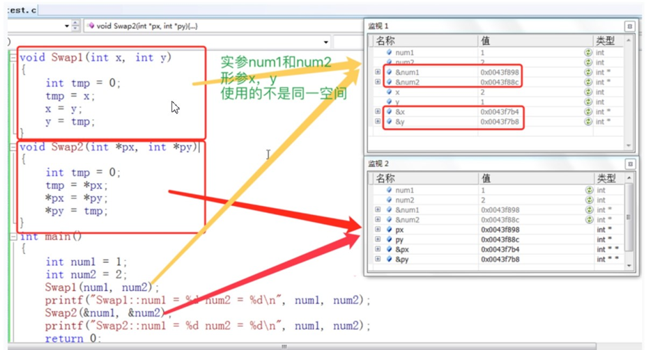
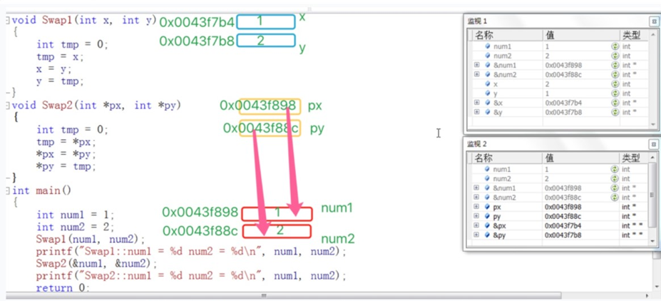

# 函数

## 函数的分类

库函数

自定义函数

### 库函数

C语言提供了许多库函数（library functions）来简化开发过程并提供常用功能的实现。库函数是预先编写好的函数，可以通过调用这些函数来执行特定的任务。

**为什么会有库函数？** 


我们知道在我们学习C语言编程的时候，总是在一个代码编写完成之后迫不及待的想知道结果，想把这个结果打印到我们的屏幕上看看。这个时候我们会频繁的使用一个功能：将信息按照一定的格 式打印到屏幕`printf`。 

在编程的过程中我们会频繁的做一些字符串的拷贝工作`strcpy`。 

在编程是我们也计算，总是会计算n的k次方这样的运算`pow`。

像上面我们描述的基础功能，它们不是业务性的代码。我们在开发的过程中每个程序员都可能用的到， 为了支持可移植性和提高程序的效率，所以C语言的基础库中提供了一系列类似的库函数，方便程序员进行软件开发。

以下是常用的库函数，使用库函数需要`#include`包含头文件，如`#include<stdio.h>`

> **stdio.h**：这个头文件提供了输入和输出函数，例如printf()、scanf()、fgets()和fopen()等。它还包含处理文件的函数，如fread()、fwrite()和fclose()。
>
> **stdlib.h**：这个头文件定义了一些实用的函数，例如内存管理函数malloc()、free()、calloc()和realloc()。它还包含一些常用的辅助函数，如rand()、atoi()和exit()。
>
> **string.h**：这个头文件提供了一些字符串处理函数，例如strcpy()、strcat()、strlen()和strcmp()。它还包含一些内存操作函数，如memcpy()、memset()和memcmp()。
>
> **math.h**：这个头文件提供了一些常见的数学函数，例如sin()、cos()、sqrt()和pow()。它还包含一些用于处理浮点数的函数，如fabs()和floor()。
>
> **time.h**：这个头文件定义了一些用于处理时间和日期的函数，例如time()、ctime()和strftime()。它还提供了用于生成伪随机数的函数，如srand()和rand()。
>
> **ctype.h**：这个头文件包含了一些字符处理函数，例如isalpha()、isdigit()和tolower()。它提供了检查字符类型和进行字符转换的功能。
>
> **stdbool.h**：这个头文件引入了一个布尔类型(bool)，定义了常量true和false。它为C语言提供了对布尔逻辑的支持。
>
> **assert.h**：这个头文件定义了一个宏函数assert()，用于在程序中插入断言。断言用于在代码中检查某些条件是否为真，如果条件为假，则终止程序的执行。

库函数需要学会使用查询工具来使用

> www.cpluscplus.com
>
> [cppreference.com](https://zh.cppreference.com/w/首页)

### 自定义函数

C语言中，可以使用自定义函数来封装一段可重复使用的代码。自定义函数由函数头和函数体组成，函数头包括函数的返回类型、函数名和参数列表，函数体则包含了函数要执行的代码。

下面是一个自定义函数的基本结构：

```c
返回类型 函数名(参数列表){
	// 函数体
	// 执行的代码
	// 可选的返回语句
}
```

以下是对函数各部分的详细说明：

- **返回类型**：函数可以有一个返回类型，用于指定函数执行完毕后返回的值的类型。如果函数不需要返回值，可以使用`void`作为返回类型。
- **函数名**：函数名是用来标识函数的唯一名称。它应该是一个合法的标识符，遵循命名规则，以便在代码中引用该函数。
- **参数列表**：参数列表包含了函数接受的输入参数。每个参数由类型和参数名组成，多个参数之间用逗号分隔。参数允许函数在调用时传递数据给函数内部进行处理和操作。
- **函数体**：函数体是包含了实际执行的代码块。它可以包含变量声明、循环、条件语句等。
- **返回语句**：返回语句用于指定函数的返回值。返回语句一般用`return`关键字后跟要返回的值或表达式。如果函数的返回类型是`void`，则可以省略返回语句。

以下是一个简单的自定义函数示例：

```c
#include <stdio.h>

int add(int a, int b) {
    int sum = a + b;
    return sum;
}

int main() {
    int result = add(3, 5);
    printf("Sum: %d\n", result);
    return 0;
}
```

在这个例子中，函数`add`接受两个整数作为参数，并返回它们的和。在`main`函数中，我们调用了`add`函数并将结果打印出来。


## 函数的参数

### 实参

实参（actual argument）是指在函数调用时传递给函数的值或变量。实参提供了函数所需的具体数据，使函数能够执行操作和计算。

在函数调用中，实参可以是以下几种形式：

1.**字面量**：字面量是指直接使用的常量值，例如整数、浮点数或字符串。例如：

```c
int sum = add(3, 4);
```

在这个例子中，函数`add`的实参是字面量值3和4。

2.**变量**：变量是存储数据的容器，可以在函数调用中使用变量作为实参。例如：

```c
int b = 10;
int result = add(a, b);
```

在这个例子中，变量`a`和`b`作为实参传递给`add`函数。

3.**表达式**：表达式是由变量、常量和操作符组成的计算式。表达式的结果可以作为实参传递给函数。例如：

```c
int c = add(a + b, 2 * a);
```

在这个例子中，表达式`a + b`和`2 * a`的结果作为实参传递给`add`函数。

4.**函数调用**：函数调用可以作为实参传递给另一个函数。例如：

```c
int result = performOperation(add(a, b), multiply(c, d));
```

在这个例子中，函数调用`add(a, b)`和`multiply(c, d)`的结果作为实参传递给`performOperation`函数。

当函数被调用时，实参的值将被传递给函数的参数，函数内部可以使用这些值进行计算和操作。实参与函数参数的类型和顺序必须匹配，以便正确传递数据。

以下是一个简单的示例，演示了如何在C语言中使用实参调用函数：

```c
#include <stdio.h>

int add(int a, int b) {
    return a + b;
}

int main() {
    int x = 3;
    int y = 5;
    int sum = add(x, y);
    printf("Sum: %d\n", sum);
    return 0;
}
```

在这个例子中，函数`add`接受两个整数参数，函数调用`add(x, y)`中的实参`x`和`y`的值被传递给函数，并返回它们的和。最后，使用`printf`函数将结果打印出来。

### 形参

形参（formal parameter）是函数定义中声明的变量，用于接收函数调用中传递的实参（actual argument）。形参充当了函数内部使用的占位符，它们在函数定义中指定了函数需要的输入。形式参数当函数调用完成之后就自动销毁了。因此形式参数只在函数中有效。

在形参列表中，每个形参由类型和名称组成，多个形参之间用逗号分隔。以下是一个函数定义的例子：

```c
int add(int num1, int num2) {
    int sum = num1 + num2;
    return sum;
}
```

在这个例子中，函数`add`的形参列表是`(int num1, int num2)`，其中`num1`和`num2`是函数接受的整数形参。

形参在函数内部的作用域仅限于函数体内。它们的作用类似于函数内的局部变量，可以在函数中使用和修改。形参在函数调用时通过实参传递数据，并在函数内部使用实参的值进行操作。

### 函数的调用

- **传值调用**：函数的形参和实参分别占有不同内存块，对形参的修改不会影响实参。
- **传址调用**：传址调用是把函数外部创建变量的内存地址传递给函数参数的一种调用函数的方式。这种传参方式可以让函数和函数外边的变量建立起真正的联系，也就是函数内部可以直接操作函数外部的变量。

下面看一个例子：

```c
#include <stdio.h>
//实现成函数，但是不能完成任务
void Swap1(int x, int y) {
    int tmp = 0;
    tmp = x;
    x = y;
    y = tmp;
}

//正确的版本
void Swap2(int *px, int *py) {
    int tmp = 0;
    tmp = *px;
    *px = *py;
    *py = tmp;
}

int main() {
    int num1 = 1;
    int num2 = 2;
    Swap1(num1, num2);
    printf("Swap1::num1 = %d num2 = %d\n", num1, num2);
    Swap2(&num1, &num2);
    printf("Swap2::num1 = %d num2 = %d\n", num1, num2);
    return 0;
}
```

输出结果如下：

```c
Swap1::num1 = 1 num2 = 2
Swap2::num1 = 2 num2 = 1
```

这个程序展示了使用不同方法进行交换两个整数值的示例，并解释了它们的不同效果。

首先，我们定义了两个函数：`Swap1`和`Swap2`。

`Swap1`函数使用值传递方式接收两个整数参数 `x` 和 `y`，并尝试交换它们的值。但是，由于参数是通过值传递方式传递的，函数内部的交换操作只影响到了形参 `x` 和 `y` 的副本，而不会改变 `main` 函数中的实际变量 `num1` 和 `num2`。因此，在函数调用 `Swap1(num1, num2)` 之后，`num1` 和 `num2` 的值并没有被交换，输出结果仍然是原始的值。

`Swap2`函数使用指针传递方式接收两个整数指针参数 `px` 和 `py`，并通过指针操作来交换它们所指向的变量的值。在函数内部，我们使用指针解引用操作 `*px` 和 `*py`，将其值存储到临时变量 `tmp` 中，然后再通过指针操作将交换后的值赋值回原始的变量。因为传递的是指针的地址，所以函数内部的操作可以直接影响到 `main` 函数中的变量 `num1` 和 `num2`。所以，在函数调用 `Swap2(&num1, &num2)` 之后，`num1` 和 `num2` 的值被成功交换了。



这里可以看到 Swap1 函数在调用的时候， x ， y 拥有自己的空间，同时拥有了和实参一模一样的内容。 所以我们可以简单的认为：**形参实例化之后其实相当于实参的一份临时拷贝**。


## 函数的嵌套调用和链式访问

### 嵌套调用

函数的嵌套调用是指在一个函数的定义或执行过程中调用另一个函数。这样的嵌套调用可以在程序中实现更复杂的逻辑和功能。下面是一个简单的示例：

```c
#include <stdio.h>
void new_line() {
    printf("hehe\n");
}

void three_line() {
    int i = 0;
    for (i = 0; i < 3; i++) {
        new_line();
    }
}

int main() {
    three_line();
    return 0;
}
```

> 函数可以嵌套调用，但是不能嵌套定义。

### 链式访问

把一个函数的返回值作为另外一个函数的参数。

```c
#include <stdio.h>
#include <string.h>

int main() {
    char arr[20] = "hello";
    int ret = strlen(strcat(arr, "world"));  //strlen函数获取字符的个数 ，strcat连接字符串
    printf("%d\n", ret);   //结果为10  strcat的返回值是helloworld，strlen返回字符个数为10
    return 0;
}
```

在给定的代码中，字符串数组 `arr` 初始化为 "hello"。然后，使用 `strcat` 函数将 "world" 追加到 `arr` 后面，结果为 "helloworld"。接下来，使用 `strlen` 函数计算字符串的长度，并将结果赋给整数变量 `ret`。最后，使用 `printf` 函数将 `ret` 的值打印出来。由于 "helloworld" 的长度为 10 个字符（包括结尾的空字符 '\0'），因此 `strlen` 函数返回的值为 10。

下面的程序结果是什么？

```c
#include <stdio.h>
int main(){
    printf("%d", printf("%d", printf("%d", 43)));
    //注：printf函数的返回值是打印在屏幕上字符的个数
    return 0;
}
```

这个程序的结果是4321。这是因为`printf`函数的返回值是打印在屏幕上字符的个数，所以第一个`printf`函数输出43，返回值为2，第二个`printf`函数输出2，返回值为1，第三个`printf`函数输出1，返回值为1。所以最终结果是4321。


## 函数的声明和定义

函数声明（Function Declaration）是指在程序中提前声明函数的存在以及函数的名称、参数列表和返回类型。通过函数声明，可以在使用函数之前告诉编译器该函数的名称、参数和返回类型，使得编译器能够正确地解析函数的调用。函数声明通常放在头文件（.h 文件）中。

函数定义（Function Definition）是指给出函数的具体实现，包括函数体内的代码逻辑。函数定义提供了函数的完整实现，包括函数的参数、返回类型、函数体等。函数定义通常放在源文件（.c 文件）中。

下面是一个示例，演示函数声明和定义的用法：

```c
// 函数声明
int add(int a, int b);

// 函数定义
int add(int a, int b) {
    return a + b;
}

int main() {
    int result = add(3, 4); // 函数调用
    return 0;
}
```

注意下面的写法会报错：

```c
int main() {
    int result = add(3, 4);// 函数调用
    return 0;
}

// 函数定义
int add(int a, int b) {
    return a + b;
}
```

函数的声明通常需要出现在函数调用之前，以便编译器能够正确地解析函数的调用。在你提供的代码中，函数 `add` 的调用出现在函数定义之前，这会导致编译错误。

要解决这个问题，可以将函数的声明移动到函数调用之前，或者在调用之前提供函数原型（function prototype）。函数原型是函数声明的另一种形式，它指定了函数的名称、参数列表和返回类型。

下面是修改后的示例代码：

```c
// 函数声明或函数原型
int add(int a, int b);

int main() {
    int result = add(3, 4); // 函数调用
    return 0;
}

// 函数定义
int add(int a, int b) {
    return a + b;
}
```

在上述修改后的代码中，我们将函数的声明 `int add(int a, int b);` 放在了函数调用之前，这样编译器就可以先知道函数的存在和参数类型。


## 函数的递归

当一个函数在其定义中调用自身，就称为递归函数。简单来说，递归就是函数在执行过程中调用自身来解决问题的一种方法。

为了更好地理解递归，我们可以使用一个经典的例子——计算阶乘（factorial）。阶乘是指从1到某个正整数n之间所有整数的乘积。

**递归的主要思考方式在于：把大事化小**

首先，我们可以定义一个名为`factorial`的递归函数，它接受一个正整数作为参数，并返回该整数的阶乘值。函数定义如下：

```c
int factorial(int n) {
    // 基线条件（递归停止条件）
    if (n == 0) {
        return 1;
    }
    // 递归调用
    return n * factorial(n - 1);
}
```

在上述代码中，我们定义了两个条件：

1. 基线条件：当传入的参数n等于0时，递归停止。此时返回1，因为0的阶乘为1。
2. 递归调用：当传入的参数n大于0时，函数将调用自身，但这次参数变为n减去1。这样就实现了递归的过程。

现在，我们来看一下函数的执行过程，以计算5的阶乘为例：

1. 首先，`factorial(5)`被调用。
2. 由于n不等于0，我们进入递归调用：`5 * factorial(4)`。
3. 然后，我们再次进入递归调用：`5 * (4 * factorial(3))`。
4. 这个过程一直持续下去，直到达到基线条件：`5 * (4 * (3 * (2 * (1 * factorial(0)))))`。
5. 当`factorial(0)`被调用时，由于n等于0，递归停止，返回1。
6. 然后，每个递归层级依次返回结果：`5 * (4 * (3 * (2 * (1 * 1))))`。
7. 最终的结果为：120。

### 递归的必要条件

1. 基线条件（递归停止条件）：递归函数必须定义一个或多个基线条件，即满足某个条件时递归停止，不再调用自身，直接返回结果。没有基线条件或者基线条件不正确，递归函数可能会无限递归，导致程序崩溃或出现其他错误。
2. 递归调用：递归函数必须包含至少一个递归调用，即在函数体内部调用自身。通过递归调用，函数可以将原始问题拆分成规模更小的子问题，然后依次解决这些子问题，直到达到基线条件。

基线条件和递归调用是函数递归的关键要素。基线条件用于定义递归的终止条件，确保递归函数最终能够停止。递归调用用于将问题分解为规模更小的子问题，并通过不断调用自身来解决这些子问题。

同时，还需要满足以下条件来确保递归函数的正确性和有效性：

- 每次递归调用中，问题规模必须比上一次递归调用时要小。否则，递归将无限进行下去，导致栈溢出等问题。
- 每个递归调用都应该朝着基线条件逼近，即递归过程中的参数或输入应该逐渐接近基线条件。这样才能保证最终能够到达基线条件并终止递归。
- 递归函数的返回值要与函数定义一致，确保递归调用的结果能够正确传递给上一层递归。

### 递归练习

**练习1**：接受一个整型值（无符号），按照顺序打印它的每一位。例如： 输入：1234，输出 1 2 3 4.

参考代码：

```c
void print(int n) {
    if (n > 9) {
        print(n / 10);
    }
    printf("%d ", n % 10);
}

int main() {
    int num = 1234;
    print(num);
    return 0;
}
```

当我们调用`print(1234)`时，首先判断参数`n`是否大于9。由于1234大于9，条件成立。

然后，我们进行递归调用`print(1234 / 10)`，即`print(123)`。这将再次进入`print`函数。

在新的函数调用中，我们再次判断参数`n`是否大于9。由于123大于9，条件仍然成立。

再次进行递归调用`print(123 / 10)`，即`print(12)`。

这个过程会一直重复，直到传入的参数`n`小于等于9。

当传入的参数小于等于9时，不再进行递归调用，而是执行`printf("%d ", n % 10)`语句。这会打印参数`n`的最右边一位数。

然后，每个递归调用返回到上一层调用，执行剩下的代码。这样，每次返回时，都会打印出相应的数字。

因此，执行完整个递归过程后，输出将会是：1 2 3 4。这就是将一个整数的每一位进行逆序打印的结果。

**练习2**：编写函数不允许创建临时变量，求字符串的长度。

```c
#include < stdio.h>
int Strlen(const char *str) {
    if (*str == '\0'){
		return 0;
    }
    else{
		return 1 + Strlen(str + 1);
    }
}

int main() {
    char *p = "abcdef";
    int len = Strlen(p);
    printf("%d\n", len);
    return 0;
}
```

1. 在`main`函数中，声明一个指向字符串常量"abcdef"的指针`p`。
2. 调用`Strlen(p)`，将指针`p`作为参数传递给递归函数`Strlen`。
3. 在`Strlen`函数中，首先检查指针`str`所指向的字符是否为'\0'，即字符串的结束符。如果是，则返回0，表示字符串的长度为0。
4. 如果指针`str`所指向的字符不是'\0'，则执行递归调用`Strlen(str + 1)`。这里通过将指针向后移动一位，来处理下一个字符。
5. 递归调用的目的是继续计算剩余字符串的长度，以达到计算整个字符串长度的目的。
6. 在递归调用中，函数再次进入`Strlen`函数，并检查新的指针`str`所指向的字符。
7. 重复上述步骤，直到遇到字符串的结束符'\0'。此时，递归停止，开始返回结果。
8. 每次递归调用返回时，都会执行`return 1 + Strlen(str + 1)`，将返回结果加1。
9. 返回的结果会依次传递给上一层递归调用，并累加结果。
10. 最终，当递归调用返回到最外层调用时，得到的结果即为整个字符串的长度。

因此，执行完整个递归过程后，输出将会是字符串"abcdef"的长度，即6。这是通过递归函数计算字符串长度的结果。

### 递归与迭代

求第n个斐波那契数。（不考虑溢出）

```c
int fib(int n) {
    if (n <= 2){
        return 1;
    }else{
        return fib(n - 1) + fib(n - 2);
    }
}
```

但是我们发现有问题； 

- 在使用 fib 这个函数的时候如果我们要计算第50个斐波那契数字的时候特别耗费时间。 
- 使用 factorial 函数求10000的阶乘（不考虑结果的正确性），程序会崩溃。

**为什么呢？**

我们发现 fib 函数在调用的过程中很多计算其实在一直重复。 如果我们把代码修改一下：

```c
int count = 0;//全局变量
int fib(int n) {
    if (n == 3){
        count++;
    }
    if (n <= 2){
        return 1;
    }else{
        return fib(n - 1) + fib(n - 2);
	}
}
```

最后我们输出看看count，是一个很大很大的值。 那我们如何改进呢？ 

在调试 factorial 函数的时候，如果你的参数比较大，那就会报错： `stack overflow`（栈溢出） 这样的信息。 系统分配给程序的栈空间是有限的，但是如果出现了死循环，或者（死递归），这样有可能导致一直开辟栈空间，最终产生栈空间耗尽的情况，这样的现象我们称为**栈溢出**。

**那如何解决上述的问题？**

1. 将递归改写成非递归。 

2. 使用`static`对象替代 `nonstatic` 局部对象。在递归函数设计中，可以使用`static`对象替代`nonstatic`局部对象（即栈对象），这不 仅可以减少每次递归调用和返回时产生和释放`nonstatic`对象的开销，而且`static`对象还可以保存递归调用的中间状态，并且可为各个调用层所访问。


比如，下面代码就采用了，非递归的方式来实现：

```c
//求n的阶乘
int factorial(int n) {
    int result = 1;
    while (n > 1) {
        result *= n;
        n -= 1;
    }
    return result;
}
//求第n个斐波那契数
int fib(int n) {
    int result;
    int pre_result;
    int next_older_result;
    result = pre_result = 1;
    while (n > 2) {
        n -= 1;
        next_older_result = pre_result;
        pre_result = result;
        result = pre_result + next_older_result;
    }
    return result;
}
```

许多问题是以递归的形式进行解释的，这只是因为它比非递归的形式更为清晰。 

但是这些问题的迭代实现往往比递归实现效率更高，虽然代码的可读性稍微差些。 

当一个问题相当复杂，难以用迭代实现时，此时递归实现的简洁性便可以补偿它所带来的运行时开销。