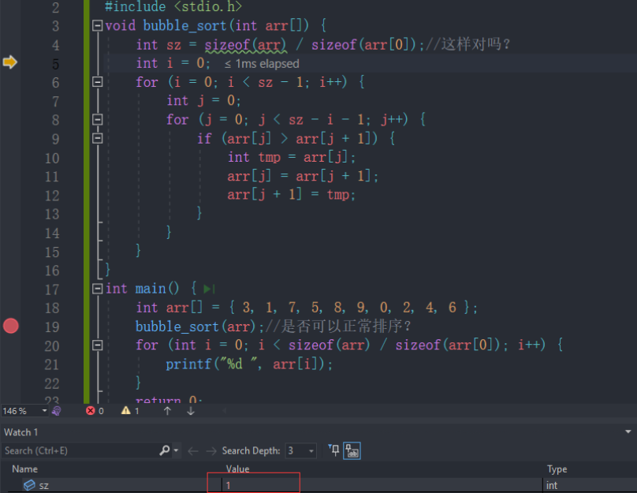



## 一维数组

### 数组的创建

> 数组是一组相同类型元素的集合。 

使用以下方式声明一个一维数组：

```c
type arrayName[arraySize];
```

`type`是数组中元素的类型，`arrayName`是数组的名称，`arraySize`是数组的大小（即元素的个数）。注意，**数组的大小必须是一个常量，不能是变量。**

**示例**：

```c
int numbers[5];  //声明一个int型的一维数组，大小为5

char arr3[10];   //声明一个char型的一维数组，大小为10
float arr4[1];    //声明一个float型的一维数组，大小为1
double arr5[20];  //声明一个double型的一维数组，大小为20

//以下代码只有在支持变长数组的情况下才支持。
int count = 10;
int arr2[count];   //err
```

> 注意：数组创建，在C99标准之前， [] 中要给一个**常量**才可以，不能使用**变量**。在C99标准支持了变长数组的概念，数组的大小可以使用变量指定，但是数组不能初始化。

### 数组的初始化

数组的初始化是指，在创建数组的同时给数组的内容一些合理初始值（初始化）。一维数组可以在**声明时**进行初始化，也可以在**声明后**通过循环或逐个赋值的方式进行初始化。

以下是一些常见的一维数组初始化方法：

```c
//静态初始化
int arr1[10] = {1};  			//不完全初始化，第一个元素初始化为1，其余的元素默认初始化为0
int arr2[] = {1,2,3,4};
int arr3[5] = {1，2，3，4，5}；
char arr4[3] = {'a',98, 'c'};
char arr5[] = {'a','b','c'};
char arr6[] = "abcdef";


// 循环赋值
int numbers[5];
for (int i = 0; i < 5; i++) {
    numbers[i] = i + 1;
}

//逐个赋值
int numbers[5];
numbers[0] = 1;
numbers[1] = 2;
numbers[2] = 3;
numbers[3] = 4;
numbers[4] = 5;
```

> 如果没有提供初始值，则数组的元素将根据数组的类型自动初始化。例如，对于整型数组，元素将被初始化为0；对于字符数组，元素将被初始化为空字符（'\0'）。

### 一维数组的使用

**访问数组元素**： 可以使用索引访问数组中的特定元素，**索引从0开始，最大索引为数组大小减1**。可以使用以下语法访问数组元素：

例如：访问数组`numbers`中的第三个元素：

```c
int x = numbers[2];
```

**修改数组元素**：

例如：将数组`numbers`中的第一个元素修改为10：

```c
numbers[0] = 10;
```

**遍历数组**：

可以使用循环结构（如`for`循环）来遍历整个数组，访问每个元素进行操作。

例如：遍历数组`numbers`，并将每个元素打印出来：

```c
for (int i = 0; i < arraySize; i++) {
    printf("%d ", numbers[i]);
}
```

**传递数组给函数:**

数组可以作为函数的参数传递，可以通过传递数组的指针或使用数组作为形参。

例如：函数接受一个整型数组作为参数，计算数组中所有元素的总和：

```c
int calculateSum(int arr[], int size) {
    int sum = 0;
    for (int i = 0; i < size; i++) {
        sum += arr[i];
    }
    return sum;
}
```

调用该函数并传递数组：

```c
int result = calculateSum(numbers, arraySize);
```

注意：数组的大小可以通过计算得到

```c
int arr[10];
int sz = sizeof(arr)/sizeof(arr[0]);
```

### 一维数组在内存中的存储

> 一维数组在内存中是连续存储的，它们按照顺序存储在一段连续的内存空间中。

当你声明一个一维数组并为其分配内存时，计算机会为数组分配一块连续的内存空间，以存储数组的元素。数组的大小决定了需要分配多少内存空间，而每个元素的大小取决于数组元素的数据类型。

```c
#include <stdio.h>
int main() {
    int arr[10] = {0};
    int i = 0;
    int sz = sizeof(arr) / sizeof(arr[0]);

    for (i = 0; i < sz; ++i) {
        printf("&arr[%d] = %p\n", i, &arr[i]);
    }
    return 0;
}
```

输出结果如下：

```c
&arr[0] = 000000000061FDF0
&arr[1] = 000000000061FDF4
&arr[2] = 000000000061FDF8
&arr[3] = 000000000061FDFC
&arr[4] = 000000000061FE00
&arr[5] = 000000000061FE04
&arr[6] = 000000000061FE08
&arr[7] = 000000000061FE0C
&arr[8] = 000000000061FE10
&arr[9] = 000000000061FE14
```

可以看到因为是int类型，所以每次递增4字节


## 二维数组

二维数组是一个由多个一维数组组成的数组。它可以看作是一个表格或矩阵，具有行和列的概念。

### 二维数组的创建

```c
//数组创建
int arr[3][4];  //三行四列的整型二维数组
char arr[3][5];  //三行五列的字符型二维数组
double arr[2][4];   //二行四列的double型二维数组
```

### 二维数组的初始化

**按行初始化：**

初始化一个包含3行4列的整型二维数组：

```c
int matrix[3][4] = {{1, 2, 3, 4}, {5, 6, 7, 8}, {9, 10, 11, 12}};
```

在这个例子中，`matrix` 是一个包含3行4列的整型二维数组，并且按行初始化了每个元素的值。

**使用循环初始化：**

可以使用嵌套循环为二维数组的每个元素赋值。

例如，初始化一个包含3行4列的整型二维数组，每个元素都被赋值为0：

```c
int matrix[3][4];
for (int i = 0; i < 3; i++) {
    for (int j = 0; j < 4; j++) {
        matrix[i][j] = 0;
    }
}
```

在这个例子中，通过嵌套的循环，对 `matrix` 的每个元素进行赋值操作。

**部分初始化：**

可以只对二维数组的一部分元素进行初始化，其余元素将自动初始化为默认值（如0）。

例如，初始化一个包含3行4列的整型二维数组，只对前两行进行初始化：

```c
int matrix[3][4] = {{1, 2, 3, 4}, {5, 6, 7, 8}};
```

在这个例子中，前两行的元素被初始化，第三行的元素将被自动初始化为0。

> **注意：二维数组如果有初始化，行可以省略，列不能省略**

**示例**：

```c
int matrix[][3] = {{1, 2, 3}, {4, 5, 6}, {7, 8, 9}};
```

在这个例子中，我们省略了行数，但指定了每行的列数为3。编译器会根据提供的初始化值自动计算出行数为3，并分配相应的内存空间。

另外，还可以对部分元素进行初始化：

```c
int matrix[][3] = {{1, 2, 3}, {4, 5, 6}};
```

在这个例子中，我们只提供了两行的初始化值，而未指定行数。编译器会根据提供的初始化值自动计算出行数为2，并分配相应的内存空间。第三行将被自动初始化为默认值（通常为0）。

### 二维数组的使用

二维数组的使用也是通过下标的方式。

**访问数组元素：**

例如，访问一个名为 `matrix` 的二维数组中的元素：

```c
int matrix[3][4];
matrix[1][2] = 42;  // 将第二行第三列的元素赋值为42
```

**遍历数组：**

可以使用嵌套的循环来遍历二维数组的所有元素。外层循环用于遍历行，内层循环用于遍历列。

例如，遍历一个名为 `matrix` 的二维数组并打印所有元素：

```c
int matrix[3][4];
for (int i = 0; i < 3; i++) {
    for (int j = 0; j < 4; j++) {
        printf("%d ", matrix[i][j]);
    }
    printf("\n");
}
```

**多维数组作为函数参数：**

你可以将二维数组作为函数的参数进行传递。在函数声明时，需要指定数组的列数，可以省略行数。

例如，定义一个接受二维整型数组作为参数的函数：

```c
void printMatrix(int matrix[][4], int numRows) {
    for (int i = 0; i < numRows; i++) {
        for (int j = 0; j < 4; j++) {
            printf("%d ", matrix[i][j]);
        }
        printf("\n");
    }
}
```

### 二维数组在内存中的存储

二维数组在内存中以连续的方式存储其元素。C语言使用行优先（row-major）顺序来存储二维数组，即将相邻的元素按行排列在内存中。

```c
int matrix[3][4] = {
    {1, 2, 3, 4},
    {5, 6, 7, 8},
    {9, 10, 11, 12}
};
```

在内存中，这个二维数组会被存储为一段连续的内存块，每个元素按行排列，如下所示：

```c
[1][2][3][4][5][6][7][8][9][10][11][12]
```

从内存的角度来看，二维数组 `matrix` 实际上是一维的，但是通过行索引和列索引的组合可以方便地访问到特定的元素。

当你使用 `matrix[i][j]` 来访问数组元素时，编译器会根据数组的类型和索引的值计算出正确的内存地址。对于上述示例，访问 `matrix[1][2]` 时，编译器会计算出内存地址为 `&matrix[1][2]`，并返回对应的值。

需要注意的是，行和列的索引都是从0开始的。对于二维数组 `matrix`，行索引的范围是0到2，列索引的范围是0到3。

像一维数组一样，这里我们尝试打印二维数组的每个元素。

```c
#include <stdio.h>

int main() {
    int arr[3][4];
    int i = 0;
    for (i = 0; i < 3; i++) {
        int j = 0;
        for (j = 0; j < 4; j++) {
            printf("&arr[%d][%d] = %p\n", i, j, &arr[i][j]);
        }
    }
    return 0;
}
```

输出结果：

```c
&arr[0][0] = 000000000061FDE0
&arr[0][1] = 000000000061FDE4
&arr[0][2] = 000000000061FDE8
&arr[0][3] = 000000000061FDEC
&arr[1][0] = 000000000061FDF0
&arr[1][1] = 000000000061FDF4
&arr[1][2] = 000000000061FDF8
&arr[1][3] = 000000000061FDFC
&arr[2][0] = 000000000061FE00
&arr[2][1] = 000000000061FE04
&arr[2][2] = 000000000061FE08
&arr[2][3] = 000000000061FE0C
```


## 数组越界

当访问数组时，数组越界指的是使用了超出数组有效索引范围的索引值。在C语言中，数组的索引从0开始，最大索引为数组长度减1。数组越界会导致未定义的行为，可能会产生以下问题：

**读取未初始化的内存：**

当尝试读取超出数组范围的元素时，访问到的内存位置可能不属于数组。这意味着实际上读取的是未初始化的内存内容，其值是不确定的。这可能导致程序产生错误的结果或不可预测的行为。

```c
int arr[5] = {1, 2, 3, 4, 5};
int value = arr[10];  // 越界访问
```

在上面的例子中，`arr` 数组的长度为5，但是我们尝试通过索引10访问元素，这超出了数组的有效索引范围，会导致未定义的行为。

**写入非法内存：**

当尝试在超出数组范围的位置写入数据时，实际上会修改内存中不属于数组的位置。这可能导致其他变量或数据被修改，或者导致程序崩溃。

```c
int arr[3] = {1, 2, 3};
arr[5] = 10;  // 越界写入
```

在上面的例子中，`arr` 数组的长度为3，但是我们尝试通过索引5写入元素，这超出了数组的有效索引范围，会导致写入非法内存位置，破坏了内存的完整性。

**缓冲区溢出：**

如果使用数组来存储字符串或其他数据，并尝试在超出数组范围的位置写入数据，可能会导致缓冲区溢出。这可能会破坏相邻的内存数据或导致安全漏洞，如缓冲区溢出攻击。

```c
char str[5] = "Hello";
str[5] = '!';  // 越界写入
```

在上面的例子中，`str` 数组的长度为5，但是我们尝试在第6个位置写入字符 `'!'`，这超出了数组的有效索引范围，可能会破坏相邻内存的数据或导致字符串结束符 `\0` 的缺失。

避免数组越界问题非常重要。确保在访问数组时使用有效的索引，并在迭代数组时小心处理边界条件。C语言本身是不做数组下标的越界检查，编译器也不一定报错，但是编译器不报错，并不意味着程序就 是正确的，所以程序员写代码时，最好自己做越界的检查。


## 数组作为函数参数

往往我们在写代码的时候，会将数组作为参数传个函数，比如：我要实现一个冒泡排序函数。

```c
//方法1：
#include <stdio.h>

void bubble_sort(int arr[]) {
    int sz = sizeof(arr) / sizeof(arr[0]);//这样对吗？
    int i = 0;
    for (i = 0; i < sz - 1; i++) {
        int j = 0;
        for (j = 0; j < sz - i - 1; j++) {
            if (arr[j] > arr[j + 1]) {
                int tmp = arr[j];
                arr[j] = arr[j + 1];
                arr[j + 1] = tmp;
            }
        }
    }
}

int main() {
    int arr[] = {3, 1, 7, 5, 8, 9, 0, 2, 4, 6};
    bubble_sort(arr);//是否可以正常排序？
    for (int i = 0; i < sizeof(arr) / sizeof(arr[0]); i++) {
        printf("%d ", arr[i]);
    }
    return 0;
}
```


经过调试发现`sz=1`，很奇怪，`sizeof(arr) / sizeof(arr[0])`为什么计算为1？这是因为在函数参数中，**数组会退化为指针**，无法通过 `sizeof` 运算符正确地获取数组的大小。在函数内部，参数 `arr` 实际上是一个指向整型的指针。

要在函数内部获取数组的大小，你需要传递数组的长度作为额外的参数，或者在数组的最后一个元素后面添加一个特定的标记来表示数组的结尾。

所以正确的方式如下：

```c
void bubble_sort(int arr[], int size) {
    int sz = size;
    // 其他代码不变
}

int main() {
    int arr[] = {3, 1, 7, 5, 8, 9, 0, 2, 4, 6};
    int size = sizeof(arr) / sizeof(arr[0]);
    bubble_sort(arr, size);
    // 其他代码不变
}
```

### 数组名是什么？

```c
#include <stdio.h>

int main() {
    int arr[10] = {1, 2, 3, 4, 5};
    printf("%p\n", arr);       //000000000061FDF0
    printf("%p\n", &arr[0]);  //000000000061FDF0
    printf("%d\n", *arr);     //1
    //输出结果
    
    return 0;
}
```

**结论**：

> **数组名是数组首元素的地址。（有两个例外）**

如果数组名是首元素地址，那么：

```c
int arr[10] = {0};
printf("%d\n", sizeof(arr));
```

为什么输出的结果是：40？

补充：

> 1. `sizeof(数组名)`，计算整个数组的大小，`sizeof`内部单独放一个数组名，数组名表示整个数组。
> 2. &数组名，取出的是数组的地址。&数组名，数组名表示整个数组。

除此1,2两种情况之外，所有的数组名都表示数组首元素的地址。

此外,还需要注意的是，**数组名**本身是一个**常量指针**，不能进行修改。不能对数组名使用赋值操作，例如 `arr = some_other_array;` 是非法的。
