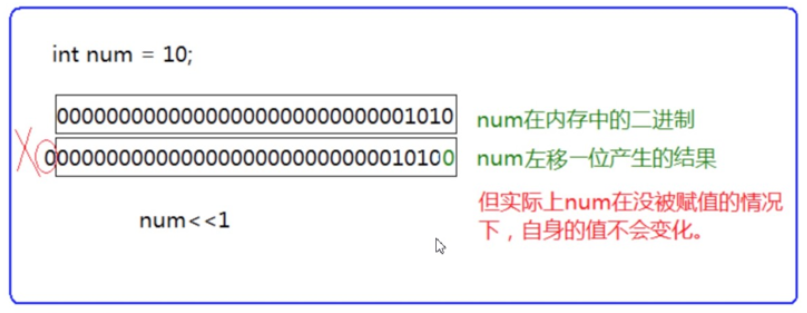
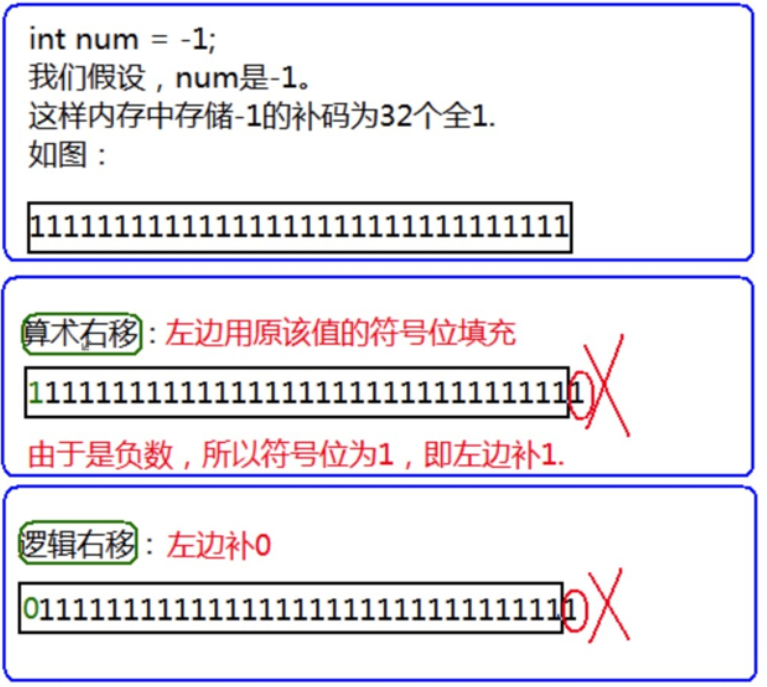

# 算术操作符

- 加法（+）：用于将两个操作数相加。
- 减法（-）：用于将第一个操作数减去第二个操作数。
- 乘法（*）：用于将两个操作数相乘。
- 除法（/）：用于将第一个操作数除以第二个操作数。
- 取模（%）：用于求两个操作数相除的余数。

```c
void test1() {
    //int a = 5.0 % 2.0;  //err `%` 操作符的两个操作数必须为整数

    int a = 10;
    int b = 3;
    int sum = a + b;       // 加法
    int difference = a - b;// 减法
    int product = a * b;   // 乘法
    int quotient = a / b;  // 除法
    int remainder = a % b; // 取模

    printf("Sum: %d\n", sum);              //13
    printf("Difference: %d\n", difference);//7
    printf("Product: %d\n", product);      //30
    printf("Quotient: %d\n", quotient);    //3
    printf("Remainder: %d\n", remainder);  //1
}
```

> 乘法、除法和取模具有相同的优先级，高于加法和减法。
>
> 优先级相同的操作符按照从左到右的顺序进行求值，除非使用括号改变优先级。
>
> 在混合数据类型的表达式中，C语言会进行隐式类型转换，将较低的数据类型提升为较高的数据类型，以执行正确的计算。
>
> 除了 `%` 操作符之外，其他的几个操作符可以作用于整数和浮点数。
>
> 对于 `/` 操作符如果两个操作数都为整数，执行整数除法。而只要有浮点数执行的就是浮点数除法。
>
> `%` 操作符的两个操作数必须为整数。返回的是整除之后的余数。


# 移位操作符

```c
<< 左移操作符
>> 右移操作符
    
//注：移位操作符的操作数只能是整数。
```

## 左移操作符

左移操作符（<<）将一个数的所有位向左移动指定的位数。移位后，低位用零填充。

> 左边抛弃、右边补0



```c
void test2(){
    int a = 4;
	//00000000000000000000000000000100 - 4的补码
	
	int b = a << 1; //把a向左移动一位的值给b，a的值不变
    //b的补码：00000000000000000000000000001000 
	printf("a=%d b=%d\n", a, b);  //a=4 b=8
}
```

```c
void test3() {
    int a = -4;
    //10000000000000000000000000000100 - -4的原码
    //11111111111111111111111111111011 - -4的反码
    //11111111111111111111111111111100 - -4的补码

    int b = a << 1;//把a向左移动一位
    //11111111111111111111111111111000 - b中存储的补码
    //11111111111111111111111111110111 - b的反码
    //10000000000000000000000000001000 - b的原码
    //-8
    printf("a=%d b=%d\n", a, b);   //a=-4 b=-8
}
```

## 右移操作符

右移操作分为两种类型：逻辑右移和算术右移。

- 逻辑右移（Logical Right Shift）：对于无符号整数，逻辑右移将高位用零填充。
- 算术右移（Arithmetic Right Shift）：对于有符号整数，算术右移将高位用符号位填充，以保持数值的符号不变。

> 逻辑移位 左边用0填充，右边丢弃 
>
> 算术移位 左边用原该值的符号位填充，右边丢弃




```c
void test4() {
    int a = -4;
    //10000000000000000000000000000100 - -4的原码
    //11111111111111111111111111111011 - -4的反码
    //11111111111111111111111111111100 - -4的补码

    int b = a >> 1;//
    //11111111111111111111111111111100
    //11111111111111111111111111111110 - b在内存中的补码
    //11111111111111111111111111111101 - b的反码
    //10000000000000000000000000000010 - b的原码
    //-2
    printf("a=%d b=%d\n", a, b);  //a=-4 b=-2
}
```

```c
void test5() {
    int a = 4;
    //00000000000000000000000000000100 补码
    
    int b = a >> 1;
    //00000000000000000000000000000010
    printf("a=%d b=%d\n", a, b);  //a=4 b=2
}
```

**总结**：

**左移一位（<<）**：对于整数来说，通常相当于乘以2。例如，`n << 1` 通常等价于 `n * 2`。需要注意的是，这个操作可能导致整数溢出，特别是当被移动的数值很大或者接近类型的最大值时。

**右移一位（>>）**：行为取决于数值类型和符号：

- 对于**无符号整数**，右移一位通常意味着除以2。
- 对于有符号整数
  - 如果是**正数**，右移一位通常相当于除以2并取下整数部分。
  - 如果是**负数**，结果也近似于除以2的操作，但由于保持符号位的特殊处理（大多数编译器实现为算术右移），结果可能会略有不同。

**注意**：

对于移位运算符，不要移动负数位，这个是标准未定义的。

```c
int num = 10;
num>>-1;//error
```


# 位操作符

- 按位与（&）：将两个操作数的对应位进行逻辑与操作，生成一个新的值。
- 按位或（|）：将两个操作数的对应位进行逻辑或操作，生成一个新的值。
- 按位异或（^）：将两个操作数的对应位进行逻辑异或操作，生成一个新的值。如果两个位相同，则结果位为0，否则为1。
- 按位取反（~）：对一个操作数的所有位进行逻辑取反操作，将1变为0，0变为1。

注：他们的操作数必须是整数。

```c
void test6() {
    int a = 3;
    int b = -5;
    int c = a & b;//& - 按（2进制）位与
    printf("%d\n", c);    //3

    //
    //00000000000000000000000000000011 - 3的补码
    //10000000000000000000000000000101 -5的原码
    //11111111111111111111111111111010 -5的反码
    //11111111111111111111111111111011 -5的补码
    
    //补码计算
    //00000000000000000000000000000011
    //11111111111111111111111111111011
    //00000000000000000000000000000011 - 3
}
```

```c
void test7() {
    int a = 3;
    int b = -5;
    int c = a | b;//& - 按（2进制）位或
    printf("%d\n", c);

    //
    //00000000000000000000000000000011 -> 3的补码
    //10000000000000000000000000000101 -5的原码
    //11111111111111111111111111111010 -5的反码
    //11111111111111111111111111111011 -5的补码
    //
    //00000000000000000000000000000011
    //11111111111111111111111111111011
    //11111111111111111111111111111011   得到的补码结果需要转换成原码
    //11111111111111111111111111111010   -1得到反码
    //10000000000000000000000000000101 -> -5
}
```

```c
void test8() {
    int a = 3;
    int b = -5;
    int c = a ^ b;//& - 按（2进制）位异或
    printf("%d\n", c);   // -8
    //异或的运算：相同为0，相异为1
    //
    //00000000000000000000000000000011 -> 3的补码
    //10000000000000000000000000000101 -5的原码
    //11111111111111111111111111111010 -5的反码
    //11111111111111111111111111111011 -5的补码
    //
    //00000000000000000000000000000011
    //11111111111111111111111111111011   
    //11111111111111111111111111111000   //补码亦或结果
    //11111111111111111111111111110111   //-1得到反码
    //10000000000000000000000000001000   //原码
    //-8
}
```

## 练习1

> 不能创建临时变量（第三个变量），实现两个数的交换。

```c
void test9() {
    int a = 10;
    int b = 20;
    a = a ^ b;
    b = a ^ b;   //b=a^b^b   b^b=0  0^a=a  b=a
    a = a ^ b;   //a=a^a^b   a=b
    printf("a = %d b = %d\n", a, b);   //a = 20 b = 10
}
```

## 练习2

编写代码实现：求一个整数存储在内存中的二进制中1的个数。

```c
//方法1：
#include <stdio.h>
int main() {
    int num = 10;
    int count = 0;//计数
    while (num) {
        if (num % 2 == 1){
            count++;
        }
        num = num / 2;
    }
    printf("二进制中1的个数 = %d\n", count);
    return 0;
}
//思考这样的实现方式有没有问题？

//方法2：
#include <stdio.h>
int main() {
    int num = -1;
    int i = 0;
    int count = 0;//计数
    for (i = 0; i < 32; i++) {
        if (num & (1 << i)){
            count++;
        }
    }
    printf("二进制中1的个数 = %d\n", count);
    return 0;
}

//思考还能不能更加优化，这里必须循环32次的。
//方法3：
#include <stdio.h>
int main() {
    int num = -1;
    int i = 0;
    int count = 0;//计数
    while (num) {
        count++;
        num = num & (num - 1);  // 清除最右边的1
    }
    printf("二进制中1的个数 = %d\n", count);
    return 0;
}
//这种方式是不是很好？达到了优化的效果，但是难以想到。
```


# 赋值操作符

- 简单赋值（=）：将右侧表达式的值赋给左侧的变量。例如：`a = 10;` 表示将值10赋给变量a。
- 加法赋值（+=）：将右侧表达式的值加到左侧变量上，并将结果赋给左侧变量。例如：`a += 5;` 表示将变量a的值加5后再赋给a。
- 减法赋值（-=）：将右侧表达式的值从左侧变量中减去，并将结果赋给左侧变量。例如：`a -= 3;` 表示将变量a的值减3后再赋给a。
- 乘法赋值（*=）：将右侧表达式的值与左侧变量相乘，并将结果赋给左侧变量。例如：`a *= 2;` 表示将变量a的值乘以2后再赋给a。
- 除法赋值（/=）：将左侧变量的值除以右侧表达式的值，并将结果赋给左侧变量。例如：`a /= 4;` 表示将变量a的值除以4后再赋给a。
- 取模赋值（%=）：将左侧变量的值模除以右侧表达式的值，并将余数赋给左侧变量。例如：`a %= 7;` 表示将变量a的值对7取模后的余数赋给a。
- 左移赋值（<<=）：将左侧变量的值左移右侧表达式指定的位数，并将结果赋给左侧变量。例如：`a <<= 3;` 表示将变量a的值左移3位后再赋给a。
- 右移赋值（>>=）：将左侧变量的值右移右侧表达式指定的位数，并将结果赋给左侧变量。例如：`a >>= 2;` 表示将变量a的值右移2位后再赋给a。
- 按位与赋值（&=）：将左侧变量的值与右侧表达式的值进行按位与操作，并将结果赋给左侧变量。例如：`a &= b;` 表示将变量a与变量b进行按位与操作后的结果赋给a。
- 按位或赋值（|=）：将左侧变量的值与右侧表达式的值进行按位或操作，并将结果赋给左侧变量。例如：`a |= b;` 表示将变量a与变量b进行按位或操作后的结果赋给a。
- 按位异或赋值（^=）：将左侧变量的值与右侧表达式的值进行按位异或操作，并将结果赋给左侧变量。例如：`a ^= b;` 表示将变量a与变量b进行按位异或操作后的结果赋给a。


# 单目操作符

- 自增（++）：将操作数的值增加1。有前缀和后缀两种用法：

  - 前缀自增：++operand，先将操作数加1，然后返回增加后的值。

  - 后缀自增：operand++，先返回操作数的值，然后再将操作数加1。

- 自减（--）：将操作数的值减少1。有前缀和后缀两种用法：

  - 前缀自减：--operand，先将操作数减1，然后返回减少后的值。

  - 后缀自减：operand--，先返回操作数的值，然后再将操作数减1。

- 取地址（&）：获取操作数的地址，即返回操作数在内存中的地址。

- 解引用（*）：用于访问指针指向的内存地址上的值。

- 正号（+）：返回操作数的正值。

- 负号（-）：返回操作数的负值。

- 逻辑非（!）：对操作数进行逻辑非操作，如果操作数为0，则返回1；如果操作数非零，则返回0。

- 按位取反（~）：对操作数的每个位进行取反操作，即将0变为1，将1变为0。

- (类型)：强制类型转换

```c
//=  +=
void test(){
    int a = 10;
	int b = 0;
	b = a = a + 3;
	printf("a=%d b=%d\n", a, b);   //a=13,b=13
    a += 1;
    printf("a=%d\n",a);  //a=14
}
```

```c
//!
void test() {
    int flag = 0;
    if (!flag) {//!flag不等于0就运行
        printf("hehe\n");
    }
}
```

```c
//& *
void test() {
    int a = 10;//4
    char c = 0;//1
    
    printf("%p\n", &a);    //打印a的地址：000000000061FDE4
    printf("%p\n", &c);    //打印c的地址：000000000061FDE3

    int *pa = &a;//& - 取地址操作符
    *pa = 20;//* - 解引用操作符
    printf("%d\n",a);    //20 
    
    int arr[10];
    //	&arr;//取出数组的地址
    
    //野指针 - 问题
	//*(int*)0x0012ff40 = 100;
}
```

```c
//~
void test() {
    int a = 0;
    //00000000000000000000000000000000
    //11111111111111111111111111111111 - 内存中-补码
    //11111111111111111111111111111110
    //10000000000000000000000000000001

    printf("%d\n", ~a);    //-1
}
```

```c
//| &
void test() {
    int a = 10;
    int n = 0;
    scanf("%d", &n);
    //把a的第n位置为1
    a = a | (1 << (n - 1));
    printf("a=%d\n", a);

    //把a的第n位置为0
    a = a & ~(1 << (n - 1));
    printf("a=%d\n", a);

    //00000000000000000000000000001010
    //00000000000000000000000000010000
    //1<<2;
    //00000000000000000000000000011010
    //11111111111111111111111111101111
    //00000000000000000000000000010000
    //00000000000000000000000000001010
}
```

```c
//前置++和--
#include <stdio.h>
int main() {
    int a = 10;
    int x = ++a;
    //先对a进行自增，然后对使用a，也就是表达式的值是a自增之后的值。x为11。
    int y = --a;
    //先对a进行自减，然后对使用a，也就是表达式的值是a自减之后的值。y为10;
    return 0;
}
//后置++和--
#include <stdio.h>
int main() {
    int a = 10;
    int x = a++;
    //先对a先使用，再增加，这样x的值是10；之后a变成11；
    int y = a--;
    //先对a先使用，再自减，这样y的值是11；之后a变成10；
    return 0;
}
```

```c
//(类型)
void test() {
   	int a = (int)3.14;
	printf("%d\n", a);  //3
}
```

## sizeof和数组

`sizeof`是一个运算符，用于获取数据类型或表达式的大小（以字节为单位）。它可以用于类型名、变量、数组和表达式。

```c
void test() {
    short s = 10;
    int a = 2;
    s = a + 5;

    printf("%zu\n", sizeof(s = a + 5));//2

    printf("%d\n", s);//7


    int b = 10;
    int *p;
    int arr[10];

    printf("%zu\n", sizeof(b));  //int  4
    printf("%zu\n", sizeof b);   //int  4
    printf("%zu\n", sizeof(int));//int  4
    //printf("%zu\n", sizeof int); //err 


    printf("%zu\n", sizeof(p));      //int* 4
    printf("%zu\n", sizeof(arr));    //int [10] 40
    printf("%zu\n", sizeof(arr[10]));//int 4
}
```

`sizeof int`是不合法的，因为`sizeof`运算符在使用时需要用括号括起来的数据类型或表达式。

```c
#include <stdio.h>

void test1(int arr[]) {
    printf("%zu\n", sizeof(arr));  // 输出指针的大小，通常为4或8
}

void test2(char ch[]) {
    printf("%zu\n", sizeof(ch));   // 输出指针的大小，通常为4或8
}

int main() {
    int arr[10] = {0};
    char ch[10] = {0};
    printf("%zu\n", sizeof(arr));   // 输出数组的大小，40字节
    printf("%zu\n", sizeof(ch));    // 输出数组的大小，10字节
    test1(arr);
    test2(ch);
    return 0;
}
```

当数组作为函数参数传递时，它实际上被转换为指针类型。因此，函数中的形参`arr`和`ch`被视为指针，而不是数组。在这种情况下，使用`sizeof`运算符获取指针的大小将得到指针本身的大小，而不是指向的数组的大小。


# 关系操作符

关系操作符用于比较两个表达式的值，并返回一个布尔值（0或1）表示比较结果的真假。

- 相等（==）：检查两个操作数是否相等，如果相等则返回1，否则返回0。
- 不等（!=）：检查两个操作数是否不相等，如果不相等则返回1，否则返回0。
- 大于（>）：检查左操作数是否大于右操作数，如果是则返回1，否则返回0。
- 小于（<）：检查左操作数是否小于右操作数，如果是则返回1，否则返回0。
- 大于等于（>=）：检查左操作数是否大于等于右操作数，如果是则返回1，否则返回0。
- 小于等于（<=）：检查左操作数是否小于等于右操作数，如果是则返回1，否则返回0。

这些关系运算符比较简单，没什么可讲的，但是我们要注意一些运算符使用时候的陷阱。

注意：在编程的过程中==和=不小心写错，导致的错误。


# 逻辑操作符

- 逻辑与（&&）：当两个操作数都为真（非零）时，返回1；否则返回0。如果左操作数为假，则右操作数不会被计算。
- 逻辑或（||）：当两个操作数中至少有一个为真（非零）时，返回1；否则返回0。如果左操作数为真，则右操作数不会被计算。
- 逻辑非（！）：对操作数进行逻辑非操作，如果操作数为零，则返回1；如果操作数非零，则返回0。

这些逻辑操作符通常用于条件判断、循环控制和布尔表达式中，用于组合和操作布尔值，得出最终的逻辑结果。

```c
#include <stdio.h>

int main() {
    int a = 5;
    int b = 3;
    int c = 0;

    printf("a > b && b > c: %d\n", a > b && b > c);   // 输出：1，因为a > b和b > c都为真
    printf("a > b || b > c: %d\n", a > b || b > c);   // 输出：1，因为a > b为真
    printf("!c: %d\n", !c);                           // 输出：1，因为c为0

    return 0;
}

```

需要注意的是，逻辑操作符具有短路求值的特性。逻辑与操作符（&&）在左操作数为假时，不会计算右操作数；逻辑或操作符（||）在左操作数为真时，不会计算右操作数。这种特性可以用于避免不必要的计算，提高程序的效率。

## 练习

```c
#include <stdio.h>
int main() {
    int i = 0, a = 0, b = 2, c = 3, d = 4;
    i = a++ && ++b && d++;
    printf("a = %d\nb = %d\nc = %d\nd = %d\n", a, b, c, d);
    return 0;
}
//程序输出的结果是什么？
```


在给定的程序中，通过逻辑与操作符（&&）对多个表达式进行逻辑运算，并将结果赋值给变量i。根据逻辑与操作符的求值规则，如果左操作数为真，则继续计算右操作数，如果左操作数为假，则右操作数不会被计算。

根据代码中的表达式`a++ && ++b && d++`，可以进行如下的求值过程：

1. `a++`：a的值为0，然后a自增1。表达式的结果为0。
2. 由于左操作数为假（非零），右操作数`++b`和`d++`都没有被计算。

根据逻辑与操作符的求值规则，整个表达式的结果为假（0）。因此，变量i被赋值为0。

输出结果为：

```c
a = 1
b = 2
c = 3
d = 4
```

```c
#include <stdio.h>
int main() {
    int i = 0, a = 0, b = 2, c = 3, d = 4;
    i = a++||++b||d++;
    printf("a = %d\nb = %d\nc = %d\nd = %d\n", a, b, c, d);
    return 0;
}
//程序输出的结果是什么？
```

在给定的程序中，通过逻辑或操作符（||）对多个表达式进行逻辑运算，并将结果赋值给变量i。根据逻辑或操作符的求值规则，如果左操作数为真，则右操作数不会被计算，整个表达式的结果为真（非零）；如果左操作数为假，则继续计算右操作数，如果右操作数为真，则整个表达式的结果为真（非零），否则结果为假（0）。

根据代码中的表达式`a++ || ++b || d++`，可以进行如下的求值过程：

1. `a++`：a的值为0，然后a自增1。表达式的结果为假（0）。
2. `++b`：由于左操作数为假（0），执行右操作数的计算。b的值为2，然后b自增1。表达式的结果为真（非零）。

由于前两个操作数中至少有一个为真，所以整个表达式的结果为真（非零）。因此，变量i被赋值为1。

输出结果为：

```c
a = 1
b = 3
c = 3
d = 4
```


# 条件操作符

条件操作符（也称为三元运算符）是一种特殊的操作符，用于根据条件选择两个表达式中的一个来求值。它的语法形式如下：

```c
condition ? expression1 : expression2
```

其中，condition是一个条件表达式，expression1和expression2是两个可能的结果表达式。条件操作符的求值过程如下：

1. 首先计算条件表达式condition的值。
2. 如果条件表达式的值为真（非零），则整个条件操作符的值为expression1的值。
3. 如果条件表达式的值为假（0），则整个条件操作符的值为expression2的值。

```c
#include <stdio.h>

int main() {
    int a = 5;
    int b = 3;

    int max = (a > b) ? a : b;  // 如果a大于b，则max为a的值；否则max为b的值

    printf("Max value: %d\n", max);

    return 0;
}

```

在上述示例中，使用条件操作符 `(a > b) ? a : b` 来选择两个数中的较大值，并将其赋值给变量max。如果a大于b，则max的值为a；否则max的值为b。输出结果为较大的值。


# 逗号表达式

逗号表达式（comma expression）是一种特殊的表达式，它允许在一个表达式中使用逗号将多个子表达式连接起来，并按顺序依次求值。逗号表达式的求值过程是从左到右的，返回值是最后一个子表达式的值。

> - 逗号表达式，就是用逗号隔开的多个表达式。 
> - 逗号表达式，从左向右依次执行。整个表达式的结果是最后一个表达式的结果。

逗号表达式的语法形式如下：

```c
expression1, expression2, expression3, ..., expressionN
```

其中，expression1、expression2、expression3等都是子表达式，可以是任意有效的表达式。

```c
#include <stdio.h>

int main() {
    int a = 5;
    int b = 3;
    int c;

    c = (a++, b++, a + b);  // 逗号表达式：先执行a++，再执行b++，最后求a + b

    printf("c = %d\n", c);  // 输出c的值，结果为10

    return 0;
}
```

在上述示例中，使用逗号表达式 `(a++, b++, a + b)` 将三个子表达式连接起来。首先执行a++，将a的值增加1，然后执行b++，将b的值增加1，最后求a + b的结果为10。这个结果赋值给变量c，然后输出c的值。


# 下标引用、函数调用和结构成员

1.[ ] 下标引用操作符 

操作数：一个数组名 + 一个索引值

```c
int arr[10];//创建数组
arr[9] = 10;//实用下标引用操作符。
//[ ]的两个操作数是arr和9。
```

2.( ) 函数调用操作符

接受一个或者多个操作数：第一个操作数是函数名，剩余的操作数就是传递给函数的参数。

```c
#include <stdio.h>
void test1() {
    printf("hehe\n");
}

void test2(const char *str) {
    printf("%s\n", str);
}

int main() {
    test1();            //（）作为函数调用操作符。
    test2("hello bit.");//（）作为函数调用操作符。
    return 0;
}
```

3.访问一个结构的成员 

> . 结构体.成员名 
>
> -> 结构体指针->成员名

```c
#include <stdio.h>
struct Stu {
    char name[10];
    int age;
    char sex[5];
    double score;
};

void set_age1(struct Stu stu) {
    stu.age = 18;
}

void set_age2(struct Stu *pStu) {
    pStu->age = 18;//结构成员访问
}

int main() {
    struct Stu stu;
    struct Stu *pStu = &stu;//结构成员访问

    stu.age = 20;//结构成员访问
    set_age1(stu);

    pStu->age = 20;//结构成员访问
    set_age2(pStu);
    return 0;
}
```


# 表达式求值

表达式求值的顺序一部分是由操作符的优先级和结合性决定。 同样，有些表达式的操作数在求值的过程中可能需要转换为其他类型。

## 隐式类型转换

隐式类型转换（implicit type conversion）是指在表达式中自动发生的类型转换，而无需显式地使用类型转换运算符。隐式类型转换是由C语言的类型规则和表达式求值规则决定的。

以下是一些常见的隐式类型转换情况：

1. 整数提升（integer promotion）：当较小的整数类型参与运算时，它们会被自动提升为较大的整数类型。例如，当 `int` 和 `short` 进行运算时，`short` 会被提升为 `int` 类型。
2. 浮点数提升（floating-point promotion）：当较小的浮点数类型参与运算时，它们会被自动提升为较大的浮点数类型。例如，当 `float` 和 `double` 进行运算时，`float` 会被提升为 `double` 类型。
3. 整数转换（integer conversion）：当不同大小的整数类型进行赋值或混合运算时，较小的整数类型会被自动转换为较大的整数类型。例如，将 `short` 赋值给 `int`，或将 `int` 与 `long` 进行运算时。
4. 浮点数转换（floating-point conversion）：当不同大小的浮点数类型进行赋值或混合运算时，较小的浮点数类型会被自动转换为较大的浮点数类型。例如，将 `float` 赋值给 `double`，或将 `float` 与 `double` 进行运算时。
5. 混合类型运算：在表达式中，不同类型的操作数进行运算时，会发生隐式类型转换以使它们具有相同的类型。例如，整数和浮点数进行运算时，整数会被转换为浮点数。

需要注意的是，隐式类型转换可能会导致精度丢失或数据溢出的问题。为了避免意外的类型转换和数据损失，建议在需要时使用显式类型转换运算符进行明确的类型转换。

C的整型算术运算总是至少以缺省整型类型的精度来进行的。 为了获得这个精度，表达式中的字符和短整型操作数在使用之前被转换为普通整型，这种转换称为**整型提升**。

**整型提升的意义：**

> 表达式的整型运算要在CPU的相应运算器件内执行，CPU内整型运算器(ALU)的操作数的字节长度 一般就是int的字节长度，同时也是CPU的通用寄存器的长度。 
>
> 因此，即使两个char类型的相加，在CPU执行时实际上也要先转换为CPU内整型操作数的标准长度。 
>
> 通用CPU（general-purpose CPU）是难以直接实现两个8比特字节直接相加运算（虽然机器指令 中可能有这种字节相加指令）。所以，表达式中各种长度可能小于int长度的整型值，都必须先转 换为int或unsigned int，然后才能送入CPU去执行运算。

```c
//实例1
char a,b,c;
...
a = b + c;
```

b和c的值被提升为普通整型，然后再执行加法运算。

加法运算完成之后，结果将被截断，然后再存储于a中。

**如何进行整体提升呢？**

> 整型提升是按照变量的数据类型的符号位来提升的

```c
//负数的整型提升
char c1 = -1;
变量c1的二进制位(补码)中只有8个比特位：
1111111
因为char为有符号的 char
所以整型提升的时候，高位补充符号位，即为1
提升之后的结果是：
11111111111111111111111111111111
//正数的整型提升
char c2 = 1;
变量c2的二进制位(补码)中只有8个比特位：
00000001
因为 char 为有符号的 char
所以整型提升的时候，高位补充符号位，即为0
提升之后的结果是：
00000000000000000000000000000001
//无符号整型提升，高位补0
```

整型提升的例子:

```c
//实例1
int main() {
    char a = 0xb6;
    short b = 0xb600;
    int c = 0xb6000000;
    if (a == 0xb6)
        printf("a");
    if (b == 0xb600)
        printf("b");
    if (c == 0xb6000000)
        printf("c");
    return 0;
}
```

实例1中的a,b要进行整形提升,但是c不需要整形提升 a,b整形提升之后,变成了负数,所以表达式 `a==0xb6 , b==0xb600` 的结果是假,但是c不发生整形提升,则表 达式 c==0xb6000000 的结果是真

所程序输出的结果是:c

```c
//实例2
int main() {
    char c = 1;
    printf("%u\n", sizeof(c));
    printf("%u\n", sizeof(+c));
    printf("%u\n", sizeof(-c));
    return 0;
}
```

实例2中的,c只要参与表达式运算,就会发生整型提升,表达式 `+c` ,就会发生提升,所以 `sizeof(+c)` 是4个字节. 表达式 `-c` 也会发生整型提升,所以 `sizeof(-c)` 是4个字节,但是 `sizeof(c)` ,就是1个字节.

## 

# 操作符的属性

复杂表达式的求值有三个影响的因素。 1. 操作符的优先级 2. 操作符的结合性 3. 是否控制求值顺序。 两个相邻的操作符先执行哪个？取决于他们的优先级。如果两者的优先级相同，取决于他们的结合性。

**操作符优先级：**

| 优先级 | 操作符 | 结果类型     | 结合性 | 控制求值顺序 |
| ------ | ------ | ------------ | ------ | ------------ |
| 1      | ()     | -            | 左     | 是           |
| 2      | []     | -            | 左     | 是           |
|        | ->     | -            | 左     | 是           |
|        | .      | -            | 左     | 是           |
|        | ++     | 相同类型     | 右     | 是           |
|        | --     | 相同类型     | 右     | 是           |
|        | (类型) | 转换后类型   | 右     | 是           |
|        | sizeof | size_t类型   | 右     | 是           |
| 3      | ++     | 相同类型     | 左     | 是           |
|        | --     | 相同类型     | 左     | 是           |
|        | +      | 相同类型     | 右     | 是           |
|        | -      | 相同类型     | 右     | 是           |
|        | !      | int类型      | 右     | 是           |
|        | ~      | int类型      | 右     | 是           |
|        | *      | 相同类型     | 右     | 是           |
|        | &      | 相同类型     | 右     | 是           |
|        | (类型) | 转换后类型   | 右     | 是           |
|        | sizeof | size_t类型   | 右     | 是           |
| 4      | *      | 相同类型     | 左     | 是           |
|        | /      | 相同类型     | 左     | 是           |
|        | %      | 相同类型     | 左     | 是           |
| 5      | +      | 相同类型     | 左     | 是           |
|        | -      | 相同类型     | 左     | 是           |
| 6      | <<     | 相同类型     | 左     | 是           |
|        | >>     | 相同类型     | 左     | 是           |
| 7      | <      | int类型      | 左     | 是           |
|        | <=     | int类型      | 左     | 是           |
|        | >      | int类型      | 左     | 是           |
|        | >=     | int类型      | 左     | 是           |
| 8      | ==     | int类型      | 左     | 是           |
|        | !=     | int类型      | 左     | 是           |
| 9      | &      | 相同类型     | 左     | 是           |
| 10     | ^      | 相同类型     | 左     | 是           |
| 11     | \|     | 相同类型     | 左     | 是           |
| 12     | &&     | int类型      | 左     | 是           |
| 13     | \|\|   | int类型      | 左     | 是           |
| 14     | ?:     | 根据操作数   | 右     | 是           |
| 15     | =      | 左操作数类型 | 右     | 是           |
|        | +=     | 左操作数类型 | 右     | 是           |
|        | -=     | 左操作数类型 | 右     | 是           |
|        | *=     | 左操作数类型 | 右     | 是           |
|        | /=     | 左操作数类型 | 右     | 是           |
|        | %=     | 左操作数类型 | 右     | 是           |
|        | <<=    | 左操作数类型 | 右     | 是           |
|        | >>=    | 左操作数类型 | 右     | 是           |
|        | &=     | 左操作数类型 | 右     | 是           |
|        | ^=     | 左操作数类型 | 右     | 是           |
|        | \|=    | 左操作数类型 | 右     | 是           |
| 16     | ,      | 右操作数类型 | 左     | 是           |

## 一些问题表达式

```c
//表达式的求值部分由操作符的优先级决定。
//表达式1
a*b + c*d + e*f
```

注释：代码1在计算的时候，由于比+的优先级高，只能保证，*的计算是比+早，但是优先级并不能决定第三个比第一个+早执行。所以表达式的计算机顺序就可能是：

```c
a*b
c*d
a*b + c*d
e*f
a*b + c*d + e*f
或者：
a*b
c*d
e*f
a*b + c*d
a*b + c*d + e*f
```

```c
//表达式2
c + --c;
```

同上，操作符的优先级只能决定自减--的运算在+的运算的前面，但是我们并没有办法得知，+操作符的左操作数的获取在右操作数之前还是之后求值，所以结果是不可预测的，是有歧义 的。

```c
//代码3-非法表达式
int main() {
    int i = 10;
    i = i-- - --i * (i = -3) * i++ + ++i;
    printf("i = %d\n", i);
    return 0;
}
```

表达式3在不同编译器中测试结果：非法表达式程序的结果

```c
//代码4
int fun(){
     static int count = 1;
     return ++count;
}

int main(){
     int answer;
     answer = fun() - fun() * fun();
     printf( "%d\n", answer);//输出多少？
     return 0;
}
```

虽然在大多数的编译器上求得结果都是相同的。 

但是上述代码 `answer = fun() - fun() * fun();` 中我们只能通过操作符的优先级得知：先算乘法， 再算减法。 

函数的调用先后顺序无法通过操作符的优先级确定。

```c
//代码5
#include <stdio.h>
int main() {
    int i = 1;
    int ret = (++i) + (++i) + (++i);
    printf("%d\n", ret);
    printf("%d\n", i);
    return 0;
}
```


这段代码中的第一个 + 在执行的时候，第三个++是否执行，这个是不确定的，因为依靠操作符的优先级 和结合性是无法决定第一个 + 和第三个前置 ++ 的先后顺序。

总结：我们写出的表达式如果不能通过操作符的属性确定唯一的计算路径，那这个表达式就是存在问题的。
