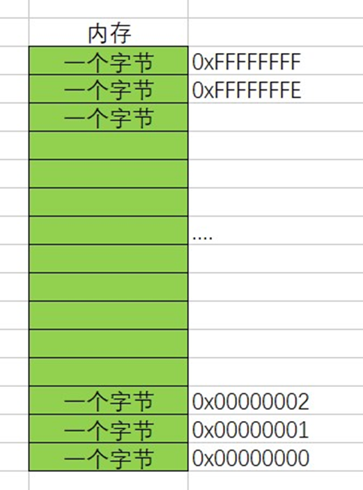
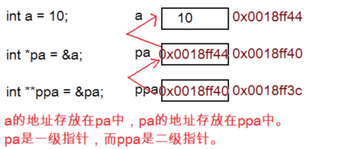

# 指针是什么？

指针（Pointer）是一种特殊的变量类型，它存储了一个内存地址。可以将指针视为存储了另一个变量的地址的变量。通过指针，可以直接访问和修改内存中的数据。

指针提供了一种间接访问内存的方式，使得在程序中可以有效地操作和管理内存资源。

> 指针是内存中一个最小单元的编号，也就是地址 
>
> 平时口语中说的指针，通常指的是指针变量，是用来存放内存地址的变量

可以通过&（取地址操作符）取出变量的内存其实地址，把地址可以存放到一个变量中，这个变量就是指针变量

```c
#include <stdio.h>

int main() {
    int a = 10;  //在内存中开辟一块空间
    int *pa = &a;//这里我们对变量a，取出它的地址，可以使用&操作符。
    //a变量占用4个字节的空间，这里是将a的4个字节的第一个字节的地址存放在pa变中，pa就是一个之指针变量。
    *pa = 20;    //解引用操作符（间接访问操作符）
    printf("%d\n", a);   //20
    //char * pc = &ch;

    //printf("%d\n", sizeof(pa));
    //printf("%d\n", sizeof(pc));

    //printf("%p\n",  &a);
    return 0;
}
```

**总结：**

指针变量，用来存放地址的变量。（存放在指针中的值都被当成地址处理）。

那这里的问题是：

- 一个小的单元到底是多大？
- （1个字节） 如何编址？

经过仔细的计算和权衡我们发现一个字节给一个对应的地址是比较合适的。




对于32位的机器，假设有32根地址线，那么假设每根地址线在寻址的时候产生高电平（高电压）和低电 平（低电压）就是（1或者0）； 那么32根地址线产生的地址就会是：

> 00000000 00000000 00000000 00000000 
>
> 00000000 00000000 00000000 00000001 
>
> ... 
>
> 11111111 11111111 11111111 11111111

这里就有2的32次方个地址。

每个地址标识一个字节，那我们就可以给 （2^32Byte == 2^32/1024KB ==  2^32/1024/1024MB==2^32/1024/1024/1024GB == 4GB） 4G的空间进行编址。

这里我们就明白： 

- 在32位的机器上，地址是32个0或者1组成二进制序列，那地址就得用4个字节的空间来存储，所以一个指针变量的大小就应该是4个字节。 
- 那如果在64位机器上，如果有64个地址线，那一个指针变量的大小是8个字节，才能存放一个地 址。

**总结**： 

> **指针变量是用来存放地址的，地址是唯一标示一个内存单元的**。 
>
> **指针的大小在32位平台是4个字节，在64位平台是8个字节。**

```c
int main(){
	int* pa;
	char* pc;
	float* pf;

	printf("%d\n", sizeof(pa));  //4/8
	printf("%d\n", sizeof(pc));  //4/8
	printf("%d\n", sizeof(pf));  //4/8

	return 0;
}
```


# 指针和指针类型

这里我们在讨论一下：指针的类型

我们都知道，变量有不同的类型，整型，浮点型等。那指针有没有类型呢？ 准确的说：有的。

当有这样的代码：

```c
int num = 10;
p = &num;
```

要将`&num`（num的地址）保存到p中，我们知道p就是一个指针变量，那它的类型是怎样的呢？ 我们给指针变量相应的类型。

```c
char  *pc = NULL;
int   *pi = NULL;
short *ps = NULL;
long  *pl = NULL;
float *pf = NULL;
double *pd = NULL;
```

这里可以看到，指针的定义方式是： `type + *` 。

其实：

`char*` 类型的指针是为了存放 `char` 类型变量的地址。 

`short*` 类型的指针是为了存放 `short` 类型变量的地址。 

`int*` 类型的指针是为了存放 `int` 类型变量的地址。

那指针类型的意义是什么？

## 指针+-整数

可以对指针进行加法和减法运算，以在内存中移动指针的位置。这种指针与整数的运算称为指针算术。

当一个指针与一个整数相加时，指针会根据指定的整数值进行偏移。偏移量是通过将整数值乘以指针所指向类型的大小来计算的。

```c
#include <stdio.h>
int main() {
    int a = 0x11223344;
    int *pa = &a;
    char *pc = (char *) &a;

    printf("pa=%p\n", pa);//pa=000000000061FE0C
    printf("pc=%p\n", pc);//pc=000000000061FE0C

    printf("pa+1=%p\n", pa - 1);//pa+1=000000000061FE08 地址从0C到08 -4
    printf("pc+1=%p\n", pc - 1);//pc+1=000000000061FE0B 地址从0C到0B -1

    return 0;
}
```

**总结**：指针的类型决定了指针向前或者向后走一步有多大（距离）。

## 指针的解引用

指针的解引用是通过指针变量来访问其所指向内存位置上存储的值。解引用操作使用星号（*）运算符来实现。

当对一个指针进行解引用时，可以通过将星号（*）放在指针变量前面来访问指针所指向内存位置上的值。

```c
#include <stdio.h>
int main() {
    int arr[10] = {0};
    int *p = arr;//数组名就是数组首元素的地址arr->&arr[0];

    int i = 0;
    for (i = 0; i < 10; i++) {
        *(p + i) = i + 1;
    }

    for (i = 0; i < 10; i++) {
        printf("%d ", *(p + i));//1 2 3 4 5 6 7 8 9 10
    }

    for (i = 0; i < 10; i++) {
        //*(p + i) = i + 1等价于以下两行
        *p = i + 1;
        p++;
    }

    return 0;
}
```

**总结：** 

指针的类型决定了，对指针解引用的时候有多大的权限（能操作几个字节）。

比如： `char*` 的指针解引用就只能访问一个字节，而 `int*` 的指针的解引用就能访问四个字节。


# 野指针

野指针（Dangling Pointer）是指指向已经释放或无效的内存位置的指针。当指针指向的内存被释放或无效后，该指针仍然保留了原来的地址，但此时访问该指针可能导致未定义的行为。

> 野指针就是指针指向的位置是不可知的（随机的、不正确的、没有明确限制的）

## 野指针成因

**1.指针未初始化**

```c
#include <stdio.h>
int main() {
    int *p;//局部变量指针未初始化，默认为随机值
    *p = 20;
    return 0;
}
```

**2.指针越界访问**

```c
#include <stdio.h>
int main() {
    int arr[10] = {0};
    int *p = arr;
    int i = 0;
    for (i = 0; i <= 11; i++) {
        //当指针指向的范围超出数组arr的范围时，p就是野指针
        *(p++) = i;
    }
    return 0;
}
```

**3.指针指向的空间释放**

在使用动态内存分配函数（如`free`）释放内存后，在使用动态内存分配函数（如`free`）释放内存后

## 如何规避野指针
**1.指针初始化**

```c
#include <stdio.h>
int main() {
    int a = 10;
    int *pa = &a;//明确初始化

    //NULL - 0，就是初始化指针的
    int *p = NULL;


    return 0;
}
```

**2.小心指针越界** 

**3.指针指向空间释放，及时置NULL** 

**4.避免返回局部变量的地址** 

```c
//返回局部变量指针
#include <stdio.h>
int *test() {
    int num = 100;
    return &num;
}

int main() {
    int *p = test();
    *p = 200;

    return 0;
}
```
在这段代码中存在一个问题，即返回了一个指向局部变量的指针 `&num`。这会导致在函数 `test()` 执行完毕后，`num` 变量所占用的内存空间被释放，而指向它的指针 `p` 仍然保留着该地址，从而形成了一个野指针。

**5.指针使用之前检查有效性**

```c
#include <stdio.h>
int main() {
    int a = 10;
    int *p = NULL;
    //检查有效性
    if (p != NULL) {
        printf("%d\n", *p);
    }

    return 0;
}
```


# 指针运算

## 指针+-整数

当指针与一个整数相加时，指针会向后偏移，**移动的字节数由指针所指向类型的大小决定**。例如，如果指针指向一个`int`类型的变量，那么加1将使指针向后移动`sizeof(int`)个字节。

同样地，当指针与一个整数相减时，指针会向前偏移。减法操作会将指针向前移动指定数量的元素，字节数由指针所指向类型的大小决定。

**示例**：

```c
#include <stdio.h>

int main() {
    int numbers[] = {1, 2, 3, 4, 5};
    int *ptr = numbers;  // 指向数组的第一个元素

    printf("初始指针位置: %p\n", ptr);

    ptr = ptr + 2;  // 向后移动2个int大小的元素
    printf("移动后的指针位置: %p\n", ptr);

    ptr = ptr - 1;  // 向前移动1个int大小的元素
    printf("移动后的指针位置: %p\n", ptr);

    return 0;
}
```

**输出结果**：

```bash
初始指针位置: 000000000061FE00
移动后的指针位置: 000000000061FE08
移动后的指针位置: 000000000061FE04
```

**注意：**

> **指针的算术运算必须在同一数组中进行，或者指向同一类型的对象。否则，结果将是不确定的。**

## 指针-指针

指针减法的结果是**两个指针之间的元素个数**，而不是字节数。具体来说，两个指针相减的结果将是一个整数，表示两个指针之间相隔的元素个数，其中每个元素的大小由指针所指向类型的大小决定。

**示例**：

```c
#include <stdio.h>

int main() {
    int numbers[] = {1, 2, 3, 4, 5};
    int *ptr1 = &numbers[0];// 指向数组的第一个元素
    int *ptr2 = &numbers[3];// 指向数组的第四个元素

    printf("指针1的位置: %p\n", ptr1);
    printf("指针2的位置: %p\n", ptr2);

    ptrdiff_t diff = ptr2 - ptr1;// 计算指针之间的偏移量
    printf("指针1和指针2之间的偏移量: %td\n", diff);

    return 0;
}
```

输出结果：

```bash
指针1的位置: 0x7ffeeef0d030
指针2的位置: 0x7ffeeef0d03c
指针1和指针2之间的偏移量: 3
```

**注意：**

> **两个指针进行减法运算必须指向同一个数组或同一类型的对象。否则，结果将是不确定的。另外，如果两个指针之间没有直接或间接的关系，进行减法运算是无意义的。**

```c
int main() {
    //两个指针相减的前提是：指针指向的同一个数组(同一块连续的空间)
    int arr[10] = {0};
    printf("%d\n", &arr[9] - &arr[0]);  //9
    printf("%d\n", &arr[0] - &arr[9]);  //-9

    int a = 10;
    char c = 'w';
    //printf("%d\n", &a - &c); //err 报错

    return 0;
}
```

## 指针的关系运算

可以对指针进行关系运算，用于比较指针的大小关系。

- `<`（小于）：如果左操作数指向的地址在内存中出现在右操作数指向的地址之前，则结果为真。
- `>`（大于）：如果左操作数指向的地址在内存中出现在右操作数指向的地址之后，则结果为真。
- `<=`（小于等于）：如果左操作数指向的地址在内存中出现在右操作数指向的地址之前或相等，则结果为真。
- `>=`（大于等于）：如果左操作数指向的地址在内存中出现在右操作数指向的地址之后或相等，则结果为真。
- `==`（等于）：如果两个操作数指向相同的地址，则结果为真。
- `!=`（不等于）：如果两个操作数指向不同的地址，则结果为真。

这些关系运算符通常用于比较指针之间的相对位置，而不是比较它们所指向的具体值。

实例：

```c
for (vp = &values[N_VALUES]; vp > &values[0];) {
    *--vp = 0;
}
```

代码简化, 这将代码修改如下：

```c
for (vp = &values[N_VALUES - 1]; vp >= &values[0]; vp--) {
    *vp = 0;
}
```

实际在绝大部分的编译器上是可以顺利完成任务的，然而我们还是应该避免这样写，因为标准并不保证它可行。

**标准规定：**

> 允许指向数组元素的指针与指向数组最后一个元素后面的那个内存位置的指针比较，但是不允许与指向第一个元素之前的那个内存位置的指针进行比较。


# 指针和数组

我们看一个例子：

```c
#include <stdio.h>
int main() {
    int arr[10] = {1, 2, 3, 4, 5, 6, 7, 8, 9, 0};
    printf("%p\n", arr);
    printf("%p\n", &arr[0]);
    return 0;
}
```

输出结果：

```c
000000000061FDF0
000000000061FDF0
```

可见数组名和数组首元素的地址是一样的。

**结论**：

> **数组名表示的是数组首元素的地址。**

那么这样写代码是可行的：

```c
int arr[10] = {1, 2, 3, 4, 5, 6, 7, 8, 9, 0};
int *p = arr;//p存放的是数组首元素的地址
```

既然可以把数组名当成地址存放到一个指针中，我们使用指针来访问一个就成为可能。

**例如**：

```c
#include <stdio.h>
int main() {
    int arr[] = {1, 2, 3, 4, 5, 6, 7, 8, 9, 0};
    int *p = arr;//指针存放数组首元素的地址
    int sz = sizeof(arr) / sizeof(arr[0]);
    for (int i = 0; i < sz; i++) {
        printf("&arr[%d] = %p   <====> p+%d = %p\n", i, &arr[i], i, p + i);
    }
    return 0;
}
```

输出结果：

```c
&arr[0] = 000000000061FDE0   <====> p+0 = 000000000061FDE0
&arr[1] = 000000000061FDE4   <====> p+1 = 000000000061FDE4
&arr[2] = 000000000061FDE8   <====> p+2 = 000000000061FDE8
&arr[3] = 000000000061FDEC   <====> p+3 = 000000000061FDEC
&arr[4] = 000000000061FDF0   <====> p+4 = 000000000061FDF0
&arr[5] = 000000000061FDF4   <====> p+5 = 000000000061FDF4
&arr[6] = 000000000061FDF8   <====> p+6 = 000000000061FDF8
&arr[7] = 000000000061FDFC   <====> p+7 = 000000000061FDFC
&arr[8] = 000000000061FE00   <====> p+8 = 000000000061FE00
&arr[9] = 000000000061FE04   <====> p+9 = 000000000061FE04
```

所以 `p+i` 其实计算的是数组 `arr` 下标为`i`的地址。

那我们就可以直接通过指针来访问数组。

```c
#include<stdio.h>
int main() {
    int arr[] = {1, 2, 3, 4, 5, 6, 7, 8, 9, 0};
    int *p = arr;//指针存放数组首元素的地址
    int sz = sizeof(arr) / sizeof(arr[0]);
    int i = 0;
    for (i = 0; i < sz; i++) {
        printf("%d ", *(p + i));  //1 2 3 4 5 6 7 8 9 0 
    }
    return 0;
}
```

**总结：**

> **数组名作为指针：**
> - **数组名可以被视为指向数组首元素的指针。**
> - **数组名作为指针使用时，可以进行指针运算。**
>
> **使用指针访问数组元素：**
> - **可以使用指针来访问和操作数组元素。**
> - **使用指针访问数组元素的常见方法是使用指针偏移运算符`*`和`[]`。**
>
> **指针与数组的关系：**
> - **数组名可以用作`指针常量`，不能被赋值或修改。**
> - **可以创建指向数组的指针变量，并通过指针变量来操作数组元素。**
>
> **指针和数组的传递：**
> - **在函数中，可以通过指针参数来传递数组，从而可以在函数内部修改数组的内容。**
> - **数组作为函数参数传递时，传递的实际是数组的首元素的地址。函数中的形式参数可以声明为指针类型或数组类型，两者等效。**


# 二级指针

二级指针是指**指向指针**的指针。也可以称为指向指针的指针，它提供了对指针的间接访问。

指针变量也是变量，是变量就有地址，那指针变量的地址存放在哪里？这就是二级指针。



**例如**：

```c
#include <stdio.h>
int main() {
    int a = 10;   
    int *p = &a;  //p就是指针变量，一级指针变量
    int **pp = &p;//pp就二级指针

    
    **pp = 200;    //*(*pp) = 200;  *pp表示a的地址 再来一个*表示对a地址解引用
    //*p = 20;
    printf("%d\n", a);  //200
 
    return 0;
}
```

## 多级指针

二级指针的概念可以扩展到多级指针。多级指针是指指向指针的指针的指针，以此类推。例如，三级指针是指指向二级指针的指针。

**例如**：

```c
#include <stdio.h>
int main() {
    int a = 10;   
    int *p = &a;  //p就是指针变量，一级指针变量，指向一个变量，是一个变量的地址
    int **pp = &p;  //pp是二级指针,是一个一级指针的地址
    int ***ppp = &pp;  //ppp是一个三级指针,是一个二级指针的地址
    int ****pppp = &ppp;  //pppp是一个四级指针，是一个三级指针的地址
 
    return 0;
}
```


# 指针数组

在C语言中，指针数组是指一个数组，其元素都是指针类型的变量。指针数组可以存储指向不同类型对象的指针。

那么指针数组是指针还是数组？ 

是数组。是存放指针的数组。

**例如**：

```c
int main() {
    //整型数组-存放整型的数组
    int arr[10];
    //字符数组-存放字符的数组
    char arr2[5];
    //指针数组-存放指针的数组
    int *arr3[5]; //存放整型指针的数组
    char *arr4[6];//存放字符指针的数组

    return 0;
}
```

**例如**：

```c
#include <stdio.h>
int main() {
    int a = 10;
    int b = 20;
    int c = 30;
    int d = 40;
    int e = 50;

    int *arr3[5] = {&a, &b, &c, &d, &e};//存放整型指针的数组
    int i = 0;
    for (i = 0; i < 5; i++) {
        printf("%d ", *(arr3[i]));
    }

    return 0;
}
```

指针数组使用场景：用一个一维数组模拟二维数组

```c
#include<stdio.h>

int main() {
    //用一维数组模拟一个二维数组
    int arr1[] = {1, 2, 3, 4, 5};
    int arr2[] = {2, 3, 4, 5, 6};
    int arr3[] = {3, 4, 5, 6, 7};
    int arr4[] = {4, 5, 6, 7, 8};

    int *arr[4] = {arr1, arr2, arr3, arr4};
    int i = 0;
    for (i = 0; i < 4; i++) {
        int j = 0;
        for (j = 0; j < 5; j++) {
            printf("%d ", *(*(arr + i) + j));
        }
        printf("\n");
    }

    //int i = 0;
    //for (i = 0; i < 4; i++)
    //{
    //	int j = 0;
    //	for (j = 0; j < 5; j++)
    //	{
    //		printf("%d ", arr[i][j]);
    //	}
    //	printf("\n");
    //}

    return 0;
}
```

**输出结果**：

```c
1 2 3 4 5 
2 3 4 5 6 
3 4 5 6 7 
4 5 6 7 8 
```


# 指针常量和常量指针

指针常量和常量指针都是指针类型的修饰符，它们的作用是限制指针的使用。`指针常量`是指针本身是一个常量，即不能改变指针所指向的地址，而`常量指针`则是指针所指向的地址是一个常量，即不能改变地址中存储的值。

```cpp
int a = 10;
int b = 20;
const int *p1 = &a; // 常量指针，指向的是一个常量，不能通过 p1 修改 a 的值
p1 = &b; // 可以改变 p1 的指向

int * const p2 = &a; // 指针常量，指向的是一个变量，不能通过 p2 修改指向的地址
*p2 = 30; // 可以修改 a 的值
```
**总结：**

> 如果 const 关键字位于 * 的左侧，则表示该指针所指向的变量是一个常量，即不能通过该指针修改变量的值；
> 
> 如果 const 关键字位于 * 的右侧，则表示该指针本身是一个常量，即不能修改该指针所指向的地址。

