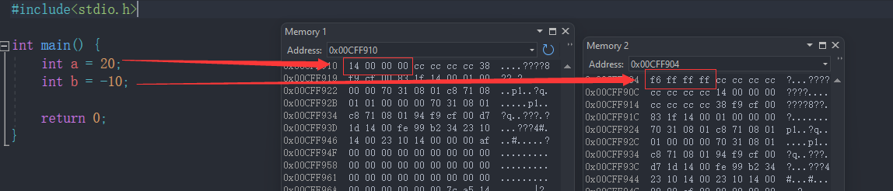
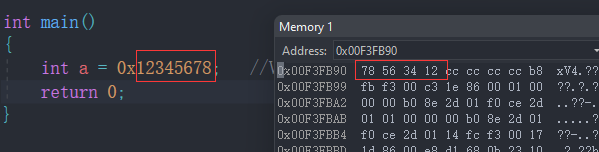
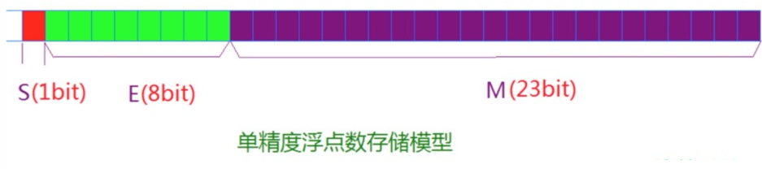
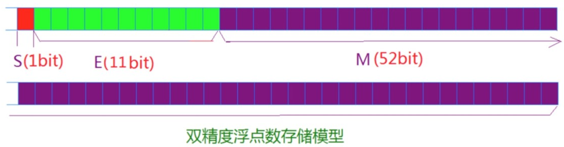


# 数据类型介绍

C语言中的基本内置类型如下：

```c
char        //字符数据类型
short       //短整型
int         //整型
long        //长整型
long long   //更长的整型
float       //单精度浮点数
double      //双精度浮点数
```

**类型的意义：**

> 使用这个类型开辟内存空间的大小（大小决定了使用范围）。
>
> 如何看待内存空间的视角。

## 类型的基本归类

**整型家族：**

```c
char
    unsigned char
    signed char
short
    unsigned short [int]
    signed short [int]
int
    unsigned int
    signed int
long
    unsigned long [int]
    signed long [int]
```

注意：char有些编译器没有规定是unsigned还是signed

**浮点数家族：**

```c
float
double
```

**构造类型：**

```c
> 数组类型
> 结构体类型 struct
> 枚举类型 enum
> 联合类型 union
```

**指针类型：**

```c
int *pi;
char *pc;
float* pf;
void* pv;
```

**空类型：**

> void 表示空类型（无类型）
>
> 通常应用于函数的返回类型、函数的参数、指针类型。


# 整型在内存中的存储

> 整型在内存中的存储通常采用二进制的表示方式。整型变量被分配一定的内存空间来存储其值，这个内存空间的大小由整型的数据类型决定，例如`int`类型通常使用4个字节（32位）或者8个字节（64位）。

我们知道为int类型分配四个字节的空间。 那如何存储？

## 原码、反码、补码

> 在计算机中，原码、反码和补码是用来表示有符号整数的不同编码方式。
>
> **原码**： 原码是最简单的表示有符号整数的方式。在原码中，整数的最高位（最左边的位）用于表示符号，0表示正数，1表示负数，其余位用二进制表示整数的绝对值。例如，用8位表示一个有符号整数，-5的原码为 10000101，+5的原码为 00000101。
>
> **反码**： 反码是将正数的原码保持不变，负数的原码按位取反得到的。即负数的反码是将其原码中的每一位取反（0变为1，1变为0）。例如，用8位表示一个有符号整数，-5的反码为 11111010，+5的反码为 00000101。
>
> **补码**： 补码是计算机中最常用的表示有符号整数的方式。在补码中，正数的补码与原码相同，而负数的补码是其反码加1。即负数的补码是将其反码中的每一位取反（0变为1，1变为0），然后再加1。例如，用8位表示一个有符号整数，-5的补码为 11111011，+5的补码为 00000101。

**总结：**

**正数的原、反、补码都相同。** 

**负整数的三种表示方法各不相同。**

> 原码：直接将数值按照正负数的形式翻译成二进制就可以得到原码。
>
> 反码：将原码的符号位不变，其他位依次按位取反就可以得到反码。
>
> 补码：反码+1就得到补码。

**对于整型来说：数据存放内存中其实存放的是补码。**

为什么呢？

为什么要使用补码表示有符号整数？补码的一个重要特点是，它使得整数的加法和减法可以通过相同的硬件电路来实现**（CPU只有加法器）**，简化了计算机的设计。此外，补码还解决了原码和反码的一个问题，即加法运算的进位问题。

举例说明加法运算： 以用8位表示的补码为例，考虑计算 +5（补码：00000101） + (-3，补码：11111101）。

00000101 (+5)

11111101 (-3)

------

00000010 (+2)

通过补码的加法运算，我们得到了正确的结果+2。这里没有出现进位问题，因为补码表示方式使得减法可以用加法的规则来进行。

**我们看看在内存中的存储：**




我们可以看到对于a和b分别存储的是16进制的补码。但是我们发现顺序有点**不对劲**。

这又是为什么？答案是大小端问题

## 大小端

> 在计算机体系结构中，大小端问题涉及到多字节数据（例如整数、浮点数）在内存中存储的顺序。具体来说，大小端问题涉及到多字节数据的最低有效字节和最高有效字节在内存中的存放顺序。
>
> 大端： 在大端存储方式中，多字节数据的最高有效字节（高位字节）存储在低地址处，而最低有效字节（低位字节）存储在高地址处。
>
> 小端： 在小端存储方式中，多字节数据的最低有效字节（低位字节）存储在低地址处，而最高有效字节（高位字节）存储在高地址处。这种方式正好与大端相反/

**为什么有大端和小端：**

历史背景： 计算机体系结构的发展始于20世纪50年代和60年代，那时不同的计算机制造商开发出了各自的计算机系统。这些计算机系统在硬件设计上有很多不同之处，其中包括数据在内存中的存储方式。最初，并没有一个统一的标准来定义多字节数据的存储顺序，因此出现了不同的字节序方式。

硬件设计差异： 大小端的差异主要源于计算机中多字节数据的存储方式。在计算机中，数据通常按字节存储在内存中，而多字节数据（如整数、浮点数）由多个字节组成。问题在于，这些字节应该以什么顺序存储。

**大端方式**： 早期的一些计算机采用了大端方式，将多字节数据的最高有效字节存储在低地址处，最低有效字节存储在高地址处。这样设计的计算机在处理多字节数据时，能够按照与人们阅读数字相同的顺序进行操作，比较直观。例如，16位整数0x1234在内存中存储为 12 34。

**小端方式**： 随着计算机技术的发展，有些计算机制造商采用了小端方式，将多字节数据的最低有效字节存储在低地址处，最高有效字节存储在高地址处。小端方式与大端方式相反，但同样合理。小端方式在处理多字节数据时，能够直接使用低地址来表示数据的低位部分，这样设计有助于一些特定操作的实现。例如，16位整数0x1234在内存中存储为 34 12。

**VS中就是采用的小端方式存储：**



**练习**：

请简述大端字节序和小端字节序的概念，设计一个小程序来判断当前机器的字节序。（10分）

```c
//代码1
#include <stdio.h>
int check_sys() {
    int i = 1;
    return (*(char *) &i);
}

int main() {
    int ret = check_sys();
    if (ret == 1) {
        printf("小端\n");
    } else {
        printf("大端\n");
    }
    return 0;
}

//代码2
int check_sys() {
    union {
        int i;
        char c;
    } un;
    un.i = 1;
    return un.c;
}
```

## 练习

```c
//练习1
int main() {
    char a = -1;// -1截断后存储在a中
    //1000000000000000000000000000001 - 原码
    //1111111111111111111111111111110 - 反码
    //1111111111111111111111111111111 - 补码
    //11111111 - 截断(从右往左截断)
    //还原成原码-1 取反得10000001 = -1
    signed char b = -1;
    //1111111111111111111111111111111 - 补码
    //11111111 - 截断后
    //还原成原码-1 取反得10000001 = -1
    unsigned char c = -1;
    //其实一眼就能看出来 -1的补码是11111111  无符号就是255  8位二进制最高的表示范围
    //1111111111111111111111111111111 - 补码
    //11111111
    printf("a=%d,b=%d,c=%d", a, b, c);//a=-1,b=-1,c=255
    //c因为是以%d打印，所以还会涉及整型提升
    //11111111
    //0000000000000000000000011111111 - 整型提升  无符号 补0后  为正数  补码 原码相同 直接计算
    //有符号整型提升补首位字符  无符号直接高位补0
    return 0;
}
```

```c
//练习2
//%u是打印无符号整数，认为内存中存放的补码对应的是一个无符号整数
int main(){
    char a = -128;
    //10000000000000000000000010000000
    //11111111111111111111111101111111
    //11111111111111111111111110000000 - 补码
    //10000000 - 截断
    //11111111111111111111111110000000  -  带符号整型提升高位补符号位
    printf("%u\n", a);  //4294967168
    char b = 128;
    //00000000000000000000000010000000 - 正数 原 反 补 一样
    //10000000 - 截断
    //11111111111111111111111110000000 - 整型提升
    printf("%u\n", b);   //4294967168
    return 0;
}
```

```c
//练习3
int main(){
    int i = -20;
    //10000000000000000000000000010100 - 原码
    //11111111111111111111111111101011 - 反码
    //11111111111111111111111111101100 - 补码
    unsigned  int  j = 10;
    //00000000000000000000000000001010
    printf("%d\n", i + j);   //-10
    //11111111111111111111111111101100 - 补码
    //00000000000000000000000000001010 - 补码
    //11111111111111111111111111110110 - 补码+补码
    //10000000000000000000000000001001 - 取反后+1得到下面的
    //10000000000000000000000000001010 - -10
    return 0;
}
```

```c
//练习4
int main(){
    unsigned int i;   //无符号整型 没有负数
    for (i = 9; i >= 0; i--)   //无符号整数一定大于0 所以循环一直进行
    {
        printf("%u\n", i);   //死循环
    }
    return 0;
}
```

```c
//练习5
int main(){
    char a[1000];  //范围-128-127
    //0 -1 -2 -3 -4...-128 127 126....1 0   一个圆，一共255个值
    int i;
    for (i = 0; i < 1000; i++)
    {
        a[i] = -1 - i;
    }
    printf("%d", strlen(a));  //255
    return 0;
}
```

```c
//练习6
unsigned char i = 0;  //0-255
int main(){
    for (i = 0; i <= 255; i++)   //255后i++之后i变成了0  char的值最大为255
    {
        printf("hello world\n");  //死循环
    }
    return 0;
}
```


# 浮点数在内存中的存储

常见的浮点数：3.14159 1E10 

浮点数家族包括： `float`、double、`long double` 类型。

浮点数表示的范围：`float.h`中定义

整型类型的取值范围：`limits.h`中定义

**浮点数存储的例子：**

```c
#include <stdio.h>
int main() {
    int n = 9;
    float *pFloat = (float *) &n;
    printf("n的值为：%d\n", n);
    printf("*pFloat的值为：%f\n", *pFloat);
    *pFloat = 9.0;
    printf("num的值为：%d\n", n);
    printf("*pFloat的值为：%f\n", *pFloat);
    return 0;
}
```

输出结果：

```c
n的值为：9
*pFloat的值为：0.000000
num的值为：1091567616
*pFloat的值为：9.000000
```

让我们解释每一步输出的原因：

`n的值为：9`：这是正确的输出，打印了变量`n`的值，它是整数9。

`*pFloat的值为：0.000000`：这里出现了问题。通过将`pFloat`指针解释为`float*`，它尝试将`n`的内存（整数类型的内存）解释为浮点数。由于浮点数和整数的内部表示方式不同，以这种方式访问`n`的值会导致不正确的浮点数值（通常是未初始化的值）。所以，打印出来的值是错误的。

`num的值为：1091567616`：这个输出是由于前面的`*pFloat = 9.0;`操作，它将浮点数值9.0写入了`n`的内存中，导致了`n`的值被修改为1091567616。这个值是浮点数9.0在内存中的二进制表示转换成整数形式的结果。

`*pFloat的值为：9.000000`：在上一步中，我们将浮点数值9.0写入了`n`的内存中，所以现在`pFloat`指向的内存被解释为浮点数9.0。因此，打印出的结果是9.0。


## 浮点数存储规则

根据国际标准IEEE（电气和电子工程协会） 754，任意一个二进制浮点数V可以表示成下面的形式：

> (-1) ^ S * M * 2 ^ E
>
> (-1) ^ S表示符号位，当S = 0，V为正数；当S = 1，V为负数。
>
> M表示有效数字，大于等于1，小于2。
>
> 2 ^ E表示指数位。

举例来说：

十进制的5.0，写成二进制是 101.0 ，相当于 1.01×2^2 。

那么，按照上面V的格式，可以得出S=0，M=1.01，E=2。

十进制的-5.0，写成二进制是 -101.0 ，相当于 -1.01×2^2 。那么，S=1，M=1.01，E=2。

**IEEE 754规定**：

 对于32位的浮点数，最高的1位是符号位s，接着的8位是指数E，剩下的23位为有效数字M。



对于64位的浮点数，最高的1位是符号位S，接着的11位是指数E，剩下的52位为有效数字M。



**IEEE 754对有效数字M和指数E，还有一些特别规定。**

前面说过， `1≤M<2` ，也就是说，M可以写成 `1.xxxxxx` 的形式，其中xxxxxx表示小数部分。 

IEEE 754规定，在计算机内部保存M时，默认这个数的第一位总是1，因此可以被舍去，只保存后面的 xxxxxx部分。比如保存1.01的时候，只保存01，等到读取的时候，再把第一位的1加上去。这样做的目的，是节省1位有效数字。以32位浮点数为例，留给M只有23位， 将第一位的1舍去以后，等于可以保存24位有效数字。

**至于指数E，情况就比较复杂。**

**首先，E为一个无符号整数（unsigned int）**

这意味着，如果E为8位，它的取值范围为0~255；如果E为11位，它的取值范围为0~2047。但是，我们 知道，科学计数法中的E是可以出现负数的，所以IEEE 754规定，存入内存时E的真实值必须再加上一个中间数，对于8位的E，这个中间数 是127；对于11位的E，这个中间 数是1023。比如，2^10的E是10，所以保存成32位浮点数时，必须保存成10+127=137，即 10001001。

然后，指数E从内存中取出还可以再分成三种情况：

**E不全为0或不全为1**

这时，浮点数就采用下面的规则表示，即指数E的计算值减去127（或1023），得到真实值，再将 有效数字M前加上第一位的1。 

比如： 0.5（1/2）的二进制形式为0.1，由于规定正数部分必须为1，即将小数点右移1位，则为 1.0*2^(-1)，其阶码为-1+127=126，表示为 01111110，而尾数1.0去掉整数部分为0，补齐0到23位00000000000000000000000，则其二进制表示形式为:

```c
0 01111110 00000000000000000000000
```

**E全为0**

这时，浮点数的指数E等于1-127（或者1-1023）即为真实值， 有效数字M不再加上第一位的1，而是还原为0.xxxxxx的小数。这样做是为了表示±0，以及接近于0的很小的数字。

**E全为1**

这时，如果有效数字M全为0，表示±无穷大（正负取决于符号位s）

**解释前面的题目：**

下面，让我们回到一开始的问题：为什么 0x00000009 还原成浮点数，就成了 0.000000 ？ 

首先，将 0x00000009 拆分，得到第一位符号位s=0，后面8位的指数 E=00000000 ， 最后23位的有效数字M=000 0000 0000 0000 0000 1001。

```c
9 -> 0000 0000 0000 0000 0000 0000 0000 1001
```

由于指数E全为0，所以符合上一节的第二种情况。因此，浮点数V就写成：

 `V=(-1)^0 × 0.00000000000000000001001×2^(-126)=1.001×2^(-146)`

显然，V是一个很小的接近于0的正数，所以用十进制小数表示就是0.000000。

再看例题的第二部分。 请问浮点数9.0，如何用二进制表示？还原成十进制又是多少？ 

首先，浮点数9.0等于二进制的1001.0，即1.001×2^3。

`9.0 -> 1001.0 ->(-1)^01.0012^3 -> s=0, M=1.001,E=3+127=130`

那么，第一位的符号位s=0，有效数字M等于001后面再加20个0，凑满23位，指数E等于3+127=130， 即10000010。

 所以，写成二进制形式，应该是s+E+M，即

```c
0 10000010 001 0000 0000 0000 0000 0000
```

这个32位的二进制数，还原成十进制，正是1091567616 。

 `V=(-1)^0 × 0.00000000000000000001001×2^(-126)=1.001×2^(-146)`

显然，V是一个很小的接近于0的正数，所以用十进制小数表示就是0.000000。

再看例题的第二部分。 请问浮点数9.0，如何用二进制表示？还原成十进制又是多少？ 

首先，浮点数9.0等于二进制的1001.0，即1.001×2^3。

`9.0 -> 1001.0 ->(-1)^01.0012^3 -> s=0, M=1.001,E=3+127=130`

那么，第一位的符号位s=0，有效数字M等于001后面再加20个0，凑满23位，指数E等于3+127=130， 即10000010。

 所以，写成二进制形式，应该是s+E+M，即

```c
0 10000010 001 0000 0000 0000 0000 0000
```

这个32位的二进制数，还原成十进制，正是1091567616 。

