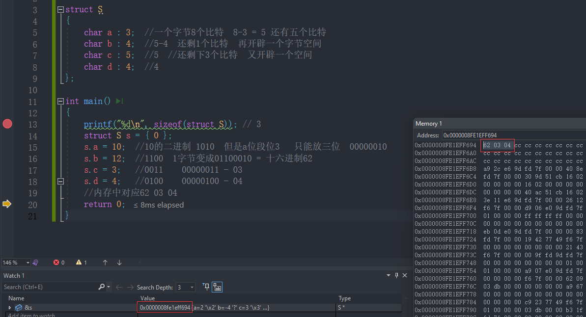

# 结构体

> 结构体是一种用户自定义的**数据类型**，允许将不同类型的数据项组合在一起，形成一个更大的数据结构。结构体可以包含多个成员变量，每个成员变量可以是不同的数据类型，如整数、字符、浮点数等，甚至可以包含其他结构体作为其成员。

复杂对象人：名字+年龄+电话+住址   

结构体struct-描述复杂对象

## 结构体的声明

```c
struct tag
{
 	member-list;
}variable-list;
```

`struct`是关键字，用于声明一个结构体类型。`tag`是给这个结构体类型起的标识符，用于在后续代码中引用这个结构体类型。

`member-list`表示结构体的成员列表，每个成员用一个数据类型和标识符定义。这些成员在结构体内部依次存储。

`variable-list` 这个部分不是结构体的必须组成部分，但是可以用来在定义结构体的同时创建结构体变量。如果在定义结构体时不创建变量，可以忽略这部分。

例如描述一个人：

```c
#include <stdio.h>

// 定义结构体类型
struct Person {
    char name[50];
    int age;
    float height;
} person1, person2; // 创建两个结构体变量 person1 和 person2，注意分号不可以缺少

int main() {
    // 初始化结构体变量
    struct Person person3 = {"John Doe", 30, 1.75};
    
    // 访问结构体成员
    printf("Name: %s\n", person3.name);
    printf("Age: %d\n", person3.age);
    printf("Height: %.2f meters\n", person3.height);
    
    return 0;
}
```

## 匿名结构体

> 匿名结构体是指在定义结构体变量时，省略结构体的名称，直接声明结构体变量并定义其成员。这种形式适用于一些临时或简单的数据组织需求，不需要为结构体类型起一个独立的名字。匿名结构体的作用范围仅限于当前代码块。

**例如**：

```c
#include <stdio.h>

int main() {
    // 定义匿名结构体变量，并直接初始化
    struct {
        float length;
        float width;
    } rectangle = {5.0, 3.0}; // 创建结构体变量并初始化
    
    // 计算矩形的面积
    float area = rectangle.length * rectangle.width;
    
    printf("Rectangle Length: %.2f\n", rectangle.length);
    printf("Rectangle Width: %.2f\n", rectangle.width);
    printf("Rectangle Area: %.2f\n", area);
    
    return 0;
}
```

问题，下面的代码合法吗？

```c
struct
{
    char book_name[20];
    char author[20];
    int price;
    char id[15];
} sb1, sb2;

struct
{
    char book_name[20];
    char author[20];
    int price;
    char id[15];
} *ps;

int main() {
    ps = &sb1;  //err,编译器会把上面的两个声明当成完全不同的两个类型。所以是非法的。
    return 0;
}
```

**警告**： 编译器会把上面的两个声明当成完全不同的两个类型。 所以是非法的。

**总结：**

> 匿名结构体适用于一些临时的数据组织，特别是在某个作用域内部且仅在局部范围使用的情况下，这样可以省略给结构体起一个名称的步骤，使得代码更加简洁和清晰。然而，对于需要在多个函数或多个地方使用的复杂数据结构，还是推荐使用带有名称的结构体类型。

## 结构体的自引用

> 结构体的自引用指的是结构体中包含指向相同类型结构体的指针成员，从而创建一个自循环的数据结构

链表结构就要利用结构体的自引用来实现：

```c
typedef struct Node { //对struct Node重命名为Node
    int data;
    struct Node *next; //指向下个结点的地址，这里的struct不能省略
} Node;

int main() {
    Node n;
    return 0;
}
```

## 结构体变量的定义和初始化

```c
struct Point{
    int x;
    int y;
} p1;            //声明类型的同时定义变量p1
struct Point p2; //定义结构体变量p2

//初始化：定义变量的同时赋初值。
struct Point p3 = {1, 2};

struct Stu {       //类型声明
    char name[15]; //名字
    int age;       //年龄
};
struct Stu s = {"zhangsan", 20}; //初始化
```

结构体还可以嵌套初始化：

```c
struct Node {
    int data;
    struct Point p;                 //4，5
    struct Node *next;              //NULL
} n1 = {10, {4, 5}, NULL};          //结构体嵌套初始化
struct Node n2 = {20, {5, 6}, NULL};//结构体嵌套初始化 
```

不按顺序初始化：

```c
struct S {
    char c;
    int a;
    float f;
};

int main() {
    struct S s = {'w', 20, 3.14f};      //顺序初始化
    printf("%c %d %f\n", s.c, s.a, s.f);
    struct S s2 = {s2.f = 3.14f, s2.c = 'w', s2.a = 10};   //不按顺序初始化
    printf("%c %d %f\n", s.c, s.a, s.f);
    return 0;
}
```

**注意**：不按顺序初始化,VS可以 gcc编译器不支持

## 结构体成员的访问

> 可以使用点操作符（`.`）来访问结构体的成员。点操作符允许我们通过结构体变量来访问结构体内部的成员变量，使得我们可以读取或修改这些成员的值。如果结构体是指针类型，我们可以使用箭头操作符（`->`）来访问指向的内容。

例如以下结构体成员：

```c
struct Stu{
	char name[20];
	int age;
};

struct Stu s;
```

我们可以看到 `s` 有成员 `name` 和 `age` ； 

那我们如何访问`s`的成员？

```c
struct S s;
strcpy(s.name, "zhangsan");//使用.访问name成员
s.age = 20;//使用.访问age成员
```


**结构体指针访问指向变量的成员** ：

有时候我们得到的不是一个结构体变量，而是指向一个结构体的指针。

那该如何访问成员

如下：

```c
struct Stu {
    char name[20];
    int age;
};

void print(struct Stu *ps) {
    printf("name = %s   age = %d\n", (*ps).name, (*ps).age);
    //使用结构体指针访问指向对象的成员
    printf("name = %s   age = %d\n", ps->name, ps->age);
}

int main() {
    struct Stu s = {"zhangsan", 20};
    print(&s);//结构体地址传参
    return 0;
}
```

使用`(*ps)`解引用后`.`操作访问,或者`->`直接访问

## 结构体传参

> 结构体可以按值传递或按指针传递给函数。在按值传递时，函数将接收到结构体的副本，对副本的修改不会影响原始结构体。在按指针传递时，函数将接收到结构体的地址，可以直接修改原始结构体的内容。

例如：

```c
struct S {
    int data[1000];
    int num;
};

void print1(struct S s) {
    //传值比较浪费空间，可能会栈溢出
    printf("%d %d %d %d\n", s.data[0], s.data[1], s.data[2], s.num);// 1 2 3 100
}

void print2(struct S *ps) {
    //两种写法  推荐第二个
    printf("%d %d %d %d\n", (*ps).data[0], (*ps).data[1], (*ps).data[2], (*ps).num);// 1 2 3 100
    printf("%d %d %d %d\n", ps->data[0], ps->data[1], ps->data[2], ps->num);        // 1 2 3 100
}

int main() {
    struct S ss = {{1, 2, 3, 4, 5}, 100};
    print1(ss);
    print2(&ss);
    return 0;
}
```

上面的 `print1` 和 `print2` 函数哪个好些？

答案是：首选print2函数。

**原因：**

> 函数传参的时候，参数是需要压栈，会有时间和空间上的系统开销。
>
> 如果传递一个结构体对象的时候，结构体过大，参数压栈的的系统开销比较大，所以会导致性能的 下降。

## 结构体内存对齐

> 结构体的内存对齐是编译器根据特定的规则将结构体成员按照一定的字节边界进行排列的过程。对齐的目的是为了优化内存访问效率，避免因为数据未对齐而导致的性能损失。对齐原则因编译器和体系结构而异

**如何计算？**

首先得掌握结构体的对齐规则：

> 1.第一个成员在与结构体变量偏移量为0的地址处。
>
> 2.其他成员变量要对齐到某个数字（对齐数）的整数倍的地址处。
>
> ​	**对齐数** = 编译器默认的一个对齐数与该成员大小最大值的**较小值**。`VS中默认的值为8`
>
> 3.结构体总大小为最大对齐数（每个成员变量都有一个对齐数）的整数倍。
>
> 4.如果嵌套了结构体的情况，嵌套的结构体对齐到自己的最大对齐数的整数倍处，结构体的整体大小就是所有最大对齐数（含嵌套结构体的对齐数）的整数倍。

观察下面的结果：

```c
#include <stddef.h>
#include <stdio.h>
struct S1 {
    char c1;
    int i;
    char c2;
};

struct S2 {
    char c1;
    char c2;
    int i;
};

int main() {
    //S1的偏移量
    printf("%d\n", offsetof(struct S1, c1));//0  c1从0开始
    printf("%d\n", offsetof(struct S1, i)); //4	 i从4开始
    printf("%d\n", offsetof(struct S1, c2));//8  c2从8开始 8+1字节=9字节，按4字节对齐=12
    
    printf("%d\n", offsetof(struct S2, c1));//0  c1从0开始
    printf("%d\n", offsetof(struct S2, c2));//1  c2从1开始  
    printf("%d\n", offsetof(struct S2, i)); //4  i从4开始  4+4=8字节，按4字节对齐=8

    printf("%d\n",sizeof(struct S1)); //12
    printf("%d\n",sizeof(struct S2)); //8
    return 0;
}
```

> `offsetof`宏-用来计算结构体成员相对于起始位置的偏移量，头文件#include<stddef>

**练习**：

```c
struct S3 {
    double d;// 0 - 7
    char c;  // 8
    int i;   // 12-15
};

struct S4 {
    char c1;     // 0
    struct S3 s3;// 8-20   s3
    double d;    // 24-31
};

int main() {
    printf("%d\n", sizeof(struct S3));// 16
    printf("%d\n", sizeof(struct S4));// 32
    return 0;
}
```

首先，我们有两个结构体 `struct S3` 和 `struct S4`。

`struct S3` 中包含了三个成员：

1. `double d`：占用8个字节（通常情况下是64位浮点数的大小）。
2. `char c`：占用1个字节。
3. `int i`：占用4个字节。

由于结构体中的成员变量的对齐数通常是成员本身大小和编译器默认对齐数（在Visual Studio中默认是8字节）中较小的值，所以每个成员都需要对齐到8字节的整数倍地址处。

所以 `struct S3` 的总大小是 `8 + 1 + 4 = 13` 字节。但由于对齐的需要，结构体的总大小会被调整为最大对齐数的整数倍，所以 `sizeof(struct S3)` 的结果为 `16` 字节。

接下来，我们看 `struct S4`。

`struct S4` 中包含了两个成员：

1. `char c1`：占用1个字节。
2. `struct S3 s3`：占用 `sizeof(struct S3) = 16` 字节。

在 `struct S4` 中，由于 `struct S3 s3` 的是16字节，编译器默认对齐数是8字节，所以 `double d` 需要对齐到`8`字节的整数倍地址处。因此，在 `struct S4` 中，`double d` 的偏移量为 `24` 字节。

总字节大小为32字节，是8的对齐数，所以结果就是8字节

**为什么存在内存对齐**?

- 平台原因(移植原因)： 

  不是所有的硬件平台都能访问任意地址上的任意数据的；某些硬件平台只能在某些地址处取某些特定类型的数据，否则抛出硬件异常。

- 性能原因：

  数据结构(尤其是栈)应该尽可能地在自然边界上对齐。
  原因在于，为了访问未对齐的内存，处理器需要作两次内存访问；而对齐的内存访问仅需要一次访
  问。

总体来说：

> 结构体的内存对齐是拿**空间**来换取**时间**的做法。

那在设计结构体的时候，我们既要满足对齐，又要节省空间，如何做到：

让占用空间小的成员尽量集中在一起。

```c
//例如：
struct S1 {
    char c1;
    int i;
    char c2;
};

struct S2 {
    char c1;
    char c2;
    int i;
};
```

S1和S2类型的成员一模一样，但是S1和S2所占空间的大小有了一些区别。

## 修改默认对齐数

> 可以通过预处理指令来修改结构体的默认对齐数。在大多数编译器中，可以使用`#pragma pack`指令来实现这一点。

`#pragma pack` 指令允许你指定对齐数的大小，从而改变结构体成员在内存中的对齐方式。通常情况下，对齐数是编译器默认的一个值和该成员大小的较小值，但通过`#pragma pack`，你可以设置一个不同的对齐数。

例如，假设将默认对齐数设置为4字节，可以这样做：

```c
#pragma pack(4)

struct YourStruct {
    // 结构体成员
};

#pragma pack() // 重置为默认对齐数
```

注意，修改对齐数可能会影响结构体的内存布局和性能。通常情况下，编译器的默认对齐数是为了在不同平台上实现最佳的内存对齐和访问效率。如果不是很确定需要修改对齐数，最好还是使用编译器的默认设置。

如果需要修改对齐数，建议只在必要时进行，并且要确保所有的相关代码都知道这个修改，以免引起不必要的问题。在修改对齐数时，最好先了解你的编译器支持的具体语法和特性，以便正确地使用`#pragma pack`指令。

```c
#include <stdio.h>
#pragma pack(8)//设置默认对齐数为8
//8和成员大小最小-对齐数4
struct S1 {
    char c1;   //0
    int i;     //4
    char c2;   //9    对齐4为12
};

#pragma pack() //取消设置的默认对齐数，还原为默认
#pragma pack(1)//设置默认对齐数为1

//对齐数为1，成员大小为4，对齐数为1
struct S2 {
    char c1;   //0
    int i;     //1
    char c2;   //5      对齐数为1表示不对齐，大小为0到5=6
};

#pragma pack()//取消设置的默认对齐数，还原为默认

int main() {
    //输出的结果是什么？
    printf("%d\n", sizeof(struct S1));  //12
    printf("%d\n", sizeof(struct S2));  //6
    return 0;
}
```


# 结构体位段

> 结构体位段是一种特殊的结构体成员，允许你以位为单位定义成员的长度。它们用于有效地使用内存，特别是在需要处理硬件寄存器或二进制数据的情况下。结构体位段可以在结构体声明中指定成员的位宽，从而使得这些成员只占用特定数量的位而不是整个字节。

位段的声明和结构是类似的，有两个不同：

> 1.位段的成员必须是 int、unsigned int或signed int 。 
>
> 2.位段的成员名后边有一个冒号和一个数字。

比如：

```c
struct S {
    int a;
    int b;
    int c;
    int d;
};

//A是位段-其中的位其实是二进制位
struct A {
    //先开辟了4byte - 32bit
    int _a : 2; // a成员只需要2个比特位  32-2 = 30
    int _b : 5; // b成员只需要5个比特位  30-5 = 25
    int _c : 10;// c成员只需要10个比特位 25-10 = 15    剩余的15个字节怎么使用由编译器决定
    int _d : 30;// d成员只需要30个比特位  还剩15 不够用 又开辟了四个字节的空间  一共8个字节
};

int main() {
    printf("%d\n", sizeof(struct S));// 16
    printf("%d\n", sizeof(struct A));// 8
    return 0;
}
```

## 位段的内存分配

> - 位段的成员可以是 `int/unsigned int/signed int` 或者是 `char` （属于整型家族）类型 
> - 位段的空间上是按照需要以4个字节（ int ）或者1个字节（ char ）的方式来开辟的。 
> - 位段涉及很多不确定因素，位段是不跨平台的，注重可移植的程序应该避免使用位段。

一个例子：

```c
struct S
{
    char a : 3;  //一个字节8个比特  8-3 = 5 还有五个比特
    char b : 4;  //5-4  还剩1个比特  再开辟一个字节空间
    char c : 5;  //5  //还剩下3个比特  又开辟一个空间
    char d : 4;  //4
};

int main()
{
    printf("%d\n", sizeof(struct S)); // 3
    struct S s = {0};
    s.a = 10;  //10的二进制 1010  但是a位段位3   只能放三位  00000010
    s.b = 12;  //1100  1字节变成01100010 = 十六进制62
    s.c = 3;   //0011    00000011 - 03
    s.d = 4;   //0100    00000100 - 04
    //内存中对应62 03 04 
    return 0;
} 
```




## 位段的跨平台问题

> 1. int位段被当成有符号数还是无符号数是不确定的。 
> 2. 位段中最大位的数目不能确定。（16位机器最大16，32位机器最大32，写成27，在16位机器会出问题。 
> 3. 位段中的成员在内存中从左向右分配，还是从右向左分配标准尚未定义。 
> 4. 当一个结构包含两个位段，第二个位段成员比较大，无法容纳于第一个位段剩余的位时，是舍弃剩余的位还是利用，这是不确定的。

**总结：**

> 跟结构相比，位段可以达到同样的效果，但是可以很好的节省空间，但是有跨平台的问题存在。


# 枚举

> 枚举（Enum）是一种用户定义的数据类型，用于表示一组具名的整数常量。枚举允许程序员为不同的值指定有意义的名字，使得代码更加清晰和易读。

比如我们现实生活中：

一周的星期一到星期日是有限的7天，可以一一列举。

性别有：男、女、保密，也可以一一列举。

月份有12个月，也可以一一列举

## 枚举类型的定义

语法如下：

```c
enum enumName {
    value1,
    value2,
    value3,
    // more values...
};
```

在枚举中，`enumName` 是枚举类型的名称，`value1`, `value2`, `value3`, ... 是`枚举常量`。每个常量都隐式地被赋予一个整数值，其值默认从0开始递增。当然在定义的时候也可以赋初值。

例如：

```c
enum Color//颜色
{
    RED = 1,
    GREEN = 2,
    BLUE = 4
};
```

**枚举类型的大小？**

> 枚举类型在C语言中的大小取决于编译器的实现和平台的架构。虽然C标准没有规定具体的枚举类型大小，但大多数编译器将枚举实现为整数类型（通常是`int`或`unsigned int`），以便能够容纳枚举中定义的所有常量值。
>
> 通常情况下，枚举类型的大小是整数类型的大小，即通常为4个字节（32位平台）或8个字节（64位平台）。

## 枚举类型的优点

**为什么使用枚举？**

我们可以使用 `#define` 定义常量，为什么非要使用枚举？

```c
#define Red 5
#define Green 7
#define Blue 10
int main(){
	int num = Red;
	return 0;
}
```

define预处理后define命令就消失了替换成了数字 ，不方便调试

**枚举的优点：**

> 1.增加代码的可读性和可维护性
>
> 2.和#define定义的标识符比较枚举有类型检查，更加严谨
>
> 3.便于调试
>
> 4.使用方便，一次可以定义多个常量
>
> 5.防止命名污染(封装)

## 枚举的使用

```c
enum Color {
    //枚举的可能取值
    //每一个可能的取值是常量
    Red,
    Green,
    Blue
    //Red = 5
    //Red = 9
    //Red = 10
};

int main() { 
    enum Color color = Blue;   //只能拿枚举常量给枚举变量赋值，才不会出现类型的差异。
    //enum Color color = 5;    //C语言支持， C++会有警告
    //Red = 2;   //常量不可修改
    int num = Red;
    printf("%d\n", num);               //0
    printf("%d\n", Red);               //0
    printf("%d\n", Green);             //1
    printf("%d\n", Blue);              //2
    int sum = Red + Blue;              //可以相加，但是有些编译器不支持
    printf("%d\n", sum);               //2
    printf("%d\n", sizeof(enum Color));//VS中为4
    
    return 0;
}
```

**注意**：枚举常量不可修改


# 联合体(共用体)

> 联合体（Union）是一种特殊的数据类型，允许在同一块内存空间中存储不同类型的数据。与结构体不同，联合体的成员共享同一块内存，但每次只有一个成员是有效的。联合体的大小取决于其成员中最大的成员大小。

定义联合体的语法如下：

```c
union unionName {
    memberType member1;
    memberType member2;
    // more members...
};
```

在联合体中，`unionName` 是联合体类型的名称，`member1`, `member2`, ... 是联合体的成员。每个成员都可以是不同的数据类型，但它们共享相同的内存空间。

## 联合体的特点

> 联合的成员是共用同一块内存空间的，这样一个联合变量的大小，至少是最大成员的大小（因为联合至少得有能力保存最大的那个成员）。

实例如下：

```c
#include <stdio.h>
union Un {
    char c;
    int i;
    double d;
};


int main() {
    union Un un;
    printf("%p\n", &un);    //000000000061FE18
    printf("%p\n", &(un.c));//000000000061FE18
    printf("%p\n", &(un.i));//000000000061FE18
    printf("%p\n", &(un.d));//000000000061FE18
    //地址相同
    
    printf("%d\n", sizeof(union Un));//8个字节
    return 0;
}
```

下面输出的结果是什么？

```c
un.i = 0x11223344;
un.c = 0x55;
printf("%x\n", un.i); 
```

结果：11223355

在这个代码中，首先将`0x11223344`赋给了`un.i`，这将整数的所有4个字节设置为十六进制的`11 22 33 44`。然后，将`0x55`赋给了`un.c`，这只会将整数的第一个字节设置为十六进制的`55`。由于整数的第一个字节先前已设置为`11`，因此在赋值后它变为了`55`。因此，当打印出`un.i`的值时，它将等于十六进制的`11223355`。

## 联合体大小计算

> - 联合体的大小取决于它包含的成员中最大的数据类型的大小。
> - 当最大成员大小不是最大对齐数的整数倍的时候，就要对齐到最大对齐数的整数倍。

比如：

```c
union Un {
    char arr[5];//5 对齐数为1
    int i;      //4
};

union Un1 {
    short s[7];//14
    int i;     //4
};

int main() {
    printf("%zu\n", sizeof(union Un)); //联合体大小为5，对齐4的倍数为8
    printf("%zu\n", sizeof(union Un1));//联合体大小为14，对齐4的倍数为16
    return 0;
}
```

## 联合体求大小端

一个数值，存储时需要的内存空间只要超过1个字节，就涉及顺序的问题

0x 11 22 33 44

**联合体求大小端**：

```c
int check_sys() {
    union {
        char c;
        int i;
    } u;

    u.i = 1;   //联合体公用一块空间 i的空间小端存储为 01 00 00 00
    return u.c;//return返回 c  c为1个字节 就是1  如果是大端返回0
}

int main() {
    int ret = check_sys();
    if (ret == 1)
        printf("小端\n");
    else
        printf("大端\n");
}
```


