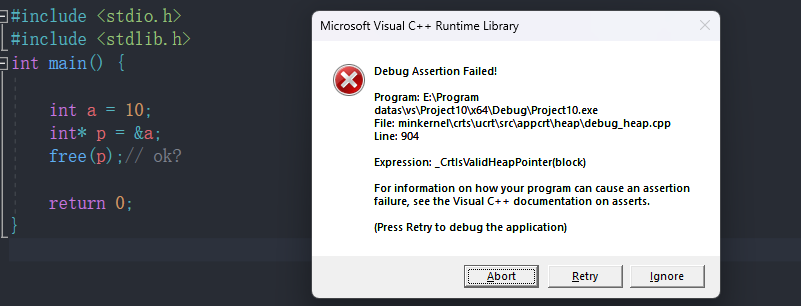
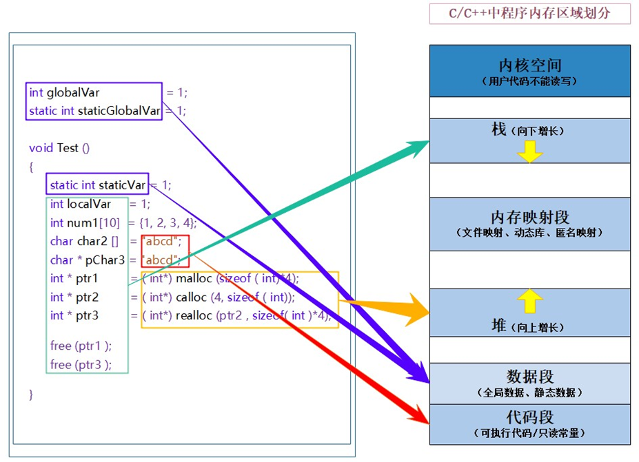


# 动态内存函数

**为什么存在动态内存分配？**

```c
int main(){
    int num = 10;  //向栈空间申请4个字节
    int arr[10];   //向栈空间申请了40个字节
    return 0;
}
```

上述的开辟空间的方式有两个特点：

1. 空间开辟大小是固定的。
2. 数组在声明的时候，必须指定数组的长度，它所需要的内存在编译时分配。

但是对于空间的需求，不仅仅是上述的情况。有时候我们需要的空间大小在程序运行的时候才能知道，那数组的编译时开辟空间的方式就不能满足了。这时候就需要动态内存开辟了。

## malloc和free

`malloc()`是用于在程序执行期间动态分配内存。它的全称是"memory allocation"，意为内存分配。`malloc()`函数是C标准库的一部分，它的声明在`stdlib.h`头文件中。

函数原型如下：

```c
void* malloc(size_t size);
```

在这里，`size`是你想要分配的字节数，函数返回一个指向分配的内存块起始地址的指针。`malloc()`函数的返回类型是`void*`，这意味着返回的指针可以赋值给任何指针类型而无需显式转换。

下面简要解释一下`malloc()`的工作原理：

> 提供想要分配的字节数，`malloc()`在堆内存中搜索一个足够大的连续内存块来存储这些字节。
>
> 如果找到了合适的内存块，它将其标记为已使用，并返回该内存块的起始地址的指针。
>
> 如果找不到足够大的内存块，它将返回一个`NULL`指针，表示内存分配失败。

**注意**：使用`malloc()`分配的内存需要使用`free()`函数显式地释放，否则会导致内存泄漏。

```c
void free(void* ptr);
```

`free()`函数接受之前分配的内存块的指针，并将其释放，使其可供将来的动态分配使用。如果忘记释放之前分配的内存，程序每次运行分配代码时都会消耗更多内存，最终可能导致内存耗尽。

```c
#include <stdio.h>
#include <stdlib.h>

int main() {
    int n = 5;
    int* dynamicArray = (int*)malloc(n * sizeof(int));

    if (dynamicArray == NULL) {
        printf("内存分配失败！\n");
    } else {
        // 使用分配的内存块
        for (int i = 0; i < n; i++) {
            dynamicArray[i] = i + 1;
        }

        // 当不再需要分配的内存时，记得释放它
        free(dynamicArray);
        dynamicArray = NULL；   
    }

    return 0;
}
```

在调用`free()`函数释放动态分配的内存后，将指针`dynamicArray`设置为`NULL`是一个良好的习惯，但不是必须的。

设置指针为`NULL`的优点：

> 1. 避免悬挂指针（Dangling Pointer）：如果在释放内存后不将指针设置为`NULL`，该指针将仍然保留先前的地址。如果你在后续代码中继续使用该指针，可能会导致悬挂指针，即指针指向的内存已经被释放或者重新分配，这可能导致程序崩溃或产生难以调试的错误。将指针设置为`NULL`可以帮助你避免这种情况，因为如果尝试使用空指针，程序将产生明确的错误（空指针解引用）。
> 2. 避免重复释放：在释放内存后，如果将指针设置为`NULL`，你可以通过检查指针是否为`NULL`来确定是否已经释放了内存。如果你在后续代码中错误地再次调用`free()`，会导致未定义的行为。

如果你在后续代码中小心地避免悬挂指针和重复释放内存，那么不设置为`NULL`也不会导致问题。然而，这是一个简单且有助于防范错误的额外保护措施，所以建议在释放内存后将指针设置为`NULL`。

## calloc

`calloc()`是另一个动态内存分配函数，也属于标准C库（stdlib.h头文件）。与`malloc()`功能类似，但在使用上有一些区别。

`calloc()`函数的原型如下：

```c
void* calloc (size_t num, size_t size);
```

其中`num`是你想要分配的元素数量，`size`是每个元素的大小（以字节为单位）。`calloc()`函数会为`num * size`字节的内存块分配空间，并将该内存块中的所有位初始化为零。

相对于`malloc()`，`calloc()`的一个优势是它会自动初始化分配的内存，这意味着你不需要手动将分配的内存清零。在某些情况下，这可能是非常有用的，特别是当你需要确保分配的内存一开始就是零值时。

**示例：**

```c
#include <stdio.h>
#include <stdlib.h>

int main() {
    int n = 5;
    int* dynamicArray = (int*)calloc(n, sizeof(int));

    if (dynamicArray == NULL) {
        printf("内存分配失败！\n");
    } else {
        // 使用分配的内存块，这里的内存已经被初始化为零
        for (int i = 0; i < n; i++) {
            printf("%d ", dynamicArray[i]); // 输出: 0 0 0 0 0
        }

        // 当不再需要分配的内存时，记得释放它
        free(dynamicArray);
    }

    return 0;
}
```

**总结：**

> calloc = malloc+memset 初始化为0

## realloc

`realloc`是一个用于重新分配内存块大小的函数。具体而言，它可以用于更改之前通过`malloc`或`calloc`分配的内存块的大小。

`realloc`函数的声明如下：

```c
void *realloc(void *ptr, size_t size);
```

参数说明：

- `ptr`：指向之前已分配内存块的指针。如果`ptr`为NULL，则`realloc`的行为就相当于`malloc`，即分配一个新的内存块。
- `size`：新的内存块大小，以字节为单位。

`realloc`的工作原理如下：

1. 如果`ptr`为NULL，那么`realloc`的行为就等同于`malloc(size)`，它将分配一个新的大小为`size`字节的内存块，并返回指向该内存块的指针。
2. 如果`size`为0，且`ptr`不为NULL，那么`realloc`的行为就等同于`free(ptr)`，即释放掉之前分配的内存块，并返回NULL指针。
3. 如果`ptr`不为NULL且`size`不为0，`realloc`将尝试重新分配之前分配的内存块。可能发生以下几种情况：
   - 如果之前分配的内存块大小大于或等于`size`，则不会分配新的内存块，而是简单地返回原始内存块的指针，不会改变原内存块的内容。
   - 如果之前分配的内存块大小小于`size`，`realloc`会尝试将原始内存块扩展到新的大小。这可能会**在原始内存块后面的可用内存空间进行扩展，如果没有足够的连续空间来扩展，则`realloc`可能会在另一个地方重新分配一个新的内存块，并将原始内容复制到新的内存块中。**这意味着`realloc`有可能返回一个新的指针，而不是原始指针，所以在使用`realloc`后，最好将返回的指针赋值给原来的指针。
   - 如果`realloc`在新的内存块分配失败时，将返回NULL，并且之前分配的内存块仍然保持未更改。

使用`realloc`时，应该特别注意以下几点：

- 如果`realloc`返回NULL，表示重新分配失败，原来的指针仍然有效，为避免内存泄漏，应该保存原来的指针，并根据需要释放之前的内存块。
- 当使用`realloc`时，最好不要直接修改原始指针，而是将`realloc`的结果赋值给原始指针，以防止意外的内存问题。

**实例：**

```c
#include <stdio.h>
#include <stdlib.h>
int main() {
    int *p = (int *) malloc(40);
    if (p == NULL)
        return 1;
    //使用
    int i = 0;
    for (i = 0; i < 10; i++) {
        *(p + i) = i;
    }

    for (i = 0; i < 10; i++) {
        printf("%d ", *(p + i));
    }
    //增加空间
    // p = (int *)realloc(p, 80); //如果开辟失败的话，p变成了空指针，不能这么写
    int *ptr = (int *) realloc(p, 80);
    if (ptr != NULL) {
        p = ptr;
        ptr = NULL;
    }
    //当realloc开辟失败的时候，返回的也是空指针
    //使用
    for (i = 10; i < 20; i++) {
        *(p + i) = i;
    }

    for (i = 10; i < 20; i++) {
        printf("%d ", *(p + i));
    }
    //释放
    free(p);
    p = NULL;
    return 0;
}

//输出结果：0 1 2 3 4 5 6 7 8 9 10 11 12 13 14 15 16 17 18 19
```


# 常见的动态内存错误

## 对NULL指针的解引用操作

```c
#include <stdio.h>
#include <stdlib.h>
int main() {
    int* p = (int*)malloc(20);
    *p = 5;  //错误,空指针解引用
    //为了不对空指针解引用  需要进行判断
    if (p == NULL) {
        perror("malloc");
        return 1;
    }
    else {
        *p = 5;
    }
    free(p);
    p = NULL;
    return 0;
}
```

## 对动态开辟空间的越界访问

```c
#include <stdio.h>
#include <stdlib.h>
int main() {
    int *p = (int *) malloc(20);
    if (p == NULL)
        return 1;
    int i = 0;
    for (i = 0; i < 20; i++)//越界访问    20个字节 只能访问5个整型
    {
        *(p + i) = i;
    }

    free(p);
    p = NULL;
    return 0;
}
```

## 对非动态开辟内存使用free释放

```c
#include <stdio.h>
#include <stdlib.h>
int main() {

    int a = 10;
    int* p = &a;
    free(p);// ok?

    return 0;
}
```


编译器会直接报错

## 使用free释放一块动态开辟内存的一部分

```c
#include <stdio.h>
#include <stdlib.h>
int main() {
    int *p = (int *) malloc(40);
    if (p = NULL)
        return 1;
    int i = 0;
    for (i = 0; i < 5; i++) {
        *p = i;
        p++;
    }
    //释放
    //在释放的时候，p指向的不再是动态内存空间的起始位置
    free(p);// p不再指向动态内存的起始位置
    p++;
    return 0;
}
```

## 对同一块动态内存多次释放

```c
#include <stdio.h>
#include <stdlib.h>
int main() {
    int* p = (int*)malloc(40);
    if (p == NULL){
		return 1;
    }
    int i = 0;
    for (i = 0; i < 5; i++) {
        *(p + i) = i;
    }
    //重复free
    free(p);
    p = NULL;//如果将p赋值为NULL  就可以在free，否则编译器会直接报错
    free(p);

    return 0;
}
```

## 动态开辟内存忘记释放（内存泄漏）

```c
#include <stdio.h>
#include <stdlib.h>
int *get_memory() {
    int *p = (int *) malloc(40);

    return p;
}

int main() {
    int *ptr = get_memory();
    //使用

    //释放  如果不释放 就会导致内存泄漏
    free(ptr);
    return 0;
}
```


# C/C++程序的内存开辟




C/C++程序内存分配的几个区域：

> 1. 栈区（stack）：在执行函数时，函数内局部变量的存储单元都可以在栈上创建，函数执行结束时这些存储单元自动被释放。栈内存分配运算内置于处理器的指令集中，效率很高，但是分配的内存容量有限。 栈区主要存放运行函数而分配的局部变量、函数参数、返回数据、返回地址等。 
> 2. 堆区（heap）：一般由程序员分配释放， 若程序员不释放，程序结束时可能由OS回收 。分配方式类似于链表。 
> 3. 数据段（静态区）（static）存放全局变量、静态数据。程序结束后由系统释放。 
> 4. 代码段：存放函数体（类成员函数和全局函数）的二进制代码。

普通的局部变量是在栈区分配空间的，栈区的特点是在上面创建的变量出了作用域就销毁。 但是被static修饰的变量存放在数据段（静态区），数据段的特点是在上面创建的变量，直到程序结束才销毁，所以生命周期变长。


# 练习

## 题目1

```c
#include <stdio.h>
#include <stdlib.h>
void GetMemory(char *p) {
    p = (char *) malloc(100);
}

void Test(void) {
    char *str = NULL;
    GetMemory(str);
    strcpy(str, "hello world");
    printf(str);
}

int main() {
    Test();
    return 0;
}
```

**请问运行Test 函数会有什么样的结果？**

运行`Test`函数会导致未定义行为。

在`GetMemory`函数中，传入的`char *p`是一个局部变量，当在函数内部对其进行修改，并不会影响到原始调用函数中的指针。这是因为函数的参数是通过值传递的，即函数得到的是实参的副本，对参数的修改不会影响原始的实参。

在`Test`函数中，将一个NULL指针`str`传递给`GetMemory`函数，然后在`GetMemory`函数中分配了内存并将新的地址赋给`p`。但这对`str`并没有影响，`str`仍然是一个NULL指针，指向未分配的内存。

接着，在`Test`函数中使用`strcpy`将字符串拷贝到`str`指向的内存，但是`str`指向的内存并没有被分配，这将导致未定义行为。

为了正确地分配内存并使用指针，需要修改`GetMemory`函数，使其返回分配的内存地址，并在`Test`函数中接收返回的指针。另外，别忘了在使用完内存后，需要使用`free`函数来释放动态分配的内存。

**改写1：**

```c
#include <stdio.h>
#include <stdlib.h>
void GetMemory(char **p) {
    *p = (char *) malloc(100);
}

void Test(void) {
    char *str = NULL;
    GetMemory(&str);   //传指针的地址
    strcpy(str, "hello world");
    printf(str);
    //释放
    free(str);
    str = NULL;
}

int main() {
    Test();
    return 0;
}
```

**改写2：**

```c
#include <stdio.h>
#include <stdlib.h>
char *GetMemory() {
    char *p = (char *) malloc(100);
    return p;
}

void Test(void) {
    char *str = NULL;
    str = GetMemory();   //接受返回的p
    strcpy(str, "hello world");
    printf(str);
    //释放
    free(str);
    str = NULL;
}

int main() {
    Test();
    return 0;
}
```

## 题目2

```c
char *GetMemory(void) {
    char p[] = "hello world";
    return p;
}

void Test(void) {
    char *str = NULL;
    str = GetMemory();
    printf(str);
}
```

**请问运行Test函数会有什么样的结果？**

在`GetMemory`函数中，定义了一个局部数组`char p[] = "hello world";`，然后将该数组的地址返回给调用者。但是，一旦`GetMemory`函数执行完毕，其局部变量（`p`数组）将被销毁，因为它是一个自动存储类别的局部变量。所以，返回的指针指向的是已经无效的内存。

在`Test`函数中，你将`GetMemory`的返回值赋给指针`str`，然后使用`printf`打印`str`指向的内容。由于`GetMemory`返回的是一个无效的指针（指向已经被销毁的局部数组），`printf`可能会打印出垃圾值，或者程序崩溃，或者导致其他不可预测的结果。

这个问题被称为"悬挂指针"问题，因为指针悬挂在指向已经无效的内存位置上。

要解决这个问题，可以考虑使用动态内存分配来分配存储字符串的内存，并在使用完后记得使用`free`来释放内存。

**修改后的代码示例：**

```c
#include <stdio.h>
#include <stdlib.h>
#include <string.h>

char *GetMemory(void) {
    char *p = (char *)malloc(strlen("hello world") + 1);
    if (p != NULL) {
        strcpy(p, "hello world");
    }
    return p;
}

void Test(void) {
    char *str = NULL;
    str = GetMemory();
    if (str != NULL) {
        printf("%s\n", str);
        free(str); // 释放内存
    }
}

int main() {
    Test();
    return 0;
}
```

## **题目3**

```c
void GetMemory(char **p, int num) {
    *p = (char *) malloc(num);
}

void Test(void) {
    char *str = NULL;
    GetMemory(&str, 100);
    strcpy(str, "hello");
    printf(str);
}
```

**请问运行Test函数会有什么样的结果？**

没有释放内存，导致内存泄漏

**修改后的代码实例：**

```c
void GetMemory(char **p, int num) {
    *p = (char *)malloc(num);
}

void Test(void) {
    char *str = NULL;
    GetMemory(&str, 100);
    if (str != NULL) {
        strcpy(str, "hello");
        printf("%s\n", str);
        free(str); // 释放内存
    }
}
```

## **题目4**

```c
void Test(void) {
    char *str = (char *) malloc(100);
    strcpy(str, "hello");
    free(str);
    if (str != NULL) {
        strcpy(str, "world");
        printf(str);
    }
}
```


**请问运行Test 函数会有什么样的结果？**

str被提前释放，再次访问str会导致野指针行为
