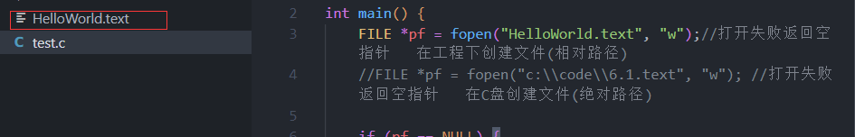
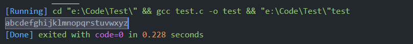
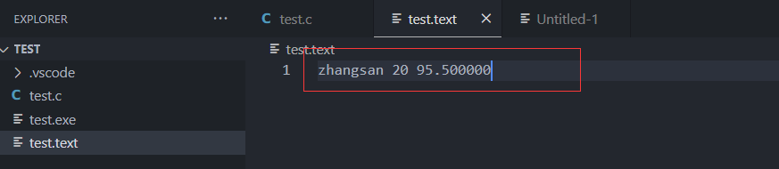
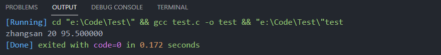
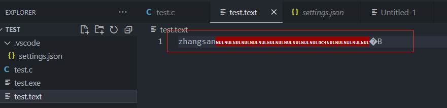
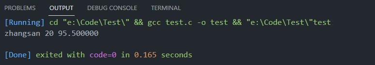
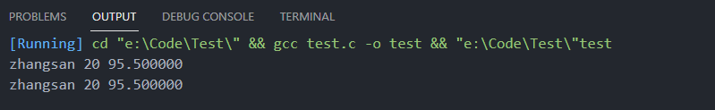
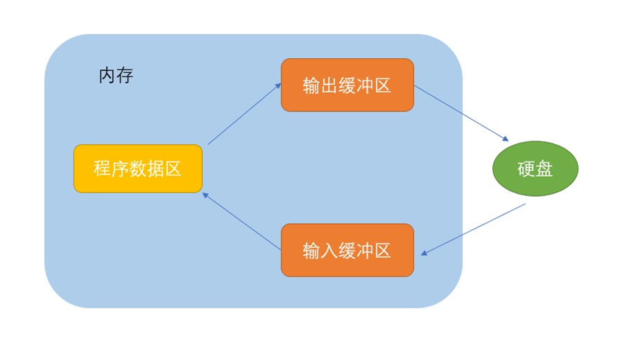

# 文件指针

缓冲文件系统中，关键的概念是“**文件类型指针**”，简称“**文件指针**”。 

每个被使用的文件都在内存中开辟了一个相应的文件信息区，用来存放文件的相关信息（如文件的名 字，文件状态及文件当前的位置等）。这些信息是保存在一个结构体变量中的。该结构体类型是有系统声明的，取名`FILE`.

例如，VS2013编译环境提供的 `stdio.h` 头文件中有以下的文件类型申明：

```c
struct _iobuf{
    char *_ptr;
    int _cnt;
    char *_base;
    int _flag;
    int _file;
    int _charbuf;
    int _bufsiz;
    char *_tmpfname;
};
typedef struct _iobuf FILE;
```

不同的C编译器的FILE类型包含的内容不完全相同，但是大同小异。

每当打开一个文件的时候，系统会根据文件的情况自动创建一个FILE结构的变量，并填充其中的信息， 使用者不必关心细节。

一般都是通过一个FILE的指针来维护这个FILE结构的变量，这样使用起来更加方便。

下面我们可以创建一个FILE*的指针变量:

```c
FILE* pf;   //文件指针变量
```

定义pf是一个指向FILE类型数据的指针变量。可以使pf指向某个文件的文件信息区（是一个结构体变 量）。通过该文件信息区中的信息就能够访问该文件。也就是说，通过**文件指针变量能够找到与它关联的文件**。


# 文件的打开和关闭

文件在读写之前应该先打开文件，在使用结束之后应该关闭文件。 

在编写程序的时候，在打开文件的同时，都会返回一个FILE*的指针变量指向该文件，也相当于建立了指针和文件的关系。 

`fopen`函数：用于打开文件。

**函数原型：**

```c
FILE *fopen(const char *filename, const char *mode);
```

- `filename`参数是要打开的文件名，可以是相对路径或绝对路径。
- `mode`参数指定打开文件的模式，有如下选项：

| 打开方式 | 描述                                                         | 如果文件不存在             |
| -------- | ------------------------------------------------------------ | -------------------------- |
| **"r"**  | **只读模式**，打开一个已存在的文本文件。                     | 打开失败，返回 NULL 指针。 |
| **"w"**  | **写入模式**，如果文件存在，则截断文件为0字节，如果文件不存在，则创建一个新文件。 | 创建一个新的空文件。       |
| **"a"**  | **追加模式**，用于在文件末尾添加数据，如果文件不存在，则创建一个新文件。 | 创建一个新的空文件。       |
| **"rb"** | 以**二进制只读模式**打开文件。                               | 打开失败，返回 NULL 指针。 |
| **"wb"** | 以**二进制写入模式**打开文件，如果文件存在，则截断文件为0字节，如果文件不存在，则创建一个新文件。 | 创建一个新的空文件。       |
| **"ab"** | 以**二进制追加模式**打开文件，如果文件不存在，则创建一个新文件。 | 创建一个新的空文件。       |
| "r+"     | 读写模式，打开一个已存在的文本文件，允许读取和写入。         | 打开失败，返回 NULL 指针。 |
| "w+"     | 读写模式，如果文件存在，则截断文件为0字节，如果文件不存在，则创建一个新文件，允许读取和写入。 | 创建一个新的空文件。       |
| "a+"     | 读写模式，用于在文件末尾添加数据，如果文件不存在，则创建一个新文件，允许读取和写入。 | 创建一个新的空文件。       |
| "r+b"    | 读写模式，以二进制方式打开一个已存在的文件，允许读取和写入。 | 打开失败，返回 NULL 指针。 |
| "w+b"    | 读写模式，以二进制方式打开文件，如果文件存在，则截断文件为0字节，如果文件不存在，则创建一个新文件，允许读取和写入。 | 创建一个新的空文件。       |
| "a+b"    | 读写模式，以二进制方式在文件末尾添加数据，如果文件不存在，则创建一个新文件，允许读取和写入。 | 创建一个新的空文件。       |

`fclose`函数：用于关闭文件。 

**函数原型：**

```c
int fclose(FILE *stream);
```

- `stream`参数是`fopen`函数返回的指向`FILE`类型的指针，用于标识要关闭的文件。

**示例：**

```c
#include <stdio.h>
int main() {
    FILE *pf1 = fopen("HelloWorld.text", "w"); //打开失败返回空指针   在工程下创建文件(相对路径)
    FILE *pf2 = fopen("c:\\code\\1.text", "w");//打开失败返回空指针  在C盘创建文件(绝对路径)

    if (pf1 == NULL) {
        perror("fopen pf1");
        return 1;
    }

    if (pf2 == NULL) {
        perror("fopen pf2");
        return 1;
    }

    //关闭文件
    fclose(pf1);
    fclose(pf2);
    pf1 = NULL;
    pf2 = NULL;
    return 0;
}
// 输出结果：fopen pf2: No such file or directory    C盘没有该目录
```



# 文件的顺序读写

## fgetc和fputc

`fgetc`和`fputc`用于文件读取和写入的标准库函数。它们用于从文件中读取单个字符和将单个字符写入文件。

`fgetc`函数:

```c
int fgetc(FILE *stream);
```

`fgetc`函数用于从给定的文件流（通过`FILE`指针`stream`表示）读取一个字符。它会返回读取的字符，如果读取到文件末尾或出现错误，它将返回`EOF`（End of File）。

**示例用法：**

```c
#include <stdio.h>
int main() {
    //打开文件
    FILE *pf = fopen("text.text", "w");

    if (pf == NULL) {
        perror("fopen");
        return 1;
    }

    //写文件
    int i = 0;
    for (i = 0; i < 26; i++) {
        fputc('a' + i, pf);
    }

    //关闭文件
    fclose(pf);
    pf = NULL;
    return 0;
}
```


`fputc`函数:

```c
int fputc(int character, FILE *stream);
```

`fputc`函数用于将一个字符写入指定的文件流（通过`FILE`指针`stream`表示）。它会返回写入的字符，如果写入时出现错误，它将返回`EOF`。

**示例用法：**

```c
#include <stdio.h>
int main() {
    //打开文件
    FILE *pf = fopen("text.text", "r");

    if (pf == NULL) {
        perror("fopen");
        return 1;
    }

    //读文件
    int ch = 0;
    while ((ch = fgetc(pf)) != EOF) {
        printf("%c", ch);
    }
    //每次读取后 pf指针会自动加1

    //关闭文件
    fclose(pf);
    pf = NULL;
    return 0;
}
```




`fgetc`和`fputc`是较低级的文件I/O函数，C语言还提供了更高级的文件读写函数，如`fgets`和`fputs`，它们更方便处理字符串和一行文本的读写。

## fgets和fputs

`fgets`和`fputs`是用于文件读取和写入的标准库函数，它们相对于`fgetc`和`fputc`更方便处理字符串和一行文本的读写。

`fgets`函数:

```c
char *fgets(char *str, int n, FILE *stream);
```

`fgets`函数用于从给定的文件流（通过`FILE`指针`stream`表示）读取一行文本，并将其存储在字符数组`str`中。参数`n`指定了最大读取的字符数（包括换行符和终止符），以避免缓冲区溢出。读取的文本会包含换行符（如果存在的话），并以空字符`\0`结尾。

**示例用法：**

```c
#include <stdio.h>
int main() {
    //打开文件
    FILE *pf = fopen("text.text", "w");

    if (pf == NULL) {
        perror("fopen");
        return 1;
    }

    //写文件
    fputs("hello ", pf);
    fputs("World", pf);
    //如果文件本身有内容 就会清楚原来文件的所有内容  在写入

    //关闭文件
    fclose(pf);
    pf = NULL;
    return 0;
}
```


`fputs`函数:

```c
int fputs(const char *str, FILE *stream);
```

`fputs`函数用于将以空字符`\0`结尾的字符串`str`写入到指定的文件流（通过`FILE`指针`stream`表示）中。它不会在字符串末尾添加额外的换行符，所以需要手动添加换行符。

**示例用法：**

```c
#include <stdio.h>
int main() {
    //打开文件
    FILE *pf = fopen("text.text", "r");

    if (pf == NULL) {
        perror("fopen");
        return 1;
    }

    //读文件一行一行读   只读一行
    char arr[20] = "#########";
    fgets(arr, 20, pf);
    printf("%s", arr);
    //关闭文件
    fclose(pf);
    pf = NULL;
    return 0;
}
```


和之前的`fgetc`和`fputc`一样，`fgets`和`fputs`也应该进行错误检查，并在不需要使用文件指针时关闭文件。它们更适用于处理文本文件和文本行的读写，可以方便地读取一行文本或写入一个带有换行符的字符串。

## fprintf和fscanf

`fscanf`和`fprintf`是用于格式化文件输入和输出的标准库函数。它们与`scanf`和`printf`函数类似，但是可以从文件中读取数据和将数据写入文件中。

`fprintf`函数:

```c
int fprintf(FILE *stream, const char *format, ...);
```

`fprintf`函数用于将格式化的数据按照指定的格式字符串`format`写入到给定的文件流（通过`FILE`指针`stream`表示）中。`format`参数是一个格式字符串，类似于`printf`函数中的格式字符串。根据格式字符串中的格式说明符，`fprintf`将相应的数据转换为字符串并写入文件。

**示例：**

```c
#include <stdio.h>
struct S {
    char name[20];
    int age;
    float score;
};

int main() {
    struct S s = {"zhangsan", 20, 95.5f};
    //把s中的结构体数据写到文件中
    FILE *pf = fopen("test.text", "w");
    if (pf == NULL) {
        perror("fopen");
        return 1;
    }
    //写文件
    fprintf(pf, "%s %d %f", s.name, s.age, s.score);
    return 0;
}
```



`fscanf`函数:

```c
int fscanf(FILE *stream, const char *format, ...);
```

`fscanf`函数用于从给定的文件流（通过`FILE`指针`stream`表示）中按照指定的格式字符串`format`读取数据。读取的数据将根据格式字符串中的格式说明符进行解析，并将解析后的值存储在对应的变量中。`format`参数是一个格式字符串，类似于`scanf`函数中的格式字符串。

**示例：**

```c
#include <stdio.h>
struct S {
    char name[20];
    int age;
    float score;
};

int main() {
    struct S s = {0};
    //把s中的结构体数据读出来
    FILE *pf = fopen("test.text", "r");
    if (pf == NULL) {
        perror("fopen");
        return 1;
    }
    //读文件
    fscanf(pf, "%s %d %f", s.name, &(s.age), &(s.score));
    printf("%s %d %f", s.name, s.age, s.score);
    return 0;
}
```




和之前的函数一样，`fscanf`和`fprintf`也应该进行错误检查，并在不需要使用文件指针时关闭文件。它们使得读取和写入文件中的数据更加方便，并且能够按照指定的格式进行数据的输入和输出。

## fwrite和fread

`fread`和`fwrite`是用于二进制文件读取和写入的标准库函数。与之前的函数（如`fgets`、`fputs`、`fscanf`和`fprintf`）不同，这两个函数用于处理二进制数据而不是文本数据。它们通常用于读取和写入二进制文件或二进制数据块。

`fwrite`函数:

```c
size_t fwrite(const void *ptr, size_t size, size_t nmemb, FILE *stream);
```

`fwrite`函数将来自由`ptr`指向的内存区域的数据写入给定的文件流（通过`FILE`指针`stream`表示）。参数`size`表示每个数据项的字节数，而`nmemb`表示要写入的数据项的数量。函数返回实际成功写入的数据项数量，通常应该与`nmemb`进行比较，以确保全部数据都被正确写入。

**示例：**

```c
#include <stdio.h>
struct S {
    char name[20];
    int age;
    float score;
};

int main() {
    struct S s = {"zhangsan", 20, 95.5f};
    //把s中的结构体数据写到文件中
    FILE *pf = fopen("test.text", "wb");
    if (pf == NULL) {
        perror("fopen");
        return 1;
    }
    //写文件
    fwrite(&s, sizeof(s), 1, pf);
    return 0;
}
```



`fread`函数:

```c
size_t fread(void *ptr, size_t size, size_t nmemb, FILE *stream);
```

`fread`函数从给定的文件流（通过`FILE`指针`stream`表示）中读取数据，并将其存储在由`ptr`指向的内存区域中。参数`size`表示每个数据项的字节数，而`nmemb`表示要读取的数据项的数量。函数返回实际成功读取的数据项数量，通常应该与`nmemb`进行比较，以确保全部数据都被正确读取。

**示例：**

```c
#include <stdio.h>
struct S {
    char name[20];
    int age;
    float score;
};

int main() {
    struct S s = {0};
    //把s中的结构体数据读到文件中
    FILE *pf = fopen("test.text", "rb");
    if (pf == NULL) {
        perror("fopen");
        return 1;
    }
    //读文件
    fread(&s, sizeof(s), 1, pf);
    printf("%s %d %f\n", s.name, s.age, s.score);
    return 0;
}
```



`fread`和`fwrite`是较低级的文件I/O函数，直接处理二进制数据。在使用它们时，需要注意字节顺序和数据的存储格式，以免在不同平台或环境下出现问题。如果需要处理复杂的数据结构或需要更高级的序列化功能，建议使用专门的库或函数来处理。

**对任何一个C程序，只要运行起来就默认打开三个流**

> `stdin` - 标准输入流 - 键盘
>
> `stdout` - 标准输出流 - 屏幕
>
> `stderr` - 标准错误流 - 屏幕
>
> 他们的类型都是FILE*

```c
int main()
{
    int ch = fgetc(stdin);  //键盘输入d
    fputc(ch,stdout);  //d键盘输出d
    return 0;
}
//printf ==  fprintf( ,stdout)
```


# 对比一组函数sprintf/sscanf

`scanf`：按照一定的格式从键盘输入数据

`printf`：按照一定的格式把数据打印（输出）到屏幕上

适用于标准输入/输出流的格式化的输入/输出语句

`fscanf`：按照一定的格式从输入流（文件/stdin）输入数据

`fprintf`：按照一定的格式向输出流（文件/stdout）输出数据

适用于所有的输入/输出流的格式化输入输出语句

`sscanf`  

```c
int sscanf（const char *s，const char* format,...）
```

从字符串中按照一定的格式读取出格式化的数据

`sprintf` 

```c
int sprintf(char * str,const char* format,...)
```

将格式化的数据按照一定的格式转换成字符串

**示例：**

```c
#include <stdio.h>
struct S {
    char name[10];
    int age;
    float score;
};

int main() {
    char buf[100] = {0};
    struct S tmp = {0};

    struct S s = {"zhangsan", 20, 95.5f};
    //能否把这个结构体的数据转换成字符串
    //转换成 - zhangsan 20 95.5
    sprintf(buf, "%s %d %f", s.name, s.age, s.score);
    printf("%s\n", buf);

    //能否将buf中的字符串还原成一个结构体数据
    sscanf(buf, "%s %d %f", tmp.name, &(tmp.age), &(tmp.score));
    printf("%s %d %f\n", tmp.name, tmp.age, tmp.score);//以结构体的形式打印
    return 0;
}
```




# 文件的随机读写

## fseek

`fseek()` 允许将文件位置指示器移动到文件中的特定位置。这个函数特别适用于当你想从文件的特定位置开始读取或写入数据而不是从开头开始时。

`fseek()` 函数的原型如下：

```c
int fseek(FILE *stream, long int offset, int origin);
```

参数：

- `stream`：指向表示你想操作的文件的 `FILE` 对象的指针。文件必须已经以支持定位的模式打开，比如读取或写入模式。
- `offset`：要移动的文件位置指示器的字节数。正值将指示器向前移动，负值将指示器向后移动。通常是 `long int` 类型。
- `origin`：参考位置，从该位置应用偏移量。它可以取以下值之一：
  - `SEEK_SET` (0)：偏移量相对于文件的开头。
  - `SEEK_CUR` (1)：偏移量相对于当前文件指针的位置。
  - `SEEK_END` (2)：偏移量相对于文件的末尾。

返回值：

- 如果成功，`fseek()` 返回 0。
- 如果发生错误，它返回一个非零值，表示失败。

**示例：**

```c
#include <stdio.h>
int main()
{
    FILE *pf = fopen("test.txt", "r");
    if (pf == NULL)
    {
        perror("fopen()");
        return 1;
    }
    //读文件 - 文件中存放abcdef
    int ch = fgetc(pf);
    printf("%c\n", ch);       // 输出：a  读完后文件指针往后+1 指向b

    fseek(pf, 2, SEEK_CUR); //从当前文件指针往后偏移2个  (当前是b)
    ch = fgetc(pf);
    printf("%c\n", ch); // 输出：d


    fseek(pf, 3, SEEK_SET); //文件首部向后偏移三个
    ch = fgetc(pf);
    printf("%c\n", ch); // 输出：d

    fseek(pf, -3, SEEK_END); //文件首部向前偏移三个  末尾的指针是f的后面
    ch = fgetc(pf);
    printf("%c\n", ch); // 输出：d

    //关闭文件
    fclose(pf);
    pf = NULL;
    return 0;
}
```

`fseek()` 应该用于二进制文件或者你知道要移动到的确切字节偏移的文本文件。对于文本文件，由于不同平台上换行符的差异，使用 `fseek()` 可能会导致意外的结果。在这种情况下，最好使用 `fgets()` 逐行读取文件，或者逐个字符处理文件内容。

## ftell

`ftell()` 用于在文件中获取当前文件位置指示器的偏移量（即文件指针的位置）。它返回当前位置相对于文件开头的字节数。

**函数原型为：**

```c
long int ftell(FILE *stream);
```

参数：

- `stream`：一个指向 `FILE` 对象的指针，表示你要获取当前位置的文件。

返回值：

- 如果成功，`ftell()` 返回一个 `long int` 类型的值，表示当前文件位置指示器相对于文件开头的偏移量（以字节为单位）。
- 如果发生错误，返回值为 `EOF`（通常为 -1），表示出现了错误。

```c
#include <stdio.h>
int main() {
    FILE *pf = fopen("test.txt", "r");
    if (pf == NULL) {
        perror("fopen()");
        return 1;
    }
    //读文件 - 文件中存放abcdef
    int ch = fgetc(pf);
    printf("%c\n", ch);// 输出：a  读完后文件指针往后+1 指向b

    fseek(pf, 2, SEEK_CUR);//从当前文件指针往后偏移2个  (当前是b)
    ch = fgetc(pf);
    printf("%c\n", ch);// 输出:d

    int pos = ftell(pf);//当文件指向d的时候 文件指针往后偏移1个 指向了e
    printf("%d\n", pos);//输出：4   e和a相差4个位置
    //关闭文件  
    fclose(pf);
    pf = NULL;
    return 0;
}
```

`ftell()` 通常与 `fseek()` 一起使用，用于确定文件中某个特定位置的偏移量。可以通过先调用 `ftell()` 获取当前位置，然后使用这个值作为 `fseek()` 的偏移量来实现定位文件指针到该位置。

## rewind

`rewind()` 用于将文件位置指示器重新设置为文件的开头。它类似于使用 `fseek()` 将文件指针移到文件开头，但是 `rewind()` 是一个更简单的函数，专门用于将文件指针归零。

**函数原型为：**

```c
void rewind(FILE *stream);
```

参数：

- `stream`：一个指向 `FILE` 对象的指针，表示你要重新设置文件位置指示器的文件。

返回值：`rewind()` 函数没有返回值（即返回类型是 `void`）。

```c
#include <stdio.h>
int main() {
    FILE *pf = fopen("test.txt", "r");
    if (pf == NULL) {
        perror("fopen()");
        return 1;
    }
    //读文件 - 文件中存放abcdef
    int ch = fgetc(pf);
    printf("%c\n", ch);// 输出：a  读完后文件指针往后+1 指向b

    fseek(pf, 2, SEEK_CUR);//从当前文件指针往后偏移2个  (当前是b)
    ch = fgetc(pf);
    printf("%c\n", ch);// 输出：d

    //记录当前偏移量
    int pos = ftell(pf);//当文件指向d的时候 文件指针往后偏移1个 指向了e
    printf("%d\n", pos);// 输出：4

    //偏移量回到初始位置
    rewind(pf);
    ch = fgetc(pf);
    printf("%c\n", ch);// 输出：a
    //关闭文件
    fclose(pf);
    pf = NULL;
    return 0;
}
```

`rewind()` 函数非常方便，因为无需知道文件的大小或使用具体的偏移量，只需调用这个函数，文件指针就会回到文件的起始位置，从头开始读取或写入数据。


# 文件读取结束的判定

## 被错误使用的feof

牢记：在文件读取过程中，不能用feof函数的返回值直接用来判断文件的是否结束。

而是**应用于当文件读取结束的时候，判断是读取失败结束，还是遇到文件尾结束。**

1.文本文件读取是否结束，判断返回值是否为 `EOF （ fgetc ）`，`或者 NULL （ fgets ）`

> 例如：
>
> fgetc - 如果读取正常，会返回读取到的字符的ascll码值，如果读取失败会返回EOF
>
> fgets - 如果读取正常，返回的是读取到的数据的地址，如果读取失败，返回的是NULL
>
> fscanf - 如果读取正常，返回的是格式串中指定的数据的个数，如果读取失败，返回的是小于格式串中指定的数据的个数

2.二进制文件的读取结束判断，判断返回值是否小于实际要读的个数。

例如：

> fread判断返回值是否小于实际要读的个数

**文本文件的例子：**

```c
#include <stdio.h>
#include <stdlib.h>
int main(void) {
    int c;// 注意：int，非char，要求处理EOF
    FILE *fp = fopen("test.txt", "r");
    if (!fp) {
        perror("File opening failed");
        return EXIT_FAILURE;
    }
    // fgetc 当读取失败的时候或者遇到文件结束的时候，都会返回EOF
    while ((c = fgetc(fp)) != EOF)// 标准C I/O读取文件循环
    {
        putchar(c);
    }
    //判断是什么原因结束的
    if (ferror(fp))
        puts("I/O error when reading");
    else if (feof(fp))
        puts("End of file reached successfully");
    fclose(fp);
}
```

**二进制文件的例子：**

```c
#include <stdio.h>
enum {
    SIZE = 5
};

int main() {
    double a[SIZE] = {1., 2., 3., 4., 5.};
    FILE *fp = fopen("test.bin", "wb");// 必须用二进制模式
    fwrite(a, sizeof *a, SIZE, fp);    // 写 double 的数组
    fclose(fp);
    double b[SIZE];
    fp = fopen("test.bin", "rb");
    size_t ret_code = fread(b, sizeof *b, SIZE, fp);// 读 double 的数组
    if (ret_code == SIZE) {
        puts("Array read successfully, contents: ");
        for (int n = 0; n < SIZE; ++n)
            printf("%f ", b[n]);
        putchar('\n');
    } else {// error handling
        if (feof(fp))
            printf("Error reading test.bin: unexpected end of file\n");
        else if (ferror(fp)) {
            perror("Error reading test.bin");
        }
    }
    fclose(fp);
}
```


# 文件缓冲区

ANSIC 标准采用“**缓冲文件系统**”处理的数据文件的，所谓缓冲文件系统是指**系统自动地在内存中为程序中每一个正在使用的文件开辟一块“文件缓冲区”**。从内存向磁盘输出数据会先送到内存中的缓冲区，装满缓冲区后才一起送到磁盘上。如果从磁盘向计算机读入数据，则从磁盘文件中读取数据输入到内存缓冲区，然后再从缓冲区逐个地将数据送到程序数据区。缓冲区的大小根据C编译系统决定的。


```c
#include <stdio.h>
#include <windows.h>
//VS2013 WIN10环境测试
int main() {
    FILE *pf = fopen("test.txt", "w");
    fputs("abcdef", pf);//先将代码放在输出缓冲区
    printf("睡眠10秒-已经写数据了，打开test.txt文件，发现文件没有内容\n");
    Sleep(10000);
    printf("刷新缓冲区\n");
    fflush(pf);//刷新缓冲区时，才将输出缓冲区的数据写到文件（磁盘）
    //注：fflush 在高版本的VS上不能使用了
    printf("再睡眠10秒-此时，再次打开test.txt文件，文件有内容了\n");
    Sleep(10000);
    fclose(pf);
    //注：fclose在关闭文件的时候，也会刷新缓冲区
    pf = NULL;
    return 0;
}
```

这里可以得出一个**结论**： 

因为有缓冲区的存在，C语言在操作文件的时候，需要做刷新缓冲区或者在文件操作结束的时候关闭文件。

 如果不做，可能导致读写文件的问题。

