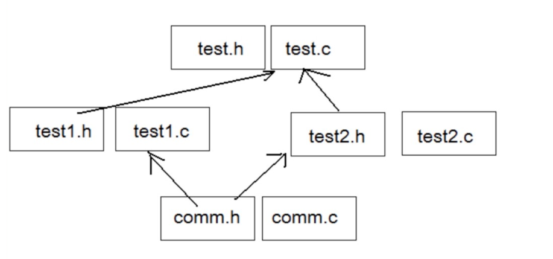

# 预定义符号

```c
__FILE__    //进行编译的源文件
__LINE__    //文件当前的行号
__DATE__    //文件被编译的日期
__TIME__    //文件被编译的时间
__STDC__    //如果编译器遵循ANSI C，其值为1，否则未定义
```

这些预定义符号都是C语言内置的。

**举个例子：**

```c
#include <stdio.h>

int main() {
    printf("%s\n", __FILE__);//如：1.c
    printf("%d\n", __LINE__);// 5
    printf("%s\n", __DATE__);// Jul 30 2023
    printf("%s\n", __TIME__);// 10:13:20  记录的时间是编译的时间
    printf("%d\n", __STDC__);   //1   也可能是未定义  不遵循ANSI C
    return 0;
}
```


# #define

## #define定义标识符

`#define`定义标识符形式：

```c
#define 标识符 值
```

其中，`标识符` 是你希望定义的名称，而 `值` 可以是一个数值、一个字符串或一个表达式。

**例子：**

```c
#include <stdio.h>
#define MAX 100
#define STR "Hello Wrold"
#define do_forever for (;;)
int main() {
    printf("%d\n", MAX);//100
    printf(STR);        //Hello World
    do_forever;       //死循环

    return 0;
}
```

> `#define` 只是进行简单的文本替换，没有类型检查和错误检查。

> 建议`#define`后面不要加分号

```c
#include <stdio.h>
#define MAX 1000;
int main() {
    int max = 0;
    if (3 > 5) {
        //max = MAX;   //报错  因为MAX ==1000; 出现了两个分号
        max = MAX//正确
    } else {
        max = 0;
    }

    return 0;
}
```

## #define定义宏

> #define机制包括了一个规定，允许把参数替换到文本中，这种实现通常称为宏或定义宏。

**下面是宏的声明方式：**

```c
#define name( parament-list ) stuff
```

 其中的 parament-list 是一个由逗号隔开的符号表，它们可能出现在stuff中。

**例子：**

```c
#include <stdio.h>

//函数解决
int Max_hanshu(int x, int y) {
    return x > y ? x : y;
}
//宏解决
#define MAX(x, y) (x > y ? x : y)
int main() {
    int a = 10;
    int b = 20;
    int max = Max_hanshu(a, b);
    int m = MAX(a, b);
    printf("%d\n", max);  //20
    printf("%d\n", m);    //20
    return 0;
}
```

**注意：** 

> 参数列表的左括号必须与name紧邻。 
> 如果两者之间有任何空白存在，参数列表就会被解释为stuff的一部分。

**例如：**

```c
#define SQUARE( x ) x * x
```

这个宏接收一个参数 x . 如果在上述声明之后，你把

```c
SQUARE( 5 );
```

置于程序中，预处理器就会用下面这个表达式替换上面的表达式：

```c
5 * 5
```

**警告：** 
这个宏存在一个问题： 
观察下面的代码段：

```c
int a = 5;
printf("%d\n" ,SQUARE( a + 1) );
```

乍一看，你可能觉得这段代码将打印36这个值。 事实上，它将打印11。

**为什么？**

替换文本时，参数x被替换成a + 1,所以这条语句实际上变成了： 

```c
printf ("%d\n",a + 1 * a + 1 );
```

这样就比较清晰了，由替换产生的表达式并没有按照预想的次序进行求值。 

在宏定义上加上两个括号，这个问题便轻松的解决了：

```c
#define SQUARE(x) (x) * (x)
```

这样预处理之后就产生了预期的效果：

```c
printf ("%d\n",(a + 1) * (a + 1) );
```

**这里还有一个宏定义：**

```c
#define DOUBLE(x) (x) + (x)
```

定义中我们使用了括号，想避免之前的问题，但是这个宏可能会出现新的错误。

```c
int a = 5;
printf("%d\n" ,10 * DOUBLE(a));
```

这将打印什么值呢？

**warning：**

看上去，好像打印100，但事实上打印的是55.
我们发现替换之后：

```c
printf ("%d\n",10 * (5) + (5));
```

乘法运算先于宏定义的加法，所以出现了55。

这个问题，的解决办法是在宏定义表达式两边加上一对括号就可以了。

```c
#define DOUBLE( x)   ( ( x ) + ( x ) )
```

```c
#include <stdio.h>

#define SQUARE(X) X *X
#define SQUARE1(X) (X) * (X)
#define DOUBLE(X) (X) + (X)
#define DOUBLE1(X) ((X) + (X))
int main() {
    printf("%d\n", SQUARE(5));     // 25
    printf("%d\n", SQUARE(5 + 1)); // 5+1*5+1 == 11
    printf("%d\n", SQUARE1(5 + 1));// 36

    printf("%d\n", DOUBLE(6));      // 12
    printf("%d\n", DOUBLE(6 + 1));  // 14
    printf("%d\n", 10 * DOUBLE(6)); // 66  10*(6)+(6) ==66
    printf("%d\n", 10 * DOUBLE1(6));//120
    return 0;
}
```

**总结：**

> 所以用于对数值表达式进行求值的宏定义都应该用这种方式加上括号，避免在使用宏时由于参数中的操作符或邻近操作符之间不可预料的相互作用。

## #define的替换规则

在程序中扩展#define定义符号和宏时，需要涉及几个步骤。

> - 在调用宏时，首先对参数进行检查，看看是否包含任何由#define定义的符号。如果是，它们首先被替换。
> - 替换文本随后被插入到程序中原来文本的位置。对于宏，参数名被他们的值所替换。
> - 最后，再次对结果文件进行扫描，看看它是否包含任何由#define定义的符号。如果是，就重复上述处理过程。

**注意：**

> - 宏参数和#define定义中可以出现其他#define定义的符号。但是对于宏，不能出现递归。
> - 当预处理器搜索#define定义的符号的时候，字符串常量的内容并不被搜索。

**示例 1** - 合法的宏定义：

```c
#define PI 3.14159
#define CIRCLE_AREA(radius) (PI * (radius) * (radius))

double area = CIRCLE_AREA(2.5); // 宏 CIRCLE_AREA 使用了已定义的宏 PI
```

**示例 2** - 非法的宏定义（递归）：

```c
// 这是一个非法的宏定义，宏 AREA 使用了它自身
#define AREA(x) (x > 0 ? x * x : AREA(x))

int result = AREA(5); // 这将导致宏展开的无限循环，造成编译错误
```

## #和##

`#`运算符可以将宏参数转换为字符串常量。它允许你在宏定义中将**参数转换为字符串字面值**。 

**实例：**

```c
#define STRINGIFY(x) #x

int main() {
    int num = 42;
    const char* str = STRINGIFY(num);
    // 在宏展开时，num 被转换为字符串 "42"
    printf("num as a string: %s\n", str); // Output: "num as a string: 42"
    return 0;
}
```

`##` 运算符用于在宏定义中将两个标记粘贴在一起。它允许你**将多个标识符组合成一个新的标识符**。

**实例：**

```c
#define CONCAT(x, y) x ## y

int main() {
    int num1 = 10;
    int num2 = 20;
    int result = CONCAT(num, 1) + CONCAT(num, 2);
    // 在宏展开时，CONCAT(num, 1) 变成 num1，CONCAT(num, 2) 变成 num2
    // 所以，result 的值就是 num1 + num2，即 10 + 20
    printf("result: %d\n", result); // Output: "result: 30"
    return 0;
}
```

## 带副作用的宏参数

当宏参数在宏的定义中出现超过一次的时候，如果参数带有副作用，那么你在使用这个宏的时候就可能出现危险，导致不可预测的后果。副作用就是表达式求值的时候出现的永久性效果。

**有副作用的代码**：

```c
int main() {
    int a = 1;
    int b = a + 1;// b=2,a=1
    a = 1;
    b = ++a;// b=2,a=2  带有副作用的代码,a的值发生了改变
    int ch = getchar();//读一个字符，缓冲区少一个字符

    return 0;
}
```

```c
x+1;//不带副作用
x++;//带有副作用
```

MAX宏可以证明具有副作用的参数所引起的问题。

```c
#define MAX(a, b) ( (a) > (b) ? (a) : (b) )
...
x = 5;
y = 8;
z = MAX(x++, y++);
printf("x=%d y=%d z=%d\n", x, y, z);//输出的结果是什么？
```

这里我们得知道预处理器处理之后的结果是什么：

```c
z = ( (x++) > (y++) ? (x++) : (y++));
```

所以输出的结果是：

```c
x=6 y=10 z=9
```

## 宏和函数对比

宏通常被应用于执行简单的运算。 比如在两个数中找出较大的一个。

那为什么不用函数来完成这个任务？

原因有二：

> 1.用于调用函数和从函数返回的代码可能比实际执行这个小型计算工作所需要的时间更多。 
> 	**所以宏比函数在程序的规模和速度方面更胜一筹。**
>
> 2.更为重要的是函数的参数必须声明为特定的类型。 所以函数只能在类型合适的表达式上使用。反之这个宏怎可以适用于整形、长整型、浮点型等可以用于>来比较的类型。 **宏是类型无关的。**

**实例：**

```c
#include <stdio.h>

int Max(int x, int y) {
    return x > y ? x : y;
}

#define MAX(x, y) ((x) > (y) ? (x) : (y))
int main() {
    int a = 10;
    int b = 20;
    //函数的方式
    int m1 = Max(a, b);
    printf("%d\n", m1);

    //宏的方式
    int m2 = MAX(a, b);
    printf("%d\n", m2);
    return 0;
}
```

**宏的缺点**：当然和函数相比宏也有劣势的地方：

> 1. 每次使用宏的时候，一份宏定义的代码将插入到程序中。除非宏比较短，否则可能大幅度增加程序的长度。
> 2. 宏是没法调试的。
>
> 3. 宏由于类型无关，也就不够严谨。
>
> 4. 宏可能会带来运算符优先级的问题，导致程容易出现错。

宏有时候可以做函数做不到的事情。比如：宏的参数可以出现**类型**，但是函数做不到。

```c
#define MALLOC(num, type) (type *)malloc(num * sizeof(type))
int main(){
    int *p = malloc(10, sizeof(int));
    MALLOC(10, int);  //类型作为参数
    return 0;
} 
```

**宏和函数的一个对比**

| 属性               | #define宏                                                    | 函数                                                         |
| ------------------ | ------------------------------------------------------------ | :----------------------------------------------------------- |
| 代码长度           | 每次使用时，宏代码都会被插入到程序中。除了非常 小的宏之外，程序的长度会大幅度增长 | 函数代码只出现于一个地方；每 次使用这个函数时，都调用那个 地方的同一份代码 |
| 执行速 度          | 更快                                                         | 存在函数的调用和返回的额外开 销，所以相对慢一些              |
| 操作符 优先级      | 宏参数的求值是在所有周围表达式的上下文环境里， 除非加上括号，否则邻近操作符的优先级可能会产生不可预料的后果，所以建议宏在书写的时候多些括号。 | 函数参数只在函数调用的时候求 值一次，它的结果值传递给函数。表达式的求值结果更容易预测。 |
| 带有副 作用的 参数 | 参数可能被替换到宏体中的多个位置，所以带有副作用的参数求值可能会产生不可预料的结果。 | 函数参数只在传参的时候求值一 次，结果更容易控制。            |
| 参数类 型          | 宏的参数与类型无关，只要对参数的操作是合法的， 它就可以使用于任何参数类型。 | 函数的参数是与类型有关的，如果参数的类型不同，就需要不同的函数，即使他们执行的任务是相同的。 |
| 调试               | 宏是不方便调试的                                             | 函数是可以逐语句调试的                                       |
| 递归               | 宏是不能递归的                                               | 函数是可以递归的                                             |

## 命名约定

一般来讲函数的宏的使用语法很相似。所以语言本身没法帮我们区分二者。 那我们平时的一个习惯是：

> 把宏名全部大写 
>
> 函数名不要全部大写


# #undef

这条指令用于移除一个宏定义。

```c
#include <stdio.h>

#define M 100
int main() {
    printf("%d\n");
#undef M
    printf("%d\n", M);//报错,M的宏定义已经被移除
    return 0;
}
```


# 命令行定义

C语言是一种通用的编程语言，它允许开发者通过编写命令行程序与计算机进行交互。命令行程序是指在命令行界面（也称为终端或命令提示符）中运行的程序。用户可以通过输入命令和参数来调用这些程序，并从程序的输出中获取结果。

在C语言中，命令行参数是通过main函数的参数传递给程序的。main函数是C程序的入口点，它有两个参数：`argc`和`argv`。

> 1. argc：表示命令行参数的数量，包括程序本身。它是一个整数类型的变量。
> 2. argv：是一个指向字符指针数组的指针，用于存储命令行参数的字符串。每个字符串代表一个命令行参数。其中，argv[0]存储的是程序的名称（执行文件的名称），argv[1]存储的是第一个命令行参数，以此类推。

```c
int main(int argc, char *argv[]) {
    // Your code here
    return 0;
}
```

**示例说明：**

假设我们有一个程序叫做"my_program"，编译后生成可执行文件"my_program.exe"（在Windows上），然后我们在命令行中运行该程序，输入如下：

```c
my_program hello world
```

在这个例子中，argc的值将是4，因为有四个参数：程序名称"my_program"、"hello"、"world"，以及一个隐含的表示字符串结束的null指针。

argv数组将包含以下内容：

```c
argv[0] -> "my_program"
argv[1] -> "hello"
argv[2] -> "world"
argv[3] -> NULL
```

```c
#include <stdio.h>

int main(int argc, char *argv[]) {
    for (int i = 0; i < argc; i++) {
        printf("Argument %d: %s\n", i, argv[i]);
    }
    return 0;
}

```

输出结果：

```c
Argument 0: my_program
Argument 1: hello
Argument 2: world
```


# 条件编译

条件编译是一种预处理指令，它允许在编译阶段根据不同的条件选择性地包含或排除代码片段。条件编译可以用于根据不同的编译条件来控制程序的行为，比如在不同平台上使用不同的代码或启用/禁用特定功能。

条件编译使用预处理指令`#ifdef`、`#ifndef`、`#else`、`#endif`、`#if`、`#elif`和`#define`等来实现。这些指令都以井号（#）开头，并且在编译前被预处理器处理。

下面是C语言条件编译的基本指令：

1.`#ifdef` 和 `#ifndef`：

```c
#ifdef 宏名
    // 如果宏已定义，则编译这里的代码
#else
    // 如果宏未定义，则编译这里的代码
#endif
```

`#ifdef` 用于检查一个宏是否已经定义，如果已定义，则编译 `#ifdef` 和 `#endif` 之间的代码，否则跳过这部分代码。

`#ifndef` 则与 `#ifdef` 相反，它用于检查一个宏是否未定义，如果未定义，则编译 `#ifndef` 和 `#endif` 之间的代码。

2.`#else`：

```c
#ifdef 宏名
    // 如果宏已定义，则编译这里的代码
#else
    // 如果宏未定义，则编译这里的代码
#endif
```

`#else` 用于在 `#ifdef` 或 `#ifndef` 条件不满足时，编译 `#else` 和 `#endif` 之间的代码。

3.`#if`、`#elif` 和 `#endif`：

```c
#if 表达式
    // 如果表达式为真，则编译这里的代码
#elif 其他表达式
    // 如果其他表达式为真，则编译这里的代码
#else
    // 如果前面的条件都不满足，则编译这里的代码
#endif
```

`#if` 允许根据一个表达式的结果来决定是否编译其后的代码。`#elif` 用于检查前面的条件不满足时，继续检查其他条件。`#else` 则用于处理前面的条件都不满足的情况。

## 嵌套条件编译

```c
#if defined(OS_UNIX)
#ifdef OPTION1
unix_version_option1();
#endif
#ifdef OPTION2
unix_version_option2();
#endif
#elif defined(OS_MSDOS)
#ifdef OPTION2
msdos_version_option2();
#endif
#endif
```


# 文件包含

## 头文件被包含的方式

**1.本地文件包含" "**

> 查找策略：先在源文件所在目录下查找，如果该头文件未找到，编译器就像查找库函数头文件一样在标准位置查找头文件。
>
> 如果找不到就提示编译错误。

```c
#include"add.h"
int main(){
    printf("hehe\n");
    return 0;
}
```

**2.库文件包含 < >**

> 查找头文件直接去标准路径下去查找，如果找不到就提示编译错误。
>
> 这样是不是可以说，对于库文件也可以使用 " " 的形式包含？
> 答案是肯定的，**可以。**
>
> **但是这样做查找的效率就低些，当然这样也不容易区分是库文件还是本地文件了。**

## 嵌套文件包含



comm.h和comm.c是公共模块。 
test1.h和test1.c使用了公共模块。 
test2.h和test2.c使用了公共模块。 
test.h和test.c使用了test1模块和test2模块。 
这样最终程序中就会出现两份comm.h的内容。这样就造成了文件内容的重复。

**如何解决这个问题？** 
答案：条件编译。

每个头文件的开头写：

```c
#ifndef __TEST_H__
#define __TEST_H__
//头文件的内容
#endif   //__TEST_H__
```

或者：

```c
#pragma once
```

