# C++介绍

C++ 是一种通用编程语言，它是在 C 语言的基础上发展而来的，由 Bjarne Stroustrup 于 1980 年代初期在贝尔实验室开发。C++ 保留了 C 语言的高效性和接近硬件的特点，同时增加了面向对象编程（OOP）的特性，使得它成为一种既强大又灵活的编程语言。

**C++主要特性**：

**1.面向对象编程（OOP）**：

- **类和对象**：C++ 支持类和对象的概念，允许开发者定义自己的数据类型和相关操作。
- **继承**：通过继承，一个类可以继承另一个类的属性和方法，从而实现代码的重用和扩展。
- **多态**：多态允许使用一个接口来表示不同的实现，提高了代码的灵活性和可扩展性。
- **封装**：封装将数据和操作数据的函数绑定在一起，并通过访问控制（如 `public`、`private`、`protected`）来隐藏内部实现细节。

**2.强类型**：C++ 是一种强类型语言，要求变量在使用前必须声明其类型，并且类型检查严格。

**3.高效性**：C++ 允许直接操作内存和硬件，因此它非常适合编写需要高性能的应用程序，如操作系统、游戏引擎、嵌入式系统等。

**4.标准模板库（STL）**：C++ 提供了丰富的标准模板库，包括容器（如 `vector`、`list`、`map`）、算法（如排序、查找）和迭代器等，这些组件大大提高了开发效率。

**5.兼容性**：C++ 与 C 语言高度兼容，许多 C 语言的代码可以直接在 C++ 中使用。

**C++兼容C语言语法**

C++是向后兼容C语言的，这意味着几乎所有合法的C代码也可以在C++中编译和运行。C++最初是作为C的一个超集而设计的，因此C++保留了C语言的大部分特性和语法，同时引入了一些新的特性。

**示例**：

```cpp
#include <iostream>
using namespace std;
int main(){
    cout << "hello world" << endl;  //hello world
    printf("hello world\n");  //hello world
    return 0;
}
```

但是并非百分百兼容。这意味着，许多合法的C代码在C++中也是有效的，并且可以在C++中编译和运行，但也有一些情况下C和C++之间存在不同之处，可能需要进行一些修改才能正常工作。


# C++关键字

```cpp
// C++ 关键字列表 
// 基本类型关键字
bool    char    int    float    double    void
short   long    signed  unsigned
 
// 控制流关键字
if      else    switch  case      default
while   do      for     break     continue
return  goto
 
// 函数相关关键字
typedef  constexpr  static_cast  dynamic_cast  reinterpret_cast
const_cast  sizeof    typeid    noexcept      operator
new        delete    this       virtual       override
final      template  typename   using         try
catch
 
// 类、对象和访问控制关键字
class    struct    union    enum    private    protected
public   friend   virtual  explicit mutable    constexpr
 
// 命名空间关键字
namespace  using
 
// 异常处理关键字
throw     try      catch
 
// 杂项关键字
asm     auto     register   volatile
 
// C++11及以后新增关键字
nullptr  enum class  static_assert  alignas    alignof
decltype  noexcept    constexpr     thread_local
 
// C++11以后引入的一些预处理器命令
static_assert  alignof  alignas  __has_include  __has_cpp_attribute
 
// C++17及以后新增关键字
inline  if constexpr  namespace
 
// C++20及以后新增关键字
concept  requires
 
// C++20引入的模块化关键字
import  module  export
 
// C++23中引入的预处理器关键字
__VA_OPT__
```


# 命名空间

C++中的命名空间是一种用于组织代码的机制，可以将全局作用域内的标识符（例如变量、函数、类等）封装在一个逻辑组中，从而防止名称冲突和提供更好的代码组织结构。

**为什么设计命名空间？**

命名空间的设计是为了解决代码组织和名称冲突问题。在大型软件项目中，可能有数以千计的函数、变量和类等。如果没有命名空间，所有这些标识符都将位于全局作用域中，很容易导致名称冲突和混乱的代码结构。

**示例：**

```cpp
#include <stdio.h>
#include <stdlib.h>
int rand = 10; 

// C语言没办法解决类似这样的命名冲突问题，所以C++提出了namespace来解决
int main(){
    printf("%d\n", rand);

    return 0;
}
// 编译后后报错：error C2365: “rand”: 重定义；以前的定义是“函数”
```

上述代码的rand变量为C语言stdlib里面的函数名，不能定义。C语言没办法解决类似这样的命名冲突问题，所以C++提出了**命名空间**来解决


## 域作用符::

> 域：全局域和局部域

```cpp
int a = 2;

void f1(){
    int a = 0;
    printf("%d\n", a);   //0
    printf("%d\n",::a);  //2 ::域作用限定符,表示全局域
}

int main(){
    printf("%d\n", a);  //2
    f1();

    return 0;
}
```

域作用符`::`还可以用于访问命名空间、类、结构体、枚举和全局变量等作用域内的成员。

## 命名空间的定义

```cpp
namespace MyNamespace {
    // 声明或定义一些变量、函数、类等
}
```

**示例：**

```cpp
// phw是命名空间的名字，一般开发中是用项目名字做命名空间名。
//1. 正常的命名空间定义
namespace phw{
    // 命名空间中可以定义变量/函数/类型
    int rand = 10;
    int Add(int left, int right){
        return left + right;
    }
    struct Node{
        struct Node* next;
        int val;
    };
}

//2. 命名空间可以嵌套
// test.cpp
namespace N1{
    int a;
    int b;
    int Add(int left, int right){
        return left + right;
    }
    namespace N2{
        int c;
        int d;
        int Sub(int left, int right){
            return left - right;
        }
    }
}

//3. 同一个工程中允许存在多个相同名称的命名空间,编译器最后会合成同一个命名空间中。
//ps：一个工程中的test.h和上面test.cpp中两个N1会被合并成一个
// test.h
namespace N1{
    int Mul(int left, int right){
        return left * right;
    }
}
```

注意：**一个命名空间就定义了一个新的作用域**，命名空间中的所有内容都局限于该命名空间中

## 命名空间的使用

```cpp
#include<iostream>
namespace phw {
    // 命名空间中可以定义变量/函数/类型
    int a = 0;
    int b = 1;
    int Add(int left, int right) {
        return left + right;
    }
    struct Node {
        struct Node *next;
        int val;
    };
}// namespace phw

int main() {
    printf("%d\n", a);
    return 0;
}
```

编译报错：error C2065: “a”: 未声明的标识符，没有引入命名空间

**命名空间的使用有三种方式：**

**1.加命名空间名称及作用域限定符**

```cpp
int main(){
    printf("%d\n", phw::a);
    return 0;    
}
```

**2.使用using将命名空间中某个成员引入**

```cpp
using phw::b;
int main(){
    printf("%d\n", phw::a);
    printf("%d\n", b);
    return 0;    
}
```

**3,使用using namespace 命名空间名称引入**

```cpp
using namespce phw;
int main(){
    printf("%d\n", N::a);
    printf("%d\n", b);
    Add(10, 20);
    return 0;    
}
```

using namespace全局展开，一般情况，不建议全局展开。

实际开发的项目工程，我们将常用部分展开即可，小的程序，日常练习，不太会发现冲突，就可以使用全局展开。

**例如：**

```cpp
#include <iostream>
//using namespace std;
//常用展开
using std::cout;
using std::endl;

int main() {
    cout << "1111" << endl;
    cout << "1111" << endl;
    cout << "1111" << endl;
    cout << "1111" << endl;

    int i = 0;
    std::cin >> i;

    return 0;
}
```


# C++输入&输出

在C++中，输入和输出是通过标准库提供的输入输出流（iostream）来完成的。标准库中定义了两个主要的流对象：`cin`用于输入（console input），`cout`用于输出（console output）。它们分别对应于标准输入和标准输出。

**示例：**

```cpp
#include <iostream>

int main() {
    int number;
    std::cout << "Enter a number: ";
    std::cin >> number;
    std::cout << "You entered: " << number << std::endl;
    return 0;
}
```

在上面的例子中，`std::cin >> number;`语句将用户输入的数据读取到`number`变量中。

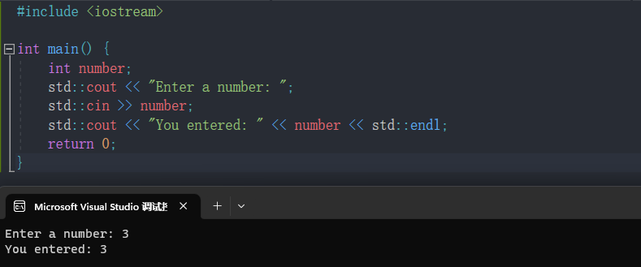

**cout和cin都是可以自动识别变量类型的**

**例如：**

```cpp
#include <iostream>
using namespace std;

int main() {
    char name[10] = "张三";
    int age = 18;
    //...

    cout << "姓名：" << name << endl;
    cout << "年龄：" << age << endl;

    printf("姓名：%s\n年龄：%d\n", name, age);

    return 0;
}
```

**输出结果**：

```cpp
姓名：张三
年龄：18
姓名：张三
年龄：18
```


## **endl和"\n"的区别：**

`std::endl`是一个特殊的操纵符，用于插入一个换行符并刷新输出缓冲区。`"\n"`是换行符的转义序列，但它不会刷新输出缓冲区。

```cpp
#include <iostream>

int main() {
    std::cout << "Hello" << std::endl; // 输出 "Hello" 并换行
    std::cout << "World\n"; // 输出 "World" 并换行（但不刷新输出缓冲区）
    return 0;
}
```

除了`cin`和`cout`，标准库还提供了其他输入输出流，如`cerr`（用于输出错误消息）和`clog`（用于输出程序运行时的日志信息）。它们的用法与`cin`和`cout`类似，但有一些细微的差异。

```cpp
#include <iostream>

int main() {
    std::cerr << "This is an error message." << std::endl;
    std::clog << "This is a log message." << std::endl;
    return 0;
}
```

**注意：**

> 关于cout和cin还有很多更复杂的用法，比如控制浮点数输出精度，控制整形输出进制格式等等。但是C++兼容C语言语法，控制浮点数输出精度，控制整形输出进制格式使用cout比较麻烦，推荐使用C语言的printf函数和scanf函数。


# 缺省参数

缺省参数是**声明或定义函数时**为函数的**参数指定一个缺省值**。在调用该函数时，如果没有指定实参则采用该形参的缺省值，否则使用指定的实参。

**示例：**

```c
#include <iostream>
using namespace std;

//形参a是一个缺省值
void Func(int a = 0) {
    cout << a << endl;
}

int main() {
    Func(1);   
    Func();    

    return 0;
}
```

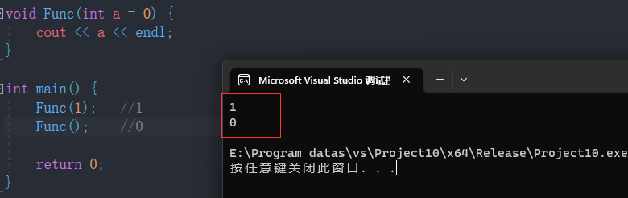


当Func函数没有传参时，使用参数的默认值0，而传参时，使用指定的实参

## 缺省参数的分类

> 分为全缺省和半缺省

### 全缺省参数

**示例：**

```c
#include <iostream>
using namespace std;

//全缺省
void Func(int a = 10, int b = 20, int c = 30){
	cout << "a = " << a << endl;
	cout << "b = " << b << endl;
	cout << "c = " << c << endl;
	cout << endl;
}

int main(){
	// 使用缺省值，必须从右往左连续使用
	Func(1, 2, 3);
	Func(1, 2);
	Func(1);
	Func();

	return 0;
}
```

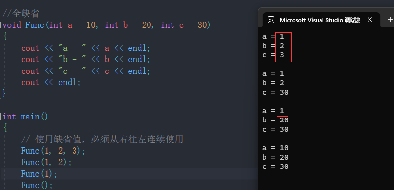

### 半缺省参数

**示例1：**

```c
#include <iostream>
using namespace std;

// 半缺省
// 必须从右往左连续缺省
void Func(int a, int b = 10, int c = 20){
	cout << "a = " << a << endl;
	cout << "b = " << b << endl;
	cout << "c = " << c << endl;
	cout << endl;
}

int main(){
	// 使用缺省值，必须从右往左连续使用
	Func(1, 2, 3);
	Func(1, 2);
	Func(1);

	return 0;
}
```

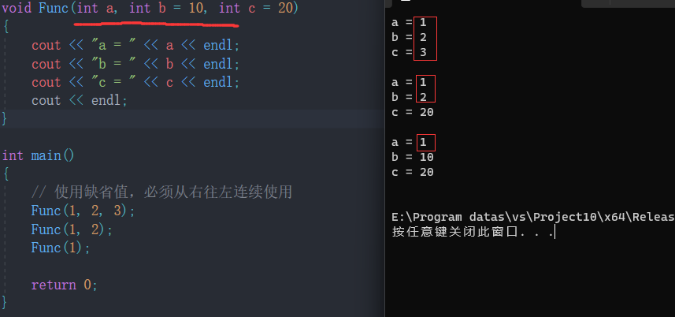


**示例2：**

```cpp
#include <iostream>
using namespace std;

struct Stack {
    int *a;
    int top;
    int capacity;
};

//defaultCapacity缺省参数
void StackInit(struct Stack *ps, int defaultCapacity = 4) {
    ps->a = (int *) malloc(sizeof(int) * defaultCapacity);
    if (ps->a == NULL) {
        perror("malloc fail");
        exit(-1);
    }
    ps->top = 0;
    ps->capacity = defaultCapacity;
}


int main() {
    Stack st1;// 最多要存100个数
    StackInit(&st1, 100);

    Stack st2;// 不知道多少数据,不传size,默认就是缺省参数的值4
    StackInit(&st2);
    return 0;
}
```

**注意：**

> 1. 半缺省参数必须从右往左依次来给出，不能间隔着给
>
> 2. 缺省参数不能在函数声明和定义中同时出现

**例如：**

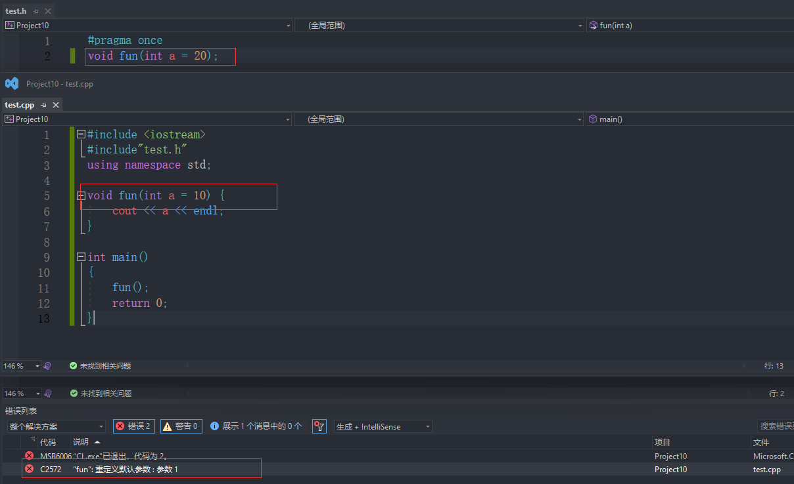


> 3. 缺省值必须是常量或者全局变量


# 函数重载

**函数重载：**是函数的一种特殊情况，C++允许在**同一作用域**中声明几个功能类似的**同名函数**，这些同名函数的**形参列表(参数个数或类型或类型顺序)不同**，常用来处理实现功能类似数据类型不同的问题。

**函数重载的条件**：

为了成功重载一个函数，函数重载必须满足以下条件：

> 1. 函数名称相同。
> 2. 函数位于同一作用域内。
> 3. 参数列表不同，包括参数的类型、数量或顺序不同。

**示例1**：

```c
#include <iostream>
using namespace std;
// 1、参数类型不同
int Add(int left, int right) {
    cout << "int Add(int left, int right)" << endl;
    return left + right;
}

double Add(double left, double right) {
    cout << "double Add(double left, double right)" << endl;
    return left + right;
}

//2.参数个数不同
void f() {
    cout << "f()" << endl;
}

void f(int a) {
    cout << "f(int a)" << endl;
}

// 3、参数类型顺序不同
void f(int a, char b) {
    cout << "f(int a,char b)" << endl;
}

void f(char b, int a) {
    cout << "f(char b, int a)" << endl;
}

int main() {
    Add(10, 20);    //int Add(int left, int right)
    Add(10.1, 20.2);//double Add(double left, double right)
    f();            //f()
    f(10);          //f(int a)
    f(10, 'a');     //f(int a,char b)
    f('a', 10);     //f(char b, int a)

    return 0;
}
```

## C++支持函数重载的原理name mangling

C++支持函数重载的原理是基于编译器的 `name mangling` 技术，这是一种将函数名和其参数类型组合起来生成唯一标识符的方法，用来区分不同的同名函数。例如，如果有两个函数都叫func ，但是一个参数是int ，另一个参数是double ，那么编译器会将它们的名字改为类似 _Z4funci 和 _Z4funcd 的形式，这样就可以在链接时正确地找到对应的函数。不同的编译器可能有不同的 `name mangling` 规则，但是原理都是一样的。

通过下面我们可以看出gcc的函数修饰后名字不变。而g++的函数修饰后变成【_Z+函数长度 +函数名+类型首字母】。

**采用gcc编译器的结果：**

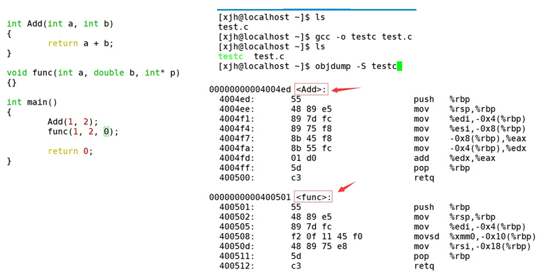


**采用g++编译的结果：**

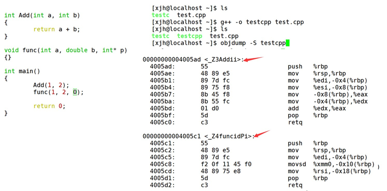


# 内联函数

以`inline`修饰的函数叫做**内联函数**，**编译时C++编译器会在**调用内联函数的地方展开，**没有函数调用建立栈帧的开销**，内联函数提升程序运行的效率。

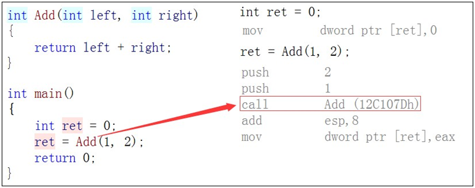


如果在上述函数前增加`inline`关键字将其改成内联函数，在编译期间编译器会用函数体替换函数的调用。

**查看方式：**

1.在release模式下，查看编译器生成的汇编代码中是否存在call Add

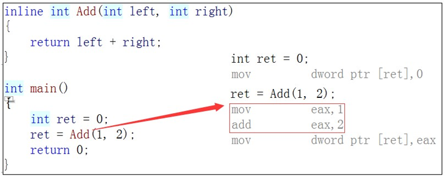

2.在debug模式下，需要对编译器进行设置，否则不会展开(因为debug模式下，编译器默认不会对代码进行优化，以下给出vs2022的设置方式)

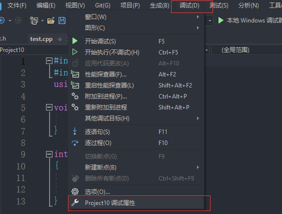

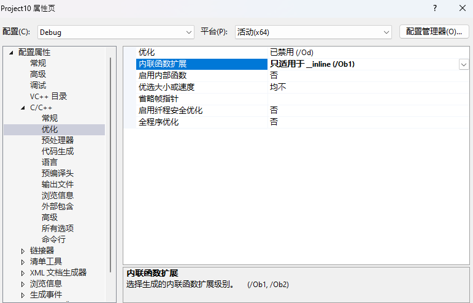


## 内联函数的特性

- `inline`是一种**以空间换时间**的做法，如果编译器将函数当成内联函数处理，在**编译阶段**，会用**函数体替换函数调用**，缺陷：可能会使目标文件变大，优势：**少了调用开销，提高程序运行效率**。
- `inline`**对于编译器而言只是一个建议**，**不同编译器关于inline实现机制可能不同**，一般建议：**将函数规模较小(即函数不是很长，具体没有准确的说法，取决于编译器内部实现)、不是递归、且频繁调用的函数采用inline修饰**，否则编译器会忽略inline特性。
- `inline`不建议声明和定义分离，分离会导致链接错误。因为inline被展开，就没有函数地址了，链接就会找不到

- **内联函数的定义通常放在头文件中**。这是因为当函数被调用时，编译器需要能够在调用处内联展开函数的代码，而函数定义必须对编译器可见。如果函数定义放在源文件中，其他文件调用时将无法内联展开。

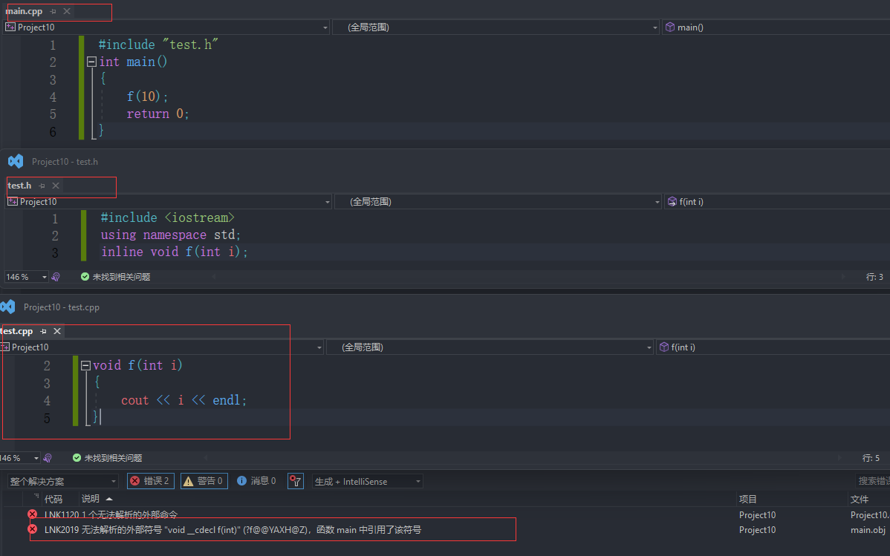

## C语言宏的缺点

**优点：** 

> 1.增强代码的复用性。 
>
> 2.提高性能。

 **缺点：** 

> 1.不方便调试宏。（因为预编译阶段进行了替换） 
>
> 2.导致代码可读性差，可维护性差，容易误用。 
>
> 3.没有类型安全的检查 。

**C++有哪些技术替代宏？**

> - `const`和`enum`替代宏常量
> - `inline`去替代宏函数

**使用宏：**

```c
#define ADD(x, y) x + y;
#define ADD(x, y) (x + y)
#define ADD(x, y) (x) + (y)
#define ADD(x, y) ((x) + (y));

#define ADD(x, y) ((x) + (y))
#define ADD(x, y) (x + y)
#define ADD(x, y) (x) + (y)
#define ADD(x, y) x + y


int main() {
    ADD(1, 2) * 3;// ((1)+(2))*3;

    int a = 1, b = 2;
    ADD(a | b, a & b);// ((a | b) + (a & b));;

    return 0;
}
```

**使用inline代替**

```c
inline int Add(int x, int y) {
    int z = x + y;
    z = x + y;
    z += x + y;
    //z = x + y;
    //z = x + y;
    //z = x * y;
    //z = x + y;
    //z += x + y;
    //z -= x + y;
    //z += x + y;
    //z += x * y;
    //z -= x / y;
    //z += x + y;
    //z += x + y;

    return z;
}

int main() {
    int ret = Add(1, 2);
    cout << ret << endl;

    return 0;
}
```
