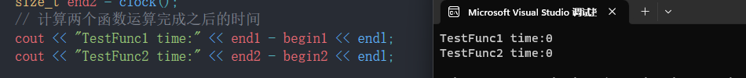

# 引用的概念

引用（Reference）是一种别名，用于**给变量或对象起另一个名称**。引用可以理解为已经存在的变量或对象的别名，通过引用可以访问到原始变量或对象的内容。引用在声明时使用 `&` 符号来定义。

**示例：**

```cpp
#include<iostream>
using namespace std;
int main(){
	int a = 0;
	int& b = a;  //b是a的别名
	int& c = b;  //c是b的别名

	cout << &a << endl;
	cout << &b << endl;
	cout << &c << endl;
    
    cout << a << endl;
	cout << b << endl;
	cout << c << endl;
	return 0;
}
```

可以发现输出结果地址相同，可知b和c其实都是a，只是a的别名而已。

**注意：引用类型必须和引用实体是同种类型的**

我们将a变量设置为double类型，可以看到编译器直接报错了。


# 引用的特性

> 1.别名：引用本身是已经存在变量或对象的别名，**没有自己的存储空间**。它和原始变量共享同一块内存地址。
>
> 2.**必须初始化**：一旦引用被声明，**必须在创建时进行初始化**，即需要指定它的初始对象。之后引用将一直指向该对象，**不可以再改变引用的目标**。
>
> 3.**不能为 null**：引用不能被赋值为 `nullptr` 或 `NULL`，必须始终指向一个有效的对象。
>
> 4.**一个变量可以有多个引用**

**示例**：

```cpp
#include<iostream>
using namespace std;
int main(){
	int a = 10;
	int& b;    //err 没有初始化
	int& c = nullptr;  //err 引用不能为nullptr
	return 0;
}
```


# 常引用

常引用（const reference）是指**通过引用访问的对象在引用生命周期内保持为只读**（不可修改）的引用类型。常引用用于确保通过引用不会对引用的对象进行修改，从而提供了更高的安全性。

常引用的声明方式为在引用类型前加上 `const` 关键字。

**常引用的特点：**

在C++中，常引用（const reference）具有一些特别的特点，这些特点使得它们在不同的场合非常有用。以下是常引用的主要特点：

> 1.**只读访问**：常引用提供了对其所引用对象的只读访问。这意味着通过常引用，你不能修改所引用对象的内容。
>
> 2.**保护被引用对象**：由于不能通过常引用修改对象，因此它们被用来保护传递给函数的参数，防止无意中被修改。
>
> 3.**引用常量**：常引用可以引用常量对象，而普通引用不能。例如，给定`const int ci = 10;`，你可以声明并初始化一个对常量`ci`的常引用：`const int& rci = ci;`。
>
> 4.**临时对象的引用**：常引用可以绑定到临时对象上，而非const引用不能。这使得常引用可以用在函数参数传递中，以避免不必要的拷贝。例如，函数`void f(const std::string& str);`可以接受临时字符串作为参数，如`f("temporary string");`。
>
> 5.**函数重载**：在函数重载中，常引用和非常引用可以用来区分重载版本。例如：
>
> ```cpp
> void func(int& x); 
> void func(const int& x);
> ```
>
> 在这种情况下，可以根据传入的参数是否为常量来决定调用哪个`func`函数。
>
> 6.**延长临时对象的生命周期**：当临时对象被作为常引用传递给某个作用域时，它的生命周期会被延长至该作用域的结束。这是C++标准中的一个特性。
>
> 7.**可以引用字面量**：你可以创建一个常量字符的引用，如`const char& c = 'a';`，但是不能创建非常量的引用到字面量上。
>
> 8.**提高性能**：使用常引用传递复杂的数据结构到函数中，可以避免进行昂贵的拷贝操作。由于保证了不会修改数据，编译器可以进行更多优化。

**例如：**

```cpp
const int x = 42;
const int& ref = x;
```

**示例1：**

```cpp
#include <iostream>

void printValue(const int& value) {
    std::cout << "Value: " << value << std::endl;
}

int getValue() {
    return 42;
}

int main() {
    // 常引用可以绑定到右值，例如字面常量或临时对象
    const int& x = 10; // x 引用了右值常量 10
    printValue(x);

    int y = 100;
    printValue(y); // x也可以引用左值y

    // 常引用在函数返回值中也很有用
    const int& z = getValue(); // 可以将函数返回的右值绑定到常引用
    printValue(z);

    return 0;
}
```

在这个例子中常引用允许我们在函数传参时使用右值，避免了额外的复制开销，并确保在函数内部不会修改原始值。

**示例2：**

```cpp
#include<iostream>
using namespace std;

int main() {
	double d = 12.34;
	int& rd1 = d; // 该语句编译时会出错，类型不同
	const int&2 rd = d;  
	return 0;
}
```


然而，`const int& rd = d;` 这一行是合法的，而且具有一个重要的特性：**当一个非常量对象被绑定到一个常量引用上时，编译器会创建一个临时的 const 变量，并将常量引用绑定到这个临时 const 变量上**。但是编译器还是会警告，从“double”转换到“const int”，可能丢失数据，但不会报错。


# 引用的使用场景

> **1.做参数**

引用通常用于在函数调用中传递参数，这样可以避免复制大型对象，提高性能。通过传递引用，函数可以直接修改传递的参数，而不需要返回新值。

**示例：**

```cpp
#include<iostream>
using namespace std;

void swap(int* p1, int* p2){
    int tmp = *p1;
    *p1 = *p2;
    *p2 = tmp;
}

void swap(int& r1, int& r2){
    int tmp = r1;
    r1 = r2;
    r2 = tmp;
}

int main(){
    int a = 10, b = 20;
    swap(&a, &b);
    cout << a << " " << b << endl;   //stdout:10 20
    swap(a, b);
    cout << a << " " << b << endl;   //stdout:20 10

    return 0;
}
```

> **2.返回值优化**

函数可以返回引用类型，这样可以避免产生临时对象，并优化性能。

**示例1：**

```cpp
#include <iostream>
using namespace std;

int &findMax(int &a, int &b){
    return (a > b) ? a : b;
}

int main(){
    int x = 5, y = 10;
    int &maxRef = findMax(x, y); // maxRef引用x或y中的较大值
    maxRef = 15;                 // 修改x或y的值，此处修改y的值为15

    cout << y << endl;
    return 0;
}
```

> **3.迭代器与范围循环** 

在C++标准库中，许多容器类都使用引用来返回迭代器或在范围循环中使用引用来遍历容器元素。

```cpp
std::vector<int> nums = {1, 2, 3, 4, 5};

// 使用引用遍历容器元素
for (int& num : nums) {
    num *= 2; // 修改容器中的元素值
}
```

> **4.与类成员的关联**

引用常用于在类中使用其他类对象作为成员。这样，类成员可以直接引用其他对象，而不需要创建新的副本。

```cpp
class Car {
public:
    Car(Engine& engine) : engineRef(engine) {}

    void start() {
        engineRef.turnOn();
    }

private:
    Engine& engineRef;
};
```


# 引用做返回值的问题

**下面代码输出什么结果？为什么？**

```cpp
int& Add(int a, int b){
    int c = a + b;
    return c;
}

int main(){
    int ret = Add(1, 2);
    int& ret1 = Add(1, 2);
    cout << "Add(1, 2) is :" << ret << endl;
    cout << "Add(1, 2) is :" << ret1 << endl;

    return 0;
}
```


为什么ret1的值非常的奇怪呢？观察下编译器给的警告


ret是值传递，Add函数返回了c的引用，编译器对c解引用，赋值给ret，结果3，但是这是vs中的结果，vs可能对这种处理结果进行了优化，这并不符合C++的标准，在g++编译器中，会直接报错，`返回局部变量或临时变量的地址: c`

> 当一个函数返回一个引用时，编译器通常不会创建一个临时变量来存储这个引用。相反，它会直接使用返回的引用所指向的对象。然而，**当将这个返回值赋给一个非引用类型的变量时，编译器会执行一个隐式的解引用操作，并将引用所指向的对象的值复制到这个变量中**。

ret1是引用传递，Add函数返回了c的引用，Add函数结束后，函数栈帧被销毁，c也被销毁，ret1的别名就是随机值

**注意：**

> **如果函数返回时，出了函数作用域，如果返回对象还在(还没还给系统)，则可以使用引用返回，如果已经还给系统了，则必须使用传值返回。或者是值接收返回值，而不使用引用接收返回值**


# 传值、传引用效率比较

以值作为参数或者返回值类型，在传参和返回期间，函数不会直接传递实参或者将变量本身直接返回，而是传递实参或者返回变量的一份临时的拷贝，因此用值作为参数或者返回值类型，效率是非常低下的，尤其是当参数或者返回值类型非常大时，效率就更低。

```cpp
#include <iostream>
#include <time.h>
using namespace std;
struct A {
    int a[10000];
};

A a;

// 值返回
A TestFunc1() {
    return a;
}

// 引用返回
A& TestFunc2() {
    return a;
}
 
void TestReturnByRefOrValue() {
    // 以值作为函数的返回值类型
    size_t begin1 = clock();
    for (size_t i = 0; i < 100000; ++i){
        TestFunc1();
    }
    
    size_t end1 = clock();
    // 以引用作为函数的返回值类型
    size_t begin2 = clock();
    for (size_t i = 0; i < 100000; ++i){
		TestFunc2();
    }
       
    size_t end2 = clock();
    // 计算两个函数运算完成之后的时间
    cout << "TestFunc1 time:" << end1 - begin1 << endl;
    cout << "TestFunc2 time:" << end2 - begin2 << endl;
}

int main() {
    TestReturnByRefOrValue();
    return 0;
}
```

这是DEBUG版本下的测试结果：


这是Release版本下的测试结果：



可以发现编译器没有优化之前，发现传值和指针在作为传参以及返回值类型上效率相差很大。但是经过编译器优化后，几乎没有差别了。


# 引用和指针的区别

在语法概念上引用就是一个别名，没有独立空间，和其引用实体共用同一块空间。

在底层实现上实际是有空间的，因为**引用是按照指针方式来实现**的。

```cpp
int main() {
    int a = 10;
    int &ra = a;
    ra = 20;
    int *pa = &a;
    *pa = 20;
    return 0;
}
```

我们来看下引用和指针的汇编代码对比：


发现汇编指令是一模一样的，说明引用的底层是指针实现的

**总结引用和指针的不同点:**

> 1.引用概念上定义一个变量的别名，指针存储一个变量地址。
>
> 2.引用在定义时必须初始化，指针没有要求
>
> 3.引用在初始化时引用一个实体后，就不能再引用其他实体，而指针可以在任何时候指向任何 一个同类型实体
>
> 4.没有NULL引用，但有NULL指针
>
> 5.在sizeof中含义不同：引用结果为引用类型的大小，但指针始是地址空间所占字节个数
>
> 6.引用自加即引用的实体增加1，指针自加即指针向后偏移一个类型的大小
>
> 7.有多级指针，但是没有多级引用
>
> 
>
> 8.访问实体方式不同，指针需要显式解引用，引用编译器自己处理
>
> 9.引用比指针使用起来相对更安全


# 引用的权限问题

**指针和引用，赋值/初始化，权限可以缩小，但是不能放大**

**示例1：权限放大**

```cpp
int main(){
    // 权限放大
    const int c = 2;
    int& d = c;   //将 "int &" 类型的引用绑定到 "const int" 类型的初始值设定项时，限定符被丢弃

    const int* p1 = nullptr;
    int* p2 = p1;  //"const int *" 类型的值不能用于初始化 "int *" 类型的实体
    
	return 0;
}
```


**示例2：权限保持**
```cpp
int main(){
	const int c = 2;
    const int& d = c;

    const int* p1 = NULL;
    const int* p2 = p1;
	return 0;
}
//可以通过编译
```

**示例3：权限缩小**

```cpp
int Count(){
    int n = 0;
    n++;

    return n;
}

int main(){
	// 权限缩小
    int x = 1;
    const int& y = x;

    int* p3 = NULL;
    const int* p4 = p3;
    
    const int& ret = Count();
    int i = 10;

    double dd = i;
    const double& rd = i;
	return 0;
}
//可以通过编译
```

**注意不要被混淆：**

```c
 const int m = 1;
 int n = m;
```

这是可以的。**const变量可以被赋值给普通变量**，不要被混淆

