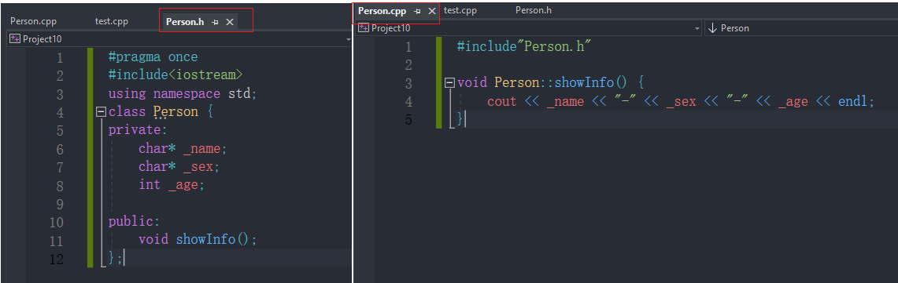
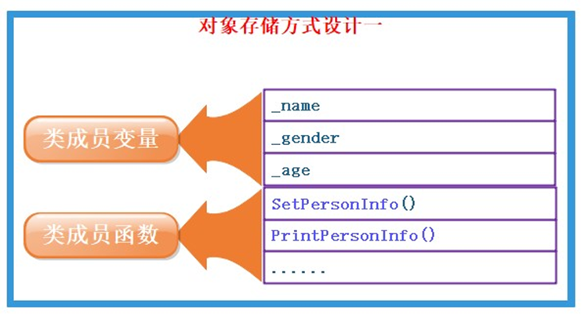
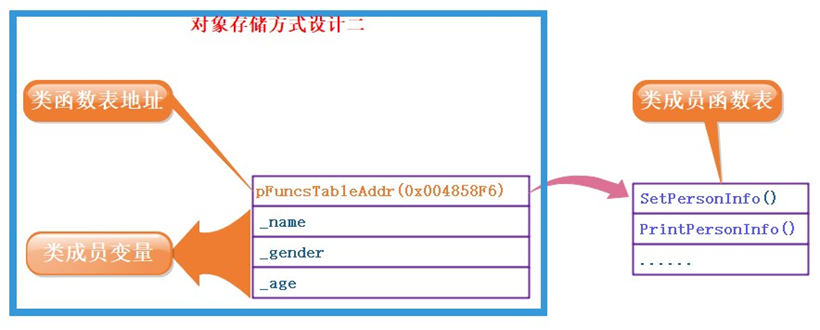
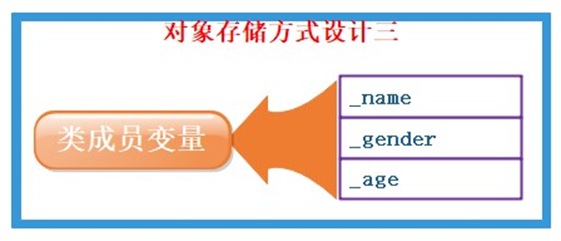
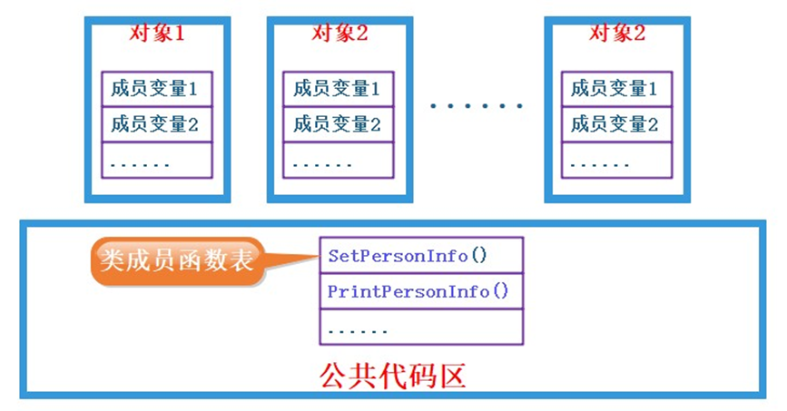
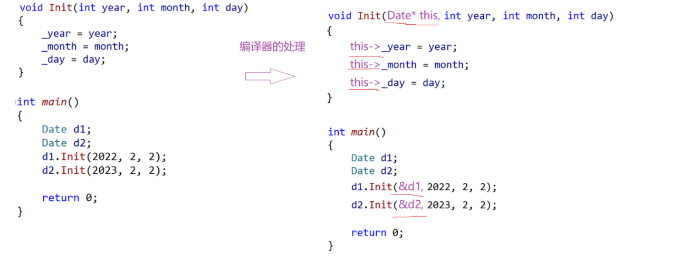

# **面向对象**

C语言是**面向过程**的，关注的是过程，分析出求解问题的步骤， 通过函数调用逐步解决问题。

C++是基于**面向对象**的，关注的是对象，将一件事情拆分成不同的对象，靠对象之间的交互完成。


# 类

**C语言结构体中只能定义变量，在C++中，结构体内不仅可以定义变量，也可以定义函数。**

**C++兼容C结构体用法,C++把结构体升级成了类。**

**示例：**

```cpp
typedef struct ListNode {
    int val;
    struct ListNode *next;
} LTN;

// C struct ListNode是类型

struct ListNode {
    int val;
    ListNode *next;
};
```

**成员函数直接定义到类里面:**

```cpp
struct Stack {
    // 成员函数
    void Init(int n = 4) {
        a = (int *) malloc(sizeof(int) * n);
        if (nullptr == a) {
            perror("malloc申请空间失败");
            return;
        }

        capacity = n;
        size = 0;
    }

    void Push(int x) {
        //...
        a[size++] = x;
    }

    int Top(){
    }

    void Destroy(){

    }


    // 成员变量
    int *a;
    int size;
    int capacity;
};

int main(){
    Stack s;
    s.Init(10);
    s.Push(1);
    int x = s.Top();
    s.Destroy();
    return 0;
}
```

上面结构体的定义，在**C++中更喜欢用class来代替**。


# 类的定义

类的定义用于声明和定义一个新的用户定义数据类型，它描述了一组数据成员和成员函数。

```cpp
class ClassName {
private:
    // 私有成员变量

public:
    // 公有成员变量

    // 构造函数

    // 成员函数
};  // 这里有一个分号
```

类体中内容称为**类的成员**：类中的**变量**称为**类的属性**或**成员变量**; 类中的**函数**称为**类的方法**或者成员函数**。

**类的两种定义方式：**

> 1.声明和定义全部放在类体中，需注意：**成员函数**如果在**类中定义**，编译器可能会将其当成**内联函数**处理。

```cpp
class Person {
private:
    char *_name;
    char *_sex;
    int _age;

public:
    void showInfo() {
        cout << _name << "-" << _sex << "-" << _age << endl;
    }
};
```

> 2.类声明放在.h文件中，成员函数定义放在.cpp文件中，注意：**成员函数名前需要加类名::**



一般情况下，更期望采用第二种方式。

**成员变量命名规则的建议**

我们看看这个函数，是不是很僵硬？

```cpp
class Date {
public:
    void Init(int year) {
        // 这里的year到底是成员变量，还是函数形参？
        year = year;
    }

private:
    int year;
};
```

所以一般建议这样：

```cpp
class Date {
public:
    void Init(int year) {
        _year = year;
    }

private:
    int _year;   //成员变量前加上_,用以区分
};
```


# 类的访问限定符及封装

C++实现封装的方式：**用类将对象的属性与方法结合在一块，让对象更加完善，通过访问权限选择性的将其接口提供给外部的用户使用。**

## 访问限定符

**访问限定符**：访问限定符用于控制类的成员（成员变量和成员函数）在类内部和类外部的可见性和访问权限。C++提供了三种主要的访问限定符：`public`、`private`和`protected`。

> 1.**public**：
>
> - `public` 成员在类内部和类外部都是可见的。
> - 任何地方都可以访问这些成员，包括类的外部代码。
> - `public` 成员通常用于表示类的接口，提供给外部代码使用。
>
> 2.**private**：
>
> - `private` 成员只在类内部可见，对外部代码是隐藏的。
> - 外部代码无法直接访问或修改这些成员。
> - `private` 成员通常用于封装类的实现细节，以确保数据的安全性和封装性。
>
> 3.**protected**：
>
> - `protected` 成员在类内部可见，而且对派生类（继承类）也是可见的。
> - 对于类的外部代码来说，`protected` 成员与 `private` 成员的行为类似，不可直接访问。

protected和private修饰的成员在类外不能直接被访问，他们之间的区别在哪呢？这涉及到了继承的概念。

```cpp
class Base {
private:
    int privateVar;    // 只能在 Base 类内部访问

protected:
    int protectedVar;  // Base 类内部和派生类内部都可访问
};

//Derived类是继承Base类的,继承在后面会介绍
class Derived : public Base {
public:
    void AccessBaseMembers() {
        // 可以访问 Base 类的 protected 成员
        protectedVar = 10;
        // 但不能访问 privateVar，因为它是 private 的
    }
};
```

Derived类是继承Base类的,继承在后面章节会介绍

**注意：**

>  访问权限作用域从该访问限定符出现的位置开始直到下一个访问限定符出现时为止     
>
>  如果后面没有访问限定符，作用域就到 } 即类结束   
>
>  class的默认访问权限为private，struct为public(因为struct要兼容C)

## 封装

面向对象的三大特性：**封装、继承、多态。**

在类和对象阶段，主要是研究类的封装特性，那什么是封装呢？

封装是面向对象编程中的一个重要概念，它指的是将数据（成员变量）和操作数据的方法（成员函数）组合在一起，形成一个类，并限制外部对类内部数据的直接访问。封装的目的是隐藏类的内部实现细节，提供一定的访问控制，以便更好地管理和维护代码，并确保数据的安全性和一致性。

**封装本质上是一种管理，让用户更方便使用类**。比如：对于电脑这样一个复杂的设备，提供给用户的就只有开关机键、通过键盘输入，显示器，USB插孔等，让用户和计算机进行交互，完成日常事务。但实际上电脑真正工作的却是CPU、显卡、内存等一些硬件元件。

对于计算机使用者而言，不用关心内部核心部件，比如主板上线路是如何布局的，CPU内部是如何设计的等，用户只需要知道，怎么开机、怎么通过键盘和鼠标与计算机进行交互即可。因此计算机厂商在出厂时，在外部套上壳子，将内部实现细节隐藏起来，仅仅对外提供开关机、鼠标以及键盘插孔等，让用户可以与计算机进行交互即可。 

在C++语言中实现封装，可以**通过类将数据以及操作数据的方法进行有机结合，通过访问权限来隐藏对象内部实现细节，控制哪些方法可以在类外部直接被使用。**


# 类的作用域

类的作用域指的是类中成员的可见性和可访问性。类的作用域分为以下几个部分：

**类内作用域**：

> 在类的内部，所有的成员（成员变量和成员函数）都可以互相访问，无需前缀。
>
> 成员函数可以直接访问类的私有成员。

```cpp
class MyClass {
private:
    int privateVar;

public:
    void publicFunc() {
        privateVar = 10;  // 直接访问私有成员
    }
};
```

**类外作用域**：

> 在类外部访问成员时，需要使用成员访问操作符 `.` 或 `->`（如果是指针对象）,还有`::`。
>
> 仅公有成员可以在类外部直接访问。

```cpp
MyClass obj;
obj.publicFunc();  // 访问公有成员函数

obj.privateVar = 20;  // 错误，无法直接访问私有成员
```

**继承和派生类的作用域**：

> 派生类可以访问其基类中的公有和受保护成员，但不能访问基类的私有成员。
>
> 派生类可以使用成员访问操作符来访问继承自基类的成员。

```cpp
class Derived : public MyClass {
public:
    void derivedFunc() {
        privateVar = 30;  // 错误，不能访问基类的私有成员

        publicFunc();     // 可以访问继承来的公有成员函数
    }
};
```


# 类的实例化

**用类类型创建对象的过程，称为类的实例化**、

> **类是对对象进行描述的**，是一个模型一样的东西，限定了类有哪些成员，**定义出一个类并没有分配实际的内存空间**来存储它；比如：入学时填写的学生信息表，表格就可以看成是一个类，来描述具体学生信息。
>
> 一个类可以实例化出多个对象，**实例化出的对象占用实际的物理空间，存储类成员变量**
>
> **类实例化出对象就像现实中使用建筑设计图建造出房子，类就像是设计图**，只设计出需要什么东西，但是并没有实体的建筑存在，同样类也只是一个设计，实例化出的对象能实际存储数据，占用物理空间

**示例1：**

```cpp
#include <iostream>
using namespace std;
class Person {
public:
    char* _name;
    char* _sex;
    int _age;

public:
    void showInfo() {
        cout << _name << "-" << _sex << "-" << _age << endl;
    }
};

.
int main() {
    //Person::_age = 100;// 编译失败：error C2059
    Person p;   //先实例化对象
    p._age = 100;  //在访问对象成员
    cout << p._age << endl;   //100
    return 0;
}
```

**示例2：**

```cpp
#include <iostream>
using namespace std;
// 类 -- 别墅设计图
class Date {
public:
    // 定义
    void Init(int year, int month, int day) {
        _year = year;
        _month = month;
        _day = day;
    }

private:
    //对数据声明，而不是定义，定义是在创建对象的时候
    int _year;
    int _month;
    int _day;
};

int main() {
    // 类对象实例化 -- 开空间
    // 实例化 -- 用设计图建造一栋栋别墅
    Date d1;
    Date d2;

    //Date.Init(2023，2，2)； //错误，调用成员函数，要用对象，不能用类
    d1.Init(2023, 12, 12);
    d2.Init(2022, 1, 1);
    //d1,d2中的成员变量占用不同的内存空间
    return 0;
}
```

**为什么成员变量在对象中，成员函数不在对象中呢？**

> 每个对象成员变量是不一样的，需要独立存储
>
> 每个对象调用成员函数是一样的，放在共享公共区域（代码段）


# **类对象的大小和内存对齐**

## **类对象大小**

**如何计算类对象的大小**

```cpp
class A {
public:
    void PrintA() {
        cout << _a << endl;
    }

private:
    char _a;
};
```

**问题**：类中既可以有成员变量，又可以有成员函数，那么一个类的对象中包含了什么？如何计算一个类的大小？

## 类对象的存储方式猜测

**对象中包含类的各个成员**

缺陷：每个对象中成员变量是不同的，但是调用同一份函数，如果按照此种方式存储，当一个类创建多个对象时，**每个对象中都会保存一份代码，相同代码保存多次，浪费空间**。那么如何解决呢？

**代码只保存一份，在对象中保存存放代码的地址**


**只保存成员变量，成员函数存放在公共的代码段**



**问题：对于上述三种存储方式，那计算机到底是按照那种方式来存储的？**

```cpp
#include <iostream>
using namespace std;
// 类中既有成员变量，又有成员函数
class A1 {
public:
    void f1() {}

private:
    int _a;
};
// 类中仅有成员函数
class A2 {
public:
    void f2() {}
};
// 类中什么都没有---空类
class A3 {};

int main(){
    cout<<sizeof(A1)<<endl;   //4
    cout<<sizeof(A2)<<endl;   //1
    cout<<sizeof(A3)<<endl;   //1
    return 0;
}
```

**结论：**

> **一个类的大小，实际就是该类中”成员变量”之和，当然要注意内存对齐注意空类的大小，空类比较特殊，编译器给了空类一个字节来唯一标识这个类的对象。**

## 类的内存对齐规则

和C语言结构体内存规则相同，可以访问C语言自定义类型章节中的结构体内存对齐规则[C语言自定义类型](https://blog.csdn.net/ikun66666/article/details/131818015?fromshare=blogdetail)


# this指针

## this指针的引出

我们先来定义一个日期类 `Date`

```cpp
#include <iostream>
using namespace std;
class Date {
public:
    void Init(int year, int month, int day) {
        _year = year;
        _month = month;
        _day = day;
    }
    void Print() {
        cout << _year << "-" << _month << "-" << _day << endl;
    }

private:
    int _year; // 年
    int _month;// 月
    int _day;  // 日
};

int main() {
    Date d1, d2;
    d1.Init(2022, 1, 11);
    d2.Init(2022, 1, 12);
    d1.Print();
    d2.Print();
    return 0;
}
```

上面的Date类中Init与Print两个成员函数，函数体中没有关于不同对象的区分，那当d1调用Init函数时，该函数是如何知道应该设置d1对象，而不是设置d2对象呢？

C++中通过引入this指针解决该问题，即：**C++编译器给每个“非静态的成员函数“增加了一个隐藏的指针参数，让该指针指向当前对象(函数运行时调用该函数的对象)，在函数体中所有“成员变量” 的操作，都是通过该指针去访问。只不过所有的操作对用户是透明的，即用户不需要来传递，编译器自动完成。**

## **this指针的特性**

> **this指针的类型：类类型 const**，即成员函数中，不能给this指针赋值。
>
> 只能在”成员函数“的内部使用 
>
> **this指针本质上是“成员函数”的形参**，当对象调用成员函数时，将对象地址作为实参传递给this形参。所以**对象中不存储this指针**。
>
> **this指针是“成员函数”第一个隐含的指针形参**，一般情况由编译器通过ecx寄存器自动传递，**不需要用户传递**



**判断下面三种结果是运行崩溃，还是编译错误，还是正常运行**

```cpp
#include<iostream>
using namespace std;
class Date{
public:
    // 定义
    void Init(int year, int month, int day){
        /*_year = year;
        _month = month;
        _day = day;*/
        cout << this << endl;
        this->_year = year;
        this->_month = month;
        this->_day = day;
    }

    void func(){
        cout << this << endl;
        cout << "func()" << endl;
    }

//private:
    int _year;  // 声明
    int _month;
    int _day;
};

int main(){
    Date d1;
    Date d2;
    d1.Init(2022, 2, 2);
    d2.Init(2023, 2, 2);
    
    //判断下面三种结果是运行崩溃，还是编译错误，还是正常运行
    Date* ptr = nullptr;
    //ptr为一个对象指针，ptr->表示访问对象成员
    ptr->Init(2022, 2, 2); 
    //运行崩溃，进入Init函数体，this指针为nullptr，this指针访问对象成员变量，出现空指针解引用。

    ptr->func();           
    // 正常运行，func函数中，没有this指针访问成员变量，不会发生空指针解引用
    (*ptr).func();           
    // 正常运行,(*ptr)等价于ptr，

    return 0;
}
```


# C语言和C++实现Stack的对比

## C语言实现

```c
#include <assert.h>
#include <stdio.h>
#include <stdlib.h>
typedef int DataType;
typedef struct Stack {
    DataType *array;
    int capacity;
    int size;
} Stack;

void StackInit(Stack *ps) {
    assert(ps);
    ps->array = (DataType *) malloc(sizeof(DataType) * 3);
    if (NULL == ps->array) {
        assert(0);
        return;
    }
    ps->capacity = 3;
    ps->size = 0;
}

void StackDestroy(Stack *ps) {
    assert(ps);
    if (ps->array) {
        free(ps->array);
        ps->array = NULL;
        ps->capacity = 0;
        ps->size = 0;
    }
}

void CheckCapacity(Stack *ps) {
    if (ps->size == ps->capacity) {
        int newcapacity = ps->capacity * 2;
        DataType *temp = (DataType *) realloc(ps->array,
                                              newcapacity * sizeof(DataType));
        if (temp == NULL) {
            perror("realloc申请空间失败!!!");
            return;
        }
        ps->array = temp;
        ps->capacity = newcapacity;
    }
}

void StackPush(Stack *ps, DataType data) {
    assert(ps);
    CheckCapacity(ps);
    ps->array[ps->size] = data;
    ps->size++;
}

int StackEmpty(Stack *ps) {
    assert(ps);
    return 0 == ps->size;
}

void StackPop(Stack *ps) {
    if (StackEmpty(ps))
        return;
    ps->size--;
}

DataType StackTop(Stack *ps) {
    assert(!StackEmpty(ps));
    return ps->array[ps->size - 1];
}

int StackSize(Stack *ps) {
    assert(ps);
    return ps->size;
}

int main() {
    Stack s;
    StackInit(&s);
    StackPush(&s, 1);
    StackPush(&s, 2);
    StackPush(&s, 3);
    StackPush(&s, 4);
    printf("%d\n", StackTop(&s));
    printf("%d\n", StackSize(&s));
    StackPop(&s);
    StackPop(&s);
    printf("%d\n", StackTop(&s));
    printf("%d\n", StackSize(&s));
    StackDestroy(&s);
    return 0;
}
```

可以看到，在用C语言实现时，Stack相关操作函数有以下共性： 

> 每个函数的第一个参数都是Stack* 
>
> 函数中必须要对第一个参数检测，因为该参数可能会为NULL 
>
> 函数中都是通过Stack*参数操作栈的 
>
> 调用时必须传递Stack结构体变量的地址 

结构体中只能定义存放数据的结构，操作数据的方法不能放在结构体中，即数据和操作数据的方式是分离开的，而且实现上相当复杂一点，涉及到大量指针操作，稍不注意可能就会出错。

## C++实现

```cpp
#include <iostream>
#include <stdlib.h>
using namespace std;
typedef int DataType;
class Stack {
public:
    void Init() {
        _array = (DataType *) malloc(sizeof(DataType) * 3);
        if (NULL == _array) {
            perror("malloc申请空间失败!!!");
            return;
        }
        _capacity = 3;
        _size = 0;
    }

    void Push(DataType data) {
        CheckCapacity();
        _array[_size] = data;
        _size++;
    }

    void Pop() {
        if (Empty())
            return;
        _size--;
    }

    DataType Top() {
        return _array[_size - 1];
    }

    int Empty() {
        return 0 == _size;
    }

    int Size() {
        return _size;
    }

    void Destroy() {
        if (_array) {
            free(_array);
            _array = NULL;
            _capacity = 0;
            _size = 0;
        }
    }

private:
    void CheckCapacity() {
        if (_size == _capacity) {
            int newcapacity = _capacity * 2;
            DataType *temp = (DataType *) realloc(_array, newcapacity *
                                                                  sizeof(DataType));
            if (temp == NULL) {
                perror("realloc申请空间失败!!!");
                return;
            }
            _array = temp;
            _capacity = newcapacity;
        }
    }

private:
    DataType *_array;
    int _capacity;
    int _size;
};

int main() {
    Stack s;
    s.Init();
    s.Push(1);
    s.Push(2);
    s.Push(3);
    s.Push(4);

    printf("%d\n", s.Top());
    printf("%d\n", s.Size());
    s.Pop();
    s.Pop();
    printf("%d\n", s.Top());
    printf("%d\n", s.Size());
    s.Destroy();
    return 0;
}
```

**C++中通过类可以将数据以及操作数据的方法进行完美结合，通过访问权限可以控制那些方法在类外可以被调用，即封装**，在使用时就像使用自己的成员一样，更符合人类对一件事物的认知。而且每个方法不需要传递Stack*的参数了，编译器编译之后该参数会自动还原，即**C++中 Stack *  参数是编译器维护的，C语言中需用用户自己维护**。
