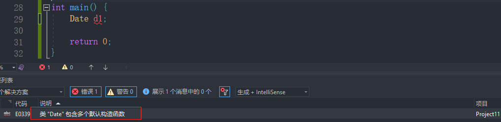
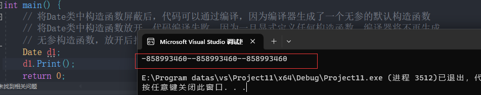
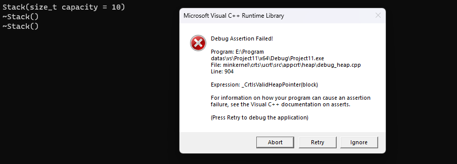
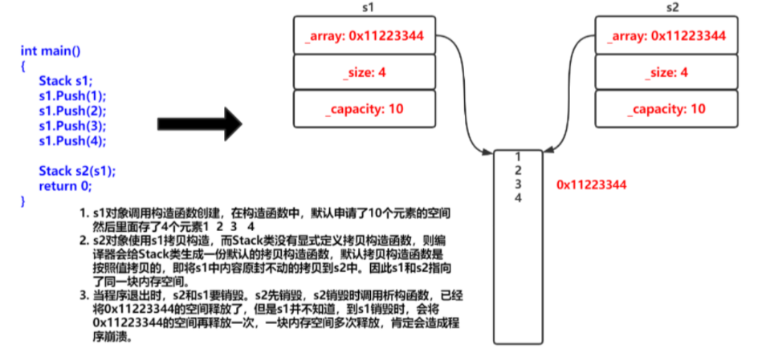

# 类的默认成员函数

> **默认成员函数：用户没有显式实现，编译器会生成的成员函数称为默认成员函数。**

如果一个类中什么成员都没有，简称为空类。 

空类中真的什么都没有吗？并不是，任何类在什么都不写时，编译器会自动生成默认成员函数。 

在 C++ 中，类的默认成员函数是指在某些情况下，编译器会自动为类生成的一些特殊成员函数。这些默认成员函数包括：

**1.默认构造函数 (Default Constructor)**：

如果没有显式定义任何构造函数，编译器会生成一个默认构造函数。

默认构造函数不接受任何参数，用于创建对象时进行初始化。

**例如**：

```cpp
class MyClass {
public:
    MyClass() { // 默认构造函数
        // 初始化代码
    }
};
```

**2.析构函数 (Destructor)**：

如果没有显式定义析构函数，编译器会生成一个默认析构函数。

析构函数在对象被销毁时调用，用于释放资源。

**例如**：

```cpp
class MyClass {
public:
    ~MyClass() { // 析构函数
        // 清理代码
    }
};
```

**3.拷贝构造函数 (Copy Constructor)**：

如果没有显式定义拷贝构造函数，编译器会生成一个默认拷贝构造函数。

拷贝构造函数用于创建一个对象，该对象是另一个同类型对象的副本。

**例如**：

```cpp
class MyClass {
public:
    MyClass(const MyClass& other) { // 拷贝构造函数
        // 拷贝代码
    }
};
```

**4.拷贝赋值运算符 (Copy Assignment Operator)**：

如果没有显式定义拷贝赋值运算符，编译器会生成一个默认拷贝赋值运算符。

拷贝赋值运算符用于将一个对象的值赋给另一个同类型对象。

例如：
```cpp
class MyClass {
public:
    MyClass& operator=(const MyClass& other) { // 拷贝赋值运算符
        // 赋值代码
        return *this;
    }
};
```

**5.移动构造函数 (Move Constructor)**：

如果没有显式定义移动构造函数，编译器会生成一个默认移动构造函数（C++11 及以后）。

移动构造函数用于将资源从一个对象“移动”到另一个新创建的对象，通常用于提高性能。

例如：
```cpp
class MyClass {
public:
    MyClass(MyClass&& other) noexcept { // 移动构造函数
        // 移动代码
    }
};
```

**6.移动赋值运算符 (Move Assignment Operator)**：

如果没有显式定义移动赋值运算符，编译器会生成一个默认移动赋值运算符（C++11 及以后）。

移动赋值运算符用于将资源从一个对象“移动”到另一个已存在的对象。

例如：
```cpp
class MyClass {
public:
    MyClass& operator=(MyClass&& other) noexcept { // 移动赋值运算符
        // 移动代码
        return *this;
    }
};
```

这些默认成员函数在大多数情况下都能满足基本需求，但当类涉及到动态内存分配或其他资源管理时，可能需要显式定义这些函数以确保正确的行为。


# 构造函数

## 构造函数的概念

对于以下Date类：

```cpp
#include <iostream>
using namespace std;
class Date {
public:
    void Init(int year, int month, int day) {
        _year = year;
        _month = month;
        _day = day;
    }

    void Print() {
        cout << _year << "-" << _month << "-" << _day << endl;
    }

private:
    int _year;
    int _month;
    int _day;
};

int main() {
    Date d1;
    d1.Init(2022, 7, 5);
    d1.Print();
    Date d2;
    d2.Init(2022, 7, 6);
    d2.Print();
    return 0;
}
```

对于`Date`类，可以通过Init公有函数给对象设置日期，但如果每次创建对象时都调用该方法设置信息，未免有点麻烦，那能否在对象创建时，就将信息设置进去呢？

答案就是使用构造函数。

**构造函数**是一个**特殊的成员函数**，**名字与类名相同，创建类类型对象时由编译器自动调用**，以保证每个数据成员都有一个合适的初始值，并且在**对象整个生命周期内只调用一次**。

## 构造函数的特性

**构造函数**是特殊的成员函数，需要注意的是，构造函数虽然名称叫构造，但是构造函数的主要任务**并不是开空间创建对象，而是初始化对象**。

**其特征如下：**

1. **函数名与类名相同**。

 2. **无返回值**

 3. 对象实例化时编译器**自动调用**对应的构造函数。也就是说在创建对象的时候，就对成员变量进行初始化。

  4. **构造函数可以重载**。(一个类可以有多个构造函数，也就是多种初始化方式)

**示例：**

```cpp
#include <iostream>
using namespace std;
class Date {
public:
    Date() {
        _year = 1;
        _month = 1;
        _day = 1;
    }

    Date(int year, int month, int day) {
        _year = year;
        _month = month;
        _day = day;
    }

    void Print() {
        cout << _year << "年" << _month << "月" << _day << "日" << endl;
    }

private:
    int _year;
    int _month;
    int _day;
};

int main() {
    Date d1;
    Date d2(2023, 2, 3); 
	
    d1.Print();
    d2.Print();   
	
    Date d3();
    //注意：如果通过无参构造函数创建对象时，对象后面不用跟括号，否则就成了函数声明

    return 0;
}
```

5. **无参的构造函数和全缺省的构造函数都称为默认构造函数**，**并且默认构造函数只能有一个**。 

   **注意**：无参构造函数、全缺省构造函数、我们没写编译器默认生成的构造函数，都可以认为是默认构造函数。

为什么只能有一个默认构造函数？ 因为调用的时候会发生歧义

不传参数就可以调用构造函数，一般建议每个类都提供一个默认构造函数

```cpp
class Date {
public:
    Date() {
        _year = 1;
        _month = 1;
        _day = 1;
    }
	
    //全缺省构造函数
    Date(int year = 1, int month = 1, int day = 1) {
        _year = year;
        _month = month;
        _day = day;
    }

    
    void Print() {
        cout << _year << "年" << _month << "月" << _day << "日" << endl;
    }

private:
    int _year;
    int _month;
    int _day;
};
```

**全缺省构造函数**不能和**无参构造函数**同时存在 - 出现歧义，编译器不知道调用哪个



6. 如果类中没有显式定义构造函数，则**C++编译器会自动生成一个无参的默认构造函数，一旦用户显式定义编译器将不再生成**。

```cpp
#include <iostream>
using namespace std;
class Date {
public:
    // 如果用户显式定义了构造函数，编译器将不再生成
    // Date(int year, int month, int day) {
    //     _year = year;
    //     _month = month;
    //     _day = day;
    // }

    void Print() {
        cout << _year << "-" << _month << "-" << _day << endl;
    }

private:
    int _year;
    int _month;
    int _day;
};

int main() {
    // 将Date类中构造函数屏蔽后，代码可以通过编译，因为编译器生成了一个无参的默认构造函数
    // 将Date类中构造函数放开，代码编译失败，因为一旦显式定义任何构造函数，编译器将不再生成
    // 无参构造函数，放开后报错：error C2512: “Date”: 没有合适的默认构造函数可用
    Date d1;
    d1.Print();
    return 0;
}
```

但是我们发现输出结果是随机值？




关于编译器生成的默认成员函数，很多人会有疑惑：不实现构造函数的情况下，编译器会生成默认的构造函数。但是看起来默认构造函数又没什么用？d对象调用了编译器生成的默认构造函数，但是d对象的值，依旧是随机值。也就说在这里**编译器生成的默认构造函数并没有什么用？**

C++把类型分成内置类型(基本类型)和自定义类型。内置类型就是语言提供的数据类型，如：int/char...，自定义类型就是我们使用class/struct/union等自己定义的类型，看看下面的程序，就会发现编译器生成默认的构造函数会对自定类型成员_t调用的它的默认成员函数。

**在包含自定义类型成员的类的构造函数被调用之前，先调用自定义成员对象的构造函数**

```cpp
#include <iostream>
using namespace std;

class Time {
public:
    Time() {
        cout << "Time()" << endl;
        _hour = 0;
        _minute = 0;
        _second = 0;
    }

private:
    int _hour;
    int _minute;
    int _second;
};

class Date {
public:
    Date(){
        cout << "Date" << endl;
    }
private:
    // 基本类型(内置类型)
    int _year;
    int _month;
    int _day;
    // 自定义类型
    Time _t;
};

int main() {
    Date d;
    return 0;
}

// out
// Time()   Date()
```


**注意：**

> C++11中针对内置类型成员不初始化的缺陷，又打了补丁，即：**内置类型成员变量在类中声明时可以给默认值**。

**示例：**

```cpp
class Date {
private:
    // 基本类型(内置类型)
    int _year = 2023;   //默认值
    int _month = 8;
    int _day = 4;
    // 自定义类型
    Time _t;
};
```

## 初始化列表

在创建对象时，编译器通过调用构造函数，给对象中各个成员变量一个合适的初始值。

但是不能将其称为对对象中成员变量的初始化，**构造函数体中的语句只能将其称为赋初值**，而不能称作初始化。因为**初始化只能初始化一次，而构造函数体内可以多次赋值**。

在效率上，初始化列表通常比在构造函数体内初始化成员变量更高效，因为它们**在对象创建的同时就初始化了成员变量，而不是先创建对象再对成员变量进行赋值。**

**例如**，假设有一个类 `MyClass` 和一个成员变量 `int x`，使用初始化列表可以直接将 `x` 初始化为某个值，而不是先默认构造（通常是0），再赋值。

**初始化列表**：以一个**冒号开始**，接着是一个以**逗号分隔的数据成员列表**，每个"**成员变量**"后面跟一个**放在括号中的初始值或表达式**。

```cpp
class Date {
public:
    Date(int year, int month, int day)
        //初始化列表
        : _year(year), _month(month), _day(day) {}

private:
    int _year;
    int _month;
    int _day;
};
```

**注意：**

> 1.每个成员变量在初始化列表中**只能出现一次**(初始化只能初始化一次) 
>
> 2.类中包含以下成员，必须放在初始化列表位置进行初始化：
>
> - 引用成员变量
> - const成员变量
> - 没有默认构造函数的自定义类型成员

```cpp
class A {
public:
    A(int a)
        : _a(a) {}

private:
    int _a;
};

class B {
public:
    B(int a, int ref)
        : _aobj(a), _ref(ref), _n(10) {}

private:
    A _aobj;     // 没有默认构造函数
    int &_ref;   // 引用
    const int _n;// const
};
```

> 3.尽量使用初始化列表初始化，因为不管你是否使用初始化列表，对于自定义类型成员变量， 一定会先使用初始化列表初始化。 

```cpp
class Time {
public:
    Time(int hour = 0)
        : _hour(hour) {
        cout << "Time()" << endl;
    }

private:
    int _hour;
};

class Date {
public:
    Date(int day) {}

private:
    int _day;
    Time _t;   //调用Time()的构造函数
};

int main() {
    Date d(1);
}
```

> 4.初始化列表中的初始化顺序与成员变量在类中的声明顺序一致,跟初始化列表顺序无关

```cpp
#include <iostream>
using namespace std;

class A {
public:
    A(int a)
        : _a1(a), _a2(_a1) {
    }

    void Print() {
        cout << _a1 << " " << _a2 << endl;
    }

private:
    int _a2;   //随机值
    int _a1;   //1
};

int main() {
    A aa(1);
    aa.Print();
}
```

a2先初始化，a1此时还没有初始化，为随机值，之后初始化a1，a复制给a1，所以a1为1，而a2是随机值

## explicit

`explicit` 是一个关键字，通常用于**修饰单参数构造函数**，其目的是**防止隐式类型转换**。它影响编译器在构造函数调用时是否进行隐式的类型转换。

当一个类的构造函数只有一个参数，并且没有使用 `explicit` 关键字进行修饰时，编译器会在需要的情况下自动执行该构造函数，将参数类型转换为类类型，从而创建一个临时对象。

使用 `explicit` 关键字修饰构造函数可以阻止这种隐式类型转换，从而防止一些意外的行为和潜在的错误。这对于避免编译器进行不必要的自动类型转换非常有用，因为有时候这种转换可能会引发不明确的代码行为。

**示例1：**

```cpp
class Date {
public:
    //1.单参构造函数，没有使用explicit修饰，具有类型转换作用
    /*Date(int year) : _year(year) {}*/

    // 2，虽然有多个参数，但是创建对象时后两个参数可以不传递，没有使用explicit修饰，具有类型转换作用 - int转换为Date类
    Date(int year, int month = 1, int day = 1)
        : _year(year), _month(month), _day(day) {}

private:
    int _year;
    int _month;
    int _day;
};

int main() {
    Date d1(2022);

    d1 = 2023;  //用一个整型变量给日期类型对象赋值
    //实际编译器背后会用2023构造一个无名对象，最后用无名对象给d1对象进行赋值
    return 0;
}
```

**示例2：**

使用`explicit`禁止类型转换

```cpp
class Date {
public:
    // explicit修饰构造函数，禁止类型转换
    explicit Date(int year, int month = 1, int day = 1)
        : _year(year), _month(month), _day(day) {}

private:
    int _year;
    int _month;
    int _day;
};

int main() {
    Date d1(2022);

    d1 = 2023;   //err 编译器报错，没有与这些操作数匹配的 "=" 运算符，操作数类型为:  Date = int
    return 0;
}
```

**示例3：**

```cpp
class MyClass {
public:
    explicit MyClass(int value) : val(value) {}

private:
    int val;
};

void func(MyClass obj) {
    // ...
}

int main() {
    MyClass obj1 = 42;  // 编译错误，因为构造函数是 explicit 的，禁止隐式类型转换
    MyClass obj2(42);   // 正确，显式调用构造函数
    func(42);           // 编译错误，因为构造函数是 explicit 的，禁止隐式类型转换
    func(obj2);         // 正确，调用 func 时显式地传递 MyClass 对象
    return 0;
}
```

**总结：** 使用 `explicit` 关键字可以帮助避免隐式的类型转换，从而提高代码的清晰性和可靠性。


# 析构函数

析构函数是一种特殊的成员函数，用于在对象被销毁时执行必要的清理工作和资源释放操作。它与构造函数相反，构造函数在对象创建时调用，而**析构函数在对象销毁时自动调用**。析构函数的名称与类名相同，前面加上一个波浪号`~`。

析构函数的主要目的是在对象生命周期结束时执行资源的清理，例如释放动态分配的内存、关闭文件、释放其他资源等。在 C++ 中，析构函数可以确保对象销毁时的资源管理，以防止内存泄漏和资源泄漏。

**析构函数的特征：**

> - 析构函数名是在类名前加上字符 ~。 
> - 无参数无返回值类型。 
> - 一个类只能有一个析构函数。若未显式定义，系统会自动生成默认的析构函数。注意：**析构函数不能重载** 
> - 对象生命周期结束时，C++编译系统系统自动调用析构函数。
> - **先构造的后析构，后构造的先析构**，因为对象是定义在函数中的，函数调用会建立栈帧，栈帧中的对象构造和析构也要符合先进后出的原则。

**当一个类的对象被销毁时，它的析构函数会被调用。这个析构函数会依次调用其成员对象的析构函数，以确保这些成员对象能够正确地释放其占用的资源**

```cpp
#include <iostream>
using namespace std;
class Time {
public:
    ~Time() {
        cout << "~Time()" << endl;
    }

private:
    int _hour;
    int _minute;
    int _second;
};

class Date {
    public:
    ~Date(){
        cout << "~Date" << endl;
    }
private:
    // 基本类型(内置类型)
    int _year = 1970;
    int _month = 1;
    int _day = 1;
    // 自定义类型
    Time _t;   //释放Date的时候调用_t的析构函数
};

int main() {
    Date d;
    return 0;
}
```

**输出结果：**

```cpp
~Time()
```

如果类中没有申请资源时，析构函数可以不写，直接使用编译器生成的默认析构函数，比如 Date 类；有资源申请时，一定要写，否则会造成资源泄漏，比如Stack类。


# 拷贝构造函数

拷贝构造函数是一种特殊的构造函数，用于创建一个对象，该对象是已存在对象的副本。它通常用于在对象初始化期间以及函数传递参数等情况下创建新对象，这些新对象与已有对象具有相同的值。拷贝构造函数采用一个参数，即要被拷贝的对象的引用。

**拷贝函数的特征如下：**

> - 拷贝构造函数是构造函数的一个重载形式。
>
> - 拷贝构造函数的参数只有一个且必须是类类型对象的引用，使用传值方式编译器直接报错， 因为会引发无穷递归调用。
>
> - 若未显式定义，编译器会生成默认的拷贝构造函数。 默认的拷贝构造函数对象按内存存储按字节序完成拷贝，这种拷贝叫做**浅拷贝**，或者**值拷贝**

**为什么会引发无穷递归？**

假设拷贝构造函数的参数是非引用类型：

```cpp
class MyClass {
public:
    MyClass(MyClass other) {  // 这里不是引用类型
        // ...
    }
};
```

当调用拷贝构造函数时，它需要一个对象作为参数。如果参数是非引用类型，那么**传递给拷贝构造函数的参数对象会通过拷贝构造函数来创建一个临时的对象副本**。但这会导致无限循环，因为在创建临时对象的过程中，又会调用拷贝构造函数来创建另一个临时对象，以此类推，导致无限递归。

使用引用类型的参数可以避免这个问题。**当参数是引用类型时，传递给拷贝构造函数的是原始对象本身的引用，而不是创建的临时对象。这样就避免了无限循环的情况。**

**正确示例：**

```cpp
#include <iostream>
using namespace std;
//正确的写法
class Date {
public:
    Date(int year = 2023, int month = 1, int day = 1) {
        _year = year;
        _month = month;
        _day = day;
    }
	
	//会调用自己的拷贝构造函数，创建一个临时对象，如果不是引用，就会无限递归
    Date(const Date &d) {
        _year = d._year;
        _month = d._month;
        _day = d._day;
    }

    void Print() {
        cout << _year << "/" << _month << "/" << _day << endl;
    }

private:
    int _year;
    int _month;
    int _day;
};

int main() {
    Date d1(2021, 2, 3);
    Date d2(d1);
    d2.Print();
    return 0;
}
```

**输出结果：**

```cpp
2021/2/3
```

## 浅拷贝和深拷贝

**浅拷贝**是指**仅仅复制对象的成员变量的值**，包括指针变量。在浅拷贝中，**复制的对象和原始对象共享相同的资源**，这可能导致意外的副作用。如果资源被释放或修改，两个对象都会受到影响。

编译器生成的默认拷贝构造函数已经可以完成字节序的值拷贝了，还需要自己显式实现吗？ 当然像日期类这样的类是没必要的。那么下面的类呢？验证一下试试？

```cpp
#include <iostream>
using namespace std;

//自动生成构造拷贝函数对自定义类型进行拷贝
typedef int DataType;
class Stack {
public:
    Stack(size_t capacity = 10) {
        cout << "Stack(size_t capacity = 10)" << endl;

        _array = (DataType*)malloc(capacity * sizeof(DataType));
        if (nullptr == _array) {
            perror("malloc申请空间失败");
            exit(-1);
        }

        _size = 0;
        _capacity = capacity;
    }

    void Push(const DataType& data) {
        // CheckCapacity();
        _array[_size] = data;
        _size++;
    }

    ~Stack() {
        cout << "~Stack()" << endl;

        if (_array) {
            free(_array);
            _array = nullptr;
            _capacity = 0;
            _size = 0;
        }
    }

private:
    DataType* _array; 
    size_t _size; 
    size_t _capacity; 
};

int main() {
    Stack st1;
    st1.Push(1);
    st1.Push(2);
    st1.Push(3);

    Stack st2(st1);
    return 0;
}
```



**可以发现程序直接崩溃了，什么原因呢？**



**注意：**

> 类中如果没有涉及资源申请时，拷贝构造函数是否写都可以；一旦涉及到资源申请时，则拷贝构造函数是一定要写，并且必须是深拷贝！

**深拷贝**是指在对象复制时，不仅复制对象的成员变量的值，还要复制指针指向的资源本身。这样新对象和原始对象就完全独立，对一个对象的修改不会影响另一个对象。

**示例：**

```cpp
#include <iostream>
using namespace std;

typedef int DataType;
class Stack {
public:
    Stack(size_t capacity = 10) {
        cout << "Stack(size_t capacity = 10)" << endl;

        _array = (DataType*)malloc(capacity * sizeof(DataType));
        if (nullptr == _array) {
            perror("malloc申请空间失败");
            exit(-1);
        }

        _size = 0;
        _capacity = capacity;
    }

    void Push(const DataType& data) {
        // CheckCapacity();
        _array[_size] = data;
        _size++;
    }

    //stack类的拷贝构造深拷贝
    Stack(const Stack& st) {
        cout << "Stack(const Stack& st)" << endl;
        //深拷贝开额外空间，为了避免指向同一空间
        _array = (DataType*)malloc(sizeof(DataType) * st._capacity);
        if (nullptr == _array) {
            perror("malloc申请空间失败");
            exit(-1);
        }
        //进行字节拷贝
        memcpy(_array, st._array, sizeof(DataType) * st._size);
        _size = st._size;
        _capacity = st._capacity;
    }

    ~Stack() {
        cout << "~Stack()" << endl;

        if (_array) {
            free(_array);
            _array = nullptr;
            _capacity = 0;
            _size = 0;
        }
    }

private:
    DataType* _array;
    size_t _size;
    size_t _capacity;
};

class MyQueue {
public:
    //MyQueue什么都不写，会调用默认的构造函数，也就是Stack类的构造函数
    // 默认生成构造
    // 默认生成析构
    // 默认生成拷贝构造

private:
    //默认构造函数初始化 - 默认析构函数
    Stack _pushST;
    //默认构造函数初始化 - 默认析构函数
    Stack _popST;
    int _size = 0;
};

int main() {
    Stack st1;
    st1.Push(1);
    st1.Push(2);
    st1.Push(4);

    Stack st2(st1);
    cout << "=============================" << endl;

    MyQueue q1;
    //q1拷贝q2  q1中有两个Stack类和一个size，size直接拷贝，stack类是调用stack拷贝构造进行拷贝
    MyQueue q2(q1);

    return 0;
}
```

## 拷贝构造函数典型调用场景：

> a、使用已存在对象创建新对象
>
> b、函数参数类型为类类型对象
>
> c、函数返回值类型为类类型对象

**示例：**

```cpp
#include <iostream>
using namespace std;
class Date {
public:
    Date(int year, int minute, int day) {
        cout << "Date(int,int,int):" << this << endl;
    }

    Date(const Date &d) {
        cout << "Date(const Date& d):" << this << endl;
    }

    ~Date() {
        cout << "~Date():" << this << endl;
    }

private:
    int _year;
    int _month;
    int _day;
};

Date Test(Date d) {
    Date temp(d);   //调用 Date 类的拷贝构造函数 Date(const Date &d); 
    return temp;
}

int main() {
    Date d1(2022, 1, 13);
    Test(d1);
    return 0;
}
```


# 赋值重载

默认情况下，C++会为类生成默认的赋值运算符，但如果类包含指针或资源，可能需要自定义赋值运算符以避免浅拷贝问题。

要重载赋值运算符，你需要在类中定义一个名为 `operator=` 的特殊成员函数。

**格式：**

> - **参数类型：**`const T&`，传递引用可以提高传参效率 
>
> - **返回值类型**：`T&`，返回引用可以提高返回的效率，有返回值目的是为了支持连续赋值 
>
>- **检测是否自己给自己赋值** 
>
> - **返回*this** ：要符合连续赋值的含义

**示例**：

```cpp
class Date {
public:
    Date(int year = 1900, int month = 1, int day = 1) {
        _year = year;
        _month = month;
        _day = day;
    }

    Date(const Date& d) {
        _year = d._year;
        _month = d._month;
        _day = d._day;
    }

    Date& operator=(const Date& d) {
        if (this != &d) {
            _year = d._year;
            _month = d._month;
            _day = d._day;
        }

        return *this;
    }

private:
    int _year;
    int _month;
    int _day;
};

int main() {
    Date d1(2024, 1, 1);
    Date d2;
    Date d3;

    d3 = d2 = d1;  //可以连续赋值
    return 0;
}

```

**特征：**

> 1.赋值运算符只能重载成类的成员函数不能重载成全局函数

```cpp
class Date {
public:
    Date(int year = 1900, int month = 1, int day = 1) {
        _year = year;
        _month = month;
        _day = day;
    }
    int _year;
    int _month;
    int _day;
};
// 赋值运算符重载成全局函数，注意重载成全局函数时没有this指针了，需要给两个参数
Date &operator=(Date &left, const Date &right) {
    if (&left != &right) {
        left._year = right._year;
        left._month = right._month;
        left._day = right._day;
    }
    return left;
}
// 编译失败：
// error C2801: “operator =”必须是非静态成员
// 'operator=' must be a member function
```

**原因：**

赋值运算符如果不显式实现，编译器会生成一个默认的。此时用户再在类外自己实现一个全局的赋值运算符重载，就和编译器在类中生成的默认赋值运算符重载冲突了，故赋值运算符重载只能是类的成员函数。

> 2.**用户没有显式实现时，编译器会生成一个默认赋值运算符重载，以值的方式逐字节拷贝**。注意：内置类型成员变量是直接赋值的，而自定义类型成员变量需要调用对应类的赋值运算符重载完成赋值。

既然编译器生成的默认赋值运算符重载函数已经可以完成字节序的值拷贝了，还需要自己实现吗？

这个问题跟拷贝构造函数一样，涉及到深拷贝问题。

> 3.**如果类中未涉及到资源管理，赋值运算符是否实现都可以；一旦涉及到资源管理则必须要实现。**

