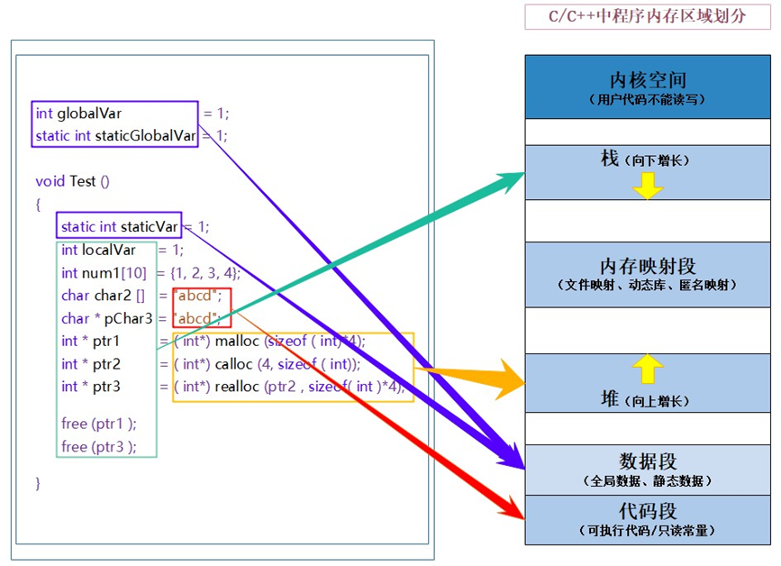
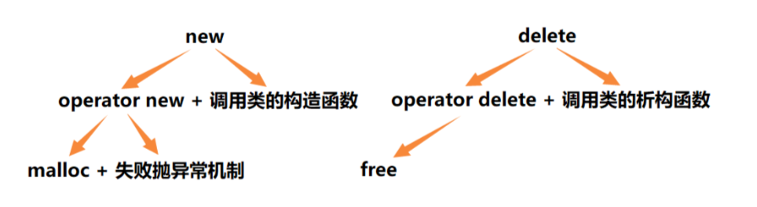

# C/C++内存分布

让我们先来看看下面这段代码

```cpp
int globalVar = 1;
static int staticGlobalVar = 1;
void Test() {
    static int staticVar = 1;
    int localVar = 1;
    int num1[10] = {1, 2, 3, 4};
    char char2[] = "abcd";
    char *pChar3 = "abcd";
    int *ptr1 = (int *) malloc(sizeof(int) * 4);
    int *ptr2 = (int *) calloc(4, sizeof(int));
    int *ptr3 = (int *) realloc(ptr2, sizeof(int) * 4);
    free(ptr1);
    free(ptr3);
}
```

以下是各个部分分别存储在内存中的哪一个区域




**说明：**

> **栈（Stack）**：栈是用于存储局部变量、函数参数和函数调用信息的内存区域。它的大小在编译时就确定，并且在程序运行期间动态地分配和释放。栈的分配和释放是由编译器自动管理的，遵循"先进后出"的原则。
>
> **堆（Heap）**：堆是用于动态分配内存的区域。在堆上分配的内存需要手动进行释放，否则可能导致内存泄漏。在C++中，我们可以使用new和delete关键字来进行堆内存的分配和释放。
>
> **全局区（Global Area）**：全局区用于存储全局变量和静态变量。全局变量是在程序启动时就被初始化的，而静态变量则具有静态生命周期，在整个程序执行期间都存在。
>
> **常量区（Constant Area）**：常量区存放常量数据，例如字符串常量和其他常量值。常量区的数据在程序运行期间是不可修改的。
>
> **代码区（Code Segment）**：代码区存放程序的机器指令，即程序的可执行代码。代码区通常是只读的，因为程序的指令在运行时是不可修改的。

这些内存区域在程序运行期间都有各自的作用和管理方式。具体的内存布局和分配方式可能会受到操作系统和编译器的影响，不同的操作系统和编译器可能有不同的内存布局和存储约定。

**顺便提一下**：为什么说栈是向下增长的，而堆是向上增长的？

**简单来说，在一般情况下，在栈区开辟空间，先开辟的空间地址较高，而在堆区开辟空间，先开辟的空间地址较低。**

**注意**：在堆区开辟空间，后开辟的空间地址不一定比先开辟的空间地址高。因为在堆区，后开辟的空间也有可能位于前面某一被释放的空间位置。


# C++动态内存管理方式

C语言内存管理方式在C++中可以继续使用，但有些地方就无能为力，而且使用起来比较麻烦，因此C++又提出了自己的内存管理方式：**通过new和delete操作符进行动态内存管理**。

## new/delete操作内置类型

**一、动态申请单个某类型的空间**

```cpp
//动态申请单个int类型的空间
int* p1 = new int; //申请

delete p1; //销毁
```

其作用等价于：

```cpp
//动态申请单个int类型的空间
int* p2 = (int*)malloc(sizeof(int)); //申请

free(p2); //销毁
```

**二、动态申请多个某类型的空间**

```cpp
//动态申请10个int类型的空间
int* p3 = new int[10]; //申请

delete[] p3; //销毁
```

其作用等价于：

```cpp
//动态申请10个int类型的空间
int* p4 = (int*)malloc(sizeof(int)* 10); //申请

free(p4); //销毁
```

**三、动态申请单个某类型的空间并初始化**

```cpp
//动态申请单个int类型的空间并初始化为10
int* p5 = new int(10); //申请 + 赋值

delete p5; //销毁
```

其作用等价于：

```cpp
//动态申请一个int类型的空间并初始化为10
int* p6 = (int*)malloc(sizeof(int)); //申请
*p6 = 10; //赋值

free(p6); //销毁
```

**四、动态申请多个某类型的空间并初始化**

```cpp
//动态申请10个int类型的空间并初始化为0到9
int* p7 = new int[10]{0, 1, 2, 3, 4, 5, 6, 7, 8, 9}; //申请 + 赋值

delete[] p7; //销毁
```

其作用等价于：

```cpp
//动态申请10个int类型的空间并初始化为0到9
int* p8 = (int*)malloc(sizeof(int)* 10); //申请
for (int i = 0; i < 10; i++) //赋值
{
	p8[i] = i;
}

free(p8); //销毁
```

**注意：申请和释放单个元素的空间，使用new和delete操作符，申请和释放连续的空间，使用 new[]和delete[]**，注意：匹配起来使用。

## new/delete操作自定义类型

**有以下类：**

```cpp
class A {
public:
    A(int a = 0)
        : _a(a) {
        cout << "A():" << this << endl;
    }
    ~A() {
        cout << "~A():" << this << endl;
    }

private:
    int _a;
};
```

**一、动态申请单个类**

```cpp
A *p1 = new A();//动态申请单个类
delete p1;

//等价于
A *p2 = (A *) malloc(sizeof(A));
free(p2);
```

**二、动态申请多个类**

```cpp
A *p5 = new A[10];//动态申请多个类
delete[] p5;

//等价于
A *p6 = (A *) malloc(sizeof(A) * 10);
free(p6);
```

**注意**：在申请自定义类型的空间时，**new会调用构造函数，delete会调用析构函数**，而malloc和free不会。

**总结一下：**

>1、C++中如果是申请内置类型的对象或是数组，用new/delete和malloc/free没有什么区别。
>
>2、如果是自定义类型，区别很大，new和delete分别是开空间+构造函数、析构函数+释放空间，而malloc和free仅仅是开空间和释放空间。
>
>3、建议在C++中无论是内置类型还是自定义类型的申请和释放，尽量都使用new和delete。


# operator new和operator delete函数

`new`和`delete`是用户进行动态内存申请和释放的操作符，`operator new` 和`operator delete`是系统提供的全局函数，`new`在底层调用`operator new`全局函数来申请空间，`delete`在底层通过 `operator delete`全局函数来释放空间。

```cpp
int* p1 = (int*)operator new(sizeof(int)* 10); //申请
operator delete(p1); //销毁

//等价于
int* p2 = (int*)malloc(sizeof(int)* 10); //申请
free(p2); //销毁
```

`operator new` 实际也是通过`malloc`来申请空间，如果`malloc`申请空间成功就直接返回，否则执行用户提供的空间不足应对措施，如果用户提供该措施就继续申请，否则就抛异常。`operator delete` 最终是通过`free`来释放空间的。



**注意**：虽然说`operator new`和`operator delete`是系统提供的全局函数，但是我们也可以针对某个类，重载其专属的`operator new`和operator delete函数，进而提高效率。


# new和delete的实现原理

## 内置类型

如果申请的是内置类型的空间，new/delete和malloc/free基本类似，不同的是，new/delete申请释放的是单个元素的空间，new[]/delete[ ]申请释放的是连续的空间，此外，malloc申请失败会返回NULL，而new申请失败会抛异常。

## 自定义类型

**new的原理**
 1、调用operator new函数申请空间。
 2、在申请的空间上执行构造函数，完成对象的构造。

**delete的原理**
 1、在空间上执行析构函数，完成对象中资源的清理工作。
 2、调用operator delete函数释放对象的空间。

**new T[N]的原理**
 1、调用operator new[ ]函数，在operator new[ ]函数中实际调用operator new函数完成N个对象空间的申请。
 2、在申请的空间上执行N次构造函数。

**delete[ ] 的原理**
 1、在空间上执行N次析构函数，完成N个对象中资源的清理。
 2、调用operator delete[ ]函数，在operator delete[ ]函数中实际调用operator delete函数完成N个对象空间的释放。


# 定位new表达式

定位new表达式是C++中的一种高级用法，允许你**在特定的内存位置上创建对象**，而不是在默认的堆内存上分配。这在某些特殊情况下很有用，例如在特定内存区域上实现内存池或在共享内存上创建对象等。

**示例：**

```cpp
#include <iostream>

class MyClass {
public:
    MyClass(int value) : data(value) {
        std::cout << "构造函数: " << data << std::endl;
    }

    ~MyClass() {
        std::cout << "析构函数：" << data << std::endl;
    }

private:
    int data;
};

int main() {
    // 分配一块内存
    void *memory = operator new(sizeof(MyClass));

    // 在预分配的内存上使用定位new表达式创建对象
    MyClass *obj = new (memory) MyClass(38);

    // 手动调用析构函数
    obj->~MyClass();

    // 释放预分配的内存
    operator delete(memory);

    return 0;
}
```

**注意**：在未使用定位new表达式进行显示调用构造函数进行初始化之前，operator new申请的空间还不能算是一个对象，它只不过是与A对象大小相同的一块空间，因为构造函数还没有执行。


# 常见问题

## malloc/free和new/delete的区别？

malloc/free和new/delete的共同点是：都是从堆上申请空间，并且需要用户手动释放。

不同的地方是：

> 1、malloc和free是函数，new和delete是操作符 
>
> 2、malloc申请的空间不会初始化，new可以初始化 
>
> 3、malloc申请空间时，需要手动计算空间大小并传递，new只需在其后跟上空间的类型即可， 如果是多个对象，[]中指定对象个数即可
>
> 4、malloc的返回值为void*, 在使用时必须强转，new不需要，因为new后跟的是空间的类型
>
> 5、malloc申请空间失败时，返回的是NULL，因此使用时必须判空，new不需要，但是new需要捕获异常 
>
> 6、申请自定义类型对象时，malloc/free只会开辟空间，不会调用构造函数与析构函数，而new在申请空间后会调用构造函数完成对象的初始化，delete在释放空间前会调用析构函数完成 空间中资源的清理

## 什么是内存泄漏，内存泄漏的危害?

**什么是内存泄漏：** 内存泄漏指因为疏忽或错误造成程序未能释放已经不再使用的内存的情况。内存泄漏并不是指内存在物理上的消失，而是应用程序分配某段内存后，因为设计错误，失去了对该段内存的控制，因而造成了内存的浪费。 

**内存泄漏的危害：** 长期运行的程序出现内存泄漏，影响很大，如操作系统、后台服务等等，出现内存泄漏会导致响应越来越慢，最终卡死。

```cpp
void MemoryLeaks() {
    // 1.内存申请了忘记释放
    int *p1 = (int *) malloc(sizeof(int));
    int *p2 = new int;

    // 2.异常安全问题
    int *p3 = new int[10];

    Func();// 这里Func函数抛异常导致 delete[] p3未执行，p3没被释放.

    delete[] p3;
}
```

### 内存泄漏分类

C/C++程序中一般我们关心两种方面的内存泄漏：

- **堆内存泄漏(Heap leak)** 

堆内存指的是程序执行中依据须要分配通过`malloc/calloc/realloc/new`等从堆中分配的一块内存，用完后必须通过调用相应的`free`或者`delete`删掉。假设程序的设计错误导致这部分内存没有被释放，那么以后这部分空间将无法再被使用，就会产生**Heap Leak**。 

- **系统资源泄漏** 

指程序使用系统分配的资源，比如套接字、文件描述符、管道等没有使用对应的函数释放掉，导致系统资源的浪费，严重可导致系统效能减少，系统执行不稳定。

### 如何避免内存泄漏？

> 1、工程前期良好的设计规范，养成良好的编码规范，申请的内存空间记住匹配的去释放。
> 2、采用RAII思想或者智能指针来管理资源。
> 3、有些公司内部规范使用内部实现的私有内存管理库，该库自带内存泄漏检测的功能选项。 
> 4、出问题了使用内存泄漏工具检测。
