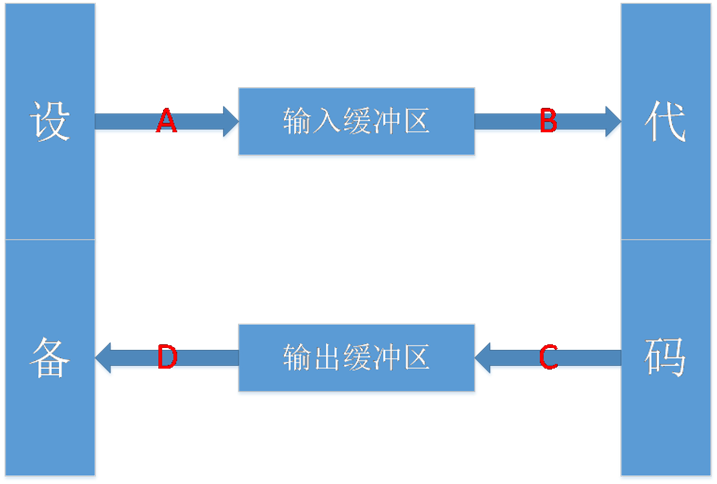
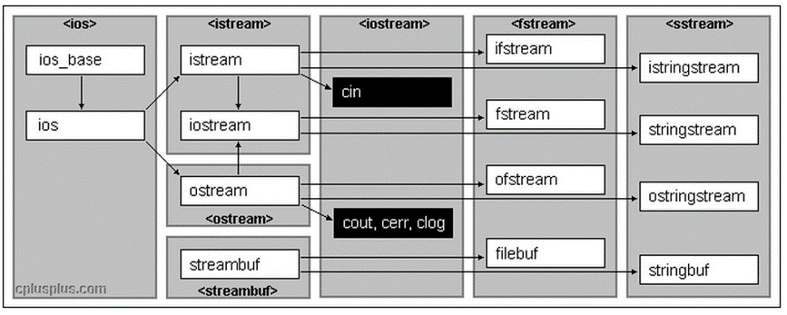

# C语言的输入与输出

在C语言当中，我们使用最频繁的输入输出方式就是scanf与printf：

- **scanf：** 从标准输入设备（键盘）读取数据，并将读取到的值存放到某一指定变量当中。
- **printf：** 将指定的数据输出到标准输出设备（屏幕），使用时需要注意宽度输出和精度输出的控制。

C语言借助了相应的缓冲区来进行输入与输出。如下图所示：




对输入输出缓冲区的理解：

1. **可以屏蔽掉低级I/O的实现**。 低级I/O的实现依赖操作系统本身内核的实现，所以如果能够屏蔽这部分的差异，可以很容易写出可移植的程序。
2. **可以使用这部分的内容实现“行”读取的行为**。 对于计算机而言是没有“行”这个概念的，有了这部分，就可以定义“行”的概念，然后解析缓冲区的内容，返回一个“行”。

·

# 流是什么

“流”即是流动的意思，是物质从一处向另一处流动的过程，是对一种有序连续且有方向性的数据的抽象描述。

C++流是指信息从外部输入设备（如键盘）向计算机内部（如内存）输入和从计算机内部向外部输出设备（如显示器）输出的过程。这种输入输出的过程被形象的比喻为“流”。

它的**特性**是：**有序连续、具有方向性**

**为了实现这种流动，C++定义了I/O标准类库，这些每个类都称为流/流类，用以完成某方面的功能**


# C++IO流

C++系统实现了一个庞大的类库，其中ios为基类，其他类都是直接或间接派生自ios类




## C++标准IO流

C++标准库提供了4个全局流对象（cin、cout、cerr、clog）：

- 使用cout进行标准输出，即数据从内存流向控制台（显示器）。
- 使用cin进行标准输入，即数据通过键盘输入到程序中。
- 使用cerr进行标准错误的输出。
- 使用clog进行日志的输出。

从上图可以看出，cout、cerr、clog都是由ostream类实例化出的三个不同的对象，因此这三个对象基本没什么区别，只是应用场景不同。

> 在使用时候必须要包含#include<iostream>文件并引入std标准命名空间。

**注意**：

1、cin为缓冲流。 **键盘输入的数据保存在缓冲区中，当要提取时，是从缓冲区中拿。** 如果一次输入过多，会留在那儿慢慢用，**如果输入错了，必须在回车之前修改，如果回车键按下就无法挽回了。只有把输入缓冲区中的数据取完后，才要求输入新的数据。**

2、**输入的数据类型必须与要提取的数据类型一致，否则出错**。出错只是在流的状态字state中对应位置位（置1），程序继续。

3、空格和回车都可以作为数据之间的分格符，所以多个数据可以在一行输入，也可以分行输入。但如果是**字符型和字符串，则空格（ASCII码为32）无法用cin输入**，字符串中也不能有空格。回车符也无法读入。

```cpp
#include <iostream>
#include <string>
using namespace std;
int main(){
	string s;
	cin >> s;          //输入："hello world"
	cout << s << endl; //输出："hello"
	return 0;
}
```

对于含有空格的字符串，我们需要使用getline函数进行读取，因为getline函数只有遇到’\n’才会停止读取。

```cpp
#include <iostream>
#include <string>
using namespace std;
int main(){
	string s;
	getline(cin, s);   //输入："hello world"
	cout << s << endl; //输出："hello world"
	return 0;
}
```

4、**cin和cout可以直接输入和输出内置类型数据**，原因：标准库已经将所有内置类型的输入和输出全部重载了

5、对于自定义类型，如果要支持cin和cout的标准输入输出，需要对<<和>>进行重载。

6、循环输入和输出

```cpp
// 单个元素循环输入
while (cin >> a) {
    // ...
}
// 多个元素循环输入
while (c >> a >> b >> c) {
    // ...
}
// 整行接收
while (cin >> str) {
    // ...
}
```

7、istream类型对象转换为逻辑条件判断值

```cpp
istream& operator>> (int& val);
explicit operator bool() const;
```

实际上我们看到使用while(cin>>i)去流中提取对象数据时，调用的operator>>，返回值是 istream类型的对象，那么这里可以做逻辑条件值，源自于istream的对象又调用了operator  bool，operator bool调用时如果接收流失败，或者有结束标志，则返回false。


## C++文件IO流

C++标准库中的`<fstream>`头文件提供了用于文件输入和输出的类和接口。这些类通常与文件流对象一起使用，允许你打开、读取、写入和关闭文件。以下是一些常用的`<fstream>`接口和类的介绍：

1、**`ifstream`（输入文件流）**：`ifstream`类用于从文件中读取数据。

**常用成员函数**：

- `open(const char* filename, ios_base::openmode mode = ios_base::in)`：打开指定文件以供读取。`mode`参数指定了文件的打开模式，例如 `ios::in` 表示只读模式。
- `close()`：关闭打开的文件。
- `is_open()`：检查文件是否已经成功打开。
- `get()`：从文件中读取一个字符。
- `getline(char* buffer, streamsize count, char delim)`：从文件中读取一行文本，直到遇到指定的分隔符或达到指定的字符数。
- `operator>>`：用于从文件中读取各种数据类型，例如 `int`、`double`等。

2、**`ofstream`（输出文件流）**：`ofstream`类用于向文件中写入数据。

**常用成员函数**：

- `open(const char* filename, ios_base::openmode mode = ios_base::out)`：打开指定文件以供写入。`mode`参数指定了文件的打开模式，例如 `ios::out` 表示只写模式。
- `close()`：关闭打开的文件。
- `is_open()`：检查文件是否已经成功打开。
- `put(char c)`：将字符写入文件。
- `write(const char* buffer, streamsize count)`：将指定数量的字节写入文件。
- `operator<<`：用于将各种数据类型写入文件，例如 `int`、`double`等。

3、**`fstream`（文件流）**：

- `fstream`类可用于既可以读取又可以写入文件的情况。
- 它继承了`ifstream`和`ofstream`的所有成员函数，因此可以用于打开、读取和写入文件。

以下是一些常见的文件打开模式：

1. **ios::in**：打开文件以供读取。可以使用`ifstream`类或`fstream`类来读取文件内容。
2. **ios::out**：打开文件以供写入。可以使用`ofstream`类或`fstream`类来写入文件内容。如果文件不存在，则会创建一个新文件；如果文件已存在，则会截断（清空）文件内容。
3. **ios::app**：打开文件以供追加写入。新数据将被添加到文件的末尾，而不会截断文件内容。如果文件不存在，则会创建一个新文件。
4. **ios::binary**：以二进制模式打开文件。这个模式用于处理二进制文件，如图像、音频或其他非文本文件。在二进制模式下，不会执行文本的自动换行和转换。
5. **ios::ate**：打开文件后，将文件指针移到文件的末尾。这可以让你立即开始读取或写入文件的末尾部分。
6. **ios::trunc**：如果文件已存在，在打开文件时会截断（清空）文件内容。通常与`ios::out`一起使用，以确保文件被清空后写入新数据。

这些打开模式可以组合使用，通过按位或运算符`|`来实现。例如，要以二进制追加写入的方式打开文件，可以使用`ios::binary | ios::app`。

**代码示例**：

```cpp
#include <iostream>
#include <fstream>
using namespace std;

int main() {
    // 打开一个文本文件以供读取
    ifstream inputFile("input.txt", ios::in);

    // 打开一个二进制文件以供写入，如果不存在则创建
    ofstream binaryFile("output.bin", ios::out | ios::binary);

    // 打开一个文本文件以供追加写入
    ofstream appendFile("log.txt", ios::out | ios::app);

    if (inputFile.is_open() && binaryFile.is_open() && appendFile.is_open()) {
        // 文件已成功打开，可以进行读取和写入操作
        // ...

        // 关闭文件
        inputFile.close();
        binaryFile.close();
        appendFile.close();
    } else {
        cout << "无法打开文件" << endl;
    }

    return 0;
}
```

### 控制文件指针位置

`tellg`和`seekg`是C++中用于在文件流对象中控制文件指针位置的函数，通常与`ifstream`和`fstream`一起使用，用于读取文件的特定位置或获取当前文件指针的位置。

1、**`tellg`函数**：

`tellg`函数用于获取当前文件指针的位置（读取位置）。它返回一个类型为`streampos`的值，表示当前文件指针的位置。`streampos`通常是一个整数类型，用于表示文件的字节偏移量。

**用法示例**：

```cpp
ifstream inputFile("example.txt", ios::in);

if (inputFile.is_open()) {
    // 获取当前文件指针的位置
    streampos currentPosition = inputFile.tellg();
    cout << "当前文件指针位置：" << currentPosition << endl;

    // 读取文件内容
    // ...

    // 获取新的文件指针位置
    currentPosition = inputFile.tellg();
    cout << "新的文件指针位置：" << currentPosition << endl;
}
```

2、**`seekg`函数**：

`seekg`函数用于设置文件指针的位置，以便在文件中进行定位。它允许你将文件指针移动到文件的特定位置，以便读取或写入数据。`seekg`接受两个参数，第一个参数是偏移量，第二个参数是基准位置，用于确定偏移量是相对于文件的开头、当前位置还是文件的末尾。

基准位置可以是以下之一：

- `ios::beg`：基于文件的开头。
- `ios::cur`：基于当前文件指针位置。
- `ios::end`：基于文件的末尾，第一个参数（偏移量）表示从文件末尾开始向前移动的字节数。

**用法示例**：

```cpp
ifstream inputFile("example.txt", ios::in);

if (inputFile.is_open()) {
    // 将文件指针移动到文件的第10个字节（相对于文件开头）
    inputFile.seekg(10, ios::beg);

    // 读取从第10个字节开始的内容，读取字符串，直到遇到空格和回车。
    string data;
    inputFile >> data; 
    cout << "从第10个字节开始的内容：" << data << endl;

    // 将文件指针移动到文件末尾
    inputFile.seekg(0, ios::end);

    // 获取文件末尾的位置
    streampos endPosition = inputFile.tellg();
    cout << "文件末尾位置：" << endPosition << endl;
}
```

### 文件操作示例

#### 以二进制的形式操作文件

以二进制的形式对文件进行写入操作：

```cpp
//以二进制的形式对文件进行写入
void WriteBinary(){
	ofstream ofile; //定义文件流对象
	ofile.open("test.bin", ofstream::out | ofstream::binary); //以二进制写入的方式打开test.bin文件
	char data[] = "Hello World";
	ofile.write(data, strlen(data)); //将data字符串写入文件
	ofile.put('!'); //将字符'!'写入文件
	ofile.close(); //关闭文件
}
```

以二进制的形式对文件进行读取操作：

```cpp
//以二进制的形式对文件进行读取
void ReadBinary(){
	ifstream ifile; //定义文件流对象
	ifile.open("test.bin", ofstream::in | ofstream::binary); //以二进制读取的方式打开test.bin文件
	ifile.seekg(0, ifile.end); //跳转到文件末尾
	int length = ifile.tellg(); //获取当前字符在文件当中的位置，即文件的字符总数
	ifile.seekg(0, ifile.beg); //重新回到文件开头
	char data[100];
	ifile.read(data, length); //将文件当中的数据全部读取到字符串data当中
	ifile.close(); //关闭文件
}
```

#### 以文本的形式操作文件

以文本的形式对文件进行写入操作：

```cpp
//以文本的形式对文件进行写入
void WriteTxt(){
	ofstream ofile; //定义文件流对象
	ofile.open("test.txt"); //以写入的方式打开test.txt文件
	char data[] = "Hello World";
	ofile.write(data, strlen(data)); //将data字符串写入文件
	ofile.put('!'); //将字符'!'写入文件
	ofile.close(); //关闭文件
}
```

以文本的形式对文件进行读取操作：

```cpp
//以文本的形式对文件进行读取
void ReadTxt(){
	ifstream ifile; //定义文件流对象
	ifile.open("test.txt"); //以读取的方式打开test.txt文件
	ifile.seekg(0, ifile.end); //跳转到文件末尾
	int length = ifile.tellg(); //获取当前字符在文件当中的位置，即文件的字符总数
	ifile.seekg(0, ifile.beg); //重新回到文件开头
	char data[100];
	ifile.read(data, length); //将文件当中的数据全部读取到字符串data当中
	cout << length << endl;
	cout << data << endl;
	ifile.close(); //关闭文件
}
```

**注意：** 使用ofstream类对象的open函数时，若不指定打开方式，则默认以写的方式打开文件；使用ifstream类对象的open函数时，若不指定打开方式，则默认以读的方式打开文件；使用fstream类对象的open函数时，若不指定打开方式，则默认以写+读的方式打开文件。

#### 使用>>和<<对文件进行操作

使用>>和<<运算符对文件进行读写操作，会变得很简单，也很形象。
对文件进行写入操作：

```cpp
//对文件进行写入操作
void WriteFile(){
	ofstream ofs("data.txt"); //定义文件流对象，并打开文件
	ofs << "Hello World"; //字符串“流入”文件
	ofs.close(); //关闭文件
}
```

对文件进行读取操作：

```cpp
//对文件进行读取操作
void ReadFile(){
	ifstream ifs("data.txt"); //定义文件流对象，并打开文件
	char data[100];
	ifs >> data; //文件数据“流入”字符串data
	ifs.close(); //关闭文件
}
```


## stringstream流

在C语言中，我们若是想要将一个整型变量的数据转化为字符串格式，有以下两种方法：
1、使用itoa函数进行转化。

```cpp
int a = 10;
char arr[10];
itoa(a, arr, 10); //将整型的a转化为十进制字符数字存储在字符串arr当中
```

2、使用sprintf函数进行转化。

```cpp
int a = 10;
char arr[10];
sprintf(arr, "%d", a); //将整型的a转化为字符串格式存储在字符串arr当中
```

虽然itoa函数和sprintf函数都能完成转化，但是在两个函数在转化时，都需要先给出保存结果的空间，而空间的大小是不太好界定的，除此之外，转化格式不匹配时，可能还会得到错误的结果甚至程序崩溃。

在C++中，我们可以使用stringstream类对象来避开此问题。在程序当中如果想要使用stringstream，必须要包含头文件sstream。在该头文件下，有三个类：

| 类            | 对应操作场景      |
| ------------- | ----------------- |
| ostringstream | 输出操作          |
| istringstream | 输入操作          |
| stringstream  | 输入操作+输出操作 |

以下是`stringstream`的一些常用接口：

1、**`stringstream` 的构造函数**：

`stringstream()`：创建一个空的字符串流。

`stringstream(std::string str)`：使用给定的字符串 `str` 初始化字符串流。

2、**插入数据到字符串流**：

`<<` 操作符：插入数据到字符串流中。你可以使用它来插入各种数据类型，如整数、浮点数、字符串等。

```cpp
std::stringstream ss;
int num = 42;
ss << "The answer is: " << num;
```

3、**从字符串流中提取数据**：

`>>` 操作符：从字符串流中提取数据。你可以使用它来提取数据到不同的数据类型。

```cpp
int extractedNum;
ss >> extractedNum;
```

4、**获取字符串流中的字符串**：

`str()` 函数：获取字符串流中的全部内容作为一个字符串。

```cpp
std::string content = ss.str();
```

5、**清空字符串流**：

`clear()` 函数：清空字符串流的状态和内容。

```cpp
ss.clear();
```

6、**指定基数（进制）**：

`std::hex`、`std::oct`、`std::dec`：可以使用这些流控制器来指定插入或提取整数时的进制，如十六进制、八进制或十进制。

```cpp
int num = 255;
ss << std::hex << num; // 将 num 以十六进制插入
```

7、**获取当前位置**：

`tellg()` 函数：获取当前的读取位置。

```cpp
std::streampos pos = ss.tellg();
```

8、**设置读取位置**：

`seekg(std::streampos pos)`：将读取位置设置为指定的位置。

```cpp
ss.seekg(0); // 设置读取位置为开头
```

### stringstream流操作示例

1、将数值类型数据格式化为字符串。

```cpp
#include <iostream>
#include <sstream>
#include <string>
using namespace std;

int main(){
	int a = 10;
	string sa;
	stringstream s;
	s << a; //将int类型的a放入输入流
	s >> sa; //从s中抽取前面插入的int类型的值，赋值给string类型（方式一）
	cout << sa << endl;  //10
	s.str(""); //将stringstream底层管理的string对象设置为""。
	s.clear(); //将上次转换状态清空掉
	
    //进行下一次转换
	double b = 3.14;
	s << b;
	sa = s.str(); //获取stringstream中管理的string类型（方式二）
	cout << sa << endl;   //3.14
	
    return 0;
}
```

2、字符串拼接。

```cpp
#include <iostream>
#include <sstream>
#include <string>
using namespace std;

int main(){
	string rets;
	stringstream s;
	s << "Hello" << "World"; //将多个字符串放入stringstream中
	s >> rets; //方式一获取
	cout << rets << endl;
	s.str(""); //将stringstream底层管理的string对象设置为空字符串
	s.clear(); //将上次转换状态清空掉
    
	s << "Thanks" << " " << "for" << " " << "reading"; //将多个字符串放入stringstream中
	rets = s.str(); //方式二获取
	cout << rets << endl;
	
    return 0;
}
```

**注意事项：**

> **1、stringstream实际是在底层维护了一个string类型的对象用来保存结果。**
>
> **2、stringstream在转换结尾时（即最后一个转换后），会将其内部状态设置为badbit，因此在下一次转换前必须调用clear将状态重置为goodbit才可以转换，但clear不会将stringstream底层的string对象清空。**
>
> **3、可以使用s.str("")的方式将stringstream底层的string对象设置为空字符串，否则多次转换时，会将结果全部累积在底层string对象中。**
>
> **4、获取stringstream转换后的结果有两个方法，一是使用>>运算符之间从流当中提取，二是使用s.str( )获取stringstream底层的string对象。**
>
> **5、stringstream使用string类对象代替字符数组，可以避免缓冲区溢出的危险，而且其会对参数类型进行推演，不需要格式化控制，也不会存在格式化失败的风险，因此使用更方便，更安全。**
