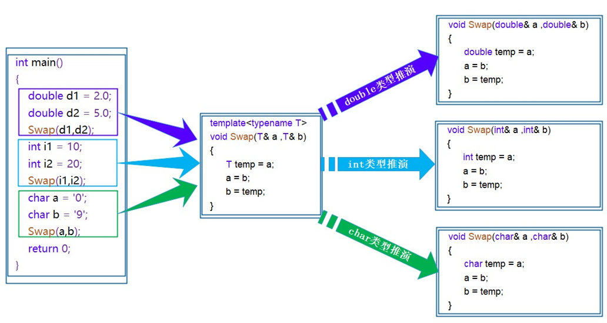
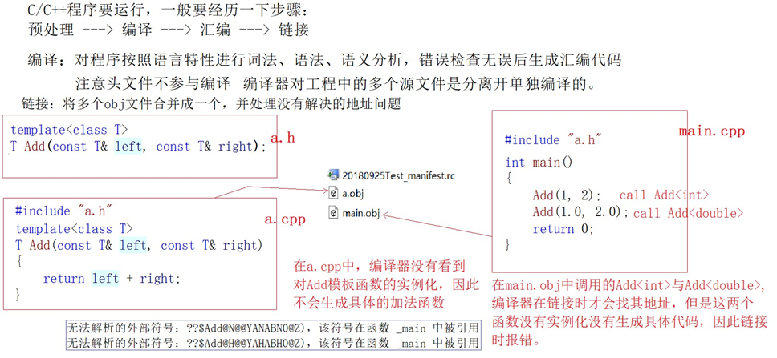


# 泛型

如何实现一个通用的交换函数呢？可以使用函数重载

```cpp
void Swap(int &left, int &right) {
    int temp = left;
    left = right;
    right = temp;
}

void Swap(double &left, double &right) {
    double temp = left;
    left = right;
    right = temp;
}

void Swap(char &left, char &right) {
    char temp = left;
    left = right;
    right = temp;
}
```

使用函数重载虽然可以实现，但是有一下几个不好的地方：

1. 重载的函数仅仅是类型不同，代码复用率比较低，只要有新类型出现时，就需要用户自己增加对应的函数 
2. 代码的可维护性比较低，一个出错可能所有的重载均出错。

**使用模板可以让编译器根据不同的类型利用该模子来生成代码呢？**

**泛型编程**：编写与类型无关的通用代码，是代码复用的一种手段。**模板**是泛型编程的基础。

模板又分为**函数模板**和**类模板**


# 函数模板

**函数模板**代表了一个函数家族，该函数模板与类型无关，在使用时被参数化，根据实参类型产生函数的特定类型版本。它允许编写通用的函数，可以适用于不同的数据类型，从而提高代码的重用性和灵活性。

函数模板的语法如下：

```cpp
template <typename T1，typename T2,......,typename Tn>
返回类型 函数名(参数列表) {
    // 函数体
}
//typename关键字使用class也可以
```

`template <typename T>` 声明了一个模板，其中 `T` 是一个类型参数，表示函数可以适用于不同的数据类型。也可以使用 `class` 关键字代替 `typename`，两者在这里的意义是相同的。但是不能使用`struct`！

下面是一个简单的函数模板示例，用于交换两个值：

```cpp
template <typename T>
void swapValues(T &a, T &b) {
    T temp = a;
    a = b;
    b = temp;
}

int main() {
    int x = 5, y = 10;
    swapValues(x, y); // 交换整数

    double a = 2.5, b = 3.7;
    swapValues(a, b); // 交换双精度浮点数

    return 0;
}
```

`swapValues` 函数模板被实例化两次：一次用于整数交换，另一次用于双精度浮点数交换。编译器会根据传入的参数类型自动生成对应的函数。

## 函数模板的原理

函数模板是一个蓝图，它本身并不是函数，是编译器用使用方式产生特定具体类型函数的模具。所以其实模板就是将本来应该我们做的重复的事情交给了编译器。



**在编译器编译阶段**，对于模板函数的使用，**编译器需要根据传入的实参类型来推演生成对应类型的函数**以供调用。比如：**当用double类型使用函数模板时，编译器通过对实参类型的推演，将T确定为double类型，然后产生一份专门处理double类型的代码**，对于字符类型也是如此。

## 函数模板的实例化

用不同类型的参数使用函数模板时，称为函数模板的实例化。模板参数实例化分为：**隐式实例化**和**显式实例化**。

**一、隐式实例化：让编译器根据实参推演模板参数的实际类型**

```cpp
template<class T>
T Add(const T &left, const T &right) {
    return left + right;
}

int main() {
    int a1 = 10, a2 = 20;
    double d1 = 10.0, d2 = 20.0;
    Add(a1, a2);
    Add(d1, d2);
}
```

```cpp
Add(a1, d1);
```

**注意**：该语句不能通过编译，因为在编译期间，当编译器看到该实例化时，需要推演其实参类型通过实参a1将T推演为int，通过实参d1将T推演为double类型，但模板参数列表中只有一个T， 编译器无法确定此处到底该将T确定为int或者double类型而报错。

注意：在模板中，编译器一般不会进行类型转换操作，因为一旦转化出问题，编译器就需要背黑锅。

此时有两种处理方式：

1. 用户自己来强制转化 
2. 使用显式实例化

```cpp
Add(a, (int)d);   //强制转换
```

**二、显式实例化：在函数名后的<>中指定模板参数的实际类型**

```cpp
T Add(const T &x, const T &y) {
    return x + y;
}

int main() {
    int a = 10;
    double b = 1.1;
    int c = Add<int>(a, b);//指定模板参数的实际类型为int
    return 0;
}
```

**注意**：使用显示实例化时，如果传入的参数类型与模板参数类型不匹配，编译器会尝试进行隐式类型转换，如果无法转换成功，则编译器将会报错。

## 模板参数的匹配原则

**一、 一个非模板函数可以和一个同名的函数模板同时存在，而且该函数模板还可以被实例化为这个非模板函数**

```cpp
// 专门处理int的加法函数
int Add(int left, int right) {
    return left + right;
}

// 通用加法函数
template<class T>
T Add(T left, T right) {
    return left + right;
}

int main() {
    Add(1, 2);     // 与非模板函数匹配，编译器不需要特化
    Add<int>(1, 2);// 调用模板函数
    
    return 0;
}
```

**二、 对于非模板函数和同名函数模板，如果其他条件都相同，在调动时会优先调用非模板函数而不会从该模板产生出一个实例。如果模板可以产生一个具有更好匹配的函数， 那么将选择模板**

```cpp
//专门用于int类型加法的非模板函数
int Add(const int &x, const int &y) {
    return x + y;
}

//通用类型加法的函数模板，可接受两个模板参数
template<typename T1, typename T2>
T1 Add(const T1 &x, const T2 &y) {
    return x + y;
}

int main() {
    int a = Add(10, 20);//与非模板函数完全匹配，不需要函数模板实例化
    int b = Add(2.2, 2);//函数模板可以生成更加匹配的版本，编译器会根据实参生成更加匹配的Add函数
    return 0;
}
```

**三、模板函数不允许自动类型转换，但普通函数可以进行自动类型转换**

```cpp
template<typename T>   //一个模板参数不可以
//template<typename T1, typename T2>   //两个模板参数就可以接受两个不同的类型了
T Add(const T &x, const T &y) {
    return x + y;
}

int main() {
    int a = Add(2, 2.2);//err 模板函数不允许自动类型转换，不能通过编译
    return 0;
}
```


# 类模板

类模板允许创建通用的类定义，可以适用于不同的数据类型。类模板类似于函数模板，但用于创建可以处理不同类型的类。

类模板的语法如下：

```cpp
template <typename T>
class ClassName {
    // 类成员和方法的定义
};
```

`template <typename T>` 声明了一个模板，其中 `T` 是一个类型参数，表示类可以适用于不同的数据类型。

下面是一个简单的类模板，实现一个通用的Vector类(动态顺序表)：

```cpp
template<class T>
class Vector {
public:
    Vector(size_t capacity = 10)
        : _pData(new T[capacity]), _size(0), _capacity(capacity) {}

    // 使用析构函数演示：在类中声明，在类外定义。
    ~Vector();

    void PushBack(const T &data);
    void PopBack();
    // ...

    size_t Size() { return _size; }

    T &operator[](size_t pos) {
        assert(pos < _size);
        return _pData[pos];
    }

private:
    T *_pData;
    size_t _size;
    size_t _capacity;
};

// 注意：类模板中函数放在类外进行定义时，需要加模板参数列表
template<class T>
Vector<T>::~Vector() {
    if (_pData)
        delete[] _pData;
    _size = _capacity = 0;
}
```

**注意**： 类模板中函数放在类外进行定义时，需要加模板参数列表。

除此之外，**类模板不支持分离编译**，即声明在xxx.h文件中，而定义却在xxx.cpp文件中。

## 类模板的实例化

类模板实例化与函数模板实例化不同，**类模板实例化需要在类模板名字后跟<>，然后将实例化的类型放在<> 中即可，类模板名字不是真正的类，而实例化的结果才是真正的类。**

```cpp
// Vector类名，Vector<int>才是类型
Vector<int> s1;
Vector<double> s2;
```

**类模板也可以有多个类型参数**，并且可以在类的成员函数和成员变量中使用这些参数，以实现更加通用的数据结构和算法。


# 非类型模板参数

模板参数分类类型形参与非类型形参。 

**类型形参**：出现在模板参数列表中，跟在class或者typename之类的参数类型名称。 

**非类型形参**：就是用一个常量作为类(函数)模板的一个参数，在类(函数)模板中可将该参数当成常量来使用。

> 非类型模板参数可以是整数类型、枚举类型或指向对象的指针类型，指针或引用类型。然而，指针和引用作为非类型模板参数是有限制的，因为它们必须满足一些特定的要求。

**整数类型：**

```cpp
template<typename T, int Size>
class Array {
public:
    T elements[Size];

    // 构造函数
    Array() {
        for (int i = 0; i < Size; ++i) {
            elements[i] = T();// 初始化元素
        }
    }
};

int main() {
    Array<int, 5> intArray;       // 创建一个包含5个int类型元素的数组
    Array<double, 10> doubleArray;// 创建一个包含10个double类型元素的数组

    return 0;
}
```

**枚举类型：**

```cpp
#include <iostream>
enum class Color {
    Red,
    Green,
    Blue
};

template<Color C>
class ColorPrinter {
public:
    void print() {
        switch (C) {
            case Color::Red:
                std::cout << "Red";
                break;
            case Color::Green:
                std::cout << "Green";
                break;
            case Color::Blue:
                std::cout << "Blue";
                break;
        }
    }
};

int main() {
    ColorPrinter<Color::Green> printer;
    printer.print();// 输出: Green
    return 0;
}
```

**指向对象的指针类型**：

```cpp
#include<iostream>
class MyClass {
public:
    int value;
};

template <int MyClass::* Ptr>
class MemberPointerContainer {
public:
    int getValue(MyClass& obj) {
        return obj.*Ptr;
    }
};

int main() {
    MemberPointerContainer<&MyClass::value> container;
    MyClass obj;
    obj.value = 123;
    std::cout << container.getValue(obj); // 输出: 123
    
    return 0;
}
```

**指针：**

非类型模板参数要求在编译时就能够获得其值，而指针和引用在编译时并没有确定的值，因为它们指向运行时的内存位置。然而，如果你使用一个指向静态存储期对象的指针或引用，它在编译时就有确定的值，因此可以作为非类型模板参数。

```cpp
#include <iostream>

// 静态存储期的整数
static int static_value = 42;

template <int* Ptr>
void print_static_value() {
    std::cout << "Static value: " << *Ptr << std::endl;
}

int main() {
    // 使用静态存储期整数的地址作为非类型模板参数
    print_static_value<&static_value>();
    return 0;
}
```

在这个例子中，`static_value` 是一个静态存储期的整数，它的地址可以在编译时确定。我们将这个地址传递给了 `print_static_value` 模板函数作为非类型模板参数。

**注意：** 

1. 浮点数、类对象以及字符串是不允许作为非类型模板参数的。 
1. 非类型的模板参数必须在编译期就能确认结果。


# 模板的特化

**模板特化**允许为特定类型或特定模板参数的组合提供定制的实现。通过模板特化，可以在需要时针对特定情况提供更具体的逻辑。

通常情况下，使用模板可以实现一些与类型无关的代码，但对于一些特殊类型的可能会得到一些错误的结果，需要特殊处理，比如：实现了一个专门用来进行小于比较的函数模板

```cpp
template<class T>
bool Less(T left, T right) {
    return left < right;
}

int main() {
    cout << Less(1, 2) << endl;// 可以比较，结果正确
    Date d1(2022, 7, 7);
    Date d2(2022, 7, 8);
    cout << Less(d1, d2) << endl;// 可以比较，结果正确
    Date *p1 = &d1;
    Date *p2 = &d2;
    cout << Less(p1, p2) << endl;// 可以比较，结果错误
    return 0;
}
```

可以看到，Less绝对多数情况下都可以正常比较，但是在特殊场景下就得到错误的结果。上述示例中，p1指向的d1显然小于p2指向的d2对象，但是Less内部并没有比较p1和p2指向的对象内容，而比较的是p1和p2指针的地址，这就无法达到预期而错误。 

此时，就需要对模板进行特化。即：在原模板类的基础上，针对特殊类型所进行特殊化的实现方式。模板特化中分为**函数模板特化**与**类模板特化**

## 函数模板特化

**函数模板的特化步骤：** 

> 1. 必须要先有一个基础的函数模板 
> 2. 关键字template后面接一对空的尖括号<> 
> 3. 函数名后跟一对尖括号，尖括号中指定需要特化的类型 
> 4. 函数形参表: 必须要和模板函数的基础参数类型完全相同，如果不同编译器可能会报一些奇怪的错误。

```cpp
#include <iostream>
using namespace std;
// 函数模板 -- 参数匹配
template<class T>
bool Less(T left, T right) {
    return left < right;
}

// 对Less函数模板进行特化
template<>
bool Less<Date *>(Date *left, Date *right) {
    return *left < *right;
}

int main() {
    cout << Less(1, 2) << endl;
    Date d1(2022, 7, 7);
    Date d2(2022, 7, 8);
    cout << Less(d1, d2) << endl;
    Date *p1 = &d1;
    Date *p2 = &d2;
    cout << Less(p1, p2) << endl;// 调用特化之后的版本，而不走模板生成了
    return 0;
}
```

注意：一般情况下如果函数模板遇到不能处理或者处理有误的类型，为了实现简单通常都是将该函数直接给出。

```cpp
bool Less(Date *left, Date *right) {
    return *left < *right;
}
```

该种实现简单明了，代码的可读性高，容易书写，因为对于一些参数类型复杂的函数模板，特化时特别给出，因此函数模板不建议特化。

## 类模板特化

### 全特化

全特化：将模板参数列表中所有的参数都确定化。

```cpp
template<class T1, class T2>
class Data {
public:
    Data() { cout << "Data<T1, T2>" << endl; }

private:
    T1 _d1;
    T2 _d2;
};

//全特化
template<>
class Data<int, char> {
public:
    Data() { cout << "Data<int, char>" << endl; }

private:
    int _d1;
    char _d2;
};

void Test() {
    Data<int, int> d1;
    Data<int, char> d2;
}
```

### 偏特化

偏特化：任何针对模版参数进一步进行条件限制设计的特化版本。

偏特化有以下两种表现方式：

- **部分特化**

将模板参数类表中的一部分参数特化。

```cpp
template<class T1, class T2>
class Data {
public:
    Data() { cout << "Data<T1, T2>" << endl; }

private:
    T1 _d1;
    T2 _d2;
};

// 将第二个参数特化为int
template<class T1>
class Data<T1, int> {
public:
    Data() { cout << "Data<T1, int>" << endl; }

private:
    T1 _d1;
    int _d2;
};
```

- **参数更进一步的限制**

偏特化并不仅仅是指特化部分参数，而是针对模板参数更进一步的条件限制所设计出来的一个特化版本。

```cpp
template<class T1, class T2>
class Data {
public:
    Data() { cout << "Data<T1, T2>" << endl; }

private:
    T1 _d1;
    T2 _d2;
};

template<class T1>
class Data<T1,int>{
public:
    Data(){ cout << "Data<T1,int>" << endl; }
private:
    T1 _d1;
    int _d2;
};

//两个参数偏特化为指针类型
template<typename T1, typename T2>
class Data<T1 *, T2 *> {
public:
    Data() { cout << "Data<T1*, T2*>" << endl; }

private:
    T1 _d1;
    T2 _d2;
};

//两个参数偏特化为引用类型
template<typename T1, typename T2>
class Data<T1 &, T2 &> {
public:
    Data(const T1 &d1, const T2 &d2)
        : _d1(d1), _d2(d2) {
        cout << "Data<T1&, T2&>" << endl;
    }

private:
    const T1 &_d1;
    const T2 &_d2;
};

int main() {
    Data<double, int> d1;       // 调用特化的int版本
    Data<int, double> d2;       // 调用基础的模板
    Data<int *, int *> d3;      // 调用特化的指针版本
    Data<int &, int &> d4(1, 2);// 调用特化的指针版本

    return 0;
}
```


# 模板分离编译

一个程序（项目）由若干个源文件共同实现，而每个源文件单独编译生成目标文件，最后将所有目标文件链接起来形成单一的可执行文件的过程称为分离编译模式。

**模板的分离编译**

假如有以下场景，模板的声明与定义分离开，在头文件中进行声明，源文件中完成定义：

```cpp
// a.h
template<class T>
T Add(const T &left, const T &right);

// a.cpp
template<class T>
T Add(const T &left, const T &right) {
    return left + right;
}

// main.cpp
#include "a.h"
int main() {
    Add(1, 2);
    Add(1.0, 2.0);

    return 0;
}
```




**解决方法**

> 1. 将声明和定义放到一个文件 "xxx.hpp" 里面或者xxx.h其实也是可以的。推荐使用这种。 
> 2. 模板定义的位置显式实例化。这种方法不实用，不推荐使用。


# 模板总结

**优点：**

> 1. 模板复用了代码，节省资源，更快的迭代开发，C++的标准模板库(STL)因此而产生 
> 2. 增强了代码的灵活性

**缺陷：**

> 1. 模板会导致代码膨胀问题，也会导致编译时间变长 
> 2. 出现模板编译错误时，错误信息非常凌乱，不易定位错误
