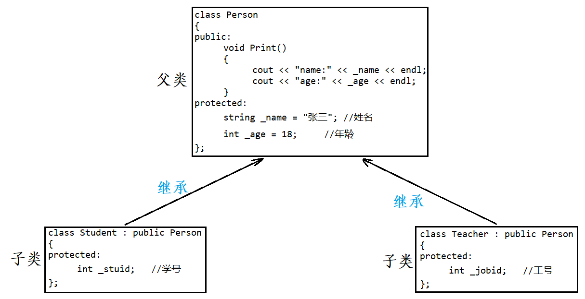
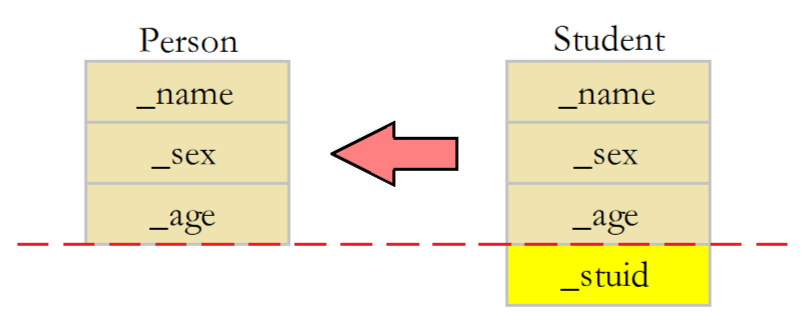
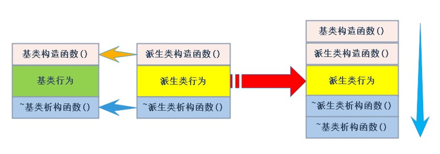
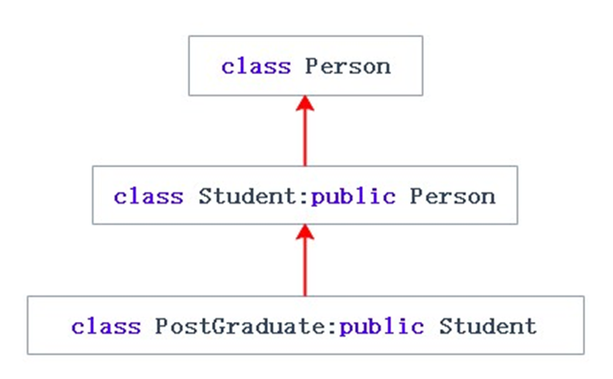
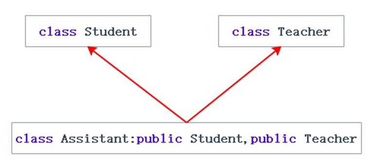
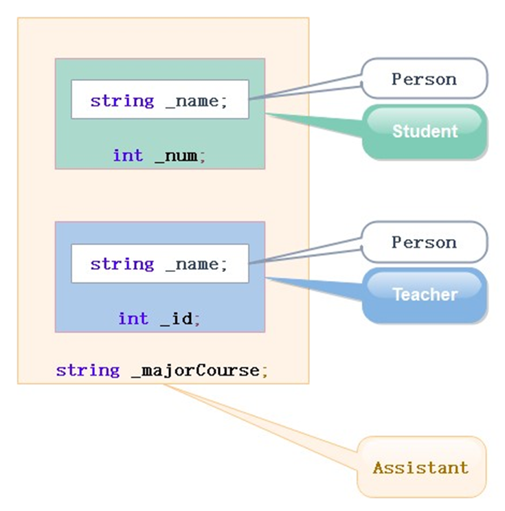
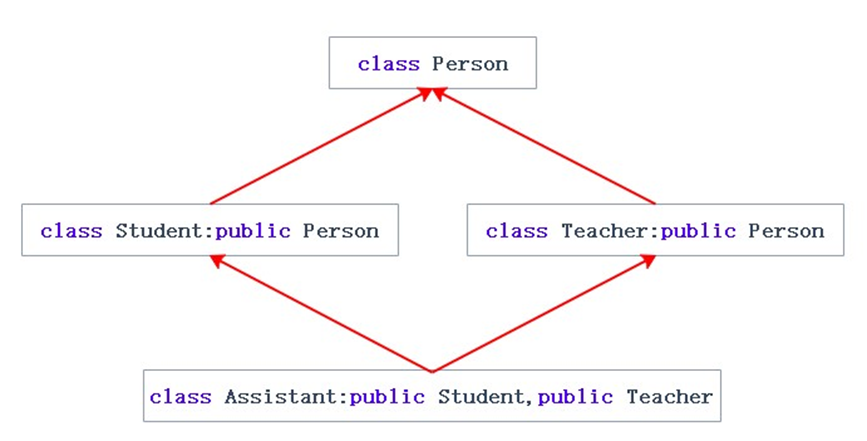
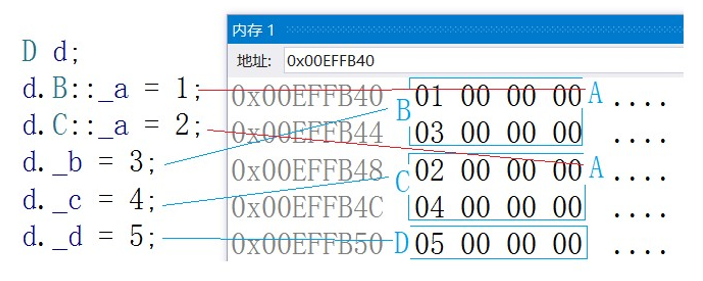
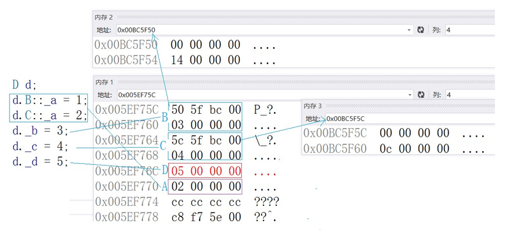
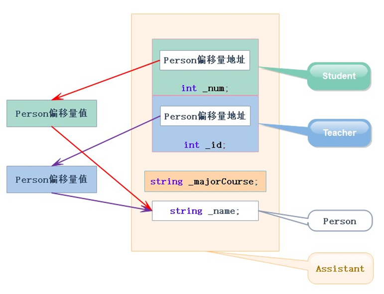

# 继承的概念和定义

继承是面向对象其中的一个核心概念之一，继承允许一个类（称为子类或派生类）从另一个类（称为父类或基类）继承属性和行为，以便在子类中重用已有的代码并添加新的功能。通过继承，可以建立类之间的层次关系，使代码更加模块化、可维护和可扩展。

继承可以通过以下方式来定义：

```cpp
class BaseClass {
    // 父类的成员变量和成员函数声明
};

class SubClass : [访问权限] BaseClass {
    // 子类的成员变量和成员函数声明
};
```

其中，`BaseClass` 是父类的名称，`SubClass` 是子类的名称。`[访问权限]` 是继承关系的访问权限修饰符，可以是 `public`、`protected` 或 `private`，分别对应公有继承、保护继承和私有继承。使用不同的访问权限修饰符会影响子类对父类成员的访问权限。

以下代码中Student类和Teacher类就继承了Person类。

```cpp
//父类
class Person {
public:
    void Print() {
        cout << "name:" << _name << endl;
        cout << "age:" << _age << endl;
    }

protected:
    string _name = "张三";//姓名
    int _age = 18;        //年龄
};
//子类
class Student : public Person {
protected:
    int _stuid;//学号
};
//子类
class Teacher : public Person {
protected:
    int _jobid;//工号
};
```




继承后，父类Person的成员，包括成员函数和成员变量，都会变成子类的一部分，也就是说，子类Student和Teacher复用了父类Person的成员。


# 继承基类成员访问方式的变化

继承的访问权限修饰符（public、protected、private）会影响派生类对基类成员的访问方式。以下是继承基类成员访问方式的变化：

- **公有继承**：
  - 公有成员：在派生类中仍然保持公有权限。可以在派生类内部和外部直接访问。
  - 受保护成员：在派生类中变为保护权限。可以在派生类内部访问，但在外部无法直接访问。
  - 私有成员：无法在派生类中直接访问。
- **保护继承**：
  - 公有成员和受保护成员：在派生类中变为保护权限。可以在派生类内部访问，但在外部无法直接访问。
  - 私有成员：无法在派生类中直接访问。
- **私有继承**：
  - 公有成员、受保护成员：在派生类中变为私有权限。可以在派生类内部访问， 但在外部无法直接访问。
  - 私有成员：无法在派生类中直接访问。

**总结：** 

> 1. 基类private成员在派生类中无论以什么方式继承都是不可见的。这里的**不可见是指基类的私有成员还是被继承到了派生类对象中，但是语法上限制派生类对象不管在类里面还是类外面都不能去访问它。** 
> 2. 基类private成员在派生类中是不能被访问，如果基类成员不想在类外直接被访问，但需要在派生类中能访问，就定义为protected。**可以看出保护成员限定符是因继承才出现的。** 这也是**protected和private的唯一区别**
> 3. 实际我们进行一下总结会发现，基类的私有成员在子类都是不可见。**基类的其他成员在子类的访问方式 == Min(成员在基类的访问限定符，继承方式)**，public > protected  > private。
> 4.  **使用关键字class时默认的继承方式是private，使用struct时默认的继承方式是public**，不过最好显示的写出继承方式。 
> 5. **在实际运用中一般使用都是public继承，几乎很少使用protetced/private继承**，也**不提倡使用protetced/private继承**，因为protetced/private继承下来的成员都只能在派生类的类里面使用，实际中扩展维护性不强。

**示例：**

```cpp
#include <iostream>

class Animal {
public:
    void eat() {
        std::cout << "Animal is eating." << std::endl;
    }

protected:
    void sleep() {
        std::cout << "Animal is sleeping." << std::endl;
    }

private:
    void move() {
        std::cout << "Animal is moving." << std::endl;
    }
};

class PublicInheritance : public Animal {
public:
    void accessBase() {
        eat();  // 可访问基类的公有成员 -> public成员
        sleep();// 可访问基类的保护成员 -> protected成员
        move(); // err 不可访问基类的私有成员 -> private成员
    }
};

class ProtectedInheritance : protected Animal {
public:
    //保护继承从基类继承下来的公有和保护都为保护，私有不变
    void accessBase() {
        eat();  // 可访问基类的公有成员 -> protected成员
        sleep();// 可访问基类的受保护成员 -> protected成员
        move(); // err  不可访问基类的私有成员 -> private成员
    }
};

class PrivateInheritance : private Animal {
public:
    //私有继承成员都变为私有成员
    void accessBase() {
        eat();  // 可访问基类的私有成员   -> private成员
        sleep();// 可访问基类的私有成员   -> private成员
        move(); // 不可访问基类的私有成员 -> private成员
    }
};

//保护和私有继承在继续派生观察区别
class Protected : public ProtectedInheritance {
public:
    //
    void access() {
        eat();  //可以访问基类的保护成员
        sleep();//可以访问基类的保护成员
        move(); //不可以访问基类的私有成员
    }
};

class Privated : public PrivateInheritance {
public:
    void access() {
        eat();  //err 不可以访问基类的私有
        sleep();//err 不可以访问基类的私有
        move(); //err 不可以访问基类的私有
    }
};
```


# 基类和派生类对象赋值转换

> **派生类对象**可以**赋值给基类的对象** / **基类的指针** / **基类的引用**。

例如，对于以下基类及其派生类。

```cpp
//基类
class Person {
protected:
    string _name;//姓名
    string _sex; //性别
    int _age;    //年龄
};
//派生类
class Student : public Person {
protected:
    int _stuid;//学号
};

int main(){
    Student s;
	Person p = s;     //派生类对象赋值给基类对象
	Person* ptr = &s; //派生类对象赋值给基类指针
	Person& ref = s;  //派生类对象赋值给基类引用
	return 0;
}
```

对于这种做法，有个形象的说法叫做切片/切割，寓意把派生类中基类那部分切来赋值过去。

派生类对象赋值给基类对象图示：



赋值给指针和引用同理

**示例：**

```cpp
#include <iostream>
using namespace std;
//基类
class Person {
public:
    string _name;//姓名
    string _sex; //性别
    int _age;    //年龄
};
//派生类
class Student : public Person {
public:
    int _stuid;//学号
};

int main() {
    Student s;
    Person p = s;//派生类对象赋值给基类对象

    cout << p._name << endl;
    cout << s._stuid << endl;
    cout << p._stuid << endl;//err 只能访问基类的成员

    return 0;
}
```

> **基类对象不能赋值给派生类对象。**

**示例：**

```cpp
int main() {
    Student s;
    Person p = s;//派生类对象赋值给基类对象

    s = p;  //err 基类不能赋值给派生类

    return 0;
}
```

> 基类的指针或者引用可以通过强制类型转换赋值给派生类的指针或者引用。但是必须是基类的指针是指向派生类对象时才是安全的。这里基类如果是多态类型，可以使用RTTI的dynamic_cast来进行识别后进行安全转换。

**示例：**

```cpp
int main() {
    Student s;
    Person p = s;//派生类对象赋值给基类对象

    Person *pp = &s;
    Student *st = (Student *) pp;//这种情况转换时可以的
    st->_stuid = 10;

    pp = &p;
    Student *st2 = (Student *) pp;// 这种情况转换时虽然可以，但是会存在越界访问的问题

    st2->_stuid = 10;
    return 0;
}
```


# 继承中的隐藏

在继承体系中的基类和派生类都有独立的作用域。若子类和父类中有同名成员，子类成员将屏蔽父类对同名成员的直接访问，这种情况叫隐藏，也叫重定义。

例如，对于以下代码，访问成员num时将访问到子类当中的num。

```cpp
#include <iostream>
#include <string>
using namespace std;
//父类
class Person {
protected:
    int _num = 111;
};
//子类
class Student : public Person {
public:
    void fun() {
        cout << _num << endl;
    }

protected:
    int _num = 999;
};

int main() {
    Student s;
    s.fun();//999
    return 0;
}
```

若此时我们就是要访问父类当中的_num成员，我们可以使用作用域限定符进行指定访问。

```cpp
class Student : public Person {
public:
    void fun() {
        cout << Person::_num << endl;//指定访问父类当中的_num成员
    }

protected:
    int _num = 999;
};
```

例如，对于以下代码，调用成员函数fun时将直接调用子类当中的fun，若想调用父类当中的fun，则需使用作用域限定符指定类域。

```cpp
#include <iostream>
#include <string>
using namespace std;
//父类
class Person {
public:
    void fun(int x) {
        cout << x << endl;
    }
};
//子类
class Student : public Person {
public:
    void fun(double x) {
        cout << x << endl;
    }
};

int main() {
    Student s;
    s.fun(3.14);      //直接调用子类当中的成员函数fun
    s.Person::fun(20);//指定调用父类当中的成员函数fun
    return 0;
}
```

代码当中，父类中的fun和子类中的fun不是构成函数重载，因为函数重载要求两个函数在同一作用域，而此时这两个fun函数并不在同一作用域。

**成员函数的隐藏，只需要函数名相同就构成隐藏**。

**在实际中在继承体系里面最好不要定义同名的成员。**


# 派生类的默认成员函数

默认成员函数，即我们不写编译器会自动生成的函数，类当中的默认成员函数有以下六个：


下面我们看看派生类当中的默认成员函数，与普通类的默认成员函数的不同之处。

例如，我们以下面这个Person类为基类。

```cpp
class Person {
public:
    //构造函数
    Person(const string &name = "peter")
        : _name(name) {
        cout << "Person()" << endl;
    }
    //拷贝构造函数
    Person(const Person &p)
        : _name(p._name) {
        cout << "Person(const Person& p)" << endl;
    }
    //赋值运算符重载函数
    Person &operator=(const Person &p) {
        cout << "Person& operator=(const Person& p)" << endl;
        if (this != &p) {
            _name = p._name;
        }
        return *this;
    }
    //析构函数
    ~Person() {
        cout << "~Person()" << endl;
    }

private:
    string _name;//姓名
};
```

我们用该基类派生出Student类，Student类当中的默认成员函数的基本逻辑如下：

```cpp
class Student : public Person {
public:
    //构造函数
    Student(const string &name, int id)
        : Person(name)//调用基类的构造函数初始化基类的那一部分成员
          ,
          _id(id)//初始化派生类的成员
    {
        cout << "Student()" << endl;
    }
    //拷贝构造函数
    Student(const Student &s)
        : Person(s)//调用基类的拷贝构造函数完成基类成员的拷贝构造
          ,
          _id(s._id)//拷贝构造派生类的成员
    {
        cout << "Student(const Student& s)" << endl;
    }
    //赋值运算符重载函数
    Student &operator=(const Student &s) {
        cout << "Student& operator=(const Student& s)" << endl;
        if (this != &s) {
            Person::operator=(s);//调用基类的operator=完成基类成员的赋值
            _id = s._id;         //完成派生类成员的赋值
        }
        return *this;
    }
    //析构函数
    ~Student() {
        cout << "~Student()" << endl;
        //派生类的析构函数会在被调用完成后自动调用基类的析构函数
    }

private:
    int _id;//学号
};
```

派生类与普通类的默认成员函数的不同之处概括为以下几点：

> 1. 派生类的构造函数被调用时，会自动调用基类的构造函数初始化基类的那一部分成员，如果基类当中没有默认的构造函数，则必须在派生类构造函数的初始化列表当中显示调用基类的构造函数。
>
> 2. 派生类的拷贝构造函数必须调用基类的拷贝构造函数完成基类成员的拷贝构造。
> 3. 派生类的赋值运算符重载函数必须调用基类的赋值运算符重载函数完成基类成员的赋值。
> 4. 派生类的析构函数会在被调用完成后自动调用基类的析构函数清理基类成员。
> 5. 派生类对象初始化时，会先调用基类的构造函数再调用派生类的构造函数。
> 6. 派生类对象在析构时，会先调用派生类的析构函数再调用基类的析构函数。

在编写派生类的默认成员函数时，需要注意以下几点：

> 1. 派生类和基类的赋值运算符重载函数因为函数名相同构成隐藏，因此在派生类当中调用基类的赋值运算符重载函数时，需要使用作用域限定符进行指定调用。
> 2. 由于多态的某些原因，任何类的析构函数名都会被统一处理为destructor();。因此，派生类和基类的析构函数也会因为函数名相同构成隐藏，若是我们需要在某处调用基类的析构函数，那么就要使用作用域限定符进行指定调用。
> 3. 在派生类的拷贝构造函数和operator=当中调用基类的拷贝构造函数和operator=的传参方式是一个切片行为，都是将派生类对象直接赋值给基类的引用。




**说明一下：**

- 基类的构造函数、拷贝构造函数、赋值运算符重载函数我们都可以在派生类当中自行进行调用，而**基类的析构函数是当派生类的析构函数被调用后由编译器自动调用的，我们若是自行调用基类的析构函数就会导致基类被析构多次的问题**。

- 我们知道，创建派生类对象时是先创建的基类成员再创建的派生类成员，编译器为了保证析构时先析构派生类成员再析构基类成员的顺序析构，所以**编译器会在派生类的析构函数被调用后自动调用基类的析构函数**。
  


# 继承和友元

**友元关系不能继承**，也就是说基类的友元可以访问基类的私有和保护成员，但是不能访问派生类的私有和保护成员。

例如，以下代码中Display函数是基类Person的友元，当时Display函数不是派生类Student的友元，即Display函数无法访问派生类Student当中的私有和保护成员。

```cpp
#include <iostream>
#include <string>
using namespace std;
class Student;
class Person {
public:
    //声明Display是Person的友元
    friend void Display(const Person &p, const Student &s);

protected:
    string _name;//姓名
};
class Student : public Person {
protected:
    int _id;//学号
};
void Display(const Person &p, const Student &s) {
    cout << p._name << endl;//可以访问
    cout << s._id << endl;  //无法访问
}
int main() {
    Person p;
    Student s;
    Display(p, s);
    return 0;
}
```

若想让Display函数也能够访问派生类Student的私有和保护成员，只能在派生类Student当中进行友元声明。

```cpp
class Student : public Person {
public:
    //声明Display是Student的友元
    friend void Display(const Person &p, const Student &s);

protected:
    int _id;//学号
};
```


# 继承与静态成员

**基类定义了static静态成员，则整个继承体系里面只有一个这样的成员**。无论派生出多少个子类，都只有一个static成员实例。

**示例：**

```cpp
#include <iostream>
using namespace std;
class Person {
public:
    Person() { ++_count; }

protected:
    string _name;// 姓名
public:
    static int _count;// 统计人的个数。
};

int Person ::_count = 0;

class Student : public Person {
protected:
    int _stuNum;// 学号
};

class Graduate : public Student {
protected:
    string _seminarCourse;// 研究科目
};

int main() {
    Student s1;
    Student s2;
    Student s3;
    Graduate s4;
    cout << " 人数 :" << Person ::_count << endl;   //4
    Student ::_count = 0;
    cout << " 人数 :" << Person ::_count << endl;  //0

    return 0;
}
```


# 继承的方式

**单继承**：一个子类只有一个直接父类时称这个继承关系为单继承



**多继承**：一个子类有两个或以上直接父类时称这个继承关系为多继承



**菱形继承**：菱形继承是多继承的一种特殊情况。


**菱形继承的问题**：从下面的对象成员模型构造，可以看出菱形继承有数据冗余和二义性的问题。 在Assistant的对象中Person成员会有两份。

```cpp
#include <string>
using namespace std;

class Person {
public:
    string _name;// 姓名
};

class Student : public Person {
protected:
    int _num;//学号
};

class Teacher : public Person {
protected:
    int _id;// 职工编号
};

class Assistant : public Student, public Teacher {
protected:
    string _majorCourse;// 主修课程
};

void Test() {
    // 这样会有二义性无法明确知道访问的是哪一个
    Assistant a;
    a._name = "peter";   //err "Assistant::_name" 不明确
}
```

Assistant对象是多继承的Student和Teacher，而Student和Teacher当中都继承了Person，因此Student和Teacher当中都有name成员，若是直接访问Assistant对象的name成员会出现访问不明确的报错。

对于此，我们可以显示指定访问Assistant哪个父类的_name成员。

```cpp
// 需要显示指定访问哪个父类的成员可以解决二义性问题
a.Student::_name = "xxx";
a.Teacher::_name = "yyy";
```

虽然该方法可以解决二义性的问题，但仍然不能解决数据冗余的问题。因为在Assistant的对象在Person成员始终会存在两份。




## 菱形虚拟继承

虚拟继承可以解决菱形继承的二义性和数据冗余的问题。如上面的继承关系，在Student和Teacher的继承Person时使用虚拟继承，即可解决问题。需要注意的是，虚拟继承不要在其他地方去使用。




**代码如下：**

```cpp
#include <iostream>
#include <string>
using namespace std;
class Person {
public:
    string _name;//姓名
};

class Student : virtual public Person//虚拟继承
{
protected:
    int _num;//学号
};

class Teacher : virtual public Person//虚拟继承
{
protected:
    int _id;//职工编号
};

class Assistant : public Student, public Teacher {
protected:
    string _majorCourse;//主修课程
};

int main() {
    Assistant a;
    a._name = "peter";//无二义性
    return 0;
}
```

此时就可以直接访问Assistant对象的name成员了，并且之后就算我们指定访问Assistant的Student父类和Teacher父类的name成员，访问到的都是同一个结果，解决了二义性的问题。

```cpp
cout << a.Student::_name << endl; //peter
cout << a.Teacher::_name << endl; //peter
```

而我们打印Assistant的Student父类和Teacher父类的_name成员的地址时，显示的也是同一个地址，解决了数据冗余的问题。

```cpp
cout << &a.Student::_name << endl; //0136F74C
cout << &a.Teacher::_name << endl; //0136F74C
```

## 菱形虚拟继承原理

为了研究虚拟继承原理，我们给出了一个简化的菱形继承继承体系，再借助内存窗口观察对象成员的模型。

```cpp
class A {
public:
    int _a;
};

class B : public A{
//class B : virtual public A {
public:
    int _b;
};
class C : public A{
//class C : virtual public A {
public:
    int _c;
};

class D : public B, public C {
public:
    int _d;
};

int main() {
    D d;
    d.B::_a = 1;
    d.C::_a = 2;
    d._b = 3;
    d._c = 4;
    d._d = 5;
    return 0;
}
```

下图是菱形继承的内存对象成员模型：这里可以看到数据冗余



下图是**菱形虚拟继承**的内存对象成员模型：这里可以分析出D对象中将A放到的了对象组成的最下面，这个A同时属于B和C，那么B和C如何去找到公共的A呢？**这里是通过了B和C的两个指针，指向的一张表。这两个指针叫虚基表指针，这两个表叫虚基表。虚基表中存的偏移量。通过偏移量可以找到下面的A。**

当使用虚拟继承时，每个对象需要包含一个或多个虚基表指针（vpointer），指向一个虚基表（vtable)。虚基表中存储了用于访问虚基类成员的信息，这允许在继承层次中的任何位置对虚基类进行正确的访问。也就意味着，使用虚拟继承会引入额外的内存开销。

下面是上面的Person关系菱形虚拟继承的原理解释：



# 继承和组合

**组合（Composition）** 是另一种对象关系，其中一个类包含另一个类的实例作为其成员变量。这种关系允许在一个类中使用另一个类的功能，但不会继承其接口。组合关系更加灵活，可以在运行时动态选择成员对象，同时避免了多继承可能引发的问题。

继承是一种`is-a`的关系，也就是说每个派生类对象都是一个基类对象；而组合是一种`has-a`的关系，若是B组合了A，那么每个B对象中都有一个A对象。

例如，车类和宝马类就是is-a的关系，它们之间适合使用继承。

```cpp
class Car {
protected:
    string _colour;//颜色
    string _num;   //车牌号
};

class BMW : public Car {
public:
    void Drive() {
        cout << "this is BMW" << endl;
    }
};
```

而车和轮胎之间就是has-a的关系，它们之间则适合使用组合。

```cpp
class Tire {
protected:
    string _brand;//品牌
    size_t _size; //尺寸
};

class Car {
protected:
    string _colour;//颜色
    string _num;   //车牌号
    Tire _t;       //轮胎
};
```

若是两个类之间既可以看作is-a的关系，又可以看作has-a的关系，则**优先使用组合**。

原因如下：

1. 继承允许你根据基类的实现来定义派生类的实现，这种通过生成派生类的复用通常被称为**白箱复用**。术语“白箱”是相对可视性而言：在继承方式中，基类的内部细节对于派生类可见，继承一定程度破坏了基类的封装，**基类的改变对派生类有很大的影响，派生类和基类间的依赖性关系很强，耦合度高**。
2. 组合是类继承之外的另一种复用选择，新的更复杂的功能可以通过组装或组合对象来获得。对象组合要求被组合的对象具有良好定义的接口，这种复用风格被称之为**黑箱复用**，因为对象的内部细节是不可见的，对象只以“黑箱”的形式出现，**组合类之间没有很强的依赖关系，耦合度低**，**优先使用对象组合有助于你保持每个类被封装。**
3. 实际中尽量多使用组合，**组合的耦合度低，代码维护性好**。不过继承也是有用武之地的，有些关系就适合用继承，另外要**实现多态也必须要继承**。**若是类之间的关系既可以用继承，又可以用组合，则优先使用组合**。

