# 多态的概念

多态是指同一个函数在不同情况下表现出不同的行为。当类之间存在层次结构，并且类之间是通过继承关联时，就会用到多态。多态意味着调用成员函数时，会根据调用函数的对象的类型来执行不同的函数。

举个例子：比如买票这个行为，当普通人买票时，是全价买票；学生买票时，是半价买票；军人买票时是优先买票。

多态有两种形式：**静态多态**和**动态多态**。静态多态是指在**编译时**就能确定函数的调用版本，而动态多态是指在**运行时**才能确定函数的调用版本。

实现多态需要使用**虚函数**。虚函数是在基类中使用关键字`virtual`声明的函数。在派生类中重新定义基类中定义的虚函数时，会告诉编译器不要静态链接到该函数。我们想要的是在程序中任意点可以根据所调用的对象类型来选择调用的函数，这种操作被称为动态链接或后期绑定。

**纯虚函数**是一种特殊的虚函数，它没有实现. 在基类中定义纯虚函数，以便在派生类中重新定义该函数更好地适用于对象. 纯虚函数可以通过在声明中使用 "= 0" 来指定.


# 多态的定义及实现

多态是在不同继承关系的类对象，去调用同一函数，产生了不同的行为。比如Student继承了Person。Person对象买票全价，Student对象买票半价。

那么在继承中要**构成多态还有两个条件**： 

> 1. 必须通过基类的指针或者引用调用虚函数 
> 2. 被调用的函数必须是虚函数，且派生类必须对基类的虚函数进行重写

## 虚函数

虚函数：即被`virtual`修饰的类成员函数称为虚函数。

```cpp
class Person {
public:
    virtual void BuyTicket() {
        cout << "买票-全价" << endl;
    }
};
```

**注意：**

> - 只有**类的非静态成员函数**前可以加virtual，普通函数前不能加virtual。
> - 虚函数这里的virtual和虚继承中的virtual是同一个关键字，但是它们之间没有任何关系。虚函数这里的virtual是为了实现多态，而虚继承的virtual是为了解决菱形继承的数据冗余和二义性。


## 虚函数的重写

虚函数的重写(覆盖)：派生类中有一个跟基类完全相同的虚函数(即派生类虚函数与基类虚函数的**返回值类型**、**函数名字**、**参数列表**完全相同)，称**子类的虚函数重写了基类的虚函数**。

**示例：**

```cpp
#include <iostream>
using namespace std;

class Person {
public:
    virtual void BuyTicket() {
        cout << "买票-全价" << endl;
    }
};

class Student : public Person {
public:
    //派生类重写的虚函数也可以不加virtual
    virtual void BuyTicket() {
        cout << "买票-半价" << endl;
    }
};

void Func(Person &people) {
    people.BuyTicket();
}

void Func(Person *people){
	people->BuyTicket();
}

int main() {
    Person Mike;
    Func(Mike);   //买票-全价
	Func(&Mike);   //买票-全价
    
    Student Johnson;
    Func(Johnson);  //买票-半价
	Func(&Johnson); //买票-半价
    
    return 0;
}
```

现在我们就可以通过父类Person的指针或者引用调用虚函数BuyTicket，此时不同类型的对象，调用的就是不同的函数，产生的也是不同的结果，进而实现了函数调用的多种形态。

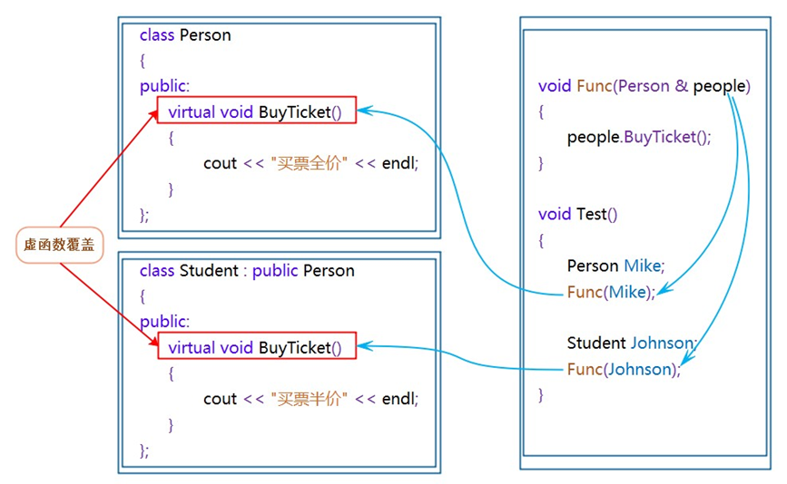


**注意：**

在重写基类虚函数时，派生类的虚函数在不加virtual关键字时，虽然也可以构成重写(因为继承后基类的虚函数被继承下来了在派生类依旧保持虚函数属性),但是该种写法不是很规范，不建议这样使用。

### 虚函数重写的两个例外

> 1.协变(基类与派生类虚函数返回值类型不同)

派生类重写基类虚函数时，与基类虚函数返回值类型不同。即**基类虚函数返回基类对象的指针或者引用，派生类虚函数返回派生类对象的指针或者引用，称为协变**。

例如，假设我们有一个名为 `Base` 的基类和一个名为 `Derived` 的派生类。如果 `Base` 类中有一个名为 `foo` 的虚函数，它返回一个指向 `Base` 对象的指针：

```cpp
class Base {
public:
    virtual Base* foo();
};
```

那么在 `Derived` 类中，我们可以重写 `foo` 函数并将其返回类型更改为指向 `Derived` 对象的指针：

```cpp
class Derived : public Base {
public:
    virtual Derived* foo() override;
};
```

这就是协变。

> 2.析构函数的重写(基类与派生类析构函数的名字不同)

析构函数虽然函数名不同，但是也可以构成重写。因为**编译器为了让析构函数实现多态，会将它们的名字都处理为destructor**，这样就可以构成多态。如果析构函数不构成多态，则指针什么类型就会调用什么类型的析构函数，这也就导致：如果派生类的析构函数中有资源要释放，而这里却没有释放掉那些资源，就会**导致内存泄漏的问题**存在。所以为了防止这种情况，**必须要将析构函数定义为虚函数**。这也就是编译器将析构函数重命名为 destructor 的原因。**析构函数构成多态后，会先调用子类对象的析构函数，再调用父类对象的析构函数**，完成对象的资源清理。

例如，下面代码中父类Person和子类Student的析构函数构成重写。

```cpp
#include <iostream>
using namespace std;
//父类
class Person {
public:
    virtual ~Person() {
        cout << "~Person()" << endl;
    }
};

//子类
class Student : public Person {
public:
    virtual ~Student() {
        cout << "~Student()" << endl;
    }
};

int main() {
    Student s;

    return 0;
}
/*输出结果：
~Student()
~Person()
*/
```

### C++11中的final和override

从上面可以看出，C++对函数重写的要求比较严格，有些情况下由于疏忽可能会导致函数名的字母次序写反而无法构成重写，而这种错误在编译期间是不会报错的，直到在程序运行时没有得到预期结果再来进行调试会得不偿失，因此，C++11提供了`final`和`override`两个关键字，可以帮助用户检测是否重写。

> 1.final：修饰虚函数，表示该虚函数不能再被重写

例如，父类Person的虚函数BuyTicket被final修饰后就不能再被重写了，子类若是重写了父类的BuyTicket函数则编译报错。

```cpp
#include <iostream>
using namespace std;
//父类
class Person {
public:
    //被final修饰，该虚函数不能再被重写
    virtual void BuyTicket() final {
        cout << "买票-全价" << endl;
    }
};
//子类
class Student : public Person {
public:
    //重写，编译报错
    virtual void BuyTicket() {
        cout << "买票-半价" << endl;   //err编译报错
    }
};
```

> 2.override: 检查派生类虚函数是否重写了基类某个虚函数，如果没有重写编译报错。

例如，子类Student和Soldier的虚函数BuyTicket被override修饰，编译时就会检查子类的这两个BuyTicket函数是否重写了父类的虚函数，如果没有则会编译报错。

```cpp
//父类
class Person {
public:
    virtual void BuyTicket() {
        cout << "买票-全价" << endl;
    }
};
//子类
class Student : public Person {
public:
    //子类完成了父类虚函数的重写，编译通过
    virtual void BuyTicket() override {
        cout << "买票-半价" << endl;
    }
};
//子类
class Soldier : public Person {
public:
    //子类没有完成了父类虚函数的重写，编译报错
    virtual void BuyTicket(int i) override {
        cout << "优先-买票" << endl;
    }
};
```

### 重载、覆盖(重写)、隐藏(重定义)的对比
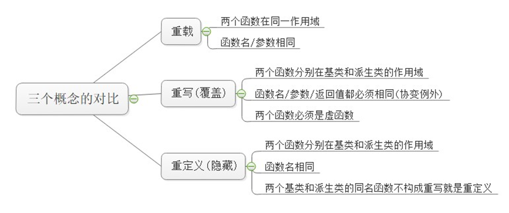


# 抽象类

在虚函数的后面写上 = 0 ，则这个函数为**纯虚函数**。**包含纯虚函数的类叫做抽象类**（也叫接口类），**抽象类不能实例化出对象**。**派生类继承后也不能实例化出对象，只有重写纯虚函数，派生类才能实例化出对象**。纯虚函数规范了派生类必须重写，另外纯虚函数更体现出了接口继承。

**示例1：**

```cpp
#include <iostream>
using namespace std;
//抽象类（接口类）
class Car {
public:
    //纯虚函数
    virtual void Drive() = 0;
};

int main() {
    Car c;//抽象类不能实例化出对象，error
    return 0;
}
```

**实例2：**

```cpp
#include <iostream>
using namespace std;
//抽象类（接口类）
class Car {
public:
    //纯虚函数
    virtual void Drive() = 0;
};
//派生类
class Benz : public Car {
public:
    //重写纯虚函数
    virtual void Drive() {
        cout << "Benz-舒适" << endl;
    }
};
//派生类
class BMV : public Car {
public:
    //重写纯虚函数
    virtual void Drive() {
        cout << "BMV-操控" << endl;
    }
};

int main() {
    //派生类重写了纯虚函数，可以实例化出对象
    Benz b1;
    BMV b2;
    //不同对象用基类指针调用Drive函数，完成不同的行为
    Car *p1 = &b1;
    Car *p2 = &b2;
    p1->Drive();//Benz-舒适
    p2->Drive();//BMV-操控
    return 0;
}
```
**注意**：纯虚函数可以有函数体，只是意义不大

**普通函数的继承是一种实现继承**，派生类继承了基类函数，可以使用函数，继承的是函数的实现。**虚函数的继承是一种接口继承**，派生类继承的是基类虚函数的接口，目的是为了重写，达成多态，继承的是接口。所以如果不实现多态，不要把函数定义成虚函数。


# 多态的原理

## 虚函数表

Base类实例化出对象的大小是多少？

```cpp
#include <iostream>
using namespace std;
class Base {
public:
    virtual void Func1() {
        cout << "Func1()" << endl;
    }

private:
    int _b = 1;
};

int main() {
    Base b;
    cout << sizeof(b) << endl;//8/16
    return 0;
}
```

在VS2022环境下x86为8，x64为16

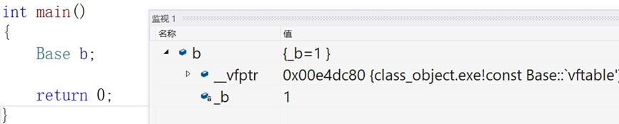


通过观察测试我们发现b对象是8bytes，除了_b成员，还多一个`__vfptr`放在对象的前面(注意有些平台可能会放到对象的最后面，这个跟平台有关)。

对象中的这个指针我们叫做**虚函数表指针**(v代表virtual，f代表function)。**一个含有虚函数的类中都至少都有一个虚函数表指针，因为虚函数的地址要被放到虚函数表中，虚函数表也简称虚表**。

那么派生类中这个表放了些什么呢？

针对上面的代码我们做出以下改造 

1.我们增加一个派生类Derive去继承Base 

2.Derive中重写Func1 

3.Base再增加一个虚函数Func2和一个普通函数Func3

```cpp
#include <iostream>
using namespace std;
class Base {
public:
    virtual void Func1() {
        cout << "Base::Func1()" << endl;
    }
    virtual void Func2() {
        cout << "Base::Func2()" << endl;
    }
    void Func3() {
        cout << "Base::Func3()" << endl;
    }

private:
    int _b = 1;
};

class Derive : public Base {
public:
    virtual void Func1() {
        cout << "Derive::Func1()" << endl;
    }

private:
    int _d = 2;
};

int main() {
    Base b;
    Derive d;
    return 0;
}
```

通过调试可以发现，父类对象b和基类对象d当中除了自己的成员变量之外，父类和子类对象都有一个虚表指针，分别指向属于自己的虚表。

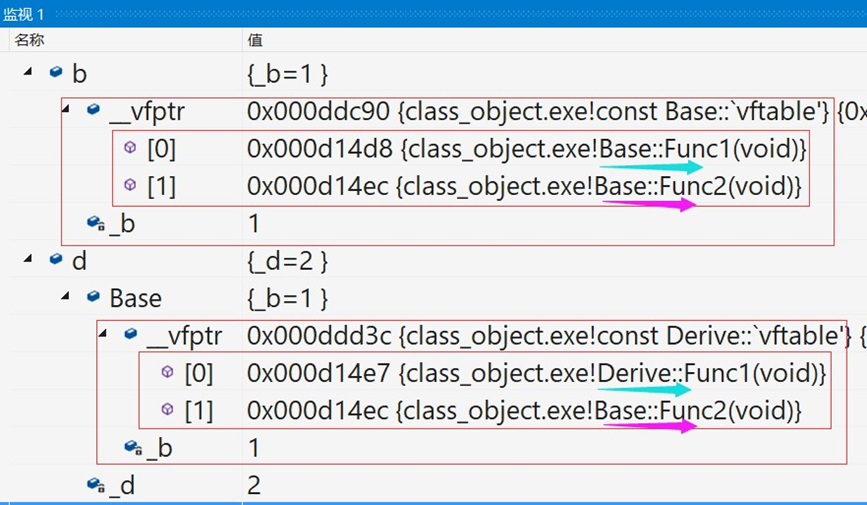


实际上虚表当中存储的就是虚函数的地址，因为父类当中的Func1和Func2都是虚函数，所以父类对象b的虚表当中存储的就是虚函数Func1和Func2的地址。

而子类虽然继承了父类的虚函数Func1和Func2，但是子类对父类的虚函数Func1进行了重写，因此，子类对象d的虚表当中存储的是父类的虚函数Func2的地址和重写的Func1的地址。这就是为什么虚函数的重写也叫做覆盖，覆盖就是指虚表中虚函数地址的覆盖，重写是语法的叫法，覆盖是原理层的叫法。

其次需要注意的是：Func2是虚函数，所以继承下来后放进了子类的虚表，而Func3是普通成员函数，继承下来后不会放进子类的虚表。此外，虚函数表本质是一个存虚函数指针的指针数组，一般情况下会在这个数组最后放一个nullptr。

**总结一下，派生类的虚表生成步骤如下**：

1. 先将基类中的虚表内容拷贝一份到派生类的虚表。
2. 如果派生类重写了基类中的某个虚函数，则用派生类自己的虚函数地址覆盖虚表中基类的虚函数地址。
3. 派生类自己新增加的虚函数按其在派生类中的声明次序增加到派生类虚表的最后。

**虚表是什么阶段初始化的？虚函数存在哪里？虚表存在哪里？**

虚表实际上是在**构造函数初始化列表阶段**进行初始化的，虚表本身通常存储在内存的静态区，具体位置和实现取决于编译器。注意虚表当中存的是虚函数的地址不是虚函数，虚函数和普通函数一样，都是存在代码段的，只是他的地址又存到了虚表当中。另外，对象中存的不是虚表而是指向虚表的指针。

## 多态的原理

下面代码中，为什么当父类Person指针指向的是父类对象Mike时，调用的就是父类的BuyTicket，当父类Person指针指向的是子类对象Johnson时，调用的就是子类的BuyTicket?

```cpp
//父类
class Person
{
public:
	virtual void BuyTicket()
	{
		cout << "买票-全价" << endl;
	}
	int _p = 1;
};
//子类
class Student : public Person
{
public:
	virtual void BuyTicket()
	{
		cout << "买票-半价" << endl;
	}
	int _s = 2;
};

int main()
{
	Person Mike;
	Student Johnson;
	Johnson._p = 3; //以便观察是否完成切片
	Person* p1 = &Mike;
	Person* p2 = &Johnson;
	p1->BuyTicket(); //买票-全价
	p2->BuyTicket(); //买票-半价
	return 0;
}
```

通过调试可以发现，对象Mike中包含一个成员变量_p和一个虚表指针，对象Johnson中包含两个成员变量_p和_s以及一个虚表指针，这两个对象当中的虚表指针分别指向自己的虚表。

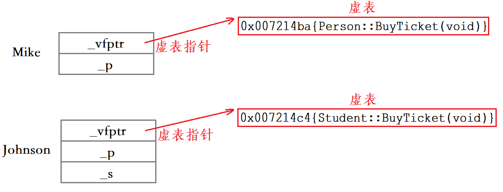


围绕此图分析便可得到多态的原理：

- 父类指针p1指向Mike对象，p1->BuyTicket在Mike的虚表中找到的虚函数就是Person::BuyTicket。
- 父类指针p2指向Johnson对象，p2>BuyTicket在Johnson的虚表中找到的虚函数就是Student::BuyTicket。

这样就实现出了不同对象去完成同一行为时，展现出不同的形态。

**为什么必须使用父类的指针或者引用去调用虚函数呢？为什么使用父类对象去调用虚函数达不到多态的效果呢？**

使用父类指针或者引用时，实际上是一种切片行为，切片时只会让父类指针或者引用得到父类对象或子类对象中切出来的那一部分。

```cpp
Person* p1 = &Mike;
Person* p2 = &Johnson;      
```

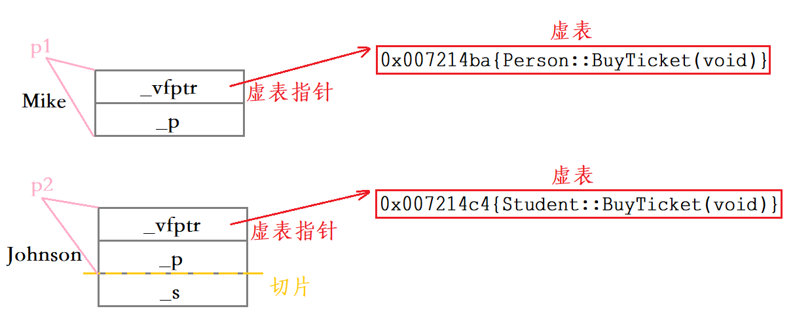


因此，我们后序用p1和p2调用虚函数时，p1和p2通过虚表指针找到的虚表是不一样的，最终调用的函数也是不一样的。

```cpp
Person p1 = Mike;
Person p2 = Johnson;
```

使用父类对象时，切片得到部分成员变量后，会调用父类的拷贝构造函数对那部分成员变量进行拷贝构造，而拷贝构造出来的父类对象p1和p2当中的虚表指针指向的都是父类对象的虚表。因为**同类型的对象共享一张虚表**，他们的虚表指针指向的虚表是一样的。

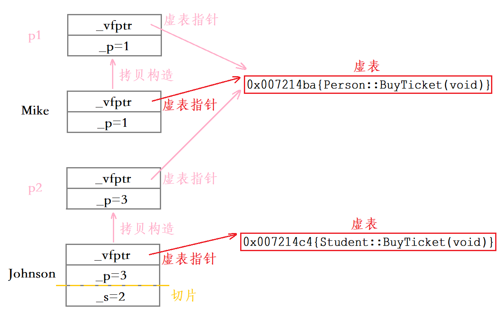


因此，我们后序用p1和p2调用虚函数时，p1和p2通过虚表指针找到的虚表是一样的，最终调用的函数也是一样的，也就无法构成多态。

**总结一下：**

> 1. 构成多态，指向谁就调用谁的虚函数，跟对象有关。
> 2. 不构成多态，对象类型是什么就调用谁的虚函数，跟类型有关。

## 动态绑定与静态绑定

**静态绑定：** 静态绑定又称为前期绑定(早绑定)，在程序编译期间确定了程序的行为，也成为静态多态，比如：**函数重载。**

**动态绑定：** 动态绑定又称为后期绑定(晚绑定)，在程序运行期间，根据具体拿到的类型确定程序的具体行为，调用具体的函数，也称为动态**多态**。

**注意：**
虚函数的访问权限只影响编译时的静态绑定，而不影响运行时的动态绑定。也就是说，如果一个指针或引用的静态类型（编译时确定的类型）和动态类型（运行时确定的类型）不同，那么它调用的虚函数版本将由动态类型决定，而不受静态类型的访问权限限制。
**实例：**

```cpp
class A {
public:
    virtual void f() {
        cout << "A::f()" << endl;
    }
};

class B : public A {
private:
    virtual void f() {
        cout << "B::f()" << endl;
    }
};

int main() {
    A *pa = (A *) new B;// 创建B类的实例并赋值给A类指针

    pa->f();  // 调用虚函数f()，输出结果会根据实际对象类型动态决定
    delete pa;// 释放内存

    return 0;
}
//输出B：：f()
```
pa是一个A类指针，但是它指向了一个B类对象。因此，pa的静态类型是A，而动态类型是B。当pa调用虚函数f()时，它会根据动态类型选择B类的f()版本，而不管它在B类中是否是私有的。

**总结：**

> 当使用基类指针指向派生类对象时，调用虚函数会根据实际对象类型动态决定。所以，即使派生类的虚函数是private的，也会被调用


# 单继承和多继承关系的虚函数表

需要注意的是在单继承和多继承关系中，下面我们去关注的是派生类对象的虚表模型，因为基类的虚表模型前面我们已经看过了，没什么需要特别研究的

## 单继承关系

```cpp
class Base {
public:
    virtual void func1() { cout << "Base::func1" << endl; }
    virtual void func2() { cout << "Base::func2" << endl; }

private:
    int a;
};

class Derive : public Base {
public:
    virtual void func1() { cout << "Derive::func1" << endl; }
    virtual void func3() { cout << "Derive::func3" << endl; }
    virtual void func4() { cout << "Derive::func4" << endl; }

private:
    int b;
};
```

其中，基类和派生类对象的虚表模型如下：

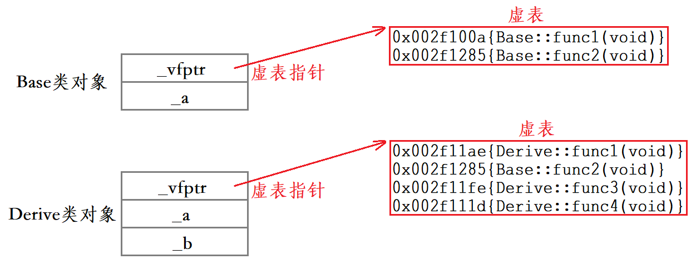

在单继承关系当中，派生类的虚表生成过程如下：

> 1. 继承基类的虚表内容到派生类的虚表。
> 2. 对派生类重写了的虚函数地址进行覆盖，比如func1。
> 3. 虚表当中新增派生类当中新的虚函数地址，比如func3和func4。

**使用程序打印出虚表地址**

**思路**：取出b、d对象的头4bytes，就是虚表的指针，前面我们说了虚函数表本质是一个存虚函数指针的指针数组，这个数组最后面放了一个nullptr

> 1. 先取b的地址，强转成一个int*的指针
> 2. 再解引用取值，就取到了b对象头4bytes的值，这个值就是指向虚表的指针
> 3. 再强转成VFPTR*，因为虚表就是一个存VFPTR类型(虚函数指针类型)的数组。
> 4. 虚表指针传递给PrintVTable进行打印虚表
> 5. 需要说明的是这个打印虚表的代码经常会崩溃，因为编译器有时对虚表的处理不干净，虚表最后面没有放nullptr，导致越界，这是编译器的问题。我们只需要点目录栏的-生成-清理解决方案，再编译就好了。

```cpp
#include <iostream>
using namespace std;
class Base {
public:
    virtual void func1() { cout << "Base::func1" << endl; }
    virtual void func2() { cout << "Base::func2" << endl; }

private:
    int a;
};

class Derive : public Base {
public:
    virtual void func1() { cout << "Derive::func1" << endl; }
    virtual void func3() { cout << "Derive::func3" << endl; }
    virtual void func4() { cout << "Derive::func4" << endl; }

private:
    int b;
};

typedef void (*VFPTR)();
void PrintVTable(VFPTR vTable[]) {
    // 依次取虚表中的虚函数指针打印并调用。调用就可以看出存的是哪个函数
    cout << " 虚表地址>" << vTable << endl;
    for (int i = 0; vTable[i] != nullptr; ++i) {
        printf(" 第%d个虚函数地址 :0X%x,->", i, vTable[i]);
        VFPTR f = vTable[i];
        f();
    }
    cout << endl;
}

int main() {
    Base b;
    Derive d;
    VFPTR* vTableb = (VFPTR*)(*(int*)&b);
    PrintVTable(vTableb);
    VFPTR* vTabled = (VFPTR*)(*(int*)&d);
    PrintVTable(vTabled);
    return 0;
}

/*输出结果
 虚表地址>007231D4
 第0个虚函数地址 :0X721050,->Base::func1
 第1个虚函数地址 :0X721070,->Base::func2

 虚表地址>007231BC
 第0个虚函数地址 :0X721090,->Derive::func1
 第1个虚函数地址 :0X721070,->Base::func2
 第2个虚函数地址 :0X7210b0,->Derive::func3
 第3个虚函数地址 :0X7210d0,->Derive::func4
```

## 多继承关系

以下列多继承关系为例，我们来看看基类和派生类的虚表模型。

```cpp
//基类1
class Base1 {
public:
    virtual void func1() { cout << "Base1::func1()" << endl; }
    virtual void func2() { cout << "Base1::func2()" << endl; }

private:
    int _b1;
};
//基类2
class Base2 {
public:
    virtual void func1() { cout << "Base2::func1()" << endl; }
    virtual void func2() { cout << "Base2::func2()" << endl; }

private:
    int _b2;
};
//多继承派生类
class Derive : public Base1, public Base2 {
public:
    virtual void func1() { cout << "Derive::func1()" << endl; }
    virtual void func3() { cout << "Derive::func3()" << endl; }

private:
    int _d1;
};
```

其中，两个基类的虚表模型如下：

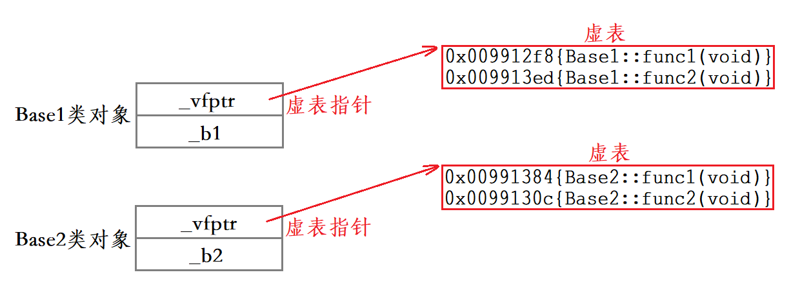


而派生类的虚表模型就不那么简单了，派生类的虚表模型如下：

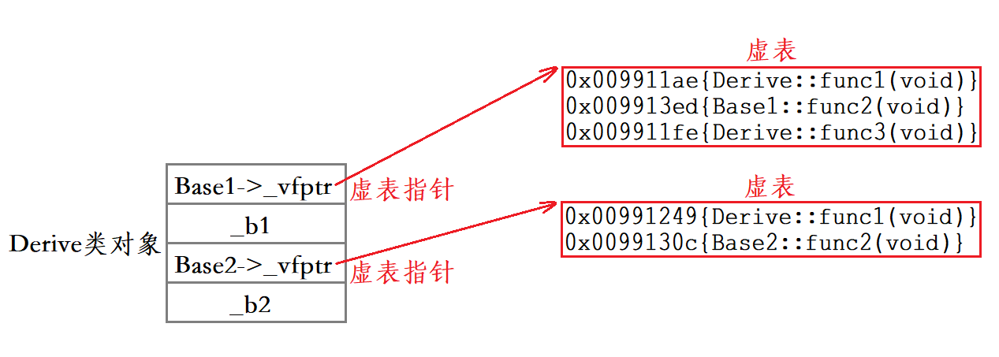


在多继承关系当中，派生类的虚表生成过程如下：

> 1. 分别继承各个基类的虚表内容到派生类的各个虚表当中。
> 2. 对派生类重写了的虚函数地址进行覆盖(派生类中的各个虚表中存有该被重写虚函数地址的都需要进行覆盖)，比如func1。
> 3. 在派生类第一个继承基类部分的虚表当中新增派生类当中新的虚函数地址，比如func3。

## 菱形继承关系

以下列菱形虚拟继承关系为例，我们来看看基类和派生类的虚表模型。

```cpp
class A {
public:
    virtual void funcA() {
        cout << "A::funcA()" << endl;
    }

private:
    int _a;
};

class B : virtual public A {
public:
    virtual void funcA() {
        cout << "B::funcA()" << endl;
    }
    virtual void funcB() {
        cout << "B::funcB()" << endl;
    }

private:
    int _b;
};

class C : virtual public A {
public:
    virtual void funcA() {
        cout << "C::funcA()" << endl;
    }
    virtual void funcC() {
        cout << "C::funcC()" << endl;
    }

private:
    int _c;
};

class D : public B, public C {
public:
    virtual void funcA() {
        cout << "D::funcA()" << endl;
    }
    virtual void funcD() {
        cout << "D::funcD()" << endl;
    }

private:
    int _d;
};
```

代码当中的继承关系图如下：

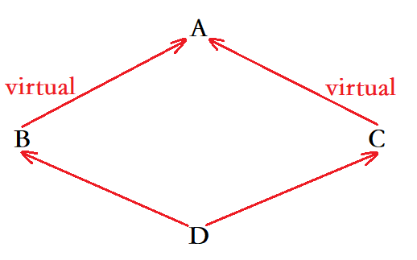


其中，A类当中有一个虚函数funcA，B类当中有一个虚函数funcB，C类当中有一个虚函数funcC，D类当中有一个虚函数funcD。此外B类、C类和D类当中均对A类当中的funcA进行了重写。

A类对象的成员包括一个虚表指针和成员变量_a，虚表指针指向的虚表当中存储的是A类虚函数funcA的地址。

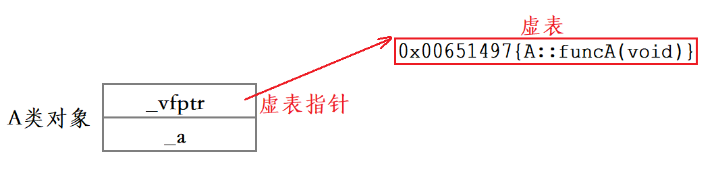


B类由于是虚拟继承的A类，所以B类对象当中将A类继承下来的成员放到了最后，除此之外，B类对象的成员还包括一个虚表指针、一个虚基表指针和成员变量_b，虚表指针指向的虚表当中存储的是B类虚函数funcB的地址。
虚基表当中存储的是两个偏移量，第一个是虚基表指针距离B虚表指针的偏移量，第二个是虚基表指针距离虚基类A的偏移量。

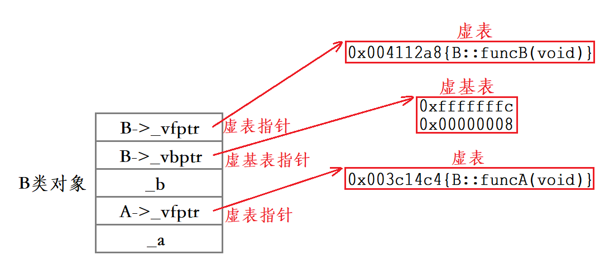

C类对象当中的成员分布情况与B类对象当中的成员分布情况相同。C类也是虚拟继承的A类，所以C类对象当中将A类继承下来的成员放到了最后，除此之外，C类对象的成员还包括一个虚表指针、一个虚基表指针和成员变量_c，虚表指针指向的虚表当中存储的是C类虚函数funcC的地址。
虚基表当中存储的是两个偏移量，第一个是虚基表指针距离C虚表指针的偏移量，第二个是虚基表指针距离虚基类A的偏移量。

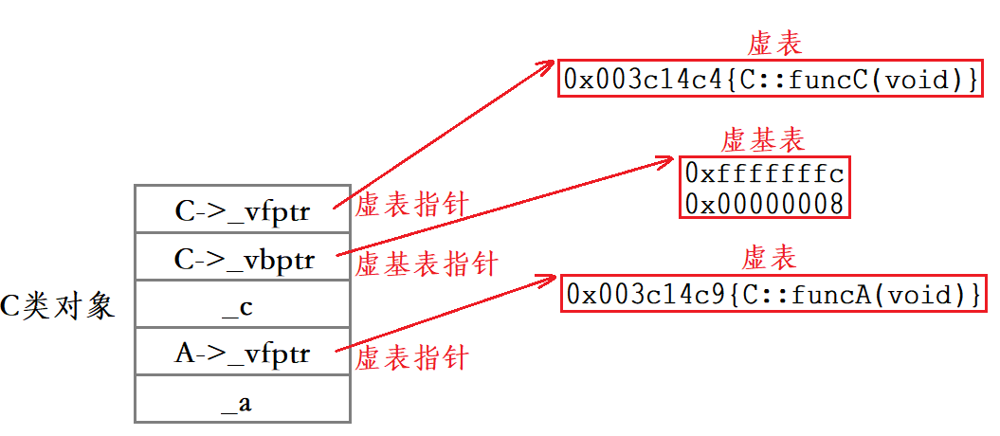

D类对象当中成员的分布情况较为复杂，D类的继承方式是菱形虚拟继承，在D类对象当中，将A类继承下来的成员放到了最后，除此之外，D类对象的成员还包括从B类继承下来的成员、从C类继承下来的成员和成员变量_d。
需要注意的是，D类对象当中的虚函数funcD的地址是存储到了B类的虚表当中。

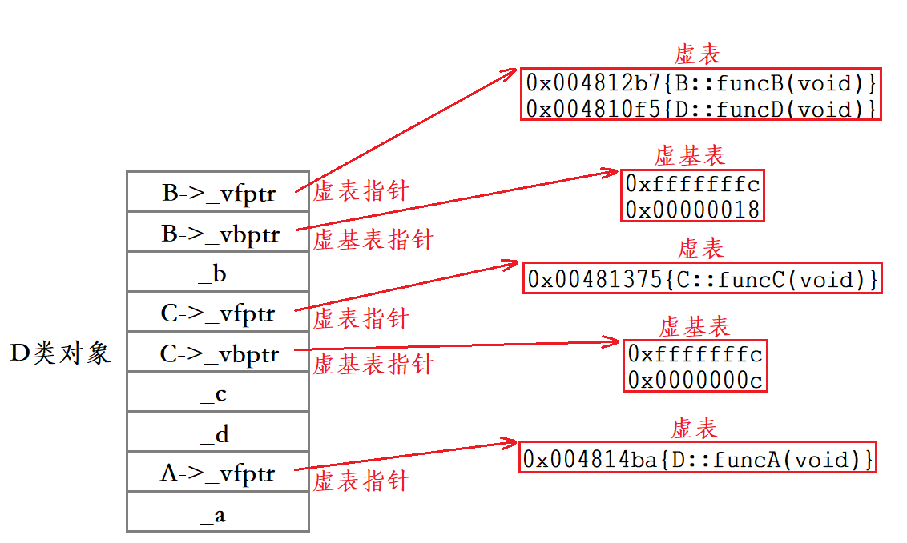
实际中我们不建议设计出菱形继承及菱形虚拟继承，一方面太复杂容易出问题，另一方面使用这样的模型访问基类成员有一定的性能损耗。
