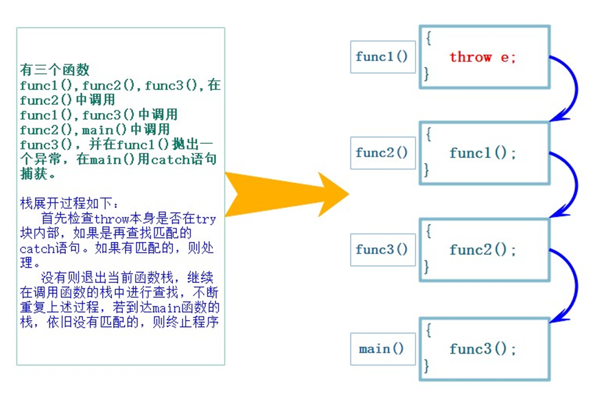
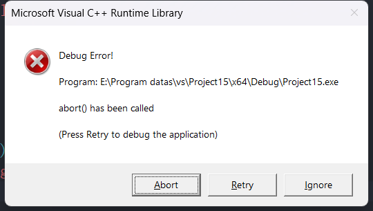
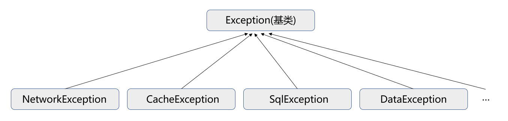
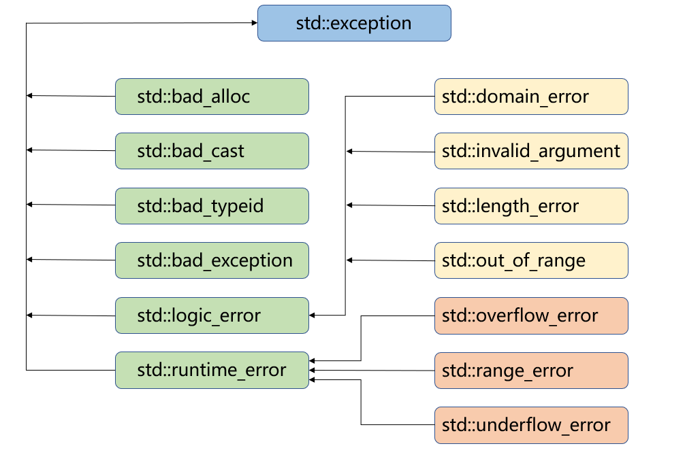
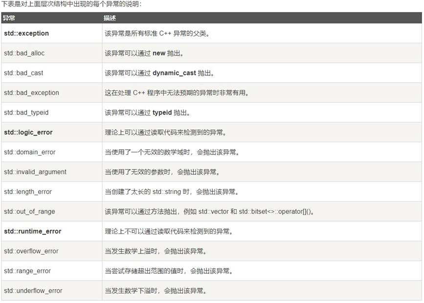

# C语言传统的处理错误的方式

**传统的错误处理机制**：

1. **终止程序**，**如assert**，缺陷：用户难以接受。如发生内存错误，除0错误时就会终止程序。
2. **返回错误码**，缺陷：需要程序员自己去查找对应的错误。如系统的很多库的接口函数都是通过把错误码放到errno中，表示错误

实际中C语言基本都是使用返回错误码的方式处理错误，部分情况下使用终止程序处理非常严重的错误。


# C++异常概念

异常处理是C++提供的一种机制，用于处理程序运行过程中出现的异常情况。这种机制涉及到三个关键字：try、catch和throw。

- throw: 当程序中出现异常情况时，会使用throw关键字抛出一个异常。这是异常处理开始的地方。
- try: try是一个代码块，用于包含可能会抛出异常的代码。如果在try代码块中的代码抛出了异常，那么try代码块后面的代码将不会被执行，程序会直接跳到与之对应的catch代码块。
- catch: catch也是一个代码块，用于捕获和处理异常。catch代码块后面需要跟一个括号，括号中是异常的类型，这可以是一个已经存在的类型，也可以是程序员自定义的类型。

使用try/catch语句的语法如下所示：

```cpp
try {
    //被保护的代码
} catch (ExceptionName e1) {
    //catch块
} catch (ExceptionName e2) {
    //catch块
} catch (ExceptionName eN) {
    //catch块
}
```


# 异常的使用

## 异常的抛出和捕获

**异常的抛出和匹配原则**

> 1. 异常是通过**抛出对象而引发**的，该**对象的类型**决定了应该激活哪个catch的处理代码。
>
> 2. 被**选中的处理代码**是调用链中**与该对象类型匹配且离抛出异常位置最近**的那一个。 
> 3. 抛出异常对象后，会生成一个异常对象的拷贝，因为抛出的异常对象可能是一个临时对象，所以会生成一个拷贝对象，这个拷贝的临时对象会在被catch以后销毁。（这里的处理类似于函数的传值返回） 
> 4. `catch(...)`可以捕获任意类型的异常，问题是不知道异常错误是什么。 
> 5. 实际中抛出和捕获的匹配原则有个例外，并不都是类型完全匹配，可以抛出的派生类对象，使用基类捕获，这个在实际中非常实用，我们后面会详细讲解这个。

**在函数调用链中异常栈展开匹配原则**

> 1. 首先**检查throw本身是否在try块内部，如果是再查找匹配的catch语句**。如果有匹配的，则调到catch的地方进行处理。 
> 2. 没有匹配的catch则退出当前函数栈，继续在调用函数的栈中进行查找匹配的catch。 
> 3. **如果到达main函数的栈，依旧没有匹配的，则终止程序**。上述这个沿着调用链查找匹配的catch子句的过程称为**栈展开**。所以实际中我们**最后都要加一个catch(...)捕获任意类型的异常**，否则当有异常没捕获，程序就会直接终止。
> 4. 找到匹配的catch子句并处理以后，会继续沿着catch子句后面继续执行。

比如下面的代码中main函数中调用了func3，func3中调用了func2，func2中调用了func1，在func1中抛出了一个string类型的异常对象。

```cpp
#include<iostream>
#include<string>
using namespace std;
void func1() {
    throw string("这是一个异常");
}

void func2() {
    func1();
}

void func3() {
    func2();
}

int main() {
    try {
        func3();
    } catch (const string &s) {
        cout << "错误描述：" << s << endl;
    } catch (...) {
        cout << "未知异常" << endl;
    }
    return 0;
}
```

当func1中的异常被抛出后：

1. 首先会检查throw本身是否在try块内部，这里由于throw不在try块内部，因此会退出func1所在的函数栈，继续在上一个调用函数栈中进行查找，即func2所在的函数栈。
2. 由于func2中也没有匹配的catch，因此会继续在上一个调用函数栈中进行查找，即func3所在的函数栈。
3. func3中也没有匹配的catch，于是就会在main所在的函数栈中进行查找，最终在main函数栈中找到了匹配的catch。
4. 这时就会跳到main函数中对应的catch块中执行对应的代码块，执行完后继续执行该代码块后续的代码。

如下图所示：




上述这个沿着调用链查找匹配的catch子句的过程称为栈展开。在实际中我们最后都要加一个`catch(...)`捕获任意类型的异常，否则当有异常没捕获时，程序就会直接终止。

```cpp
#include <iostream>
using namespace std;
double Division(int a, int b) {
    // 当b == 0时抛出异常
    if (b == 0)
        throw "Division by zero condition!";
    else
        return ((double)a / (double)b);
}

void Func() {
    int len, time;
    cin >> len >> time;
    cout << Division(len, time) << endl;
}

int main() {
    try {
        Func();
    }
    catch (const char* errmsg) {
        cout << errmsg << endl;
    }
    catch (...) {
        cout << "unkown exception" << endl;
    }
    
    return 0;
}
```

**输出**：

```bash
10 0
Division by zero condition!
```

如果throw没有匹配的catch

```cpp
int main() {
    try {
        Func();
    }
    catch (int errmsg) {
        cout << errmsg << endl;
    }

    return 0;
}
```




只有加上`catch (...)`

```cpp
int main() {
    try {
        Func();
    }
    catch (int errmsg) {
        cout << errmsg << endl;
    }
    catch (...) {
        cout << "unkown exception" << endl;
    }

    return 0;
}
```

**输出**：

```bash
10 0
unkown exception
```

## 异常的重新抛出

有时候单个的catch可能不能完全处理一个异常，在进行一些校正处理以后，希望再交给更外层的调用链函数来处理，比如最外层可能需要拿到异常进行日志信息的记录，这时就需要通过重新抛出将异常传递给更上层的函数进行处理。

但如果直接让最外层捕获异常进行处理可能会引发一些问题。比如：

```cpp
#include<string>
#include<iostream>
using namespace std;

void func1() {
    throw string("这是一个异常");
}

void func2() {
    int *array = new int[10];
    func1();

    //do something...

    delete[] array;
}

int main() {
    try {
        func2();
    } catch (const string &s) {
        cout << s << endl;
    } catch (...) {
        cout << "未知异常" << endl;
    }
    return 0;
}
```

其中func2中通过new操作符申请了一块内存空间，并且在func2最后通过delete对该空间进行了释放，但由于func2中途调用的func1内部抛出了一个异常，这时会直接跳转到main函数中的catch块执行对应的异常处理程序，并且在处理完后继续沿着catch块往后执行。

这时就导致func2中申请的内存块没有得到释放，造成了内存泄露。这时可以在func2中先对func1抛出的异常进行捕获，捕获后先将申请到的内存释放再将异常重新抛出，这时就避免了内存泄露。比如：

```cpp
#include <iostream>
#include <string>
using namespace std;

void func1() {
    throw string("这是一个异常");
}

void func2() {
    int* array = new int[10];
    try {
        func1();
        //do something...
    }
    catch (...) {
        delete[] array;
        throw;   //捕获func1的异常，将捕获到的异常再次重新抛出
    }
    delete[] array;
}


int main() {
    try {
        func2();
    }
    catch (const string& s) {
        cout << s << endl;
    }
    catch (...) {
        cout << "未知异常" << endl;
    }
    return 0;
}
```

**说明一下：**

- func2中的new和delete之间可能还会抛出其他类型的异常，因此在fun2中最好以catch(...)的方式进行捕获，将申请到的内存delete后再通过throw重新抛出。
- 重新抛出异常对象时，throw后面可以不用指明要抛出的异常对象（正好也不知道以catch(...)的方式捕获到的具体是什么异常对象）。

## 异常安全

将抛异常导致的安全问题叫做异常安全问题，对于异常安全问题下面给出几点建议：

- 构造函数完成对象的构造和初始化，最好**不要在构造函数中抛出异常**，否则可能导致对象不完整或没有完全初始化。
- 析构函数主要完成对象资源的清理，最好**不要在析构函数中抛出异常**，否则可能导致资源泄露（内存泄露、句柄未关闭等）。
- C++中异常经常会导致资源泄露的问题，比如在new和delete中抛出异常，导致内存泄露，在lock和unlock之间抛出异常导致死锁，C++经常使用RAII的方式来解决以上问题。

## 异常规范

在C++中，异常规范是一种语法，用于显式地声明一个函数可能抛出的异常类型。异常规范在函数声明后面，使用 throw 关键字后跟括号内可能抛出的异常类型列表来表示。

1. 在函数的后面接`throw(type1, type2, ...)`，列出这个函数可能抛掷的所有异常类型。
2. 在函数的后面接`throw()`或`noexcept`（C++11），表示该函数不抛异常。
3. 若无异常接口声明，则此函数可以抛掷任何类型的异常。（异常接口声明不是强制的）

例如：

```cpp
void func() throw (int, char); // 可抛出 int 或 char 类型的异常
```

C++11以后的新标准已经废弃了上述的异常规范方式，取而代之的是 `noexcept` 关键字。`noexcept` 用于声明一个函数保证不抛出任何异常。如果函数确实抛出了异常，那么程序将调用 std::terminate()，引发程序的终止。

例如：

```cpp
void func() noexcept; // 声明 func() 保证不抛出任何异常
```

另外，`noexcept` 还可以带一个可选的布尔参数，如果参数为 true，那么表示函数保证不抛出任何异常，等同于无参数的 `noexcept`；如果参数为 false，那么表示函数可能抛出异常。

例如：

```cpp
void func() noexcept(true);  // 声明 func() 保证不抛出任何异常
void func() noexcept(false); // 声明 func() 可能抛出异常
```

使用 `noexcept` 能帮助编译器进行一些优化，因此在知道函数不会抛出异常的情况下，建议使用 `noexcept`。


# 自定义异常体系

实际中很多公司都会自定义自己的异常体系进行规范的异常管理。

- 公司中的项目一般会进行模块划分，让不同的程序员或小组完成不同的模块，如果不对抛异常这件事进行规范，那么负责最外层捕获异常的程序员就非常难受了，因为他需要捕获大家抛出的各种类型的异常对象。
- 因此实际中都会定义一套继承的规范体系，先定义一个最基础的异常类，所有人抛出的异常对象都必须是继承于该异常类的派生类对象，因为异常语法规定可以用基类捕获抛出的派生类对象，因此最外层就只需捕获基类就行了。

如下图：




**服务器开发中通常使用的异常继承体系**：

```cpp
#include <chrono> // for std::chrono::seconds
#include <cstdlib>// for srand, rand
#include <ctime>  // for time
#include <iostream>
#include <string>
#include <thread>// for std::this_thread::sleep_for
using namespace std;
class Exception {
public:
    Exception(const string &errmsg, int id)
        : _errmsg(errmsg), _id(id) {}
    virtual string what() const {
        return _errmsg;
    }

protected:
    string _errmsg;
    int _id;
};

class SqlException : public Exception {
public:
    SqlException(const string &errmsg, int id, const string &sql)
        : Exception(errmsg, id), _sql(sql) {}
    virtual string what() const {
        string str = "SqlException:";
        str += _errmsg;
        str += "->";
        str += _sql;
        return str;
    }

private:
    const string _sql;
};

class CacheException : public Exception {
public:
    CacheException(const string &errmsg, int id)
        : Exception(errmsg, id) {}
    virtual string what() const {
        string str = "CacheException:";
        str += _errmsg;
        return str;
    }
};

class HttpServerException : public Exception {
public:
    HttpServerException(const string &errmsg, int id, const string &type)
        : Exception(errmsg, id), _type(type) {}
    virtual string what() const {
        string str = "HttpServerException:";
        str += _type;
        str += ":";
        str += _errmsg;
        return str;
    }

private:
    const string _type;
};

void SQLMgr() {
    srand(time(0));
    if (rand() % 7 == 0) {
        throw SqlException("权限不足", 100, "select * from name = '张三'");
    }
    //throw "xxxxxx";
}

void CacheMgr() {
    srand(time(0));
    if (rand() % 5 == 0) {
        throw CacheException("权限不足", 100);
    } else if (rand() % 6 == 0) {
        throw CacheException("数据不存在", 101);
    }
    SQLMgr();
}

void HttpServer() {
    // ...
    srand(time(0));
    if (rand() % 3 == 0) {
        throw HttpServerException("请求资源不存在", 100, "get");
    } else if (rand() % 4 == 0) {
        throw HttpServerException("权限不足", 101, "post");
    }
    CacheMgr();
}

int main() {
    while (1) {
        this_thread::sleep_for(chrono::seconds(1));
        try {
            HttpServer();
        } catch (const Exception &e)// 这里捕获父类对象就可以
        {
            // 多态
            cout << e.what() << endl;
        } catch (...) {
            cout << "Unkown Exception" << endl;
        }
    }
    return 0;
}
```

**说明一下：**

- 异常类的成员变量不能设置为私有，因为私有成员在子类中是不可见的。
- 基类Exception中的what成员函数最好定义为虚函数，方便子类对其进行重写，从而达到多态的效果。


# C++标准库的异常体系

C++标准库当中的异常也是一个基础体系，其中exception就是各个异常类的基类，我们可以在程序中使用这些标准的异常，它们之间的继承关系如下：




下表是对上面继承体系中出现的每个异常的说明：




**说明一下：**

- exception类的what成员函数和析构函数都定义成了虚函数，方便子类对其进行重写，从而达到多态的效果。
- 实际中我们也可以去继承exception类来实现自己的异常类，但实际中很多公司都会自己定义一套异常继承体系。因为C++标准库设计的不够好用。


# 异常的优缺点

**优点**：

1. **信息丰富**：异常对象可以携带丰富的信息，包括错误类型、详细描述、堆栈调用信息等，这在错误定位和bug调试时非常有帮助。
2. **错误传播**：异常允许错误信息沿着函数调用链条向上层传递，直到被捕获和处理。这样就避免了需要在每一层都进行错误检查和处理的繁琐。
3. **兼容性**：许多第三方库都使用异常处理来处理错误，使用异常能够更好地调用这些库的功能。
4. **方便测试**：许多测试框架也支持异常处理，使用异常可以更容易地进行单元测试和白盒测试。
5. **某些情况下必要**：对于某些无法通过返回值表示错误的情况，，比如`T& operator`这样的函数，如果pos越界了只能使用异常或者终止程序处理，没办法通过返回值表示错误。

**缺点**：

1. **控制流混乱**：异常会导致程序的执行流程发生跳转，这可能会使得程序的控制流程变得混乱，给代码阅读、调试和维护带来困扰。
2. **性能开销**：虽然现代硬件性能较高，但异常处理仍然会引入一些性能开销，当异常频繁发生时，性能影响可能会显著。
3. **可能导致资源泄漏**：在C++中，资源管理需要程序员手动完成。由于异常可能导致函数提前退出，因此可能会导致资源泄露。要解决这个问题，需要使用RAII（资源获取即初始化）等技术，这会增加学习和使用的复杂性。
4. **异常体系混乱**：由于C++标准库的异常体系设计不够完善，很多时候开发者需要自定义异常，这可能导致异常类型混乱，增加了使用的难度。
4. **方便测试**：许多测试框架也支持异常处理，使用异常可以更容易地进行单元测试和白盒测试。
5. **某些情况下必要**：对于某些无法通过返回值表示错误的情况，，比如`T& operator`这样的函数，如果pos越界了只能使用异常或者终止程序处理，没办法通过返回值表示错误。
