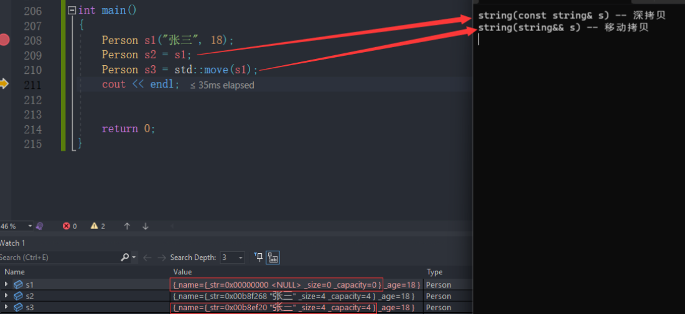

# C++11新的类功能

## 默认成员函数

原来C++类中，有6个默认成员函数：

> 1. 构造函数
> 2. 析构函数
> 3. 拷贝构造函数
> 4. 拷贝赋值重载
> 5. 取地址重载
> 6. const取地址重载

最后重要的是前4个，后两个用处不大。默认成员函数就是我们不写编译器会生成一个默认的。

C++11 新增了两个：**移动构造函数**和移**动赋值运算符重载**。

针对**移动构造函数**和**移动赋值运算符重载**有一些需要注意的点如下：

- 如果你没有自己实现**移动构造函数**，且没有实现**析构函数** 、**拷贝构造**、**拷贝赋值重载**中的任意一个。那么编译器会自动生成一个**默认移动构造**。默认生成的移动构造函数，对于**内置类型成员**会执行逐成员按**字节拷贝**，**自定义类型**成员，则需要**看这个成员是否实现移动构造**， 如果**实现了**就调用**移动构造**，**没有实现**就调用**拷贝构造**。
- 移动赋值重载同上规则相同
- 如果你提供了移动构造或者移动赋值，编译器不会自动提供拷贝构造和拷贝赋值。

以下代码在vs2013中不能体现，在vs2019下才能演示体现上面的特性。

```cpp
namespace phw {
    class string {
    public:
        typedef char *iterator;
        iterator begin() {
            return _str;
        }

        iterator end() {
            return _str + _size;
        }

        string(const char *str = "")
            : _size(strlen(str)), _capacity(_size) {
            //cout << "string(char* str)" << endl;

            _str = new char[_capacity + 1];
            strcpy(_str, str);
        }

        // s1.swap(s2)
        void swap(string &s) {
            ::swap(_str, s._str);
            ::swap(_size, s._size);
            ::swap(_capacity, s._capacity);
        }

        // 拷贝构造
        string(const string &s)
            : _str(nullptr) {
            cout << "string(const string& s) -- 深拷贝" << endl;

            string tmp(s._str);
            swap(tmp);
        }

        // 移动构造
        string(string &&s)
            : _str(nullptr) {
            cout << "string(string&& s) -- 移动拷贝" << endl;
            swap(s);
        }

        // 赋值重载
        string &operator=(const string &s) {
            cout << "string& operator=(string s) -- 深拷贝" << endl;
            string tmp(s);
            swap(tmp);

            return *this;
        }

        // s1 = 将亡值
        string &operator=(string &&s) {
            cout << "string& operator=(string&& s) -- 移动赋值" << endl;
            swap(s);

            return *this;
        }

        ~string() {
            //cout << "~string()" << endl;

            delete[] _str;
            _str = nullptr;
        }

        char &operator[](size_t pos) {
            return _str[pos];
        }

        void reserve(size_t n) {
            if (n > _capacity) {
                char *tmp = new char[n + 1];
                strcpy(tmp, _str);
                delete[] _str;
                _str = tmp;

                _capacity = n;
            }
        }

        void push_back(char ch) {
            if (_size >= _capacity) {
                size_t newcapacity = _capacity == 0 ? 4 : _capacity * 2;
                reserve(newcapacity);
            }

            _str[_size] = ch;
            ++_size;
            _str[_size] = '\0';
        }

        //string operator+=(char ch)
        string &operator+=(char ch) {
            push_back(ch);
            return *this;
        }

        string operator+(char ch) {
            string tmp(*this);
            tmp += ch;
            return tmp;
        }

        const char *c_str() const {
            return _str;
        }

    private:
        char *_str;
        size_t _size;
        size_t _capacity;// 不包含最后做标识的\0
    };

    //const bit::string& to_string(int value)
    phw::string to_string(int value) {
        bool flag = true;
        if (value < 0) {
            flag = false;
            value = 0 - value;
        }

        phw::string str;
        while (value > 0) {
            int x = value % 10;
            value /= 10;

            str += ('0' + x);
        }

        if (flag == false) {
            str += '-';
        }

        std::reverse(str.begin(), str.end());
        return str;
    }
}// namespace phw

// 以下代码在vs2013中不能体现，在vs2019下才能演示体现上面的特性。
class Person {
public:
    Person(const char *name = "", int age = 0)
        : _name(name), _age(age) {}

    Person(const Person &p)
        : _name(p._name), _age(p._age) {}

    Person &operator=(const Person &p) {
        if (this != &p) {
            _name = p._name;
            _age = p._age;
        }
        return *this;
    }

    // 强制生成移动构造和移动赋值
    Person(Person &&p) = default;
    Person &operator=(Person &&p) = default;

    ~Person() {
        cout << "~Person()" << endl;
    }

private:
    phw::string _name;// 自定义类型
    int _age = 1;     // 内置类型
};

int main() {
    Person s1("张三", 18);
    Person s2 = s1;
    Person s3 = std::move(s1);
    cout << endl;


    return 0;
}
```




## 关键字delete

`delete`关键字用于显式地禁用某些特殊成员函数或运算符，以阻止它们在特定的上下文中被调用或使用。

使用`delete`关键字，可以在类的声明中删除以下函数：

1.删除默认构造函数：

   ```cpp
   MyClass() = delete;
   ```

   这将禁用默认构造函数，阻止对象的无参创建。

2.删除复制构造函数和复制赋值运算符：

   ```cpp
   MyClass(const MyClass&) = delete;
   MyClass& operator=(const MyClass&) = delete;
   ```

   这将阻止对象的复制，即禁止使用拷贝构造函数和复制赋值运算符进行对象的复制。

3.删除移动构造函数和移动赋值运算符：

   ```cpp
   MyClass(MyClass&&) = delete;
   MyClass& operator=(MyClass&&) = delete;
   ```

   这将阻止对象的移动语义，即禁止使用移动构造函数和移动赋值运算符进行对象的移动操作。

4.删除析构函数：

   ```cpp
   ~MyClass() = delete;
   ```

   这将阻止对象的销毁，即禁止调用析构函数进行对象的内存释放。

通过使用`delete`关键字，可以在编译期间捕捉到一些潜在的错误或不正确的使用。例如，如果尝试复制或移动被删除的函数，编译器将会产生错误。

示例：

```cpp
class MySingleton {
private:
    MySingleton() = delete;  // 默认构造函数被删除
    MySingleton(const MySingleton&) = delete;  // 复制构造函数被删除
    MySingleton& operator=(const MySingleton&) = delete;  // 复制赋值运算符被删除

public:
    static MySingleton& getInstance() {
        static MySingleton instance;
        return instance;
    }

    void doSomething() {
        // 执行操作
    }
};

int main() {
    MySingleton& singleton = MySingleton::getInstance();
    singleton.doSomething();

    // 错误示例，尝试创建被删除的默认构造函数的对象
    // MySingleton singleton2;  // 编译错误

    return 0;
}

```

在上面的示例中，通过删除默认构造函数、复制构造函数和复制赋值运算符，实现了一个单例模式的类。这样，阻止了通过复制或拷贝方式创建多个实例。任何尝试复制的操作都会在编译时被捕获并产生错误。

总结来说，C++11的`delete`关键字为开发者提供了更大的灵活性，可以显式地删除某些函数，以避免在特定情况下的误用和错误。这是C++中一个强大的特性，有助于更好地控制类的行为和语义。


## 关键字default

`default` 关键字用于显式地表示编译器生成默认的函数实现。`default` 关键字可以用于构造函数、析构函数、复制构造函数、移动构造函数、复制赋值运算符和移动赋值运算符等特殊成员函数。这提供了一种简单而明确的方式来指示编译器生成默认的函数实现，从而避免了手动编写这些函数的冗余代码。

**作用**：

- **生成默认实现**：当一个类没有显式定义构造函数或析构函数时，编译器会自动生成默认的构造函数或析构函数。如果我们在类中使用了default关键字，则可以显式地告诉编译器使用默认的实现。
- **防止默认实现被删除**：在某些情况下，编译器不会生成默认的构造函数或析构函数，例如当类包含了一个用户自定义的构造函数或析构函数时。如果我们想要让编译器生成默认的实现，可以在类定义中使用default关键字来显式声明默认的构造函数或析构函数。

**示例**：

```cpp
#include <iostream>

class MyClass {
public:
    // 用户自定义的构造函数
    MyClass(int value) : value_(value) {
        std::cout << "User-defined constructor called with value: " << value_ << std::endl;
    }

    // 显式声明默认的构造函数
    MyClass() = default;

    // 用户自定义的析构函数
    ~MyClass() {
        std::cout << "User-defined destructor called for value: " << value_ << std::endl;
    }

    // 显式声明默认的复制构造函数
    MyClass(const MyClass&) = default;

    // 显式声明默认的复制赋值运算符
    MyClass& operator=(const MyClass&) = default;

    // 显式声明默认的移动构造函数
    MyClass(MyClass&&) = default;

    // 显式声明默认的移动赋值运算符
    MyClass& operator=(MyClass&&) = default;

    void display() const {
        std::cout << "Value: " << value_ << std::endl;
    }

private:
    int value_ = 0;  // 初始化为 0
};

int main() {
    MyClass obj1;  // 调用默认构造函数
    MyClass obj2(42);  // 调用用户自定义的构造函数
    MyClass obj3 = obj2;  // 调用默认的复制构造函数
    MyClass obj4 = std::move(obj2);  // 调用默认的移动构造函数

    obj1.display();
    obj3.display();
    obj4.display();

    obj1 = obj3;  // 调用默认的复制赋值运算符
    obj1 = std::move(obj4);  // 调用默认的移动赋值运算符

    return 0;
}

```

通过使用default，即使定义了自定义的构造函数和析构函数，仍然可以显式地要求编译器生成默认的实现。

**使用 `default` 的限制**

- 不能用于非特殊成员函数。
- 无法为默认参数提供具体的值。例如，不能为默认构造函数提供默认参数。


## final与override

在C++11标准中，关键字`final`和`override`用于类的继承和虚函数的重写。它们提供了一种显式的方法来控制和标记继承关系和函数重写。

### final

`final`关键字用于修饰类、虚函数或成员函数，表示它们不能被继承或重写。具体来说：

- 当应用于类时，`final`关键字表示该类不能被其他类继承。
- 当应用于虚函数时，`final`关键字表示该虚函数不能被派生类重写。


以下是使用`final`关键字的示例：

```c
class Base final {
    // ...
};

class Derived : public Base {  // 错误，无法继承被标记为final的类
    // ...
};

class Base {
public:
    virtual void foo() const final;
};

class Derived : public Base {
public:
    void foo() const override;  // 错误，无法重写被标记为final的虚函数
};


```

### override

`override`关键字用于显式地标记派生类中的成员函数，以表明它们是基类中虚函数的重写版本。使用`override`关键字可以增强代码的可读性和可维护性，并帮助编译器检测错误。如果函数签名不匹配，编译器会生成错误。例如，如果基类虚函数的参数或返回类型发生了变化，而派生类的函数没有相应更新，编译器会捕获这个错误。

以下是使用`override`关键字的示例：

```c
class Base {
public:
    virtual void foo() const{}
};

class Derived : public Base {
public:
    void foo() const override{}  // 表示该函数是基类虚函数的重写版本，
};

class Base {
public:
    virtual void foo() const{}
};

class Derived : public Base {
public:
    void foo() const{}  // 正确，没有使用override关键字重写基类的虚函数,编译器不会报错
};
```
