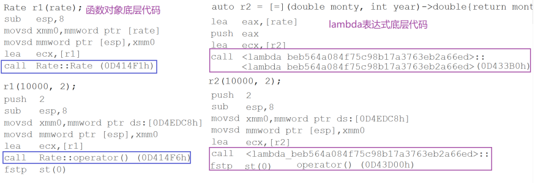

# C++11 Lambda表达式

## C++98中的一个例子

在C++98中，如果想要对一个数据集合中的元素进行排序，可以使用std::sort方法。

```cpp
#include <algorithm>
#include <functional>
int main() {
    int array[] = {4, 1, 8, 5, 3, 7, 0, 9, 2, 6};
    // 默认按照小于比较，排出来结果是升序
    std::sort(array, array + sizeof(array) / sizeof(array[0]));
    // 如果需要降序，需要改变元素的比较规则
    std::sort(array, array + sizeof(array) / sizeof(array[0]), greater<int>());
    return 0;
}
```

如果待排序元素为自定义类型，需要用户定义排序时的比较规则：

```cpp
#include <algorithm>
#include <string>
#include <vector>
using namespace std;

struct Goods {
    string _name; // 名字
    double _price;// 价格
    int _evaluate;// 评价
    Goods(const char *str, double price, int evaluate)
        : _name(str), _price(price), _evaluate(evaluate) {}
};
//价格降序
struct ComparePriceLess {
    bool operator()(const Goods &gl, const Goods &gr) {
        return gl._price < gr._price;
    }
};
//价格升序
struct ComparePriceGreater {
    bool operator()(const Goods &gl, const Goods &gr) {
        return gl._price > gr._price;
    }
};

int main() {
    vector<Goods> v = {{"苹果", 2.1, 5}, {"香蕉", 3, 4}, {"橙子", 2.2, 3}, {"菠萝", 1.5, 4}};
    sort(v.begin(), v.end(), ComparePriceLess());
    sort(v.begin(), v.end(), ComparePriceGreater());
}
```

随着C++语法的发展，**人们开始觉得上面的写法太复杂了，每次为了实现一个`algorithm`算法， 都要重新去写一个类，如果每次比较的逻辑不一样，还要去实现多个类，特别是相同类的命名， 这些都给编程者带来了极大的不便**。因此，在C++11语法中出现了`Lambda`表达式。


## Lambda表达式

Lambda表达式是C++11标准引入的一种匿名函数的方式。它提供了一种简洁、灵活的语法，可以在需要函数对象的地方定义和使用函数。

Lambda表达式的基本语法如下：

```cpp
[capture-list](parameter-list) -> return-type { 
    // 函数体
}
```

其中，各部分的含义如下：

- `capture-list`：指定要在lambda表达式中捕获的变量。捕获可以是值捕获（通过复制变量的值进行捕获）或引用捕获（通过引用绑定到变量）。捕获列表是可选的，如果没有捕获任何变量，则可以省略。
- `parameter-list`：指定lambda函数的参数列表，与普通函数的参数列表相似。参数列表是可选的，如果函数不需要参数，则可以省略。
- `return-type`：指定lambda函数的返回类型。返回类型可以省略，编译器会自动推导出返回类型。
- `{}`：lambda函数体的起始和结束标记。

上述代码可以使用C++11中的lambda表达式来解决

```cpp
struct Goods {
    string _name; // 名字
    double _price;// 价格
    int _evaluate;// 评价
    Goods(const char *str, double price, int evaluate)
        : _name(str), _price(price), _evaluate(evaluate) {}
};
struct ComparePriceLess {
    bool operator()(const Goods &gl, const Goods &gr) {
        return gl._price < gr._price;
    }
};
struct ComparePriceGreater {
    bool operator()(const Goods &gl, const Goods &gr) {
        return gl._price > gr._price;
    }
};


int main() {
    vector<Goods> v = {{"苹果", 2.1, 5}, {"香蕉", 3, 4}, {"橙子", 2.2, 3}, {"菠萝", 1.5, 4}};
    sort(v.begin(), v.end(), [](const Goods &g1, const Goods &g2) {
        return g1._price < g2._price;
    });
    sort(v.begin(), v.end(), [](const Goods &g1, const Goods &g2) {
        return g1._price > g2._price;
    });
    sort(v.begin(), v.end(), [](const Goods &g1, const Goods &g2) {
        return g1._evaluate < g2._evaluate;
    });
    sort(v.begin(), v.end(), [](const Goods &g1, const Goods &g2) {
        return g1._evaluate > g2._evaluate;
    });
}
```

可以看出lambda表达式实际是一个匿名函数。

> **注意**： 
>
> 在Lambda表达式定义中，**参数列表和返回值类型都是可选部分，而捕捉列表和函数体可以为空**。因此C++11中**最简单的Lambda表达式**为：[]{}; 该Lambda表达式不能做任何事情。

```cpp
int main() {
    // 最简单的lambda表达式, 该lambda表达式没有任何意义
    [] {};

    // 省略参数列表和返回值类型，返回值类型由编译器推导为int
    int a = 3, b = 4;
    [=] { return a + 3; };

    // 省略了返回值类型，无返回值类型
    auto fun1 = [&](int c) { b = a + c; };
    fun1(10);
    cout << a << " " << b << endl;

    // 各部分都很完善的lambda函数
    auto fun2 = [=, &b](int c) -> int { return b += a + c; };

    //cout << [=, &b](int c) -> int { return b += a + c; }(10);
    cout << fun2(10) << endl;

    // 复制捕捉x
    int x = 10;
    auto add_x = [x](int a) mutable { x *= 2; return a + x; };
    cout << add_x(10) << endl;
    return 0;
}
```

通过上述例子可以看出，Lambda表达式实际上可以理解为无名函数，该函数无法直接调用，如果想要直接调用，可借助auto将其赋值给一个变量。

### 捕获列表说明

**捕捉列表描述了上下文中那些数据可以被Lambda使用，以及使用的方式传值还是传引用。**

> - [var]：表示值传递方式捕捉变量var 
> - [=]：表示值传递方式捕获所有父作用域中的变量(包括this) 
> - [&var]：表示引用传递捕捉变量var 
> - [&]：表示引用传递捕捉所有父作用域中的变量(包括this) 
> - [this]：表示值传递方式捕捉当前的this指针

1. `[var]`：表示值传递方式捕获变量 `var`。Lambda函数会复制变量 `var` 的值，以便在函数体中使用。修改Lambda函数内部的变量 `var` 不会影响外部的变量。

```cpp
int x = 5;

auto Lambda = [x]() {
    // 使用值传递方式捕获的变量x
    std::cout << "Value of x: " << x << std::endl;
};

x = 10; // 修改外部变量x的值

Lambda(); // 输出: Value of x: 5
```

在上述示例中，Lambda函数通过值传递方式捕获了变量 `x` 的值。即使在Lambda函数外部修改了变量 `x` 的值，Lambda函数内部使用的是捕获时的复制，所以输出结果仍然是捕获时的值。

2. `[=]`：表示值传递方式捕获所有父作用域中的变量（包括 `this`）。Lambda函数会复制所有的外部变量的值，以便在函数体中使用。这样，Lambda函数可以在没有副作用的情况下访问所有的外部变量。

```cpp
int x = 5;
int y = 10;

auto lambda = [=]() {
    // 使用值传递方式捕获的变量x和y
    std::cout << "Value of x: " << x << std::endl;
    std::cout << "Value of y: " << y << std::endl;
};

x = 20;
y = 30;

lambda(); // 输出: Value of x: 5  Value of y: 10
```

在上述示例中，Lambda函数通过值传递方式捕获了变量 `x` 和 `y` 的值。即使在Lambda函数外部修改了变量的值，Lambda函数内部使用的是捕获时的复制，所以输出结果仍然是捕获时的值。

​	3.`[&var]`：表示引用传递捕获变量 `var`。Lambda函数通过引用绑定到变量 `var`，以便在函数体中使用。对变量 `var` 的修改会影响外部的变量。

```cpp
int x = 5;

auto lambda = [&x]() {
    // 使用引用传递方式捕获的变量x
    std::cout << "Value of x: " << x << std::endl;
};

x = 10; // 修改外部变量x的值

lambda(); // 输出: Value of x: 10
```

在上述示例中，Lambda函数通过引用传递方式捕获了变量 `x`。因为是通过引用绑定到变量，所以在Lambda函数内部访问的是同一个变量，所以输出结果会反映变量修改后的值。

4. `[&]`：表示引用传递捕获所有父作用域中的变量（包括 `this`）。Lambda函数通过引用绑定到所有的外部变量，以便在函数体中使用。对变量的修改会影响外部的变量。

```cpp
int x = 5;
int y = 10;

auto lambda = [&]() {
    // 使用引用传递方式捕获的变量x和y
    std::cout << "Value of x: " << x << std::endl;
    std::cout << "Value of y: " << y << std::endl;
};

x = 20;
y = 30;

lambda(); // 输出: Value of x: 20  Value of y: 30
```

在上述示例中，Lambda函数通过引用传递方式捕获了变量 `x` 和 `y`。因为是通过引用绑定到变量，所以在Lambda函数内部访问的是同一个变量，所以输出结果会反映变量修改后的值。

5. `[this]`：表示值传递方式捕获当前的 `this` 指针。Lambda函数会复制当前对象的 `this` 指针，以便在函数体中使用。通过捕获 `this`，Lambda函数可以访问当前对象的成员变量和成员函数。

```cpp
class MyClass {
public:
    void foo() {
        auto lambda = [this]() {
            // 使用值传递方式捕获的当前对象的this指针
            std::cout << "Value of member: " << member << std::endl;
            bar(); // 调用成员函数
        };

        lambda();
    }

private:
    int member = 5;

    void bar() {
        std::cout << "Inside bar()" << std::endl;
    }
};

MyClass obj;
obj.foo(); // 输出: Value of member: 5  Inside bar()
```

在上述示例中，Lambda函数通过值传递方式捕获了当前对象的 `this` 指针，并使用该指针访问了成员变量 `member` 和成员函数 `bar()`。

```cpp
int main() {
    int x = 0, y = 1;
    int m = 0, n = 1;

    auto swap1 = [](int &rx, int &ry) {
        int tmp = rx;
        rx = ry;
        ry = tmp;
    };

    swap1(x, y);
    cout << x << " " << y << endl;

    // 传值捕捉
    auto swap2 = [x, y]() mutable {
        int tmp = x;
        x = y;
        y = tmp;
    };

    swap2();
    cout << x << " " << y << endl;

    // 引用捕捉
    auto swap2 = [&x, &y]() {
        int tmp = x;
        x = y;
        y = tmp;
    };

    swap2();
    cout << x << " " << y << endl;

    // 混合捕捉
    auto func1 = [&x, y]() {
        //...
    };

    // 全部引用捕捉
    auto func2 = [&]() {
        //...
    };

    // 全部传值捕捉
    auto func3 = [=]() {
        //...
    };

    // 全部引用捕捉，x传值捕捉
    auto func4 = [&, x]() {
        //...
    };

    return 0;
}
```
> 注意： 
>
> a. 父作用域指包含lambda函数的语句块 
>
> b. 语法上捕捉列表可由多个捕捉项组成，并以逗号分割。 比如：[=, &a, &b]：以引用传递的方式捕捉变量a和b，值传递方式捕捉其他所有变量 [&，a, this]：值传递方式捕捉变量a和this，引用方式捕捉其他变量 
>
> c. 捕捉列表不允许变量重复传递，否则就会导致编译错误。 比如：[=, a]：=已经以值传递方式捕捉了所有变量，捕捉a重复
>
> d. 在块作用域以外的lambda函数捕捉列表必须为空。
>
> e. 在块作用域中的lambda函数仅能捕捉父作用域中局部变量，捕捉任何非此作用域或者非局部变量都会导致编译报错
>
> f. lambda表达式之间不能相互赋值，即使看起来类型相同

```cpp
void (*PF)();
int main() {
    auto f1 = [] { cout << "hello world" << endl; };
    auto f2 = [] { cout << "hello world" << endl; };
    // 此处先不解释原因，等lambda表达式底层实现原理看完后，大家就清楚了
    //f1 = f2;   // 编译失败--->提示找不到operator=()
    // 允许使用一个lambda表达式拷贝构造一个新的副本
    auto f3(f2);
    f3();
    // 可以将lambda表达式赋值给相同类型的函数指针
    PF = f2;
    PF();
    return 0;
}
```

### mutable

`mutable`是一个关键字，用于修饰Lambda表达式，表示Lambda函数体内的可变状态。默认情况下，Lambda函数体中捕获的变量是只读的，不允许修改。然而，有时候我们可能需要在Lambda函数体中修改这些变量的值，这就需要使用`mutable`关键字。

使用`mutable`关键字修饰Lambda函数后，可以在函数体内修改被捕获的变量。这对于需要在Lambda函数中维护一些内部状态或计数器等情况非常有用。

```cpp
#include <iostream>

int main() {
    int x = 0;

    auto lambda = [x]() mutable {
        x++;// 修改被捕获的变量x
        std::cout << "Value of x: " << x << std::endl;
    };

    /*  auto lambda = [&x]() {
        x++; // 修改被捕获的变量x
        std::cout << "Value of x: " << x << std::endl;
    } */

    lambda();// 输出: Value of x: 1
    lambda();// 输出: Value of x: 2

    std::cout << "Final value of x: " << x << std::endl;// 输出: Final value of x: 0

    return 0;
}
```

在上述示例中，Lambda函数通过值传递方式捕获了变量 `x`。由于使用了`mutable`关键字修饰，Lambda函数体内部可以修改被捕获的变量 `x` 的值。每次调用Lambda函数，`x` 的值都会递增，并输出相应的结果。

需要注意的是，`mutable`关键字只对Lambda函数体内的变量生效，对于通过引用传递方式捕获的变量，`mutable`不起作用。

使用`mutable`关键字需要谨慎，因为它使Lambda函数具有副作用，可能导致意外的结果。在使用`mutable`时，务必确保修改被捕获的变量不会引发竞态条件或其他问题。


## 函数对象与Lambda表达式

函数对象，又称为仿函数，即可以想函数一样使用的对象，就是在类中重载了operator()运算符的类对象。

```cpp
class Rate {
public:
    Rate(double rate) : _rate(rate) {}
    double operator()(double money, int year) { return money * _rate * year; }

private:
    double _rate;
};

int main() {
    // 函数对象
    double rate = 0.49;
    Rate r1(rate);
    r1(10000, 2);
    // Lambda
    auto r2 = [=](double monty, int year) -> double {
        return monty * rate * year;
    };
    r2(10000, 2);
    return 0;
}
```

从使用方式上来看，函数对象与lambda表达式完全一样。

函数对象将rate作为其成员变量，在定义对象时给出初始值即可，Lambda表达式通过捕获列表可以直接将该变量捕获到。

实际在底层编译器对于lambda表达式的处理方式，完全就是按照函数对象的方式处理的，即：如果定义了一个Lambda表达式，编译器会自动生成一个类(每次生产的类编号都不一样)，在该类中重载了operator()。

