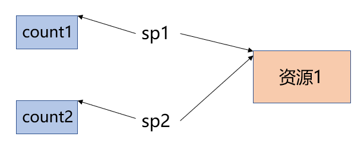
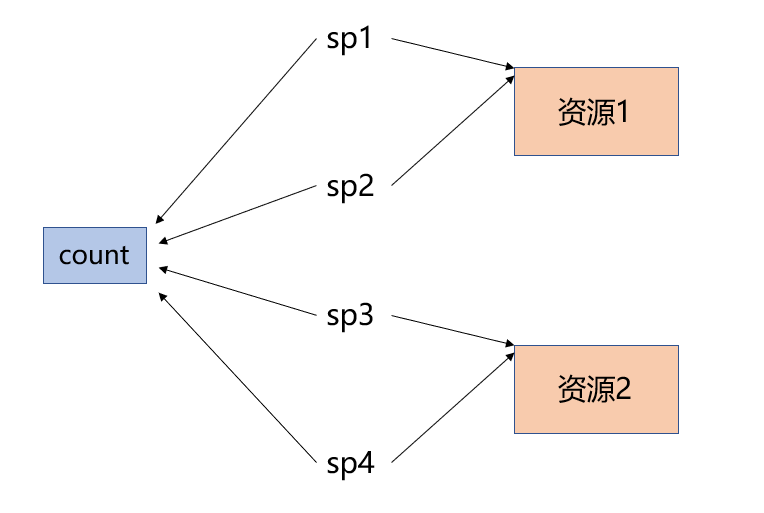
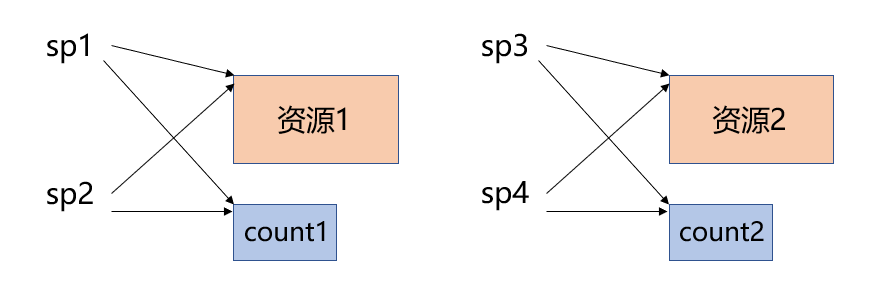
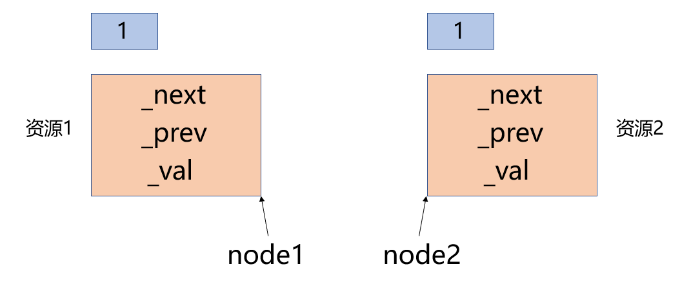
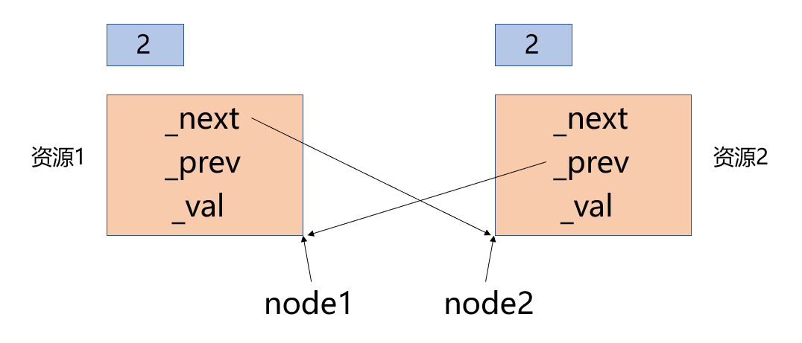
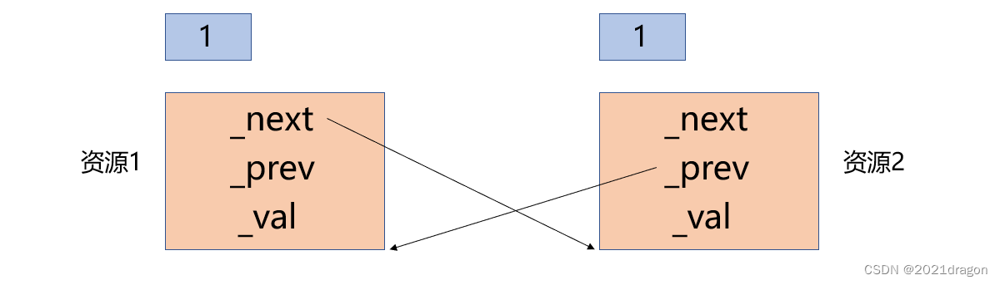

# 智能指针的使用

## 内存泄露问题

内存泄露是指因为疏忽或错误，造成程序未能释放已经不再使用的内存的情况。比如：

```cpp
#include <iostream>
#include <stdexcept>
using namespace std;
int div() {
    int a, b;
    cin >> a >> b;
    if (b == 0)
        throw invalid_argument("除0错误");
    return a / b;
}

void func() {
    int *ptr = new int;
    //...
    cout << div() << endl;
    //...
    delete ptr;
}

int main() {
    try {
        func();
    } catch (exception &e) {
        cout << e.what() << endl;
    }
    return 0;
}
```

执行上述代码时，如果用户输入的除数为0，那么div函数中就会抛出异常，这时程序的执行流会直接跳转到主函数中的catch块中执行，最终导致func函数中申请的内存资源没有得到释放。

**利用异常的重新捕获解决**

对于这种情况，我们可以在func函数中先对div函数中抛出的异常进行捕获，捕获后先将之前申请的内存资源释放，然后再将异常重新抛出。比如：

```cpp
#include <iostream>
#include <stdexcept>
using namespace std;

int div() {
    int a, b;
    cin >> a >> b;
    if (b == 0)
        throw invalid_argument("除0错误");
    return a / b;
}

void func() {
    int *ptr = new int;
    try {
        cout << div() << endl;
    } catch (...) {
        delete ptr;
        throw;
    }
    delete ptr;
}

int main() {
    try {
        func();
    } catch (exception &e) {
        cout << e.what() << endl;
    }
    return 0;
}
```

**利用智能指针解决**

上述问题也可以使用智能指针进行解决。比如：

```cpp
#include <iostream>
#include <stdexcept>
using namespace std;

template<class T>
class SmartPtr {
public:
    SmartPtr(T *ptr)
        : _ptr(ptr) {}

    ~SmartPtr() {
        cout << "delete: " << _ptr << endl;
        delete _ptr;
    }

    T &operator*() {
        return *_ptr;
    }
    
    T *operator->() {
        return _ptr;
    }

private:
    T *_ptr;
};

int div() {
    int a, b;
    cin >> a >> b;
    if (b == 0)
        throw invalid_argument("除0错误");
    return a / b;
}

void func() {
    SmartPtr<int> sp(new int);
    //...
    cout << div() << endl;
    //...
}

int main() {
    try {
        func();
    } catch (exception &e) {
        cout << e.what() << endl;
    }
    return 0;
}
```

代码中将申请到的内存空间交给了一个SmartPtr对象进行管理。

- 在构造SmartPtr对象时，SmartPtr将传入的需要被管理的内存空间保存起来。

- 在SmartPtr对象析构时，SmartPtr的析构函数中会自动将管理的内存空间进行释放。

- 此外，为了让SmartPtr对象能够像原生指针一样使用，还需要对`*`和`->`运算符进行重载。

这样一来，无论程序是正常执行完毕返回了，还是因为某些原因中途返回了，或是因为抛异常返回了，只要SmartPtr对象的生命周期结束就会调用其对应的析构函数，进而完成内存资源的释放。


# 智能指针的原理

实现智能指针时需要考虑以下三个方面的问题：

1. **在对象构造时获取资源，在对象析构的时候释放资源**，**利用对象的生命周期来控制程序资源**，即`RAII`特性。
2. 对`*`和`->`运算符进行重载，使得该对象具有像指针一样的行为。
3. 智能指针对象的拷贝问题。

**概念说明：** RAII，全称是 Resource Acquisition Is Initialization，翻译为"资源获取即初始化"，是C++中的一种编程技术。这种技术的主要思想是，将对象的生命周期与资源的管理绑定起来，当对象创建时获取资源，当对象销毁时自动释放资源。

使用RAII可以有效地防止资源泄露，避免因异常、错误返回或忘记手动释放资源而导致的问题。除了内存资源之外，RAII也可以用来管理诸如文件、线程、网络连接等其他资源。

**为什么要解决智能指针对象的拷贝问题?**

对于当前实现的SmartPtr类，如果用一个SmartPtr对象来拷贝构造另一个SmartPtr对象，或是将一个SmartPtr对象赋值给另一个SmartPtr对象，都会导致程序崩溃。比如：

```cpp
int main() {
    SmartPtr<int> sp1(new int);
    SmartPtr<int> sp2(sp1);//拷贝构造

    SmartPtr<int> sp3(new int);
    SmartPtr<int> sp4(new int);
    sp3 = sp4;//拷贝赋值

    return 0;
}
```

**原因如下：**

- 编译器默认生成的拷贝构造函数对内置类型完成值拷贝（浅拷贝），因此用sp1拷贝构造sp2后，相当于这sp1和sp2管理了同一块内存空间，当sp1和sp2析构时就会导致这块空间被释放两次。

- 编译器默认生成的拷贝赋值函数对内置类型也是完成值拷贝（浅拷贝），因此将sp4赋值给sp3后，相当于sp3和sp4管理的都是原来sp3管理的空间，当sp3和sp4析构时就会导致这块空间被释放两次，并且还会导致sp4原来管理的空间没有得到释放。

需要注意的是，智能指针就是要模拟原生指针的行为，当我们将一个指针赋值给另一个指针时，目的就是让这两个指针指向同一块内存空间，所以这里本就应该进行浅拷贝，但单纯的浅拷贝又会导致空间被多次释放，因此根据解决智能指针拷贝问题方式的不同，从而衍生出了不同版本的智能指针。


# C++中的智能指针
以下是智能指针常用的接口：

> 1. 构造函数：`shared_ptr<T>(T* ptr)`，`unique_ptr<T>(T* ptr)`。传入的T* ptr是原始指针。
> 
> 2. 拷贝构造函数：`shared_ptr<T>(const shared_ptr<T>& sp)`。注意，`unique_ptr`不支持拷贝构造。
> 
> 3. 赋值运算符：`shared_ptr& operator=(const shared_ptr& r)`。注意，`unique_ptr`不支持赋值运算。
> 
> 4. 解引用操作符：`T& operator*() const`。
> 
> 5. 成员访问操作符：`T* operator->() const`。
> 
> 6. get() 方法：`T* get() const`。返回内部的原始指针。
> 
> 7. reset() 方法：`void reset(T* ptr = nullptr)`。释放原有资源并可能接管新资源。
> 
> 8. swap() 方法：`void swap(shared_ptr<T>& other)`。
> 
> 9. operator bool() 方法：`explicit operator bool() const`。用于判断智能指针是否为空。
> 
> 10. use_count() 方法：`long use_count() const`。只对`shared_ptr`有效，返回当前资源的引用计数。
> 
> 11. unique() 方法：`bool unique() const`。只对`shared_ptr`有效，返回是否只有一个`shared_ptr`对象指向该资源。
> 
> 12. make_shared() 函数：用法为 `std::make_shared<T>(args...)`，用于创建一个`shared_ptr`智能指针并初始化资源。
> 
> 13. make_unique() 函数：用法为 `std::make_unique<T>(args...)`，用于创建一个`unique_ptr`智能指针并初始化资源。注意这个函数在C++14 标准库中被引入。

## auto_ptr

`auto_ptr`是C++标准库中的一种智能指针。它是一种管理动态分配的对象，以确保在适当的时候释放该对象的内存。这种智能指针在其生命周期结束时会自动释放其所指向的对象。

然而，要注意的是，`auto_ptr`已经在C++11中被废弃，在C++17中被移除，因为其拥有一些设计上的问题。取而代之的是`unique_ptr`，`shared_ptr`和`weak_ptr`。

以下是`auto_ptr`的一些主要特性：

1. 唯一所有权：`auto_ptr`实现了对动态分配对象的唯一所有权。一个对象在同一时间只能被一个`auto_ptr`所指向。如果通过赋值或者拷贝构造将一个`auto_ptr`赋予另一个`auto_ptr`，所有权就会被转移，原来的`auto_ptr`就失去了对对象的所有权。
2. 自动释放：当`auto_ptr`的生命周期结束时（例如，离开了它的作用域），它的析构函数就会被调用，从而释放其所拥有的动态分配对象。
3. 不支持数组：`auto_ptr`不支持动态分配的数组，只支持单一对象。如果尝试让`auto_ptr`管理一个动态数组，可能会导致undefined behavior。

以下是`std::auto_ptr`的一些常见接口：

> 1. 构造函数：
>
>    - `std::auto_ptr<T>()`：默认构造函数，创建一个空的`auto_ptr`。
>    - `std::auto_ptr<T>(T* ptr)`：使用指针`ptr`构造一个`auto_ptr`，将其管理。
>
> 2. 拷贝构造函数和拷贝赋值运算符：
>
>    - `std::auto_ptr<T>(std::auto_ptr<T>& other)`：拷贝构造函数，将另一个`auto_ptr`的所有权转移给当前对象。
>    - `std::auto_ptr<T>& operator=(std::auto_ptr<T>& other)`：拷贝赋值运算符，将另一个`auto_ptr`的所有权转移给当前对象。
>
> 3. 移动构造函数和移动赋值运算符：
>
>    - `std::auto_ptr<T>(std::auto_ptr<T>&& other)`：移动构造函数，将另一个`auto_ptr`的所有权移动给当前对象。
>    - `std::auto_ptr<T>& operator=(std::auto_ptr<T>&& other)`：移动赋值运算符，将另一个`auto_ptr`的所有权移动给当前对象。
>
> 4. 成员函数：
>
>    - `T* get()`：获取`auto_ptr`所管理的指针。
>    - `T* release()`：释放`auto_ptr`对指针的所有权，并返回指针。
>    - `void reset(T* ptr = nullptr)`：重置`auto_ptr`，将其管理的指针指向`ptr`，原来的指针会被销毁。
>    - `T* operator->()`：返回`auto_ptr`所管理的指针，用于通过指针访问对象的成员函数。
>    - `T& operator*()`：返回`auto_ptr`所管理的指针指向的对象的引用。
```cpp
#include <memory>
using namespace std;
int main() {
    auto_ptr<int> ap1(new int(1));
    auto_ptr<int> ap2(ap1);
    *ap2 = 10;
    //*ap1 = 20; //error

    auto_ptr<int> ap3(new int(1));
    auto_ptr<int> ap4(new int(2));
    ap3 = ap4;
    return 0;
}
```

一个对象的管理权转移后也就意味着，该对象不能再用对原来管理的资源进行访问了，否则程序就会崩溃，因此使用auto_ptr之前必须先了解它的机制，否则程序很容易出问题，很多公司也都明确规定了禁止使用auto_ptr。

### auto_ptr的模拟实现

简易版的auto_ptr的实现步骤如下：

1. 在构造函数中获取资源，在析构函数中释放资源，利用对象的生命周期来控制资源。
2. 对*和->运算符进行重载，使auto_ptr对象具有指针一样的行为。
3. 在拷贝构造函数中，用传入对象管理的资源来构造当前对象，并将传入对象管理资源的指针置空。
4. 在拷贝赋值函数中，先将当前对象管理的资源释放，然后再接管传入对象管理的资源，最后将传入对象管理资源的指针置空。

**代码如下**：

```cpp
template<class T>
class auto_ptr {
private:
    T *_ptr;//管理的资源
public:
    //RAII
    auto_ptr(T *ptr = nullptr)
        : _ptr(ptr) {}

    ~auto_ptr() {
        if (_ptr != nullptr) {
            cout << "delete: " << _ptr << endl;
            delete _ptr;
            _ptr = nullptr;
        }
    }

    auto_ptr(auto_ptr<T> &ap)
        : _ptr(ap._ptr) {
        ap._ptr = nullptr;//管理权转移后ap被置空
    }

    auto_ptr &operator=(auto_ptr<T> &ap) {
        if (this != &ap) {
            delete _ptr;      //释放自己管理的资源
            _ptr = ap._ptr;   //接管ap对象的资源
            ap._ptr = nullptr;//管理权转移后ap被置空
        }
        return *this;
    }
    //可以像指针一样使用
    T &operator*() {
        return *_ptr;
    }

    T *operator->() {
        return _ptr;
    }
};
```

## unique_ptr

`unique_ptr`是C++11中引入的一种智能指针，它用来管理在堆上动态分配的资源。`unique_ptr`的设计目标是拥有单一所有权，即在任何时刻一个`unique_ptr`实例都只能拥有一个对象的所有权。

以下是`unique_ptr`的一些关键特性：

1. **独占所有权**: `unique_ptr`实现了严格的所有权政策。一个特定的对象一次只能由一个`unique_ptr`实例拥有。如果你尝试将一个`unique_ptr`赋给另一个，你将得到一个编译错误。但是，你可以使用`std::move`将所有权从一个`unique_ptr`移动到另一个。
2. **自动释放**: 当`unique_ptr`实例被销毁（例如，离开其作用域或被`delete`）时，它会自动删除其拥有的对象。
3. **自定义删除器**: `unique_ptr`允许你指定一个自定义删除器，这个删除器是在`unique_ptr`销毁其所有的对象时被调用的函数或函数对象。这使得`unique_ptr`可以用于管理不同类型的资源，如文件、网络连接等。
4. **支持数组**: `unique_ptr`可以处理动态数组。如果`unique_ptr`是用来管理一个动态数组（例如`std::unique_ptr<int[]> ptr(new int[10])`），那么它会在需要的时候自动使用`delete[]`来释放资源。
5. **转移语义**: `unique_ptr`支持转移语义，可以将资源的所有权安全地从一个`unique_ptr`转移给另一个`unique_ptr`。转移后，原`unique_ptr`不再拥有任何资源，也不能对其进行访问。
6. **与STL容器兼容**: 与`auto_ptr`不同，`unique_ptr`可以安全地存储在STL容器中。

**示例**：

```cpp
int main(){
	std::unique_ptr<int> up1(new int(0));
	//std::unique_ptr<int> up2(up1); //error
	return 0;
}
```

当进行拷贝构造，编译器会直接报错！

但防拷贝其实也不是一个很好的办法，因为总有一些场景需要进行拷贝。

### unique_ptr的模拟实现

简易版的unique_ptr的实现步骤如下：

1. 在构造函数中获取资源，在析构函数中释放资源，利用对象的生命周期来控制资源。
2. 对`*`和`->`运算符进行重载，使unique_ptr对象具有指针一样的行为。
3. 用C++98的方式将拷贝构造函数和拷贝赋值函数声明为私有，或者用C++11的方式在这两个函数后面加上`=delete`，防止外部调用。

**代码如下**：

```cpp
template<class T>
class unique_ptr {
public:
    //RAII
    unique_ptr(T *ptr = nullptr)
        : _ptr(ptr) {}
    
    ~unique_ptr() {
        if (_ptr != nullptr) {
            cout << "delete: " << _ptr << endl;
            delete _ptr;
            _ptr = nullptr;
        }
    }
    //可以像指针一样使用
    T &operator*() {
        return *_ptr;
    }
    
    T *operator->() {
        return _ptr;
    }
    //防拷贝
    unique_ptr(unique_ptr<T> &up) = delete;
    unique_ptr &operator=(unique_ptr<T> &up) = delete;

private:
    T *_ptr;//管理的资源
};
```

## shared_ptr

`shared_ptr`是C++11中引入的一种智能指针，用于共享所有权的情况。与`unique_ptr`不同，`shared_ptr`允许多个智能指针指向同一个对象，也就是说，一个对象可以有多个`shared_ptr`拥有。

以下是`shared_ptr`的一些关键特性：

1. **共享所有权**: 多个`shared_ptr`可以共同拥有一个对象的所有权，这意味着一个对象可以被多个`shared_ptr`指向，且每个`shared_ptr`都拥有该对象。
2. **自动释放**: 当最后一个拥有对象的`shared_ptr`被销毁或者失去所有权时（例如，被赋予新的对象），该对象会自动被删除。这是通过引用计数实现的，每当一个新的`shared_ptr`指向对象，引用计数就加一，当`shared_ptr`失去所有权时引用计数减一，当引用计数达到零时对象被删除。
3. **循环引用问题**: 当两个对象互相拥有对方的`shared_ptr`时，就会形成循环引用，导致两个对象都无法被释放。为了解决这个问题，C++11引入了`std::weak_ptr`。
4. **线程安全**: `shared_ptr`的设计是线程安全的，当在多线程环境中使用`shared_ptr`时，它的引用计数操作是原子的，可以避免竞态条件。
5. **自定义删除器**: 与`unique_ptr`一样，`shared_ptr`也支持自定义删除器。
6. **支持数组**: `shared_ptr`不直接支持数组类型，但可以通过自定义删除器让它支持数组类型。

### 引用计数

shared_ptr通过引用计数的方式解决智能指针的拷贝问题。

- 每一个被管理的资源都有一个对应的引用计数，通过这个引用计数记录着当前有多少个对象在管理着这块资源。

- 当新增一个对象管理这块资源时则将该资源对应的引用计数进行`++`，当一个对象不再管理这块资源或该对象被析构时则将该资源对应的引用计数进行`--`。

- 当一个资源的引用计数减为0时说明已经没有对象在管理这块资源了，这时就可以将该资源进行释放了。

通过这种引用计数的方式就能支持多个对象一起管理某一个资源，也就是支持了智能指针的拷贝，并且只有当一个资源对应的引用计数减为0时才会释放资源，因此保证了同一个资源不会被释放多次。比如：

```cpp
#include<memory>
#include<iostream>
using namespace std;

int main() {
    shared_ptr<int> sp1(new int(1));
    shared_ptr<int> sp2(sp1);
    *sp1 = 10;
    *sp2 = 20;
    cout << sp1.use_count() << endl;//2

    shared_ptr<int> sp3(new int(1));
    shared_ptr<int> sp4(new int(2));
    sp3 = sp4;
    cout << sp3.use_count() << endl;//2
    return 0;
}
```

**说明一下：** use_count成员函数，用于获取当前对象管理的资源对应的引用计数。

### shared_ptr的模拟实现

简易版的shared_ptr的实现步骤如下：

1. 在shared_ptr类中增加一个成员变量count，表示智能指针对象管理的资源对应的引用计数。
2. 在构造函数中获取资源，并将该资源对应的引用计数设置为1，表示当前只有一个对象在管理这个资源。
3. 在拷贝构造函数中，与传入对象一起管理它管理的资源，同时将该资源对应的引用计数++。
4. 在拷贝赋值函数中，先将当前对象管理的资源对应的引用计数--（如果减为0则需要释放），然后再与传入对象一起管理它管理的资源，同时需要将该资源对应的引用计数++。
5. 在析构函数中，将管理资源对应的引用计数--，如果减为0则需要将该资源释放。
6. 对*和->运算符进行重载，使shared_ptr对象具有指针一样的行为。

**代码如下**：

```cpp
template<class T>
class shared_ptr {
private:
    T *_ptr;     //管理的资源
    int *_pcount;//管理的资源对应的引用计数

public:
    //RAII
    shared_ptr(T *ptr = nullptr)
        : _ptr(ptr), _pcount(new int(1)) {}

    ~shared_ptr() {
        if (--(*_pcount) == 0) {
            if (_ptr != nullptr) {
                cout << "delete: " << _ptr << endl;
                delete _ptr;
                _ptr = nullptr;
            }
            delete _pcount;
            _pcount = nullptr;
        }
    }

    shared_ptr(const shared_ptr<T> &sp)
        : _ptr(sp._ptr), _pcount(sp._pcount) {
        (*_pcount)++;
    }

    shared_ptr &operator=(const shared_ptr<T> &sp) {
        if (_ptr != sp._ptr) {      //管理同一块空间的对象之间无需进行赋值操作
            if (--(*_pcount) == 0) {//将管理的资源对应的引用计数--
                cout << "delete: " << _ptr << endl;
                delete _ptr;
                delete _pcount;
            }
            _ptr = sp._ptr;      //与sp对象一同管理它的资源
            _pcount = sp._pcount;//获取sp对象管理的资源对应的引用计数
            (*_pcount)++;        //新增一个对象来管理该资源，引用计数++，增加的是新增的引用计数
        }
        return *this;
    }
    
    T *get() const {
        return _ptr;
    }
    
    //获取引用计数
    int use_count() {
        return *_pcount;
    }
    //可以像指针一样使用
    T &operator*() {
        return *_ptr;
    }

    T *operator->() {
        return _ptr;
    }
};
```

**为什么引用计数需要存放在堆区？**

首先，shared_ptr中的引用计数count不能单纯的定义成一个int类型的成员变量，因为这就意味着每个shared_ptr对象都有一个自己的count成员变量，而当多个对象要管理同一个资源时，这几个对象应该用到的是同一个引用计数。

如下图：




其次，shared_ptr中的引用计数count也不能定义成一个静态的成员变量，因为静态成员变量是所有类型对象共享的，这会导致管理相同资源的对象和管理不同资源的对象用到的都是同一个引用计数。

如下图：




而如果将shared_ptr中的引用计数count定义成一个指针，当一个资源第一次被管理时就在堆区开辟一块空间用于存储其对应的引用计数，如果有其他对象也想要管理这个资源，那么除了将这个资源给它之外，还需要把这个引用计数也给它。

这时管理同一个资源的多个对象访问到的就是同一个引用计数，而管理不同资源的对象访问到的就是不同的引用计数了，相当于将各个资源与其对应的引用计数进行了绑定。

如下图：




但同时需要注意，由于引用计数的内存空间也是在堆上开辟的，因此当一个资源对应的引用计数减为0时，除了需要将该资源释放，还需要将该资源对应的引用计数的内存空间进行释放。

### shared_ptr的线程安全问题

当前模拟实现的shared_ptr还存在线程安全的问题，由于管理同一个资源的多个对象的引用计数是共享的，因此多个线程可能会同时对同一个引用计数进行自增或自减操作，而自增和自减操作都不是原子操作，因此需要通过加锁来对引用计数进行保护，否则就会导致线程安全问题。

比如下面代码中用一个shared_ptr管理一个整型变量，然后用两个线程分别对这个shared_ptr对象进行1000次拷贝操作，这些对象被拷贝出来后又会立即被销毁。比如：

```cpp
#include <iostream>
#include <thread>
template<class T>
class shared_ptr {
private:
    T* _ptr;     //管理的资源
    int* _pcount;//管理的资源对应的引用计数

public:
    //RAII
    shared_ptr(T* ptr = nullptr)
        : _ptr(ptr), _pcount(new int(1)) {}

    ~shared_ptr() {
        if (--(*_pcount) == 0) {
            if (_ptr != nullptr) {
                std::cout << "delete: " << _ptr << std::endl;
                delete _ptr;
                _ptr = nullptr;
            }
            delete _pcount;
            _pcount = nullptr;
        }
    }

    shared_ptr(const shared_ptr<T>& sp)
        : _ptr(sp._ptr), _pcount(sp._pcount) {
        (*_pcount)++;
    }

    shared_ptr& operator=(const shared_ptr<T>& sp) {
        if (_ptr != sp._ptr) {      //管理同一块空间的对象之间无需进行赋值操作
            if (--(*_pcount) == 0) {//将管理的资源对应的引用计数--
                std::cout << "delete: " << _ptr << std::endl;
                delete _ptr;
                delete _pcount;
            }
            _ptr = sp._ptr;      //与sp对象一同管理它的资源
            _pcount = sp._pcount;//获取sp对象管理的资源对应的引用计数
            (*_pcount)++;        //新增一个对象来管理该资源，引用计数++，增加的是新增的引用计数
        }
        return *this;
    }
   	
    T *get() const {
    	return _ptr;
    }
    //获取引用计数
    int use_count() {
        return *_pcount;
    }
    //可以像指针一样使用
    T& operator*() {
        return *_ptr;
    }

    T* operator->() {
        return _ptr;
    }
};

void func(shared_ptr<int> sp, size_t n) {
    for (size_t i = 0; i < n; i++) {
        shared_ptr<int> copy(sp);
    }
}

int main() {
    shared_ptr<int> p(new int(0));

    const size_t n = 1000;
    std::thread t1(func, p, n);
    std::thread t2(func, p, n);

    t1.join();
    t2.join();

    std::cout << p.use_count() << std::endl;//预期：1

    return 0;
}
```

在这个过程中两个线程会不断对引用计数进行自增和自减操作，理论上最终两个线程执行完毕后引用计数的值应该是1，因为拷贝出来的对象都被销毁了，只剩下最初的shared_ptr对象还在管理这个整型变量，但每次运行程序得到引用计数的值可能都是不一样的，根本原因就是因为对引用计数的自增和自减不是原子操作。

> **加锁解决线程安全问题**

要解决引用计数的线程安全问题，本质就是要让对引用计数的自增和自减操作变成一个原子操作，因此可以对引用计数的操作进行加锁保护，也可以用原子类atomic对引用计数进行封装，这里以加锁为例。

- 在shared_ptr类中新增互斥锁成员变量，为了让管理同一个资源的多个线程访问到的是同一个互斥锁，管理不同资源的线程访问到的是不同的互斥锁，因此互斥锁也需要在堆区创建。

- 在调用拷贝构造函数和拷贝赋值函数时，除了需要将对应的资源和引用计数交给当前对象管理之外，还需要将对应的互斥锁也交给当前对象。

- 当一个资源对应的引用计数减为0时，除了需要将对应的资源和引用计数进行释放，由于互斥锁也是在堆区创建的，因此还需要将对应的互斥锁进行释放。

- 为了简化代码逻辑，可以将拷贝构造函数和拷贝赋值函数中引用计数的自增操作提取出来，封装成AddRef函数，将拷贝赋值函数和析构函数中引用计数的自减操作提取出来，封装成ReleaseRef函数，这样就只需要对AddRef和ReleaseRef函数进行加锁保护即可。

**代码如下**：

```cpp
#include <iostream>
#include <mutex>

template<class T>
class shared_ptr {
private:
    T *_ptr;            //管理的资源
    int *_pcount;       //管理的资源对应的引用计数
    std::mutex *_pmutex;//管理的资源对应的互斥锁

private:
    //++引用计数
    void AddRef() {
        _pmutex->lock();
        (*_pcount)++;
        _pmutex->unlock();
    }

    //--引用计数
    void ReleaseRef() {
        _pmutex->lock();
        bool flag = false;
        if (--(*_pcount) == 0) {//将管理的资源对应的引用计数--
            if (_ptr != nullptr) {
                cout << "delete: " << _ptr << endl;
                delete _ptr;
                _ptr = nullptr;
            }
            delete _pcount;
            _pcount = nullptr;
            flag = true;
        }
        _pmutex->unlock();
        if (flag == true) {
            delete _pmutex;
        }
    }

public:
    //RAII
    shared_ptr(T *ptr = nullptr)
        : _ptr(ptr), _pcount(new int(1)), _pmutex(new std::mutex) {}

    ~shared_ptr() {
        ReleaseRef();
    }

    shared_ptr(shared_ptr<T> &sp)
        : _ptr(sp._ptr), _pcount(sp._pcount), _pmutex(sp._pmutex) {
        AddRef();
    }

    shared_ptr &operator=(shared_ptr<T> &sp) {
        if (_ptr != sp._ptr) {   //管理同一块空间的对象之间无需进行赋值操作
            ReleaseRef();        //将管理的资源对应的引用计数--
            _ptr = sp._ptr;      //与sp对象一同管理它的资源
            _pcount = sp._pcount;//获取sp对象管理的资源对应的引用计数
            _pmutex = sp._pmutex;//获取sp对象管理的资源对应的互斥锁
            AddRef();            //新增一个对象来管理该资源，引用计数++
        }
        return *this;
    }
    
    T *get() const {
    	return _ptr;
    }
    //获取引用计数
    int use_count() {
        return *_pcount;
    }
    //可以像指针一样使用
    T &operator*() {
        return *_ptr;
    }
    
    T *operator->() {
        return _ptr;
    }
};
```

**说明一下：**

- 在ReleaseRef函数中，当引用计数被减为0时需要释放互斥锁资源，但不能在临界区中释放互斥锁，因为后面还需要进行解锁操作，因此代码中借助了一个flag变量，通过flag变量来判断解锁后释放需要释放互斥锁资源。

- shared_ptr只需要保证引用计数的线程安全问题，而不需要保证管理的资源的线程安全问题，就像原生指针管理一块内存空间一样，原生指针只需要指向这块空间，而这块空间的线程安全问题应该由这块空间的操作者来保证。

### shared_ptr的定制删除器

当智能指针对象的生命周期结束时，所有的智能指针默认都是以`delete`的方式将资源释放，这是不太合适的，因为智能指针并不是只管理以`new`方式申请到的内存空间，智能指针管理的也可能是以`new[]`的方式申请到的空间，或管理的是一个文件指针。比如：

```cpp
struct ListNode {
    ListNode *_next;
    ListNode *_prev;
    int _val;
    ~ListNode() {
        std::cout << "~ListNode()" << std::endl;
    }
};

int main() {
    shared_ptr<ListNode> sp1(new ListNode[10]);  //error
    shared_ptr<FILE> sp2(fopen("test.cpp", "r"));//error

    return 0;
}
```

这时当智能指针对象的生命周期结束时，再以`delete`的方式释放管理的资源就会导致程序崩溃，因为以`new[]`的方式申请到的内存空间必须以`delete[]`的方式进行释放，而文件指针必须通过调用`fclose`函数进行释放。

这时就需要用到定制删除器来控制释放资源的方式，C++标准库中的shared_ptr提供了如下构造函数：

```cpp
template <class U, class D>
shared_ptr (U* p, D del);
```

**参数说明：**

- p：需要让智能指针管理的资源。
- del：删除器，这个删除器是一个可调用对象，比如函数指针、仿函数、lambda表达式以及被包装器包装后的可调用对象。

当shared_ptr对象的生命周期结束时就会调用传入的删除器完成资源的释放，调用该删除器时会将shared_ptr管理的资源作为参数进行传入。

因此当智能指针管理的资源不是以`new`的方式申请到的内存空间时，就需要在构造智能指针对象时传入定制的删除器。比如：

```cpp
#include <functional>
#include <memory>
#include <iostream>

struct ListNode {
    ListNode *_next;
    ListNode *_prev;
    int _val;
    ~ListNode() {
        std::cout << "~ListNode()" << std::endl;
    }
};

template<class T>
struct DelArr {
    void operator()(const T *ptr) {
        std::cout << "delete[]: " << ptr << std::endl;
        delete[] ptr;
    }
};

int main() {
    std::shared_ptr<ListNode> sp1(new ListNode[10], DelArr<ListNode>());
    std::shared_ptr<FILE> sp2(fopen("test.cpp", "r"), [](FILE *ptr) {
        std::cout << "fclose: " << ptr << std::endl;
        fclose(ptr);
    });

    return 0;
}

// out
fclose: 0x7ffa944eda90
delete[]: 0x268bce45d58
~ListNode()
~ListNode()
~ListNode()
~ListNode()
~ListNode()
~ListNode()
~ListNode()
~ListNode()
~ListNode()
~ListNode()
```

#### 定制删除器的模拟实现

定制删除器的实现问题：

- C++标准库中实现shared_ptr时是分成了很多个类的，因此C++标准库中可以将删除器的类型设置为构造函数的模板参数，然后将删除器的类型在各个类之间进行传递。

- 但我们是直接用一个类来模拟实现shared_ptr的，因此不能将删除器的类型设置为构造函数的模板参数。因为删除器不是在构造函数中调用的，而是需要在ReleaseRef函数中进行调用，因此势必需要用一个成员变量将删除器保存下来，而在定义这个成员变量时就需要指定删除器的类型，因此这里模拟实现的时候不能将删除器的类型设置为构造函数的模板参数。
- 要在当前模拟实现的shared_ptr的基础上支持定制删除器，就只能给shared_ptr类再增加一个模板参数，在构造shared_ptr对象时就需要指定删除器的类型。然后增加一个支持传入删除器的构造函数，在构造对象时将删除器保存下来，在需要释放资源的时候调用该删除器进行释放即可。最好在设置一个默认的删除器，如果用户定义shared_ptr对象时不传入删除器，则默认以delete的方式释放资源。

```cpp
template<class T>
struct Delete {
    void operator()(const T *ptr) {
        delete ptr;
    }
};

template<class T>
struct DelArr {
    void operator()(const T *ptr) {
        std::cout << "delete[]: " << ptr << std::endl;
        delete[] ptr;
    }
};

template<class T, class D = Delete<T>>
class shared_ptr {
private:
    T *_ptr;            //管理的资源
    int *_pcount;       //管理的资源对应的引用计数
    std::mutex *_pmutex;//管理的资源对应的互斥锁
    D _del;             //管理的资源对应的删除器
private:
    //++引用计数
    void AddRef() {
        _pmutex->lock();
        (*_pcount)++;
        _pmutex->unlock();
    }

    //--引用计数
    void ReleaseRef() {
        _pmutex->lock();
        bool flag = false;
        if (--(*_pcount) == 0) {//将管理的资源对应的引用计数--
            if (_ptr != nullptr) {
                std::cout << "delete: " << _ptr << std::coutendl;
                _del(_ptr);//使用定制删除器释放资源
                _ptr = nullptr;
            }
            delete _pcount;
            _pcount = nullptr;
            flag = true;
        }
        _pmutex->unlock();
        if (flag == true) {
            delete _pmutex;
        }
    }

public:
    //RAII
    shared_ptr(T *ptr = nullptr)
        : _ptr(ptr), _pcount(new int(1)), _pmutex(new std::mutex) {}

    //增加一个支持定制删除器的构造函数
    shared_ptr(T *ptr, D del)
        : _ptr(ptr), _pcount(new int(1)), _pmutex(new std::mutex), _del(del) {}

    ~shared_ptr() {
        ReleaseRef();
    }

    shared_ptr(shared_ptr<T> &sp)
        : _ptr(sp._ptr), _pcount(sp._pcount), _pmutex(sp._pmutex) {
        AddRef();
    }

    shared_ptr &operator=(shared_ptr<T> &sp) {
        if (_ptr != sp._ptr) {   //管理同一块空间的对象之间无需进行赋值操作
            ReleaseRef();        //将管理的资源对应的引用计数--
            _ptr = sp._ptr;      //与sp对象一同管理它的资源
            _pcount = sp._pcount;//获取sp对象管理的资源对应的引用计数
            _pmutex = sp._pmutex;//获取sp对象管理的资源对应的互斥锁
            AddRef();            //新增一个对象来管理该资源，引用计数++
        }
        return *this;
    }
    
    T *get() const {
    	return _ptr;
    }
    //获取引用计数
    int use_count() {
        return *_pcount;
    }
    //可以像指针一样使用
    T &operator*() {
        return *_ptr;
    }

    T *operator->() {
        return _ptr;
    }
};
```

这时我们模拟实现的shared_ptr就支持定制删除器了，但是使用起来没有C++标准库中的那么方便。

- 如果传入的删除器是一个仿函数，那么需要在构造shared_ptr对象时指明仿函数的类型。

- 如果传入的删除器是一个lambda表达式就更麻烦了，因为lambda表达式的类型不太容易获取。这里可以将lambda表达式的类型指明为一个包装器类型，让编译器传参时自行进行推演，也可以先用auto接收lambda表达式，然后再用decltype来声明删除器的类型。

```cpp
struct ListNode {
    ListNode *_next;
    ListNode *_prev;
    int _val;
    ~ListNode() {
        std::cout << "~ListNode()" << std::endl;
    }
};

template<class T>
struct DelArr {
    void operator()(const T *ptr) {
        std::cout << "delete[]: " << ptr << std::endl;
        delete[] ptr;
    }
};

int main() {
    //仿函数示例
    shared_ptr<ListNode, DelArr<ListNode>> sp1(new ListNode[10], DelArr<ListNode>());

    //lambda示例1
    shared_ptr<FILE, std::function<void(FILE *)>> sp2(fopen("test.cpp", "r"), [](FILE *ptr) {
        std::cout << "fclose: " << ptr << std::endl;
        fclose(ptr);
    });

    //lambda示例2
    auto f = [](FILE *ptr) {
        std::cout << "fclose: " << ptr << std::endl;
        fclose(ptr);
    };
    
    shared_ptr<FILE, decltype(f)> sp3(fopen("test.cpp", "r"), f);

    return 0;
}
```

### shared_ptr的循环引用问题

shared_ptr的循环引用问题在一些特定的场景下才会产生。比如定义如下的结点类，并在结点类的析构函数中打印一句提示语句，便于判断结点是否正确释放。

```cpp
struct ListNode{
	ListNode* _next;
	ListNode* _prev;
	int _val;
	~ListNode()
	{
		std::cout << "~ListNode()" << std::endl;
	}
};
```

现在以`new`的方式在堆上构建两个结点，并将这两个结点连接起来，在程序的最后以`delete`的方式释放这两个结点。比如：

```cpp
int main() {
    ListNode *node1 = new ListNode;
    ListNode *node2 = new ListNode;

    node1->_next = node2;
    node2->_prev = node1;
    //...
    delete node1;
    delete node2;
    return 0;
}
```

上述程序是没有问题的，两个结点都能够正确释放。为了防止程序中途返回或抛异常等原因导致结点未被释放，我们将这两个结点分别交给两个shared_ptr对象进行管理，这时为了让连接节点时的赋值操作能够执行，就需要把ListNode类中的next和prev成员变量的类型也改为shared_ptr类型。比如：

```cpp
struct ListNode {
    std::shared_ptr<ListNode> _next;
    std::shared_ptr<ListNode> _prev;
    int _val;
    ~ListNode() {
        std::cout << "~ListNode()" << std::endl;
    }
};

int main() {
    std::shared_ptr<ListNode> node1(new ListNode);
    std::shared_ptr<ListNode> node2(new ListNode);

    node1->_next = node2;
    node2->_prev = node1;
    //...

    return 0;
}
```

这时程序运行结束后两个结点都没有被释放，但如果去掉连接结点时的两句代码中的任意一句，那么这两个结点就都能够正确释放，根本原因就是因为这两句连接结点的代码导致了循环引用。

当以new的方式申请到两个ListNode结点并交给两个智能指针管理后，这两个资源对应的引用计数都被加到了1。如下图：




将这两个结点连接起来后，资源1当中的next成员与node2一同管理资源2，资源2中的prev成员与node1一同管理资源1，此时这两个资源对应的引用计数都被加到了2。如下图：




当出了main函数的作用域后，node1和node2的生命周期也就结束了，因此这两个资源对应的引用计数最终都减到了1。如下图：



**循环引用导致资源未被释放的原因**：

- 当资源对应的引用计数减为0时对应的资源才会被释放，因此资源1的释放取决于资源2当中的prev成员，而资源2的释放取决于资源1当中的next成员。
- 而资源1当中的next成员的释放又取决于资源1，资源2当中的prev成员的释放又取决于资源2，于是这就变成了一个死循环，最终导致资源无法释放。

而如果连接结点时只进行一个连接操作，那么当node1和node2的生命周期结束时，就会有一个资源对应的引用计数被减为0，此时这个资源就会被释放，这个释放后另一个资源的引用计数也会被减为0，最终两个资源就都被释放了，这就是为什么只进行一个连接操作时这两个结点就都能够正确释放的原因。

## weak_ptr

`weak_ptr` 是 C++11 中引入的一种智能指针（smart pointer），它设计用来解决 `shared_ptr` 中的循环引用问题。`weak_ptr` 是一种弱引用指针，它指向由 `shared_ptr` 所管理的对象，但并不会增加该对象的引用计数。这意味着，`weak_ptr` 对象并不会阻止其所指向的对象被析构。

以下是一些 `weak_ptr` 的主要特点：

1. **防止循环引用**：当两个或多个 `shared_ptr` 对象互相引用时，会形成一个循环引用，这会导致内存泄漏，因为这些对象的引用计数永远都不会降为零，从而永远不会被析构。使用 `weak_ptr` 可以打破这种循环引用，因为它不会增加其所指向的对象的引用计数。
2. **延迟获取**：`weak_ptr` 对象可以在稍后的某个时间点通过调用 `lock` 函数来获取一个 `shared_ptr` 对象。如果在调用 `lock` 函数时，`weak_ptr` 所指向的对象已被析构，那么 `lock` 函数将返回一个空的 `shared_ptr` 对象。
3. **可检查所指向的对象是否存在**：通过 `weak_ptr::expired` 函数，可以检查 `weak_ptr` 所指向的对象是否已经被析构。
4. **无法直接访问所指向的对象**：`weak_ptr` 对象不能直接访问它所指向的对象（即，不能通过 `weak_ptr` 对象来调用其所指向的对象的成员函数或访问其成员变量）。要访问 `weak_ptr` 所指向的对象，必须先调用 `lock` 函数获取一个 `shared_ptr` 对象。

### weak_ptr解决循环引用问题

- weak_ptr支持用shared_ptr对象来构造weak_ptr对象，构造出来的weak_ptr对象与shared_ptr对象管理同一个资源，但不会增加这块资源对应的引用计数。

将ListNode中的next和prev成员的类型换成weak_ptr就不会导致循环引用问题了，此时当node1和node2生命周期结束时两个资源对应的引用计数就都会被减为0，进而释放这两个结点的资源。比如：

```cpp
struct ListNode {
    std::weak_ptr<ListNode> _next;
    std::weak_ptr<ListNode> _prev;
    int _val;
    ~ListNode() {
        std::cout << "~ListNode()" << std::endl;
    }
};

int main() {
    std::shared_ptr<ListNode> node1(new ListNode);
    std::shared_ptr<ListNode> node2(new ListNode);

    std::cout << node1.use_count() << std::endl;//1
    std::cout << node2.use_count() << std::endl;//1
    node1->_next = node2;
    node2->_prev = node1;
    //...
    std::cout << node1.use_count() << std::endl;//1
    std::cout << node2.use_count() << std::endl;//1
    return 0;
}
```

通过use_count获取这两个资源对应的引用计数就会发现，在结点连接前后这两个资源对应的引用计数就是1，根本原因就是weak_ptr不会增加管理的资源对应的引用计数。

### weak_ptr 使用

```cpp
#include <iostream>
#include <memory>

int main() {
    std::shared_ptr<int> sp = std::make_shared<int>(42);
    std::weak_ptr<int> wp = sp;

    std::cout << "Initial use_count: " << sp.use_count() << std::endl; // 输出: 1

    {
        std::shared_ptr<int> sp_locked = wp.lock();
        if (sp_locked) {
            std::cout << "Locked value: " << *sp_locked << std::endl; // 输出: 42
            std::cout << "Locked use_count: " << sp_locked.use_count() << std::endl; // 输出: 2
        } else {
            std::cout << "wp is expired" << std::endl;
        }
    }

    std::cout << "Final use_count: " << sp.use_count() << std::endl; // 输出: 1

    return 0;
}

```

当通过 `wp.lock()` 获取到一个 `std::shared_ptr` 时，会使共享引用计数增加。这样做是为了确保在使用 `shared_ptr` 期间，所管理的对象不会被销毁。

### weak_ptr的模拟实现

简易版的weak_ptr的实现步骤如下：

1. 提供一个无参的构造函数，比如刚才new ListNode时就会调用weak_ptr的无参的构造函数。
2. 支持用shared_ptr对象拷贝构造weak_ptr对象，构造时获取shared_ptr对象管理的资源。
3. 支持用shared_ptr对象拷贝赋值给weak_ptr对象，赋值时获取shared_ptr对象管理的资源。
4. 对*和->运算符进行重载，使weak_ptr对象具有指针一样的行为。

**代码如下**：

```cpp
template<class T>
class weak_ptr {
private:
    T *_ptr;//管理的资源
    
public:
    weak_ptr()
        : _ptr(nullptr) {}

    weak_ptr(const shared_ptr<T> &sp)
        : _ptr(sp.get()) {}

    weak_ptr &operator=(const shared_ptr<T> &sp) {
        _ptr = sp.get();
        return *this;
    }

    //可以像指针一样使用
    T &operator*() {
        return *_ptr;
    }

    T *operator->() {
        return _ptr;
    }
    
    shared_ptr<T> lock() const{
        return shared_ptr<T>();
    }
};
```

